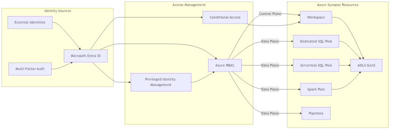

# Security Implementation Diagrams for Azure Synapse Analytics

This section provides security implementation diagrams for Azure Synapse Analytics, focusing on security patterns and best practices.

## Defense-in-Depth Security Architecture

This diagram illustrates the defense-in-depth security model for Azure Synapse Analytics.

<!-- Mermaid diagram for MkDocs rendering -->

<!-- Static image fallback for GitHub -->

## Network Isolation Architecture

This diagram shows the network isolation architecture for securing Azure Synapse Analytics workspaces.

<!-- Static image fallback for GitHub -->

## Data Protection Security Model

This diagram illustrates the comprehensive data protection model for Azure Synapse Analytics.

<!-- Mermaid diagram for MkDocs rendering -->

<!-- Static image fallback for GitHub -->

## Identity and Access Management Architecture

This diagram depicts the identity and access management architecture for Azure Synapse Analytics.

<!-- Mermaid diagram for MkDocs rendering -->

<!-- Static image fallback for GitHub -->

## Sensitive Data Protection Framework

This diagram shows the sensitive data protection framework for Azure Synapse Analytics.

<!-- Mermaid diagram for MkDocs rendering -->

<!-- Static image fallback for GitHub -->

## Compliance Controls Architecture

This diagram illustrates how Azure Synapse Analytics implements controls for various compliance standards.

<!-- Mermaid diagram for MkDocs rendering -->

<!-- Static image fallback for GitHub -->

## Security Implementation Best Practices

When implementing security for Azure Synapse Analytics, follow these best practices:

1. __Network Security__
   - Implement private endpoints for all Synapse components
   - Use network security groups to restrict traffic
   - Deploy Azure Firewall for advanced threat protection
   - Utilize virtual network service endpoints for Azure services

2. __Data Protection__
   - Enable transparent data encryption for all data at rest
   - Implement customer-managed keys with Azure Key Vault rotation
   - Apply column-level encryption for sensitive data
   - Use dynamic data masking for PII data

3. __Identity and Access Management__
   - Implement Azure AD authentication for all access
   - Use conditional access policies for sensitive workloads
   - Apply least privilege principle with custom RBAC roles
   - Implement managed identities for service-to-service authentication

4. __Monitoring and Compliance__
   - Enable diagnostic logs for all Synapse components
   - Implement advanced threat protection for SQL pools
   - Create custom alerts for security events
   - Perform regular vulnerability assessments
