# ☁️ Serverless SQL Architecture Description

> __🏠 [Home](../../README.md)__ | __📊 [Diagrams](README.md)__ | __☁️ Serverless SQL Architecture__


Detailed description and visual representation of Azure Synapse Serverless SQL Pool architecture and query processing.

---

## 🎯 Overview

Azure Synapse Serverless SQL Pool provides on-demand T-SQL query capabilities over data in Azure Data Lake without the need to provision or manage compute infrastructure. It operates on a pay-per-query model, charging only for data processed.

## 📊 Visual Architecture

### High-Level Architecture


---

## 🏗️ Architecture Components

### 1. Query Submission Layer

Multiple client tools and applications can connect to Serverless SQL Pool:

| Client Type | Protocol | Authentication | Best For |
|------------|----------|----------------|----------|
| __SQL Server Management Studio__ | TDS (TCP 1433) | Azure AD, SQL Auth | Interactive queries, development |
| __Azure Data Studio__ | TDS (TCP 1433) | Azure AD | Cross-platform development |
| __Power BI__ | Direct Query, Import | Azure AD | Business intelligence, dashboards |
| __JDBC/ODBC__ | Standard drivers | Azure AD, connection string | Application integration |
| __Azure Portal__ | Web interface | Azure AD | Quick exploration, testing |

**Connection String Example**:

```text
Server=tcp:your-workspace-ondemand.sql.azuresynapse.net,1433;
Database=your-database;
Authentication=Active Directory Integrated;
Encrypt=yes;
TrustServerCertificate=no;
```

### 2. Query Processing Pipeline

#### Query Parser


**Parser Functions**:

- **Tokenization**: Break down SQL text into tokens
- **Syntax Validation**: Ensure T-SQL syntax correctness
- **Semantic Analysis**: Validate object references, data types
- **IR Generation**: Create internal query representation

#### Query Optimizer


**Optimization Techniques**:

1. **Predicate Pushdown**: Filter early in data scan
2. **Partition Elimination**: Skip irrelevant partitions
3. **Column Pruning**: Read only required columns
4. **Join Optimization**: Choose optimal join strategy
5. **Aggregation Pushdown**: Aggregate before data transfer

**Example Optimization**:

```sql
-- Original query
SELECT customer_id, SUM(amount) as total
FROM sales.transactions
WHERE transaction_date >= '2025-01-01'
GROUP BY customer_id;

-- Optimized execution:
-- 1. Partition elimination (only 2025 partitions)
-- 2. Column pruning (read only customer_id, amount, transaction_date)
-- 3. Predicate pushdown (filter applied during file scan)
-- 4. Aggregation pushdown (partial aggregates per file)
```

#### Execution Planner


### 3. Execution Engine

#### Query Coordinator

**Responsibilities**:

- Receive execution plan from planner
- Allocate compute workers dynamically
- Distribute work across workers
- Monitor execution progress
- Handle failures and retries
- Collect and merge results


#### Compute Workers

**Auto-scaling Characteristics**:


**Worker Operations**:

| Operation | Description | Parallelization |
|-----------|-------------|-----------------|
| __File Scanning__ | Read data from storage files | High (per file) |
| __Filtering__ | Apply WHERE clause predicates | High (per partition) |
| __Projection__ | Select specific columns | High (per row group) |
| __Aggregation__ | GROUP BY and aggregate functions | Medium (partial aggregates) |
| __Joins__ | Combine data from multiple sources | Medium (hash/merge joins) |
| __Sorting__ | ORDER BY operations | Low (global sort required) |

#### Result Cache


**Cache Characteristics**:

- **TTL**: 48 hours automatic expiration
- **Invalidation**: Automatic when underlying data changes
- **Scope**: Per-user and per-query
- **Storage**: Temporary blob storage
- **Billing**: Cached results not charged on subsequent access

### 4. Metadata Services

#### Metadata Database

**Storage**:

- Azure SQL Database backend
- Workspace-level metadata repository
- Stores table definitions, views, procedures

**Metadata Types**:

```sql
-- External tables over data lake files
CREATE EXTERNAL TABLE sales.transactions (
    transaction_id INT,
    customer_id INT,
    amount DECIMAL(10,2),
    transaction_date DATE
)
WITH (
    LOCATION = '/sales/transactions/',
    DATA_SOURCE = DataLakeSource,
    FILE_FORMAT = ParquetFormat
);

-- Views for business logic
CREATE VIEW sales.monthly_summary AS
SELECT
    YEAR(transaction_date) as year,
    MONTH(transaction_date) as month,
    SUM(amount) as total_sales
FROM sales.transactions
GROUP BY YEAR(transaction_date), MONTH(transaction_date);

-- Stored procedures for reusable logic
CREATE PROCEDURE sales.GetCustomerSummary
    @customer_id INT
AS
BEGIN
    SELECT
        customer_id,
        COUNT(*) as transaction_count,
        SUM(amount) as total_spent
    FROM sales.transactions
    WHERE customer_id = @customer_id
    GROUP BY customer_id;
END;
```

#### Statistics Service

**Automatic Statistics**:


**Manual Statistics**:

```sql
-- Create statistics manually for better performance
CREATE STATISTICS customer_stats
ON sales.transactions(customer_id)
WITH FULLSCAN;

-- View existing statistics
SELECT * FROM sys.stats
WHERE object_id = OBJECT_ID('sales.transactions');
```

#### Schema Discovery

**Automatic Schema Inference**:


**Schema Inference Examples**:

```sql
-- Automatic schema discovery with OPENROWSET
SELECT TOP 100 *
FROM OPENROWSET(
    BULK 'https://datalake.dfs.core.windows.net/data/sales/*.parquet',
    FORMAT = 'PARQUET'
) AS [result];

-- Schema inference with type specification
SELECT *
FROM OPENROWSET(
    BULK 'https://datalake.dfs.core.windows.net/data/sales/*.csv',
    FORMAT = 'CSV',
    PARSER_VERSION = '2.0',
    HEADER_ROW = TRUE
) WITH (
    transaction_id INT,
    amount DECIMAL(10,2),
    transaction_date DATE
) AS [result];
```

---

## 💾 Storage Layer Integration

### Supported File Formats

| Format | Read Performance | Compression | Schema Evolution | Best For |
|--------|-----------------|-------------|------------------|----------|
| __Delta Lake__ |  | Snappy, Gzip | ✅ Yes | ACID requirements, updates |
| __Parquet__ |  | Snappy, Gzip | ⚠️ Limited | Columnar analytics |
| __CSV__ |  | Gzip | ❌ No | Simple data, compatibility |
| __JSON__ |  | Gzip | ⚠️ Limited | Semi-structured, flexibility |

### Query Patterns by Format

#### Delta Lake Queries

```sql
-- Query Delta table directly
SELECT *
FROM OPENROWSET(
    BULK 'https://datalake.dfs.core.windows.net/gold/sales/',
    FORMAT = 'DELTA'
) AS [sales];

-- Time travel query
SELECT *
FROM OPENROWSET(
    BULK 'https://datalake.dfs.core.windows.net/gold/sales/',
    FORMAT = 'DELTA'
) WITH (VERSION = 5) AS [sales];

-- Create external table over Delta
CREATE EXTERNAL TABLE gold.sales
WITH (
    LOCATION = '/gold/sales/',
    DATA_SOURCE = DataLakeSource,
    FILE_FORMAT = DeltaFormat
);
```

#### Parquet Queries

```sql
-- Direct Parquet query with partition elimination
SELECT
    customer_id,
    SUM(amount) as total
FROM OPENROWSET(
    BULK 'https://datalake.dfs.core.windows.net/sales/year=2025/month=01/*.parquet',
    FORMAT = 'PARQUET'
) AS [result]
WHERE transaction_date >= '2025-01-01'
GROUP BY customer_id;

-- Wildcard patterns for multiple partitions
SELECT *
FROM OPENROWSET(
    BULK 'https://datalake.dfs.core.windows.net/sales/year=2025/month=*/day=*/*.parquet',
    FORMAT = 'PARQUET'
) AS [result]
WHERE filepath(1) IN ('01', '02')  -- Only Jan and Feb
  AND filepath(2) > '15';           -- After 15th of month
```

### Data Access Patterns


---

## 🔒 Security & Governance

### Authentication Flow


### Authorization Layers

| Layer | Purpose | Granularity | Management |
|-------|---------|-------------|------------|
| __Azure AD__ | User authentication | User/group identity | Azure portal |
| __Synapse RBAC__ | Workspace permissions | Workspace/pool level | Synapse Studio |
| __SQL Permissions__ | Database object access | Table/view/procedure | T-SQL GRANT/DENY |
| __Storage ACLs__ | File/folder access | File/folder level | Storage portal/SDK |

**Security Best Practices**:

```sql
-- Grant minimum required permissions
GRANT SELECT ON SCHEMA::sales TO [DataAnalysts];

-- Use database scoped credentials for external data sources
CREATE DATABASE SCOPED CREDENTIAL DataLakeCredential
WITH IDENTITY = 'Managed Identity';

CREATE EXTERNAL DATA SOURCE DataLakeSource
WITH (
    LOCATION = 'https://datalake.dfs.core.windows.net/data',
    CREDENTIAL = DataLakeCredential
);

-- Row-level security with predicates
CREATE SECURITY POLICY SalesFilter
ADD FILTER PREDICATE dbo.fn_securitypredicate(SalesPersonID)
ON sales.transactions
WITH (STATE = ON);
```

---

## ⚡ Performance Optimization

### Query Optimization Techniques

#### 1. Partition Elimination

```sql
-- Inefficient: Full scan
SELECT * FROM sales.transactions
WHERE transaction_date >= '2025-01-01';

-- Efficient: Partition elimination
SELECT * FROM sales.transactions
WHERE year = 2025 AND month = 1;
-- Folder structure: /sales/year=2025/month=01/
```

#### 2. Column Pruning

```sql
-- Inefficient: Read all columns
SELECT * FROM sales.transactions;

-- Efficient: Select only needed columns
SELECT customer_id, amount, transaction_date
FROM sales.transactions;
-- Only 3 columns read from Parquet
```

#### 3. Predicate Pushdown

```sql
-- Efficient: Filter pushed to file scan
SELECT customer_id, SUM(amount) as total
FROM sales.transactions
WHERE transaction_date >= '2025-01-01'
  AND amount > 100
GROUP BY customer_id;
-- Filters applied during file read, reduces data transfer
```

#### 4. File Size Optimization

```mermaid
graph LR
    subgraph "File Size Impact"
        TooSmall[Too Small<br/>< 10MB<br/>❌ Overhead]
        Optimal[Optimal<br/>100MB-1GB<br/>✅ Best Performance]
        TooLarge[Too Large<br/>> 1GB<br/>⚠️ Limited Parallelism]
    end

    TooSmall -.->|Consolidate| Optimal
    TooLarge -.->|Partition| Optimal

    style TooSmall fill:#ffebee
    style Optimal fill:#e8f5e9
    style TooLarge fill:#fff9c4
```



**File Consolidation Example**:

```python
# Spark job to consolidate small files
df = spark.read.format("delta").load("/path/to/table")
df.coalesce(10).write.format("delta").mode("overwrite").save("/path/to/table")
```

### Cost Optimization

#### Data Processed Calculation


**Cost Comparison**:

| Scenario | Files Scanned | Data Scanned | Cost ($/TB) | Total Cost |
|----------|--------------|--------------|-------------|------------|
| Full table scan (CSV) | 1000 files | 10 TB | $5 | $50 |
| Partition elimination (Parquet) | 100 files | 1 TB | $5 | $5 |
| Column pruning (Parquet) | 100 files | 0.2 TB | $5 | $1 |
| Cached result (2nd run) | 0 files | 0 TB | $0 | $0 |

**Cost Optimization Tips**:

1. **Use Parquet/Delta**: 10-100x better compression than CSV
2. **Partition Data**: Reduce scanned files
3. **Query Only Needed Columns**: Reduce scanned data
4. **Use Views**: Encapsulate optimization logic
5. **Leverage Cache**: Repeated queries are free

---

## 📊 Monitoring & Troubleshooting

### Query Performance Monitoring

```sql
-- View query execution statistics
SELECT
    request_id,
    status,
    total_elapsed_time,
    data_processed_mb,
    result_set_size_kb,
    command
FROM sys.dm_exec_requests
WHERE session_id = SESSION_ID();

-- Historical query performance
SELECT
    request_id,
    start_time,
    end_time,
    DATEDIFF(SECOND, start_time, end_time) as duration_seconds,
    data_processed_mb / 1024.0 as data_processed_gb,
    command
FROM sys.dm_exec_requests_history
WHERE session_id = SESSION_ID()
ORDER BY start_time DESC;
```

### Common Issues & Solutions

| Issue | Symptom | Solution |
|-------|---------|----------|
| **Slow queries** | Long execution time | Add partitioning, use Parquet, create statistics |
| **High costs** | Unexpected charges | Optimize queries, use views, partition data |
| **Permission errors** | Access denied | Check AAD, RBAC, storage ACLs |
| **Schema errors** | Column not found | Recreate external table, check file format |
| **Timeout errors** | Query timeout | Optimize query, reduce data scanned |

---

## 🎯 Best Practices

### Design Principles

1. **Use External Tables** for frequently accessed datasets
2. **Partition Data** by commonly filtered columns (date, region, category)
3. **Use Parquet or Delta** for optimal performance and cost
4. **Create Statistics** on join and filter columns
5. **Implement Views** for reusable business logic
6. **Monitor Costs** regularly and optimize expensive queries

### Anti-Patterns to Avoid

- ❌ SELECT * queries on large datasets
- ❌ Querying CSV files for large-scale analytics
- ❌ Small files (< 10MB) in data lake
- ❌ Missing partitioning on time-series data
- ❌ Not leveraging result cache

---

## 🔗 Related Resources

### Architecture Documentation

- [Serverless SQL Overview](../architecture/serverless-sql/serverless-overview.md)
- [Detailed Architecture](../architecture/serverless-sql/detailed-architecture.md)
- [Architecture Patterns](../03-architecture-patterns/README.md)

### Implementation Guides

- [Serverless SQL Guide](../code-examples/serverless-sql-guide.md)
- [Query Optimization](../code-examples/serverless-sql/query-optimization.md)
- [Best Practices](../best-practices/serverless-sql-best-practices.md)

### Performance & Cost

- [Performance Optimization](../best-practices/performance-optimization.md)
- [Cost Optimization](../best-practices/cost-optimization.md)

---

*Last Updated: 2025-01-28*
*Architecture Version: 2.0*
*Pattern: Serverless Query Processing*
