# Serverless SQL Pool Architecture Diagram

[🏠 Home](../../README.md) > [📊 Diagrams](README.md) > Serverless SQL Architecture

## Overview

This diagram illustrates the Azure Synapse Serverless SQL Pool architecture, showing how it enables on-demand querying of data lake files using familiar T-SQL syntax without managing infrastructure or dedicated resources.

---

## Complete Serverless SQL Architecture


---

## Query Processing Flow

### Ad-hoc Query with OPENROWSET


---

### External Table Query


---

## Data Virtualization Patterns

### OPENROWSET Pattern (Schema-on-Read)


**Example Query**:
```sql
-- Ad-hoc query with schema inference
SELECT *
FROM OPENROWSET(
    BULK 'https://datalake.dfs.core.windows.net/data/sales/*.parquet',
    FORMAT = 'PARQUET'
) AS sales
WHERE order_date >= '2024-01-01';
```

---

### External Table Pattern (Schema-on-Write)


**Example Setup**:
```sql
-- Create external data source
CREATE EXTERNAL DATA SOURCE SalesDataLake
WITH (
    LOCATION = 'https://datalake.dfs.core.windows.net/sales'
);

-- Create external file format
CREATE EXTERNAL FILE FORMAT ParquetFormat
WITH (
    FORMAT_TYPE = PARQUET,
    DATA_COMPRESSION = 'org.apache.hadoop.io.compress.SnappyCodec'
);

-- Create external table
CREATE EXTERNAL TABLE SalesOrders (
    OrderID INT,
    CustomerID INT,
    OrderDate DATE,
    Amount DECIMAL(10,2)
)
WITH (
    LOCATION = '/orders/*.parquet',
    DATA_SOURCE = SalesDataLake,
    FILE_FORMAT = ParquetFormat
);

-- Query like a regular table
SELECT * FROM SalesOrders WHERE OrderDate >= '2024-01-01';
```

---

## Query Optimization Strategies

### Predicate Pushdown & Partition Elimination


---

### Result Set Caching


---

## File Format Optimization

### Format Comparison


### Recommended Format Strategy

| Data Stage | Format | Reason | Cost Impact |
|------------|--------|--------|-------------|
| __Raw/Landing__ | CSV, JSON | Source format preservation | Higher query cost |
| __Refined/Cleansed__ | Parquet | Optimized for analytics | Medium cost |
| __Curated/Gold__ | Delta Lake | Best performance + ACID | Lowest cost |

---

## Cost Optimization Strategies

### Data Scanned vs Query Cost

```mermaid
graph TB
    subgraph "Factors Affecting Cost"
        DataSize[Amount of Data<br/>Scanned in TB]
        FileType[File Format<br/>CSV vs Parquet]
        Partition[Partition<br/>Elimination]
        Compression[Compression<br/>Codec]
    end

    subgraph "Cost Calculation"
        Formula[Cost = Data Scanned &#40;TB&#41;<br/>× $5 per TB]
    end

    subgraph "Optimization Techniques"
        Convert[Convert to<br/>Parquet/Delta]
        PartitionData[Partition by<br/>Date/Category]
        CreateStats[Create<br/>Statistics]
        FilterEarly[Apply Filters<br/>in WHERE Clause]
    end

    subgraph "Cost Savings"
        S1[60-80% Reduction<br/>Parquet vs CSV]
        S2[80-95% Reduction<br/>With Partitioning]
        S3[Result Caching<br/>Near Zero Cost]
    end

    DataSize --> Formula
    FileType --> Formula
    Partition --> Formula

    Convert --> S1
    PartitionData --> S2
    CreateStats --> S2
    FilterEarly --> S2

    style Formula fill:#FFEBEE
    style S1 fill:#C8E6C9
    style S2 fill:#A5D6A7
    style S3 fill:#81C784
```



**Cost Optimization Example**:
```sql
-- High Cost: Full table scan on CSV
SELECT AVG(amount)
FROM OPENROWSET(
    BULK 'https://.../sales/**/*.csv',
    FORMAT = 'CSV'
) AS sales;
-- Scans: 100 GB, Cost: $0.50

-- Optimized: Filtered query on Parquet with partitioning
SELECT AVG(amount)
FROM OPENROWSET(
    BULK 'https://.../sales/year=2024/month=01/*.parquet',
    FORMAT = 'PARQUET'
) AS sales
WHERE region = 'West';
-- Scans: 2 GB, Cost: $0.01 (98% savings)
```

---

## Security Architecture

### Multi-Layer Security Model


---

## Use Case Patterns

### Pattern 1: Ad-hoc Data Exploration


**Best For**:
- Exploring new data sources
- One-time analysis
- Prototyping queries
- Data quality checks

---

### Pattern 2: Self-Service BI


**Best For**:
- Business intelligence dashboards
- Self-service reporting
- Departmental analytics
- Cost-effective queries

---

### Pattern 3: Data Lake Querying


**Best For**:
- Medallion architecture
- Progressive data refinement
- Cost-optimized analytics
- Scalable queries

---

## Performance Best Practices

### Query Optimization Checklist

```mermaid
graph TB
    subgraph "Before Writing Query"
        Format[✓ Use Parquet or Delta Lake]
        Partition[✓ Leverage Partitioning]
        Columns[✓ Select Only Needed Columns]
    end

    subgraph "Query Design"
        Where[✓ Apply WHERE Filters]
        Stats[✓ Create Statistics]
        Aggregate[✓ Aggregate in SQL]
        Join[✓ Optimize JOIN Order]
    end

    subgraph "Schema Management"
        ExtTable[✓ Use External Tables]
        DataTypes[✓ Explicit Data Types]
        Compress[✓ Enable Compression]
    end

    subgraph "Monitoring"
        QPI[✓ Review Query Performance Insights]
        Cost[✓ Monitor Data Scanned]
        Optimize[✓ Iteratively Optimize]
    end

    Format --> Where
    Partition --> Where
    Where --> ExtTable
    Stats --> Join
    ExtTable --> QPI

    style Format fill:#C8E6C9
    style Where fill:#C8E6C9
    style ExtTable fill:#C8E6C9
    style QPI fill:#C8E6C9
```



---

## Reference Links

- [Serverless SQL Overview](../architecture/serverless-sql/serverless-overview.md)
- [Detailed Architecture](../architecture/serverless-sql/detailed-architecture.md)
- [Best Practices](../best-practices/serverless-sql-best-practices.md)
- [Code Examples](../code-examples/serverless-sql/README.md)
- [Performance Optimization](../best-practices/sql-performance.md)

---

*Last Updated: 2025-01-28*
*Diagram Type: Service Architecture*
*Technology: Azure Synapse Serverless SQL Pool*
