# 🔗 Shared Metadata Architecture Description

> __🏠 [Home](../../README.md)__ | __📊 [Diagrams](README.md)__ | __🔗 Shared Metadata Architecture__


Detailed description and visual representation of the shared metadata architecture in Azure Synapse Analytics, enabling cross-engine data access and unified governance.

---

## 🎯 Overview

Shared metadata in Azure Synapse Analytics provides a unified catalog that allows different compute engines (Spark, SQL, Pipelines) to discover and access the same data assets seamlessly. This eliminates data silos, reduces duplication, and enables a truly unified analytics platform.

## 📊 Visual Architecture

### High-Level Metadata Architecture


---

## 🏗️ Architecture Components

### 1. Metadata Management Layer

#### Metadata Service

**Purpose**: Central orchestrator for metadata synchronization across engines

**Responsibilities**:

- Synchronize metadata between Spark and SQL engines
- Handle schema evolution and versioning
- Manage metadata conflicts and resolution
- Provide unified discovery interface
- Track metadata lineage and dependencies


#### Unified Catalog

**Data Model**:


**Catalog Queries**:

```sql
-- Query catalog for all databases
SELECT * FROM sys.databases;

-- Query catalog for tables in a schema
SELECT
    t.name as table_name,
    s.name as schema_name,
    t.type_desc as table_type,
    t.create_date,
    t.modify_date
FROM sys.tables t
JOIN sys.schemas s ON t.schema_id = s.schema_id
WHERE s.name = 'gold';

-- Query catalog for column information
SELECT
    c.name as column_name,
    t.name as table_name,
    ty.name as data_type,
    c.max_length,
    c.precision,
    c.scale,
    c.is_nullable
FROM sys.columns c
JOIN sys.tables t ON c.object_id = t.object_id
JOIN sys.types ty ON c.user_type_id = ty.user_type_id
WHERE t.name = 'customer_metrics';
```

### 2. Compute Engine Metadata

#### Spark Metastore

**Hive Metastore Compatibility**:


**Spark SQL DDL Examples**:

```python
# Create database
spark.sql("""
    CREATE DATABASE IF NOT EXISTS sales
    COMMENT 'Sales analytics database'
    LOCATION 'abfss://gold@datalake.dfs.core.windows.net/sales'
""")

# Create managed Delta table (metadata + data in catalog)
spark.sql("""
    CREATE TABLE sales.transactions (
        transaction_id BIGINT,
        customer_id INT,
        amount DECIMAL(10,2),
        transaction_date DATE
    )
    USING DELTA
    PARTITIONED BY (transaction_date)
""")

# Create external Delta table (metadata in catalog, data in specified location)
spark.sql("""
    CREATE EXTERNAL TABLE sales.customer_dim (
        customer_id INT,
        customer_name STRING,
        email STRING,
        segment STRING
    )
    USING DELTA
    LOCATION 'abfss://gold@datalake.dfs.core.windows.net/dimensions/customer'
""")

# Describe table metadata
spark.sql("DESCRIBE EXTENDED sales.transactions").show(100, False)

# Show table properties
spark.sql("SHOW TBLPROPERTIES sales.transactions").show()
```

#### SQL Pool Metadata

**Metadata Views**:

```sql
-- System catalog views
SELECT * FROM INFORMATION_SCHEMA.TABLES;
SELECT * FROM INFORMATION_SCHEMA.COLUMNS;
SELECT * FROM INFORMATION_SCHEMA.VIEWS;

-- Extended metadata
SELECT * FROM sys.tables;
SELECT * FROM sys.columns;
SELECT * FROM sys.views;
SELECT * FROM sys.external_tables;
SELECT * FROM sys.external_data_sources;

-- Table statistics
SELECT * FROM sys.dm_pdw_nodes_db_partition_stats;
```

**Creating SQL Objects Over Spark Tables**:

```sql
-- Create external data source pointing to data lake
CREATE EXTERNAL DATA SOURCE DataLakeSource
WITH (
    LOCATION = 'abfss://gold@datalake.dfs.core.windows.net',
    CREDENTIAL = DataLakeCredential
);

-- Create external file format for Delta
CREATE EXTERNAL FILE FORMAT DeltaFormat
WITH (
    FORMAT_TYPE = DELTA
);

-- Create external table over Spark-created Delta table
CREATE EXTERNAL TABLE sales.transactions_sql
WITH (
    LOCATION = '/sales/transactions/',
    DATA_SOURCE = DataLakeSource,
    FILE_FORMAT = DeltaFormat
);

-- Create view with business logic
CREATE VIEW sales.monthly_summary AS
SELECT
    YEAR(transaction_date) as year,
    MONTH(transaction_date) as month,
    SUM(amount) as total_sales,
    COUNT(DISTINCT customer_id) as unique_customers
FROM sales.transactions_sql
GROUP BY YEAR(transaction_date), MONTH(transaction_date);
```

### 3. Cross-Engine Metadata Sharing

#### Metadata Synchronization Flow


#### Automatic Table Discovery

**Spark to SQL Discovery**:

```python
# Step 1: Create table in Spark
spark.sql("""
    CREATE TABLE gold.product_metrics (
        product_id INT,
        product_name STRING,
        category STRING,
        total_sales DECIMAL(15,2),
        metric_date DATE
    )
    USING DELTA
    PARTITIONED BY (metric_date)
    LOCATION 'abfss://gold@datalake.dfs.core.windows.net/products/metrics'
""")

# Step 2: Automatically visible in Serverless SQL Pool
# (No additional steps needed for discovery)
```

```sql
-- Step 3: Query from SQL Pool
-- Table is discoverable through catalog
SELECT
    schema_name,
    table_name,
    create_date
FROM INFORMATION_SCHEMA.TABLES
WHERE schema_name = 'gold'
  AND table_name = 'product_metrics';

-- Step 4: Create external table in SQL to access
CREATE EXTERNAL TABLE gold.product_metrics
WITH (
    LOCATION = '/products/metrics/',
    DATA_SOURCE = DataLakeSource,
    FILE_FORMAT = DeltaFormat
);

-- Step 5: Query the data
SELECT
    category,
    SUM(total_sales) as category_sales
FROM gold.product_metrics
WHERE metric_date >= '2025-01-01'
GROUP BY category;
```

### 4. External Metadata Integration

#### Azure Purview Integration


**Purview Capabilities**:

| Capability | Description | Benefit |
|-----------|-------------|---------|
| __Automatic Scanning__ | Discover Synapse tables automatically | Complete asset inventory |
| __Data Lineage__ | Track data flow end-to-end | Impact analysis, debugging |
| __Classification__ | Identify sensitive data (PII, PHI) | Compliance, security |
| __Business Glossary__ | Define business terms | Shared understanding |
| __Search & Discovery__ | Find data assets easily | Reduced time to insight |

**Lineage Example**:


---

## 🔄 Metadata Lifecycle

### Table Creation Lifecycle


### Schema Evolution Scenarios

#### Adding Columns

```python
# Spark: Add column to Delta table
spark.sql("""
    ALTER TABLE sales.transactions
    ADD COLUMN payment_method STRING
""")

# Automatic sync to catalog
# SQL Pool: Column visible after sync (< 5 minutes)
```

```sql
-- SQL: Verify new column
SELECT column_name, data_type
FROM INFORMATION_SCHEMA.COLUMNS
WHERE table_name = 'transactions'
  AND column_name = 'payment_method';
```

#### Column Type Changes (with Delta)

```python
# Spark: Change column type (Delta supports type widening)
spark.sql("""
    ALTER TABLE sales.transactions
    ALTER COLUMN amount TYPE DECIMAL(15,2)
""")

# Note: Type narrowing may require data validation
# Old data remains readable with type casting
```

#### Partition Evolution

```python
# Spark: Add new partition column
spark.sql("""
    ALTER TABLE sales.transactions
    ADD PARTITION (region='US', year=2025)
""")

# Spark: Drop partition
spark.sql("""
    ALTER TABLE sales.transactions
    DROP PARTITION (region='EU', year=2024)
""")
```

---

## 🎯 Use Cases & Patterns

### Use Case 1: Unified Data Engineering & Analytics

**Scenario**: Data engineers use Spark for ETL, analysts use SQL for querying

```mermaid
graph LR
    subgraph "Data Engineering - Spark"
        Engineer[Data Engineer]
        SparkNotebook[Spark Notebook]
        ETL[ETL Processing<br/>Bronze → Silver → Gold]
    end

    subgraph "Shared Metadata"
        Catalog[Unified Catalog]
    end

    subgraph "Data Analytics - SQL"
        Analyst[Data Analyst]
        SQLQuery[SQL Queries]
        Dashboard[Power BI Dashboard]
    end

    Engineer --> SparkNotebook
    SparkNotebook --> ETL
    ETL -.->|Register Tables| Catalog

    Catalog -.->|Discover Tables| SQLQuery
    Analyst --> SQLQuery
    SQLQuery --> Dashboard

    style ETL fill:#fff3e0
    style Catalog fill:#e1f5fe
    style SQLQuery fill:#e8f5e9
    style Dashboard fill:#f3e5f5
```



**Implementation**:

```python
# Data Engineer: Create gold tables in Spark
spark.sql("""
    CREATE TABLE gold.daily_sales_summary (
        sale_date DATE,
        region STRING,
        total_revenue DECIMAL(15,2),
        order_count INT,
        avg_order_value DECIMAL(10,2)
    )
    USING DELTA
    PARTITIONED BY (sale_date)
""")

# Populate with ETL logic
daily_summary = spark.sql("""
    SELECT
        DATE(order_timestamp) as sale_date,
        region,
        SUM(amount) as total_revenue,
        COUNT(*) as order_count,
        AVG(amount) as avg_order_value
    FROM silver.orders
    GROUP BY DATE(order_timestamp), region
""")

daily_summary.write.format("delta") \
    .mode("overwrite") \
    .partitionBy("sale_date") \
    .saveAsTable("gold.daily_sales_summary")
```

```sql
-- Data Analyst: Query in SQL (automatically available)
-- Create external table
CREATE EXTERNAL TABLE gold.daily_sales_summary_sql
WITH (
    LOCATION = '/daily_sales_summary/',
    DATA_SOURCE = DataLakeSource,
    FILE_FORMAT = DeltaFormat
);

-- Query for dashboard
SELECT
    region,
    SUM(total_revenue) as total_revenue,
    SUM(order_count) as total_orders,
    AVG(avg_order_value) as avg_order_value
FROM gold.daily_sales_summary_sql
WHERE sale_date >= DATEADD(day, -30, GETDATE())
GROUP BY region
ORDER BY total_revenue DESC;
```

### Use Case 2: Machine Learning Feature Store

**Scenario**: ML engineers create features in Spark, data scientists consume via SQL


### Use Case 3: Cross-Engine Data Validation

**Scenario**: Validate data quality across Spark and SQL engines

```python
# Spark: Calculate data quality metrics
quality_metrics = spark.sql("""
    SELECT
        COUNT(*) as total_rows,
        COUNT(DISTINCT customer_id) as unique_customers,
        SUM(CASE WHEN amount IS NULL THEN 1 ELSE 0 END) as null_amounts,
        AVG(amount) as avg_amount,
        MIN(transaction_date) as min_date,
        MAX(transaction_date) as max_date
    FROM silver.transactions
""")

quality_metrics.write.format("delta") \
    .mode("overwrite") \
    .saveAsTable("monitoring.data_quality_metrics")
```

```sql
-- SQL: Query quality metrics for dashboard
SELECT
    total_rows,
    unique_customers,
    null_amounts,
    CAST(null_amounts AS FLOAT) / total_rows * 100 as null_percentage,
    avg_amount,
    min_date,
    max_date
FROM monitoring.data_quality_metrics;
```

---

## 💡 Best Practices

### Metadata Management

1. **Consistent Naming Conventions**
   - Use lowercase for database and table names
   - Use underscores for multi-word names
   - Prefix with layer (bronze, silver, gold)

2. **Documentation**
   - Add table and column descriptions
   - Document data lineage
   - Maintain business glossary

3. **Schema Evolution**
   - Plan for backward compatibility
   - Use schema evolution features of Delta Lake
   - Communicate changes to consumers

4. **Governance**
   - Implement access controls at multiple layers
   - Use Azure Purview for data catalog
   - Track sensitive data classifications

### Performance Optimization

1. **Metadata Caching**
   - Metadata is cached by compute engines
   - Cache refresh happens automatically
   - Manual refresh if needed: `REFRESH TABLE tablename`

2. **Statistics Maintenance**
   - Keep statistics up to date
   - Run ANALYZE TABLE periodically
   - Use auto-optimize features in Delta

3. **Partition Strategy**
   - Partition by commonly filtered columns
   - Avoid over-partitioning (< 1GB per partition)
   - Align partitioning across related tables

---

## 🔗 Related Resources

### Architecture Documentation

- [Shared Metadata Overview](../architecture/shared-metadata/shared-metadata.md)
- [Shared Metadata Visuals](../architecture/shared-metadata/shared-metadata-visuals.md)
- [Architecture Patterns](../03-architecture-patterns/README.md)

### Implementation Guides

- [Delta Lake Guide](../code-examples/delta-lake-guide.md)
- [Serverless SQL Guide](../code-examples/serverless-sql-guide.md)
- [Integration Guide](../code-examples/integration-guide.md)

### Best Practices

- [Performance Optimization](../best-practices/performance-optimization.md)
- [Data Governance](../best-practices/data-governance.md)
- [Security Best Practices](../best-practices/security.md)

---

*Last Updated: 2025-01-28*
*Architecture Version: 2.0*
*Pattern: Unified Metadata Catalog*
