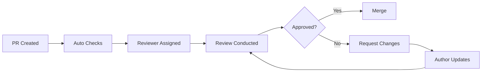

# 👀 Code Review Guide

> __🏠 [Home](../../README.md)__ | __📚 Documentation__ | __📖 [Guides](./README.md)__

---

## 📋 Overview

This guide provides comprehensive standards and best practices for code review within the Cloud Scale Analytics (CSA) in-a-Box documentation project. Effective code reviews ensure code quality, knowledge sharing, and maintainable software.

## 📑 Table of Contents

- [Review Philosophy](#review-philosophy)
- [Review Process](#review-process)
- [Review Checklist](#review-checklist)
- [Review Types](#review-types)
- [Giving Feedback](#giving-feedback)
- [Responding to Reviews](#responding-to-reviews)
- [Review Tools](#review-tools)
- [Common Issues](#common-issues)
- [Best Practices](#best-practices)
- [Templates](#templates)

---

## 🎯 Review Philosophy

### Core Principles

1. __Collaborative Learning__ - Reviews are opportunities to learn and teach
2. __Quality Focus__ - Maintain high standards while being constructive
3. __Respectful Communication__ - Be kind, specific, and helpful
4. __Continuous Improvement__ - Use reviews to improve processes
5. __Shared Ownership__ - Everyone is responsible for code quality

### Goals of Code Review

| Goal | Description | Benefit |
|------|-------------|---------|
| __Bug Prevention__ | Catch issues before they reach production | Reliability |
| __Knowledge Sharing__ | Spread domain knowledge across team | Team Growth |
| __Standard Enforcement__ | Ensure coding standards are followed | Consistency |
| __Architecture Alignment__ | Maintain architectural principles | Maintainability |
| __Security__ | Identify security vulnerabilities | Protection |

---

## 🔄 Review Process

### Review Workflow



### Review Timeline

| Stage | Target Time | Maximum Time |
|-------|-------------|--------------|
| __Initial Response__ | 24 hours | 48 hours |
| __First Review__ | 3 business days | 1 week |
| __Follow-up Reviews__ | 24 hours | 48 hours |
| __Final Approval__ | Same day | 24 hours |

---

## ✅ Review Checklist

### Pre-Review Checklist

__For Authors:__

- [ ] Self-review completed
- [ ] All tests pass
- [ ] Documentation updated
- [ ] Commit messages are clear
- [ ] PR description is complete

__For Reviewers:__

- [ ] Understand the context and requirements
- [ ] Check related issues and discussions
- [ ] Review previous feedback on similar changes

### Code Quality Checklist

#### Functionality

- [ ] Code does what it's supposed to do
- [ ] Edge cases are handled
- [ ] Error handling is appropriate
- [ ] Performance is acceptable
- [ ] No obvious bugs or logic errors

#### Design & Architecture

- [ ] Follows project architecture patterns
- [ ] Abstractions are appropriate
- [ ] No unnecessary complexity
- [ ] Separation of concerns maintained
- [ ] DRY principle followed

#### Readability & Style

- [ ] Code is easy to read and understand
- [ ] Naming conventions followed
- [ ] Functions/methods have single responsibility
- [ ] Comments explain "why", not "what"
- [ ] Style guide compliance

#### Testing

- [ ] Adequate test coverage
- [ ] Tests are meaningful and robust
- [ ] Test names are descriptive
- [ ] Both positive and negative cases covered
- [ ] No flaky or brittle tests

#### Documentation

- [ ] Public APIs documented
- [ ] Complex logic explained
- [ ] README updated if needed
- [ ] Breaking changes noted
- [ ] Examples provided where helpful

#### Security & Performance

- [ ] No hardcoded secrets or credentials
- [ ] Input validation implemented
- [ ] SQL injection prevention
- [ ] No performance regressions
- [ ] Resource leaks avoided

---

## 🔍 Review Types

### Review Depth Levels

#### Light Review (15-30 minutes)

- __When__: Small bug fixes, typos, minor updates
- __Focus__: Correctness, style, basic functionality
- __Scope__: <50 lines changed

#### Standard Review (30-60 minutes)

- __When__: Feature additions, moderate refactoring
- __Focus__: All checklist items, design patterns
- __Scope__: 50-200 lines changed

#### Deep Review (1-2 hours)

- __When__: Major features, architectural changes
- __Focus__: Comprehensive review, multiple perspectives
- __Scope__: >200 lines changed, complex logic

#### Architectural Review (2+ hours)

- __When__: System design changes, new patterns
- __Focus__: Long-term maintainability, scalability
- __Scope__: Multiple files, system-wide impact

---

## 💬 Giving Feedback

### Feedback Categories

Use clear prefixes to categorize feedback:

| Prefix | Meaning | Action Required |
|--------|---------|-----------------|
| __`MUST:`__ | Critical issue that blocks merge | Fix required |
| __`SHOULD:`__ | Important improvement needed | Fix strongly recommended |
| __`CONSIDER:`__ | Suggestion for improvement | Optional |
| __`NIT:`__ | Minor style or preference issue | Optional |
| __`QUESTION:`__ | Need clarification | Response needed |
| __`PRAISE:`__ | Positive feedback | None - but appreciated! |

### Effective Feedback Examples

#### Good Feedback Examples

```markdown
**MUST:** This SQL query is vulnerable to injection attacks.
Consider using parameterized queries:
```python
# Instead of:
query = f"SELECT * FROM users WHERE id = {user_id}"

# Use:
query = "SELECT * FROM users WHERE id = %s"
cursor.execute(query, (user_id,))
```

__SHOULD:__ This function is doing too many things. Consider breaking it into smaller, focused functions for better testability and readability.

__CONSIDER:__ You might want to add logging here for debugging purposes, especially since this handles external API calls.

__NIT:__ Variable name `d` isn't very descriptive. Maybe `document` or `doc_data`?

__QUESTION:__ What happens if `response.json()` fails? Should we handle that exception?

__PRAISE:__ Great use of the builder pattern here! This makes the API much more intuitive to use.
```

#### Poor Feedback Examples

```text
❌ "This is wrong." 
✅ "MUST: This function doesn't handle the case where input is None."

❌ "Bad naming."
✅ "NIT: Consider using a more descriptive variable name like `user_count` instead of `c`."

❌ "Why did you do it this way?"
✅ "QUESTION: I'm curious about the choice to use recursion here. Have you considered an iterative approach?"
```

---

## 🔄 Responding to Reviews

### Response Guidelines

#### For Authors

1. __Acknowledge All Feedback__

   ```markdown
   Thanks for the thorough review! I've addressed all the MUST and SHOULD items.
   ```

2. __Be Specific About Changes__

   ```markdown
   ✅ Fixed SQL injection vulnerability in user_service.py:45
   ✅ Extracted validation logic into separate function
   ⏭️ Logging suggestion noted for future iteration
   ```

3. __Ask for Clarification When Needed__

   ```markdown
   QUESTION: Regarding the caching suggestion - are you thinking Redis or in-memory? 
   The usage pattern might affect the choice.
   ```

4. __Explain Decisions__

   ```markdown
   I kept the recursive approach because:
   1. The max depth is guaranteed to be <10
   2. It matches the tree structure naturally
   3. Stack overflow isn't a risk here
   ```

#### Response Timeline

| Feedback Type | Response Time |
|---------------|---------------|
| MUST items | Same day |
| SHOULD items | Within 2 days |
| CONSIDER items | Acknowledge within 2 days |
| QUESTIONS | Within 1 day |

---

## 🛠️ Review Tools

### GitHub Review Features

#### Using Review Comments

```markdown
// Good: Specific, actionable feedback
/* SHOULD: Consider extracting this complex condition into a well-named function
 * for better readability and testability.
 */
if (user.isActive && user.hasPermission('read') && !user.isBlocked) {
  // ...
}
```

#### Suggested Changes

Use GitHub's suggestion feature for simple fixes:

```diff
- const data = response.data.items.data;
+ const data = response.data?.items?.data || [];
```

### Review Automation

#### Automated Checks

```yaml
# .github/workflows/review-checks.yml
- name: Lint Check
  run: markdownlint "**/*.md"
  
- name: Test Coverage
  run: pytest --cov=80%
  
- name: Security Scan
  run: bandit -r src/
```

---

## 🔧 Common Issues

### Code Issues

| Issue | Example | Solution |
|-------|---------|----------|
| __Magic Numbers__ | `if size > 1000:` | `MAX_FILE_SIZE = 1000` |
| __Long Functions__ | 50+ line function | Break into smaller functions |
| __Unclear Names__ | `data`, `temp`, `x` | Use descriptive names |
| __Missing Error Handling__ | No try/catch blocks | Add appropriate error handling |
| __Hardcoded Values__ | `"prod-db-server"` | Use configuration |

### Review Issues

| Issue | Problem | Solution |
|-------|---------|----------|
| __Nitpicky Reviews__ | Focus on minor style issues | Address major issues first |
| __Unclear Feedback__ | Vague comments | Be specific and actionable |
| __Delayed Reviews__ | Week+ response time | Set expectations, communicate delays |
| __Inconsistent Standards__ | Different rules per reviewer | Document and agree on standards |

---

## 💡 Best Practices

### For Reviewers

#### Do This ✅

1. __Start with positives__ - Acknowledge good work
2. __Be specific__ - Point to exact lines and issues
3. __Suggest solutions__ - Don't just point out problems
4. __Ask questions__ - Understand author's reasoning
5. __Focus on important issues__ - Don't bikeshed
6. __Review promptly__ - Respect author's time

#### Avoid This ❌

1. __Being harsh or dismissive__
2. __Nitpicking without context__
3. __Requesting changes without explanation__
4. __Ignoring the bigger picture__
5. __Inconsistent feedback__
6. __Review fatigue - too many small comments__

### For Authors

#### Do This ✅

1. __Self-review first__ - Catch obvious issues
2. __Provide context__ - Explain complex decisions
3. __Keep PRs focused__ - One feature/fix per PR
4. __Respond to all feedback__ - Show you've considered everything
5. __Ask for help__ - Don't struggle alone

#### Avoid This ❌

1. __Taking feedback personally__
2. __Defensive responses__
3. __Ignoring feedback__
4. __Rushing to address comments__
5. __Large, unfocused PRs__

---

## 📝 Templates

### PR Description Template

```markdown
## Description
Brief description of changes and why they were needed.

## Type of Change
- [ ] Bug fix (non-breaking change which fixes an issue)
- [ ] New feature (non-breaking change which adds functionality)  
- [ ] Breaking change (fix or feature that would cause existing functionality to not work as expected)
- [ ] Documentation update

## Testing
- [ ] Unit tests pass
- [ ] Integration tests pass
- [ ] Manual testing completed
- [ ] New tests added for new functionality

## Checklist
- [ ] Code follows style guidelines
- [ ] Self-review performed
- [ ] Documentation updated
- [ ] No breaking changes (or breaking changes documented)

## Screenshots (if applicable)

## Related Issues
Closes #123
```

### Review Comment Templates

```markdown
**Architecture Concern:**
This change introduces tight coupling between X and Y. Consider using dependency injection or an interface to decouple these components.

**Security Issue:**
This endpoint doesn't validate user permissions. Please add authorization checks before allowing access to user data.

**Performance Question:**
This N+1 query pattern could cause performance issues with large datasets. Have you considered using a batch query or eager loading?

**Testing Suggestion:**
Great implementation! Consider adding a test for the error case when the external API is unavailable.
```

---

## 📊 Review Metrics

### Quality Metrics

Track these metrics to improve review process:

| Metric | Target | Measurement |
|--------|--------|-------------|
| __Review Response Time__ | <24 hours | Time to first response |
| __Review Completion Time__ | <3 days | Time to approval/merge |
| __Defects Found in Review__ | >80% | Issues caught before production |
| __Review Coverage__ | 100% | PRs that receive review |
| __Review Participation__ | >75% | Team members actively reviewing |

### Review Dashboard Example

```markdown
## This Week's Review Stats
- 📊 PRs Reviewed: 15/15 (100%)
- ⏱️ Avg Response Time: 18 hours
- 🎯 Avg Resolution Time: 2.3 days
- 🐛 Issues Found: 23
- 👥 Active Reviewers: 6/8 team members
```

---

## 🤝 Cultural Aspects

### Building Review Culture

1. __Lead by Example__ - Senior developers model good behavior
2. __Celebrate Learning__ - Share interesting findings from reviews
3. __Make it Safe__ - No blame, focus on improvement
4. __Regular Retrospectives__ - Continuously improve the process
5. __Recognize Contributors__ - Acknowledge good reviewers

### Review Etiquette

#### Language Guidelines

| Instead of | Use |
|------------|-----|
| "This is bad" | "This could be improved by..." |
| "You should..." | "Consider..." |
| "This is wrong" | "I think there might be an issue with..." |
| "Obviously..." | "It might be clearer if..." |

---

## 📚 Resources

### Internal Documentation

- [Development Guide](./DEVELOPMENT_GUIDE.md)
- [Testing Guide](./TESTING_GUIDE.md)
- [Contributing Guide](./CONTRIBUTING_GUIDE.md)
- [Style Guides](./MARKDOWN_STYLE_GUIDE.md)

### External Resources

- [Google's Code Review Guidelines](https://google.github.io/eng-practices/review/)
- [GitHub's Code Review Best Practices](https://github.blog/2015-01-21-how-to-write-the-perfect-pull-request/)
- [Best Practices for Code Review](https://smartbear.com/learn/code-review/best-practices-for-peer-code-review/)

### Tools

- __GitHub__ - Built-in review tools
- __SonarQube__ - Code quality analysis
- __CodeClimate__ - Automated code review
- __DeepCode__ - AI-powered code review

---

__Last Updated:__ January 28, 2025  
__Version:__ 1.0.0  
__Maintainer:__ CSA Documentation Team
