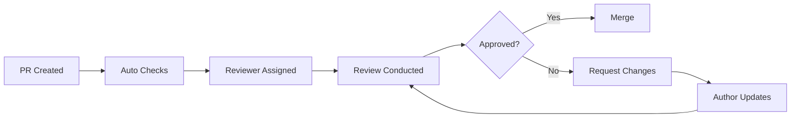

# 👀 Code Review Guide

> **🏠 [Home](../../README.md)** | **📚 [Documentation](../README.md)** | **📖 [Guides](./README.md)**

---

## 📋 Overview

This guide provides comprehensive standards and best practices for code review within the Cloud Scale Analytics (CSA) in-a-Box documentation project. Effective code reviews ensure code quality, knowledge sharing, and maintainable software.

## 📑 Table of Contents

- [Review Philosophy](#review-philosophy)
- [Review Process](#review-process)
- [Review Checklist](#review-checklist)
- [Review Types](#review-types)
- [Giving Feedback](#giving-feedback)
- [Responding to Reviews](#responding-to-reviews)
- [Review Tools](#review-tools)
- [Common Issues](#common-issues)
- [Best Practices](#best-practices)
- [Templates](#templates)

---

## 🎯 Review Philosophy

### Core Principles

1. **Collaborative Learning** - Reviews are opportunities to learn and teach
2. **Quality Focus** - Maintain high standards while being constructive
3. **Respectful Communication** - Be kind, specific, and helpful
4. **Continuous Improvement** - Use reviews to improve processes
5. **Shared Ownership** - Everyone is responsible for code quality

### Goals of Code Review

| Goal | Description | Benefit |
|------|-------------|---------|
| **Bug Prevention** | Catch issues before they reach production | Reliability |
| **Knowledge Sharing** | Spread domain knowledge across team | Team Growth |
| **Standard Enforcement** | Ensure coding standards are followed | Consistency |
| **Architecture Alignment** | Maintain architectural principles | Maintainability |
| **Security** | Identify security vulnerabilities | Protection |

---

## 🔄 Review Process

### Review Workflow



### Review Timeline

| Stage | Target Time | Maximum Time |
|-------|-------------|--------------|
| **Initial Response** | 24 hours | 48 hours |
| **First Review** | 3 business days | 1 week |
| **Follow-up Reviews** | 24 hours | 48 hours |
| **Final Approval** | Same day | 24 hours |

---

## ✅ Review Checklist

### Pre-Review Checklist

**For Authors:**
- [ ] Self-review completed
- [ ] All tests pass
- [ ] Documentation updated
- [ ] Commit messages are clear
- [ ] PR description is complete

**For Reviewers:**
- [ ] Understand the context and requirements
- [ ] Check related issues and discussions
- [ ] Review previous feedback on similar changes

### Code Quality Checklist

#### Functionality
- [ ] Code does what it's supposed to do
- [ ] Edge cases are handled
- [ ] Error handling is appropriate
- [ ] Performance is acceptable
- [ ] No obvious bugs or logic errors

#### Design & Architecture
- [ ] Follows project architecture patterns
- [ ] Abstractions are appropriate
- [ ] No unnecessary complexity
- [ ] Separation of concerns maintained
- [ ] DRY principle followed

#### Readability & Style
- [ ] Code is easy to read and understand
- [ ] Naming conventions followed
- [ ] Functions/methods have single responsibility
- [ ] Comments explain "why", not "what"
- [ ] Style guide compliance

#### Testing
- [ ] Adequate test coverage
- [ ] Tests are meaningful and robust
- [ ] Test names are descriptive
- [ ] Both positive and negative cases covered
- [ ] No flaky or brittle tests

#### Documentation
- [ ] Public APIs documented
- [ ] Complex logic explained
- [ ] README updated if needed
- [ ] Breaking changes noted
- [ ] Examples provided where helpful

#### Security & Performance
- [ ] No hardcoded secrets or credentials
- [ ] Input validation implemented
- [ ] SQL injection prevention
- [ ] No performance regressions
- [ ] Resource leaks avoided

---

## 🔍 Review Types

### Review Depth Levels

#### Light Review (15-30 minutes)
- **When**: Small bug fixes, typos, minor updates
- **Focus**: Correctness, style, basic functionality
- **Scope**: <50 lines changed

#### Standard Review (30-60 minutes)
- **When**: Feature additions, moderate refactoring
- **Focus**: All checklist items, design patterns
- **Scope**: 50-200 lines changed

#### Deep Review (1-2 hours)
- **When**: Major features, architectural changes
- **Focus**: Comprehensive review, multiple perspectives
- **Scope**: >200 lines changed, complex logic

#### Architectural Review (2+ hours)
- **When**: System design changes, new patterns
- **Focus**: Long-term maintainability, scalability
- **Scope**: Multiple files, system-wide impact

---

## 💬 Giving Feedback

### Feedback Categories

Use clear prefixes to categorize feedback:

| Prefix | Meaning | Action Required |
|--------|---------|-----------------|
| **`MUST:`** | Critical issue that blocks merge | Fix required |
| **`SHOULD:`** | Important improvement needed | Fix strongly recommended |
| **`CONSIDER:`** | Suggestion for improvement | Optional |
| **`NIT:`** | Minor style or preference issue | Optional |
| **`QUESTION:`** | Need clarification | Response needed |
| **`PRAISE:`** | Positive feedback | None - but appreciated! |

### Effective Feedback Examples

#### Good Feedback Examples

```markdown
**MUST:** This SQL query is vulnerable to injection attacks.
Consider using parameterized queries:
```python
# Instead of:
query = f"SELECT * FROM users WHERE id = {user_id}"

# Use:
query = "SELECT * FROM users WHERE id = %s"
cursor.execute(query, (user_id,))
```

**SHOULD:** This function is doing too many things. Consider breaking it into smaller, focused functions for better testability and readability.

**CONSIDER:** You might want to add logging here for debugging purposes, especially since this handles external API calls.

**NIT:** Variable name `d` isn't very descriptive. Maybe `document` or `doc_data`?

**QUESTION:** What happens if `response.json()` fails? Should we handle that exception?

**PRAISE:** Great use of the builder pattern here! This makes the API much more intuitive to use.
```

#### Poor Feedback Examples

```markdown
❌ "This is wrong." 
✅ "MUST: This function doesn't handle the case where input is None."

❌ "Bad naming."
✅ "NIT: Consider using a more descriptive variable name like `user_count` instead of `c`."

❌ "Why did you do it this way?"
✅ "QUESTION: I'm curious about the choice to use recursion here. Have you considered an iterative approach?"
```

---

## 🔄 Responding to Reviews

### Response Guidelines

#### For Authors

1. **Acknowledge All Feedback**
   ```markdown
   Thanks for the thorough review! I've addressed all the MUST and SHOULD items.
   ```

2. **Be Specific About Changes**
   ```markdown
   ✅ Fixed SQL injection vulnerability in user_service.py:45
   ✅ Extracted validation logic into separate function
   ⏭️ Logging suggestion noted for future iteration
   ```

3. **Ask for Clarification When Needed**
   ```markdown
   QUESTION: Regarding the caching suggestion - are you thinking Redis or in-memory? 
   The usage pattern might affect the choice.
   ```

4. **Explain Decisions**
   ```markdown
   I kept the recursive approach because:
   1. The max depth is guaranteed to be <10
   2. It matches the tree structure naturally
   3. Stack overflow isn't a risk here
   ```

#### Response Timeline

| Feedback Type | Response Time |
|---------------|---------------|
| MUST items | Same day |
| SHOULD items | Within 2 days |
| CONSIDER items | Acknowledge within 2 days |
| QUESTIONS | Within 1 day |

---

## 🛠️ Review Tools

### GitHub Review Features

#### Using Review Comments

```markdown
// Good: Specific, actionable feedback
/* SHOULD: Consider extracting this complex condition into a well-named function
 * for better readability and testability.
 */
if (user.isActive && user.hasPermission('read') && !user.isBlocked) {
  // ...
}
```

#### Suggested Changes

Use GitHub's suggestion feature for simple fixes:

```diff
- const data = response.data.items.data;
+ const data = response.data?.items?.data || [];
```

### Review Automation

#### Automated Checks

```yaml
# .github/workflows/review-checks.yml
- name: Lint Check
  run: markdownlint "**/*.md"
  
- name: Test Coverage
  run: pytest --cov=80%
  
- name: Security Scan
  run: bandit -r src/
```

---

## 🔧 Common Issues

### Code Issues

| Issue | Example | Solution |
|-------|---------|----------|
| **Magic Numbers** | `if size > 1000:` | `MAX_FILE_SIZE = 1000` |
| **Long Functions** | 50+ line function | Break into smaller functions |
| **Unclear Names** | `data`, `temp`, `x` | Use descriptive names |
| **Missing Error Handling** | No try/catch blocks | Add appropriate error handling |
| **Hardcoded Values** | `"prod-db-server"` | Use configuration |

### Review Issues

| Issue | Problem | Solution |
|-------|---------|----------|
| **Nitpicky Reviews** | Focus on minor style issues | Address major issues first |
| **Unclear Feedback** | Vague comments | Be specific and actionable |
| **Delayed Reviews** | Week+ response time | Set expectations, communicate delays |
| **Inconsistent Standards** | Different rules per reviewer | Document and agree on standards |

---

## 💡 Best Practices

### For Reviewers

#### Do This ✅

1. **Start with positives** - Acknowledge good work
2. **Be specific** - Point to exact lines and issues
3. **Suggest solutions** - Don't just point out problems
4. **Ask questions** - Understand author's reasoning
5. **Focus on important issues** - Don't bikeshed
6. **Review promptly** - Respect author's time

#### Avoid This ❌

1. **Being harsh or dismissive**
2. **Nitpicking without context**
3. **Requesting changes without explanation**
4. **Ignoring the bigger picture**
5. **Inconsistent feedback**
6. **Review fatigue - too many small comments**

### For Authors

#### Do This ✅

1. **Self-review first** - Catch obvious issues
2. **Provide context** - Explain complex decisions
3. **Keep PRs focused** - One feature/fix per PR
4. **Respond to all feedback** - Show you've considered everything
5. **Ask for help** - Don't struggle alone

#### Avoid This ❌

1. **Taking feedback personally**
2. **Defensive responses**
3. **Ignoring feedback**
4. **Rushing to address comments**
5. **Large, unfocused PRs**

---

## 📝 Templates

### PR Description Template

```markdown
## Description
Brief description of changes and why they were needed.

## Type of Change
- [ ] Bug fix (non-breaking change which fixes an issue)
- [ ] New feature (non-breaking change which adds functionality)  
- [ ] Breaking change (fix or feature that would cause existing functionality to not work as expected)
- [ ] Documentation update

## Testing
- [ ] Unit tests pass
- [ ] Integration tests pass
- [ ] Manual testing completed
- [ ] New tests added for new functionality

## Checklist
- [ ] Code follows style guidelines
- [ ] Self-review performed
- [ ] Documentation updated
- [ ] No breaking changes (or breaking changes documented)

## Screenshots (if applicable)

## Related Issues
Closes #123
```

### Review Comment Templates

```markdown
**Architecture Concern:**
This change introduces tight coupling between X and Y. Consider using dependency injection or an interface to decouple these components.

**Security Issue:**
This endpoint doesn't validate user permissions. Please add authorization checks before allowing access to user data.

**Performance Question:**
This N+1 query pattern could cause performance issues with large datasets. Have you considered using a batch query or eager loading?

**Testing Suggestion:**
Great implementation! Consider adding a test for the error case when the external API is unavailable.
```

---

## 📊 Review Metrics

### Quality Metrics

Track these metrics to improve review process:

| Metric | Target | Measurement |
|--------|--------|-------------|
| **Review Response Time** | <24 hours | Time to first response |
| **Review Completion Time** | <3 days | Time to approval/merge |
| **Defects Found in Review** | >80% | Issues caught before production |
| **Review Coverage** | 100% | PRs that receive review |
| **Review Participation** | >75% | Team members actively reviewing |

### Review Dashboard Example

```markdown
## This Week's Review Stats
- 📊 PRs Reviewed: 15/15 (100%)
- ⏱️ Avg Response Time: 18 hours
- 🎯 Avg Resolution Time: 2.3 days
- 🐛 Issues Found: 23
- 👥 Active Reviewers: 6/8 team members
```

---

## 🤝 Cultural Aspects

### Building Review Culture

1. **Lead by Example** - Senior developers model good behavior
2. **Celebrate Learning** - Share interesting findings from reviews
3. **Make it Safe** - No blame, focus on improvement
4. **Regular Retrospectives** - Continuously improve the process
5. **Recognize Contributors** - Acknowledge good reviewers

### Review Etiquette

#### Language Guidelines

| Instead of | Use |
|------------|-----|
| "This is bad" | "This could be improved by..." |
| "You should..." | "Consider..." |
| "This is wrong" | "I think there might be an issue with..." |
| "Obviously..." | "It might be clearer if..." |

---

## 📚 Resources

### Internal Documentation
- [Development Guide](./DEVELOPMENT_GUIDE.md)
- [Testing Guide](./TESTING_GUIDE.md)
- [Contributing Guide](./CONTRIBUTING_GUIDE.md)
- [Style Guides](./MARKDOWN_STYLE_GUIDE.md)

### External Resources
- [Google's Code Review Guidelines](https://google.github.io/eng-practices/review/)
- [GitHub's Code Review Best Practices](https://github.blog/2015-01-21-how-to-write-the-perfect-pull-request/)
- [Best Practices for Code Review](https://smartbear.com/learn/code-review/best-practices-for-peer-code-review/)

### Tools
- **GitHub** - Built-in review tools
- **SonarQube** - Code quality analysis
- **CodeClimate** - Automated code review
- **DeepCode** - AI-powered code review

---

**Last Updated:** January 28, 2025  
**Version:** 1.0.0  
**Maintainer:** CSA Documentation Team