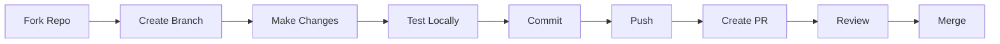

# Contributing to CSA-in-a-Box Documentation

> **Home [Home](../../README.md)** | **Documentation** | **Guides [Guides](./README.md)**

---

## Overview

Thank you for your interest in contributing to the Cloud Scale Analytics (CSA) in-a-Box documentation project! This guide provides everything you need to know about contributing, from setting up your environment to submitting your first pull request.

## Table of Contents

- [Code of Conduct](#code-of-conduct)
- [How to Contribute](#how-to-contribute)
- [Getting Started](#getting-started)
- [Development Process](#development-process)
- [Contribution Types](#contribution-types)
- [Pull Request Process](#pull-request-process)
- [Style Guidelines](#style-guidelines)
- [Review Process](#review-process)
- [Recognition](#recognition)
- [Communication](#communication)
- [Resources](#resources)

---

## Code of Conduct

### Our Pledge

We are committed to providing a friendly, safe, and welcoming environment for all contributors, regardless of experience level, gender identity and expression, sexual orientation, disability, personal appearance, body size, race, ethnicity, age, religion, nationality, or other similar characteristics.

### Expected Behavior

- **Be respectful** and considerate in communication
- **Be collaborative** and supportive of others
- **Accept constructive** criticism gracefully
- **Focus on** what is best for the community
- **Show empathy** towards other community members

### Unacceptable Behavior

- Harassment, discrimination, or offensive comments
- Personal attacks or trolling
- Publishing private information without consent
- Unethical or unprofessional conduct
- Any behavior that creates an unsafe environment

### Reporting Issues

Report Code of Conduct violations to the project maintainers through GitHub Issues with the `conduct` label.

---

## How to Contribute

### Quick Start for First-Time Contributors

New to contributing? Start here!

1. **Browse Good First Issues** - Look for issues labeled `good-first-issue`
2. **Read the [Markdown Style Guide](./MARKDOWN_STYLE_GUIDE.md)** - Learn our formatting standards
3. **Set up your environment** - Follow the [Getting Started](#getting-started) section below
4. **Make a small change** - Fix a typo or improve a sentence
5. **Submit your first PR** - Follow our [Pull Request Process](#pull-request-process)

### Ways to Contribute

| Contribution Type | Description | Skill Level | Issue Label |
|------------------|-------------|-------------|-------------|
| **Report Bugs** | Report issues and problems | Beginner | `bug` |
| **Suggest Features** | Propose new features or improvements | Beginner | `enhancement` |
| **Request Docs** | Request new or improved documentation | Beginner | `documentation` |
| **Fix Typos** | Correct spelling and grammar | Beginner | Direct PR |
| **Improve Docs** | Enhance existing documentation | Intermediate | Direct PR |
| **Add Examples** | Create new examples and tutorials | Intermediate | Direct PR |
| **Fix Bugs** | Resolve reported issues | Intermediate | `bug` |
| **Add Features** | Implement new functionality | Advanced | `enhancement` |
| **Review PRs** | Review others' contributions | Advanced | Review queue |

---

## Getting Started

### Prerequisites

1. **GitHub Account** - [Sign up](https://github.com/join)
2. **Git Installed** - [Download](https://git-scm.com/downloads)
3. **Python 3.8+** - [Download](https://www.python.org/downloads/)
4. **Text Editor** - VS Code recommended

### First-Time Setup

#### 1. Fork the Repository

```bash
# Navigate to the repository on GitHub and click "Fork" button
# This creates a copy of the repository in your account
```

#### 2. Clone Your Fork

```bash
# Clone your fork
git clone https://github.com/YOUR-USERNAME/csa-inabox-docs.git

# Navigate to project
cd csa-inabox-docs

# Add upstream remote
git remote add upstream https://github.com/fgarofalo56/csa-inabox-docs.git
```

#### 3. Set Up Environment

```bash
# Create virtual environment
python -m venv venv

# Activate environment
source venv/bin/activate  # Linux/Mac
venv\Scripts\activate     # Windows

# Install dependencies
pip install -r requirements.txt
pip install -r requirements-test.txt
```

#### 4. Configure Git

```bash
# Set your Git identity
git config user.name "Your Name"
git config user.email "your.email@example.com"
```

---

## Development Process

### Workflow Overview



### Step-by-Step Process

#### 1. Sync Your Fork

```bash
# Fetch upstream changes
git fetch upstream

# Checkout main branch
git checkout main

# Merge upstream changes
git merge upstream/main

# Push to your fork
git push origin main
```

#### 2. Create Feature Branch

```bash
# Create and checkout new branch
git checkout -b feature/your-feature-name

# Branch naming conventions:
# feature/add-synapse-guide     - New features
# fix/broken-links              - Bug fixes
# docs/update-readme            - Documentation
# refactor/reorganize-structure - Code refactoring
# test/add-unit-tests          - Test additions
```

#### 3. Make Your Changes

Follow these guidelines:

- Read [DIRECTORY_STRUCTURE_GUIDE.md](./DIRECTORY_STRUCTURE_GUIDE.md)
- Follow [MARKDOWN_STYLE_GUIDE.md](./MARKDOWN_STYLE_GUIDE.md)
- Update tests if applicable
- Update documentation

#### 4. Test Your Changes

```bash
# Run tests
pytest tests/

# Validate markdown
markdownlint "**/*.md"

# Build documentation
mkdocs build --strict

# Serve locally
mkdocs serve
```

#### 5. Commit Your Changes

```bash
# Stage changes
git add .

# Commit with descriptive message
git commit -m "feat: add Azure Synapse performance guide

- Add optimization techniques section
- Include real-world examples
- Update navigation in mkdocs.yml
- Add tests for new validator

Closes #123"
```

**Commit Message Format:**

```text
<type>(<scope>): <subject>

<body>

<footer>
```

**Types:**

- `feat`: New feature
- `fix`: Bug fix
- `docs`: Documentation changes
- `style`: Formatting changes
- `refactor`: Code restructuring
- `test`: Test additions
- `chore`: Maintenance tasks

#### 6. Push Changes

```bash
# Push to your fork
git push origin feature/your-feature-name
```

---

## Contribution Types

### Documentation Contributions

#### Adding New Documentation

1. **Determine location** using directory structure guide
2. **Create markdown file** following style guide
3. **Update navigation** in `mkdocs.yml`
4. **Add cross-references** to related docs
5. **Test locally** with `mkdocs serve`

#### Improving Existing Docs

1. **Identify improvements** needed
2. **Make changes** following guidelines
3. **Preserve existing** structure where possible
4. **Update metadata** (last updated, version)
5. **Test all links** and references

### Code Contributions

#### Adding Features

1. **Discuss first** - Open issue for significant changes
2. **Follow architecture** - Maintain clean architecture
3. **Write tests** - Include unit and integration tests
4. **Document changes** - Update relevant documentation
5. **Consider backwards** compatibility

#### Fixing Bugs

1. **Verify bug** - Reproduce the issue
2. **Write test** - Add test that fails
3. **Fix bug** - Make test pass
4. **Verify fix** - Ensure no regressions
5. **Document** - Update changelog if needed

---

## Pull Request Process

### Before Creating PR

- [ ] Changes follow style guidelines
- [ ] Tests pass locally
- [ ] Documentation is updated
- [ ] Commit messages are descriptive
- [ ] Branch is up-to-date with main

### Creating Pull Request

1. **Navigate to your fork** on GitHub
2. **Click "Pull Request"** button
3. **Select base and compare** branches
4. **Fill out PR template**:

```markdown
## Description
Brief description of changes

## Type of Change
- [ ] Bug fix
- [ ] New feature
- [ ] Documentation update
- [ ] Performance improvement

## Testing
- [ ] Tests pass locally
- [ ] New tests added
- [ ] Manual testing completed

## Checklist
- [ ] Code follows style guidelines
- [ ] Self-review completed
- [ ] Documentation updated
- [ ] No breaking changes

## Related Issues
Closes #issue-number
```

### PR Best Practices

1. **Keep PRs focused** - One feature/fix per PR
2. **Write clear descriptions** - Explain what and why
3. **Include screenshots** - For UI changes
4. **Reference issues** - Link related issues
5. **Respond to feedback** - Address review comments promptly

---

## Style Guidelines

### Markdown Standards

See [MARKDOWN_STYLE_GUIDE.md](./MARKDOWN_STYLE_GUIDE.md) for complete standards.

**Key Points:**

- Use ATX headers (`#`)
- One H1 per document
- Include navigation breadcrumbs
- Add table of contents for long docs
- Use consistent formatting

### Git Standards

**Branch Names:**

- `feature/description`
- `fix/issue-description`
- `docs/what-updated`

**Commit Messages:**

- Present tense
- Imperative mood
- Under 72 characters
- Reference issues

---

## Review Process

### Review Timeline

- **Initial Response**: Within 48 hours
- **Full Review**: Within 1 week
- **Iteration**: As needed

### Review Criteria

| Aspect | What We Look For |
|--------|------------------|
| **Correctness** | Changes work as intended |
| **Style** | Follows project guidelines |
| **Tests** | Adequate test coverage |
| **Documentation** | Clear and complete |
| **Performance** | No degradation |
| **Security** | No vulnerabilities |

### Review Feedback

#### Responding to Reviews

1. **Thank reviewer** for their time
2. **Address all** comments
3. **Ask questions** if unclear
4. **Update PR** based on feedback
5. **Request re-review** when ready

#### Comment Types

- **`MUST`** - Required change
- **`SHOULD`** - Strongly recommended
- **`CONSIDER`** - Suggestion
- **`NIT`** - Minor issue
- **`QUESTION`** - Clarification needed

---

## Recognition

### Contributor Levels

| Level | Contributions | Benefits |
|-------|--------------|----------|
| **Contributor** | 1+ merged PR | Listed in contributors |
| **Regular Contributor** | 5+ merged PRs | Review permissions |
| **Core Contributor** | 10+ merged PRs | Write access consideration |
| **Maintainer** | Consistent high-quality contributions | Full repository access |

### Attribution

- Contributors are listed in CONTRIBUTORS.md
- Significant contributions mentioned in release notes
- Featured in README.md Contributors section

---

## Communication

### Communication Channels

| Channel | Purpose | Response Time |
|---------|---------|---------------|
| **GitHub Issues** | Bug reports, features | 48 hours |
| **GitHub Discussions** | Questions, ideas | 72 hours |
| **Pull Requests** | Code review | 1 week |

### Getting Help

#### Where to Ask

1. **Documentation question** - GitHub Discussions
2. **Bug report** - GitHub Issues
3. **Feature request** - GitHub Issues
4. **Code help** - Pull Request comments
5. **General discussion** - GitHub Discussions

---

## Resources

### Essential Reading

- [README.md](../../README.md) - Project overview
- [DIRECTORY_STRUCTURE_GUIDE.md](./DIRECTORY_STRUCTURE_GUIDE.md) - File organization
- [MARKDOWN_STYLE_GUIDE.md](./MARKDOWN_STYLE_GUIDE.md) - Documentation standards
- [DEVELOPMENT_GUIDE.md](./DEVELOPMENT_GUIDE.md) - Development setup
- [TESTING_GUIDE.md](./TESTING_GUIDE.md) - Testing practices

### External Resources

- [GitHub Guides](https://guides.github.com/)
- [Markdown Guide](https://www.markdownguide.org/)
- [Conventional Commits](https://www.conventionalcommits.org/)
- [Semantic Versioning](https://semver.org/)

---

## Thank You

Your contributions make this project better for everyone. Whether you're fixing a typo, adding documentation, or implementing features, every contribution matters!

---

**Last Updated:** December 9, 2025
**Version:** 1.0.0
**Maintainer:** CSA Documentation Team

*Happy Contributing!*
