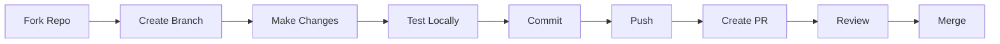

# 🤝 Contributing Guide

> __🏠 [Home](../../README.md)__ | __📚 Documentation__ | __📖 [Guides](./README.md)__

---

## 📋 Overview

Thank you for your interest in contributing to the Cloud Scale Analytics (CSA) in-a-Box documentation project! This guide provides everything you need to know about contributing, from setting up your environment to submitting your first pull request.

## 📑 Table of Contents

- [Code of Conduct](#code-of-conduct)
- [How to Contribute](#how-to-contribute)
- [Getting Started](#getting-started)
- [Development Process](#development-process)
- [Contribution Types](#contribution-types)
- [Pull Request Process](#pull-request-process)
- [Style Guidelines](#style-guidelines)
- [Review Process](#review-process)
- [Recognition](#recognition)
- [Communication](#communication)
- [Resources](#resources)

---

## 📜 Code of Conduct

### Our Pledge

We are committed to providing a friendly, safe, and welcoming environment for all contributors, regardless of experience level, gender identity and expression, sexual orientation, disability, personal appearance, body size, race, ethnicity, age, religion, nationality, or other similar characteristics.

### Expected Behavior

- __Be respectful__ and considerate in communication
- __Be collaborative__ and supportive of others
- __Accept constructive__ criticism gracefully
- __Focus on__ what is best for the community
- __Show empathy__ towards other community members

### Unacceptable Behavior

- Harassment, discrimination, or offensive comments
- Personal attacks or trolling
- Publishing private information without consent
- Unethical or unprofessional conduct
- Any behavior that creates an unsafe environment

### Reporting Issues

Report Code of Conduct violations to: <csa-docs-conduct@microsoft.com>

---

## 🚀 How to Contribute

### Quick Start for First-Time Contributors

New to contributing? Start here!

1. __Browse [Good First Issues](https://github.com/fgarofalo56/csa-inabox-docs/labels/good%20first%20issue)__ - Beginner-friendly tasks
2. __Read the [Markdown Style Guide](./MARKDOWN_STYLE_GUIDE.md)__ - Learn our formatting standards
3. __Set up your environment__ - Follow the [Getting Started](#getting-started) section below
4. __Make a small change__ - Fix a typo or improve a sentence
5. __Submit your first PR__ - Follow our [Pull Request Process](#pull-request-process)

Need help? Ask in [GitHub Discussions](https://github.com/fgarofalo56/csa-inabox-docs/discussions)!

### Ways to Contribute

| Contribution Type | Description | Skill Level | Issue Template |
|------------------|-------------|-------------|----------------|
| __Report Bugs__ 🐛 | Report issues and problems | Beginner | [Bug Report](https://github.com/your-org/csa-inabox-docs/issues/new?template=bug-report.md) |
| __Suggest Features__ 💡 | Propose new features or improvements | Beginner | [Feature Request](https://github.com/your-org/csa-inabox-docs/issues/new?template=feature_request.md) |
| __Request Docs__ 📋 | Request new or improved documentation | Beginner | [Documentation Request](https://github.com/your-org/csa-inabox-docs/issues/new?template=documentation-request.md) |
| __Fix Typos__ ✏️ | Correct spelling and grammar | Beginner | Direct PR |
| __Improve Docs__ 📚 | Enhance existing documentation | Intermediate | Direct PR |
| __Add Examples__ 📝 | Create new examples and tutorials | Intermediate | Direct PR |
| __Fix Bugs__ 🔧 | Resolve reported issues | Intermediate | Direct PR |
| __Add Features__ ⚡ | Implement new functionality | Advanced | Direct PR |
| __Review PRs__ 👀 | Review others' contributions | Advanced | Review queue |

---

## 🎯 Getting Started

### Prerequisites

1. __GitHub Account__ - [Sign up](https://github.com/join)
2. __Git Installed__ - [Download](https://git-scm.com/downloads)
3. __Python 3.8+__ - [Download](https://www.python.org/downloads/)
4. __Text Editor__ - VS Code recommended

### First-Time Setup

#### 1. Fork the Repository

```bash
# Navigate to https://github.com/fgarofalo56/csa-inabox-docs
# Click "Fork" button in top-right corner
```

#### 2. Clone Your Fork

```bash
# Clone your fork
git clone https://github.com/YOUR-USERNAME/csa-inabox-docs.git

# Navigate to project
cd csa-inabox-docs

# Add upstream remote
git remote add upstream https://github.com/fgarofalo56/csa-inabox-docs.git
```

#### 3. Set Up Environment

```bash
# Create virtual environment
python -m venv venv

# Activate environment
source venv/bin/activate  # Linux/Mac
venv\Scripts\activate     # Windows

# Install dependencies
pip install -r requirements.txt
pip install -r requirements-test.txt
```

#### 4. Configure Git

```bash
# Set your Git identity
git config user.name "Your Name"
git config user.email "your.email@example.com"

# Enable Git hooks
git config core.hooksPath .githooks
```

---

## 🔄 Development Process

### Workflow Overview



### Step-by-Step Process

#### 1. Sync Your Fork

```bash
# Fetch upstream changes
git fetch upstream

# Checkout main branch
git checkout main

# Merge upstream changes
git merge upstream/main

# Push to your fork
git push origin main
```

#### 2. Create Feature Branch

```bash
# Create and checkout new branch
git checkout -b feature/your-feature-name

# Branch naming conventions:
# feature/add-synapse-guide     - New features
# fix/broken-links              - Bug fixes
# docs/update-readme            - Documentation
# refactor/reorganize-structure - Code refactoring
# test/add-unit-tests          - Test additions
```

#### 3. Make Your Changes

Follow these guidelines:

- Read [DIRECTORY_STRUCTURE_GUIDE.md](./DIRECTORY_STRUCTURE_GUIDE.md)
- Follow [MARKDOWN_STYLE_GUIDE.md](./MARKDOWN_STYLE_GUIDE.md)
- Update tests if applicable
- Update documentation

#### 4. Test Your Changes

```bash
# Run tests
pytest tests/

# Validate markdown
markdownlint "**/*.md"

# Check links
python src/csa_docs_tools/cli.py validate-links

# Build documentation
mkdocs build --strict

# Serve locally
mkdocs serve
```

#### 5. Commit Your Changes

```bash
# Stage changes
git add .

# Commit with descriptive message
git commit -m "feat: add Azure Synapse performance guide

- Add optimization techniques section
- Include real-world examples
- Update navigation in mkdocs.yml
- Add tests for new validator

Closes #123"
```

__Commit Message Format:__

```text
<type>(<scope>): <subject>

<body>

<footer>
```

__Types:__

- `feat`: New feature
- `fix`: Bug fix
- `docs`: Documentation changes
- `style`: Formatting changes
- `refactor`: Code restructuring
- `test`: Test additions
- `chore`: Maintenance tasks

#### 6. Push Changes

```bash
# Push to your fork
git push origin feature/your-feature-name
```

---

## 📝 Contribution Types

### Documentation Contributions

#### Adding New Documentation

1. __Determine location__ using directory structure guide
2. __Create markdown file__ following style guide
3. __Update navigation__ in `mkdocs.yml`
4. __Add cross-references__ to related docs
5. __Test locally__ with `mkdocs serve`

#### Improving Existing Docs

1. __Identify improvements__ needed
2. __Make changes__ following guidelines
3. __Preserve existing__ structure where possible
4. __Update metadata__ (last updated, version)
5. __Test all links__ and references

### Code Contributions

#### Adding Features

1. __Discuss first__ - Open issue for significant changes
2. __Follow architecture__ - Maintain clean architecture
3. __Write tests__ - Include unit and integration tests
4. __Document changes__ - Update relevant documentation
5. __Consider backwards__ compatibility

#### Fixing Bugs

1. __Verify bug__ - Reproduce the issue
2. __Write test__ - Add test that fails
3. __Fix bug__ - Make test pass
4. __Verify fix__ - Ensure no regressions
5. __Document__ - Update changelog if needed

### Example Contributions

#### Simple Documentation Fix

```markdown
<!-- Before -->
# Azure Synpase Analytics

<!-- After -->
# Azure Synapse Analytics
```

#### Adding New Guide Section

```markdown
## Performance Optimization

### Query Optimization

Optimize your Synapse SQL queries using these techniques:

1. **Use appropriate distributions**
   - Hash distribution for large fact tables
   - Round-robin for staging tables
   - Replicated for small dimension tables

2. **Implement proper indexing**
   ```sql
   CREATE CLUSTERED COLUMNSTORE INDEX cci_FactSales
   ON dbo.FactSales;
   ```

1. __Partition large tables__
   - Partition by date for time-series data
   - Ensure partitions have >1 million rows

```text
```

---

## 🔀 Pull Request Process

### Before Creating PR

- [ ] Changes follow style guidelines
- [ ] Tests pass locally
- [ ] Documentation is updated
- [ ] Commit messages are descriptive
- [ ] Branch is up-to-date with main

### Creating Pull Request

1. __Navigate to your fork__ on GitHub
2. __Click "Pull Request"__ button
3. __Select base and compare__ branches
4. __Fill out PR template__:

```markdown
## Description
Brief description of changes

## Type of Change
- [ ] Bug fix
- [ ] New feature
- [ ] Documentation update
- [ ] Performance improvement

## Testing
- [ ] Tests pass locally
- [ ] New tests added
- [ ] Manual testing completed

## Checklist
- [ ] Code follows style guidelines
- [ ] Self-review completed
- [ ] Documentation updated
- [ ] No breaking changes

## Related Issues
Closes #issue-number
```

### PR Best Practices

1. __Keep PRs focused__ - One feature/fix per PR
2. __Write clear descriptions__ - Explain what and why
3. __Include screenshots__ - For UI changes
4. __Reference issues__ - Link related issues
5. __Respond to feedback__ - Address review comments promptly

---

## 🎨 Style Guidelines

### Markdown Standards

See [MARKDOWN_STYLE_GUIDE.md](./MARKDOWN_STYLE_GUIDE.md) for complete standards.

__Key Points:__

- Use ATX headers (`#`)
- One H1 per document
- Include navigation breadcrumbs
- Add table of contents for long docs
- Use consistent formatting

### Python Code Standards

```python
"""Module docstring."""
from typing import List, Optional
import logging

logger = logging.getLogger(__name__)


class ExampleClass:
    """Class docstring."""
    
    def __init__(self, param: str) -> None:
        """Initialize with parameter."""
        self.param = param
    
    def method(self, value: int) -> Optional[str]:
        """Method docstring."""
        if value > 0:
            return f"Positive: {value}"
        return None
```

### Git Standards

__Branch Names:__

- `feature/description`
- `fix/issue-description`
- `docs/what-updated`

__Commit Messages:__

- Present tense
- Imperative mood
- Under 72 characters
- Reference issues

---

## 👀 Review Process

### Review Timeline

- __Initial Response__: Within 48 hours
- __Full Review__: Within 1 week
- __Iteration__: As needed

### Review Criteria

| Aspect | What We Look For |
|--------|------------------|
| __Correctness__ | Changes work as intended |
| __Style__ | Follows project guidelines |
| __Tests__ | Adequate test coverage |
| __Documentation__ | Clear and complete |
| __Performance__ | No degradation |
| __Security__ | No vulnerabilities |

### Review Feedback

#### Responding to Reviews

1. __Thank reviewer__ for their time
2. __Address all__ comments
3. __Ask questions__ if unclear
4. __Update PR__ based on feedback
5. __Request re-review__ when ready

#### Comment Types

- __`MUST`__ - Required change
- __`SHOULD`__ - Strongly recommended
- __`CONSIDER`__ - Suggestion
- __`NIT`__ - Minor issue
- __`QUESTION`__ - Clarification needed

---

## 🏆 Recognition

### Contributor Levels

| Level | Contributions | Benefits |
|-------|--------------|----------|
| __Contributor__ | 1+ merged PR | Listed in contributors |
| __Regular Contributor__ | 5+ merged PRs | Review permissions |
| __Core Contributor__ | 10+ merged PRs | Write access consideration |
| __Maintainer__ | Consistent high-quality contributions | Full repository access |

### Hall of Fame

We celebrate our top contributors! Outstanding contributors are featured in our Hall of Fame section.

__Recognition Categories:__

- __Documentation Champions__ - Most documentation contributions
- __Quality Advocates__ - Highest quality submissions
- __Community Leaders__ - Active reviewers and mentors
- __Innovation Stars__ - Creative solutions and improvements

### Attribution

- Contributors are recognized in the project
- Significant contributions mentioned in release notes
- Annual contributor spotlight blog posts
- Featured in README.md Contributors section

---

## 💬 Communication

### Communication Channels

| Channel | Purpose | Response Time |
|---------|---------|---------------|
| __GitHub Issues__ | Bug reports, features | 48 hours |
| __GitHub Discussions__ | Questions, ideas | 72 hours |
| __Pull Requests__ | Code review | 1 week |
| __Email__ | Private concerns | 1 week |

### Getting Help

#### Where to Ask

1. __Documentation question__ → GitHub Discussions
2. __Bug report__ → GitHub Issues
3. __Feature request__ → GitHub Issues
4. __Code help__ → Pull Request comments
5. __General discussion__ → GitHub Discussions

#### How to Ask

```markdown
## Question/Issue
Clear description of the problem

## Context
- What you're trying to do
- What you've tried
- Error messages (if any)

## Environment
- OS: [e.g., Windows 11]
- Python: [e.g., 3.11.0]
- Project Version: [e.g., 1.0.0]

## Additional Information
Any other relevant details
\```

---

## 📚 Resources

### Essential Reading

- [README.md](../../README.md) - Project overview
- [DIRECTORY_STRUCTURE_GUIDE.md](./DIRECTORY_STRUCTURE_GUIDE.md) - File organization
- [MARKDOWN_STYLE_GUIDE.md](./MARKDOWN_STYLE_GUIDE.md) - Documentation standards
- [DEVELOPMENT_GUIDE.md](./DEVELOPMENT_GUIDE.md) - Development setup
- [TESTING_GUIDE.md](./TESTING_GUIDE.md) - Testing practices

### External Resources

- [GitHub Guides](https://guides.github.com/)
- [Markdown Guide](https://www.markdownguide.org/)
- [Conventional Commits](https://www.conventionalcommits.org/)
- [Semantic Versioning](https://semver.org/)

### Learning Resources

#### For Beginners

- [First Contributions](https://firstcontributions.github.io/)
- [How to Contribute to Open Source](https://opensource.guide/how-to-contribute/)
- [GitHub Skills](https://skills.github.com/)

#### For Advanced Contributors

- [Pro Git Book](https://git-scm.com/book)
- [GitHub Actions Documentation](https://docs.github.com/actions)
- [Python Testing Best Practices](https://realpython.com/python-testing/)

---

## 🎉 Thank You

Your contributions make this project better for everyone. Whether you're fixing a typo, adding documentation, or implementing features, every contribution matters!

### Quick Links

- [Open Issues](https://github.com/fgarofalo56/csa-inabox-docs/issues)
- [Good First Issues](https://github.com/fgarofalo56/csa-inabox-docs/labels/good%20first%20issue)
- [Help Wanted](https://github.com/fgarofalo56/csa-inabox-docs/labels/help%20wanted)
- [Discussions](https://github.com/fgarofalo56/csa-inabox-docs/discussions)

---

__Last Updated:__ January 28, 2025  
__Version:__ 1.0.0  
__Maintainer:__ CSA Documentation Team

*Happy Contributing! 🚀*
