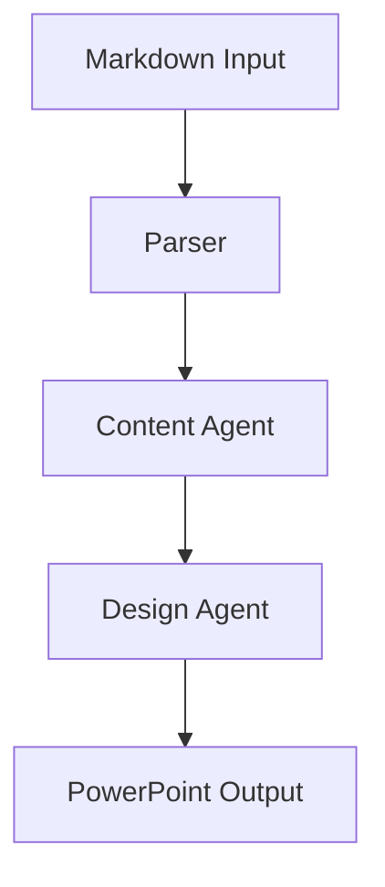

# 📝 Markdown Style Guide

This document defines the visual and structural standards for all markdown files.

## 📋 Table of Contents

- [File Organization](#file-organization)
- [Markdown Flavors](#markdown-flavors)
- [Formatting Standards](#formatting-standards)
- [Content Guidelines](#content-guidelines)
- [Code Documentation](#code-documentation)
- [Visual Elements](#visual-elements)
- [Images & Media](#images--media)
- [Cross-References](#cross-references)
- [Special Content](#special-content)
- [SEO & Discoverability](#seo--discoverability)
- [Testing & Validation](#testing--validation)
- [Automation & Enforcement](#automation--enforcement)
- [Templates](#templates)
- [Feedback Prompts](#feedback-prompts)
- [Review Checklist](#review-checklist)
- [Additional Resources](#additional-resources)

## 📁 File Organization

### __File Naming__

- Use lowercase with hyphens: `api-reference.md`, `user-guide.md`
- Be descriptive and specific: `agent-configuration.md` not `config.md`
- Use consistent prefixes for related files: `test-unit.md`, `test-integration.md`
- Include version in filename when needed: `api-v2.md`, `migration-guide-v3.md`

### __Directory Structure__

```text
docs/
├── api/              # API documentation
├── architecture/     # System design docs
├── guides/          # User and developer guides
├── diagrams/        # Visual documentation
├── assets/          # Images and media files
│   └── images/      # Screenshot and diagram storage
├── deployment/      # Deployment guides
├── changelog/       # Version history and changes
└── troubleshooting/ # Problem-solving docs
```

### __File Headers__

All markdown files should start with:

```markdown
# Document Title

Brief description of the document's purpose (1-2 sentences).

## Table of Contents
- [Section 1](#section-1)
- [Section 2](#section-2)
```

## 📋 Markdown Flavors

This guide follows __GitHub Flavored Markdown (GFM)__ with these extensions:

- Task lists: `- [ ]` and `- [x]`
- Strikethrough: `~~text~~`
- Tables (with alignment support)
- Autolinked URLs
- Syntax highlighting in code blocks
- Emoji support via shortcodes `:emoji:` or Unicode
- Collapsible sections with `<details>` tags
- Mermaid diagram support

## 🎨 Formatting Standards

### __Headings__

- Use ATX style (`#`) with space after hash
- Only one H1 per document
- Don't skip heading levels
- Use sentence case: `## Getting started` not `## Getting Started`

```markdown
# Main Title (H1)
## Section Title (H2)
### Subsection Title (H3)
#### Detail Section (H4)
```

### __Lists__

- __Unordered__: Use `-` (hyphen) consistently
- __Ordered__: Use `1.` format with auto-numbering
- Add blank line before and after lists
- Use consistent indentation (2 spaces)

```markdown
## Features

- Feature one with description
- Feature two with description
  - Sub-feature with 2-space indent
  - Another sub-feature

## Steps

1. First step
2. Second step
   1. Sub-step with 3-space indent
   2. Another sub-step
```

### __Emphasis__

- __Bold__: Use `**text**` for important terms
- *Italic*: Use `*text*` for emphasis
- `Code`: Use backticks for inline code, filenames, commands
- ~~Strikethrough~~: Use `~~text~~` for deprecated items

### __Links__

- Use descriptive link text: `[API documentation](api.md)` not `[here](api.md)`
- Use reference-style for repeated URLs:

```markdown
Check the [official docs][anthropic] and [API reference][anthropic].

[anthropic]: https://docs.anthropic.com
```

### __Code Blocks__

- Always specify language for syntax highlighting
- Use descriptive comments
- Keep examples concise but complete

```python
# Good: Complete example with context
async def process_slides(slides: List[Slide]) -> ProcessingResult:
    """Process slides with error handling."""
    try:
        return await processor.process(slides)
    except ProcessingError as e:
        logger.error("Processing failed", error=str(e))
        raise
```

### __Inline Code vs Code Blocks__

__Use inline code for:__

- Single commands: `npm install`
- File/directory names: `src/main.py`
- Function names: `processData()`
- Short config values: `DEBUG=true`
- Package names: `pandas`, `react-router`

__Use code blocks for:__

- Multi-line code
- Complete examples
- Configuration files
- Command sequences
- Complex expressions

### __Enhanced Table Formatting__

#### Standard Table Structure

```markdown
| Column 1     | Column 2       | Column 3      |
| :----------- | :------------- | :------------ |
| Left-aligned | Center content | Right info    |
| Use icons 🎯  | Add badges     | Include links |
```

#### Feature Comparison Tables

```markdown
| Feature | Basic | Premium | Enterprise |
| :------ | :---: | :-----: | :--------: |
| Users   |  10   |   100   | Unlimited  |
| Storage |  1GB  |  10GB   |   100GB    |
| Support |   ❌   |    ✅    |     ✅      |
```

#### API Parameter Tables

| Parameter | Type        | Required | Description                       |
| --------- | ----------- | -------- | --------------------------------- |
| `slides`  | List[Slide] | ✅ Yes    | Input slides to process           |
| `theme`   | str         | ❌ No     | Theme name (default: "corporate") |

### __Line Length__

- Maximum 100 characters for prose
- Exceptions:
  - Tables
  - Long URLs (use reference-style when possible)
  - Code blocks
  - Badge definitions

## 📖 Content Guidelines

### __Writing Style__

- __Voice__: Use active voice when possible
- __Tense__: Present tense for instructions, past tense for examples
- __Person__: Second person for user-facing docs ("you"), first person plural for team docs ("we")
- __Tone__: Professional but approachable

### __Structure__

- Start with overview/summary
- Use progressive disclosure (general → specific)
- Include practical examples
- End with next steps or related links

### __Terminology__

- Use consistent terms throughout project
- Define acronyms on first use: "Large Language Model (LLM)"
- Maintain glossary for complex terms

### __Examples__

- Include realistic, working examples
- Show both success and error cases
- Provide context for when to use each approach

## 💻 Code Documentation

### __API Documentation__

```markdown
### `generate_presentation(markdown_path, **kwargs)`

Generate presentation from markdown file.

**Parameters:**
- `markdown_path` (str): Path to input markdown file
- `output_path` (str, optional): Output file path. Defaults to auto-generated name
- `theme` (str, default="corporate"): Presentation theme
- `max_slides` (int, default=100): Maximum number of slides

**Returns:**
- `str`: Path to generated presentation file

**Raises:**
- `FileNotFoundError`: If input file doesn't exist
- `ValidationError`: If markdown is malformed

**Example:**
```python
# Basic usage
output = await generator.generate("presentation.md")

# With custom options
output = await generator.generate(
    "presentation.md",
    theme="academic",
    max_slides=25,
    output_path="custom_output.pptx"
)
```

```text
```

### __Configuration Examples__

```markdown
## Configuration

Create `.env` file:

\```bash
# Required API keys
ANTHROPIC_API_KEY=sk-ant-your-key-here
OPENAI_API_KEY=sk-your-key-here

# Optional settings
LOG_LEVEL=INFO
MAX_SLIDES=100
ENABLE_CACHING=true
\```
```

## 🎯 Visual Elements

### __Icon Usage Guidelines__

#### 📋 Standard Icon Mappings

| Category             | Primary Icon | Alternative Icons | Usage                                   |
| :------------------- | :----------- | :---------------- | :-------------------------------------- |
| __Architecture__     | 🏗️            | 🏛️, 🌉, 🔧           | System design, patterns, infrastructure |
| __Code/Development__ | 💻            | 🔧, ⚙️, 🛠️, 👨‍💻        | Code examples, tools, programming       |
| __Security__         | 🔒            | 🔐, 🛡️, 🔑, 🚨        | Security topics, authentication         |
| __Performance__      | ⚡            | 🚀, 📈, ⏱️, 🏃‍♂️        | Optimization, speed, efficiency         |
| __Best Practices__   | 💡            | 📋, ✨, 🎯, 🌟        | Guidelines, tips, recommendations       |
| __Warning/Caution__  | ⚠️            | 🚨, ❗, ⛔, 🔥        | Important notices, alerts               |
| __Success/Complete__ | ✅            | ✔️, 🎉, 👍, 🟢        | Positive outcomes, completion           |
| __Error/Failed__     | ❌            | ❗, 🔴, 🚫, 💥        | Negative outcomes, failures             |
| __Documentation__    | 📚            | 📖, 📝, 📄, 📋        | Text content, guides, manuals           |
| __Data/Analytics__   | 📊            | 📈, 📉, 💾, 🗃️        | Data topics, charts, storage            |
| __Cloud/Services__   | ☁️            | 🌐, 🔷, 🌍, 🖥️        | External services, web, servers         |
| __Process/Workflow__ | 🔄            | ➡️, 🔀, 📍, 🔁        | Steps, flows, procedures                |
| __Configuration__    | ⚙️            | 🔧, 🛠️, 📝, 🎛️        | Settings, setup, customization          |
| __Testing__          | 🧪            | ✅, 🔍, 🎯, 🧬        | Testing, validation, quality assurance  |
| __Deployment__       | 🚀            | 📦, 🌐, ⬆️, 🎯        | Releases, publishing, distribution      |
| __Monitoring__       | 👀            | 📊, 📈, 🔍, 📡        | Observability, tracking, alerts         |
| __Troubleshooting__  | 🔧            | 🩺, 🔍, ❓, 🛠️        | Problem solving, debugging              |
| __Getting Started__  | 🚀            | 🌟, ⭐, 🎯, 🏁        | Quick start, onboarding                 |
| __Resources__        | 📚            | 🔗, 📎, 🌐, 💼        | Links, references, tools                |
| __Examples__         | 💡            | 📝, 🎯, 🔍, 📋        | Code samples, demonstrations            |

#### 🎨 Heading Icon Rules

```markdown
# 🚀 Main Title (H1) - Use bold, distinctive icons
## 📖 Major Section (H2) - Use category-specific icons
### 🎯 Subsection (H3) - Use relevant contextual icons
#### 📝 Detail Level (H4) - Optional, smaller scope icons
```

### __Badge Standards__

#### 🏷️ Required Badge Types

__Status Badges:__

```markdown


```

__Version & Build Badges:__

```markdown


```

__Documentation Badges:__

```markdown


```

#### Badge URL Structure

Badge URLs follow this pattern:

```text
https://img.shields.io/badge/{label}-{message}-{color}?style={style}
```

- Use `%20` for spaces in label/message
- Use `%25` for percentage signs
- Style options: `flat`, `flat-square`, `plastic`, `for-the-badge`

Example:

```markdown

```

#### 🎨 Standard Color Coding

| Status               | Color         | Hex Code  | Usage                                |
| :------------------- | :------------ | :-------- | :----------------------------------- |
| __Success/Active__   | `brightgreen` | `#4c1`    | Completed, working, stable           |
| __Information__      | `blue`        | `#007ec6` | Version, documentation, general info |
| __Warning/Progress__ | `yellow`      | `#dfb317` | In development, caution, pending     |
| __Error/Critical__   | `red`         | `#e05d44` | Failed, deprecated, broken           |
| __Neutral__          | `lightgrey`   | `#9f9f9f` | Unknown, not applicable              |

#### 📏 Badge Placement Rules

__Document Header Badges:__

```markdown
# 🚀 Project Name


Brief project description here.
```

__Section Status Badges:__

```markdown
## 📖 API Documentation 

### 🔧 Configuration 
```

#### Complexity Badges

```markdown


```

#### Performance Impact Badges

```markdown


```

### __Visual Element Rules & Standards__

#### 🎯 Consistent Visual Hierarchy

__Document Structure:__

```markdown
# 🚀 Project Title (H1) - Bold, project-defining icon
## 📖 Major Sections (H2) - Category-specific icons
### 🔧 Subsections (H3) - Functional icons
#### 📝 Details (H4) - Minimal, contextual icons
```

__Icon Consistency Rules:__

- __Use the same icon__ for similar concepts across all documentation
- __Maintain visual balance__ - avoid icon overload in headings
- __Follow the Standard Icon Mappings__ table for all icon choices
- __Test icon visibility__ across different themes and devices

#### 🎨 Visual Spacing Standards

__Required Spacing:__

```markdown
# 🚀 Title

 

Brief description paragraph.

## 📖 Section Header

Content with proper spacing around elements.

### 🔧 Subsection

- List items with proper spacing
- Second item

```code blocks with blank lines above and below```

More content continues...
```

#### 🔍 Accessibility Guidelines

__Icon Accessibility:__

- Always include descriptive alt text for images
- Use high-contrast icon combinations
- Ensure icons enhance, not replace, textual information
- Test with screen readers when possible

__Badge Accessibility:__

```markdown

```

### __Header Navigation Standards__

#### 🧭 Required Header Format

__All markdown files must include a consistent header with breadcrumb navigation:__

```markdown
# 🎯 Document Title - Project Name

> **🏠 [Home](../../README.md)** | **📖 Documentation** | **🔧 [Current Section](CURRENT_FILE.md)** | **👤 Current Page**

<!-- --- -->
```

#### 📍 Breadcrumb Navigation Rules

__Structure Requirements:__

- Start with Home icon (🏠) linking to root README.md
- Include Documentation link (📖) to docs/README.md
- Add relevant section link with appropriate icon
- End with current page name (no link, bold text)
- Use pipe separators (|) between navigation items
- Wrap entire navigation in blockquote (>)

__Icon Guidelines for Navigation:__

- 🏠 __Home__ - Always links to root README.md
- 📖 __Documentation__ - Links to docs/README.md
- 🔧 __Developer Guide__ - For development-related docs
- 👤 __User Guide__ - For user-facing documentation
- 📋 __API Reference__ - For API documentation
- 🏗️ __Architecture__ - For system design docs
- ⚙️ __Configuration__ - For setup and config docs

__Path Examples:__

```markdown
<!-- Root level file -->
> **🏠 [Home](README.md)** | **📖 Current Page**

<!-- Docs folder file -->
> **🏠 Home** | **📖 Documentation** | **👤 Current Page**

<!-- Docs subfolder file -->
> **🏠 [Home](../../README.md)** | **📖 Documentation** | **🔧 [Guides](README.md)** | **👤 Current Page**
```

### __Color Coding Guidelines__

| Color        | Hex Code  | Usage                    | Examples              |
| :----------- | :-------- | :----------------------- | :-------------------- |
| 🟢 __Green__  | `#28a745` | Success, Good, Complete  | Active, Low Impact    |
| 🟡 __Yellow__ | `#ffc107` | Warning, Caution, Medium | Beta, Medium Impact   |
| 🔴 __Red__    | `#dc3545` | Error, High Priority     | Critical, High Impact |
| 🔵 __Blue__   | `#007bff` | Information, Primary     | Default, Links        |
| ⚫ __Gray__   | `#6c757d` | Disabled, Inactive       | Deprecated, N/A       |

### __Callouts__

Use consistent formatting for special content:

```markdown
> **💡 Tip:** Use caching to improve performance in production environments.

> **⚠️ Warning:** This operation will overwrite existing files.

> **📝 Note:** The API key must have presentation generation permissions.

> **🚨 Important:** Always backup data before performing this operation.

> **ℹ️ Info:** This feature requires version 2.0 or higher.
```

### __Diagrams__

- Use mermaid for simple diagrams
- Store complex diagrams in `docs/diagrams/`
- Include alt text for accessibility



## 🖼️ Images & Media

### __Image Standards__

- __Format__: Prefer PNG for screenshots, SVG for diagrams, JPEG for photos
- __Size__: Optimize images under 500KB
- __Storage__: Place in `/docs/images/` or `/docs/images/diagrams/` for architecture diagrams
- __Naming__: Use descriptive names: `api-flow-diagram.png`, `setup-step-1.png`
- __Dimensions__: Maximum width 1200px for readability

### __Alt Text Requirements__

Always provide descriptive alt text for accessibility:

```markdown

```

### __Responsive Images__

For HTML embedding when markdown isn't sufficient:

```html

```

### __Image Captions__

```markdown

*Figure 1: System architecture showing component interactions*
```

### __Screenshots__

- Include relevant UI context
- Highlight important areas with arrows or boxes
- Use consistent styling across all screenshots
- Update screenshots when UI changes

## 🔗 Cross-References

### __Internal Links__

- Use relative paths for navigation between docs
- Link to specific sections using anchors
- Verify links with tools before committing
- Use descriptive anchor text

### __Document Versioning__

- Include version in filename for major versions: `api-v2.md`
- Maintain changelog: `CHANGELOG.md`
- Link to version history
- Archive old versions in `/docs/archive/`

### __External Links__

- Always use HTTPS when available
- Check links periodically for dead URLs
- Consider using reference-style for frequently used links
- Add `target="_blank"` for external links in HTML

## 📦 Special Content

### __Collapsible Sections__

Use for lengthy optional content:

```markdown
<details>
<summary>🔍 Click to expand advanced configuration</summary>

Advanced configuration content here...

- Option 1: Description
- Option 2: Description

</details>
```

### __Task Lists & Checklists__

```markdown
## ✅ Implementation Checklist

- [x] Design approved
- [x] Code implemented
- [ ] Tests written
- [ ] Documentation updated
- [ ] Code review completed
```

### __Mathematical Notation__

For inline math: `$E = mc^2$`

For block math:

```markdown
$$
\frac{n!}{k!(n-k)!} = \binom{n}{k}
$$
```

### __Deprecation Notices__

```markdown
> **⚠️ DEPRECATED**: This feature will be removed in v3.0
>
> **Migration Path:** Use `new_function()` instead
> **Timeline:** Removal planned for January 2025
> **Migration Guide:** [View migration guide](migration-v3.md)
```

### __Changelog Format__

```markdown
# Changelog

All notable changes to this project will be documented in this file.

The format is based on [Keep a Changelog](https://keepachangelog.com/en/1.0.0/),
and this project adheres to [Semantic Versioning](https://semver.org/spec/v2.0.0.html).

## [Unreleased]

### Added
- New feature X

### Changed
- Updated Y behavior

### Deprecated
- Feature Z will be removed in v3.0

### Removed
- Deleted obsolete feature W

### Fixed
- Bug fix in component V

### Security
- Patched vulnerability in dependency U
```

## 🔍 SEO & Discoverability

### __SEO Guidelines__

- Include primary keywords in H1 and H2 headings
- Add meta description in front matter (if supported)
- Use descriptive file names with keywords
- Include relevant tags/labels
- Create meaningful URLs/paths
- Add schema markup where appropriate

### __Front Matter Template__

```yaml
---
title: "API Reference Guide"
description: "Complete API reference for all endpoints and methods"
keywords: ["api", "reference", "documentation", "endpoints"]
author: "Team Name"
date: 2024-01-01
version: "2.0.0"
---
```

### __Searchability__

- Use consistent terminology
- Include common synonyms
- Add search tags
- Create index pages
- Build sitemap for docs

## 🧪 Testing & Validation

### __Documentation Testing Checklist__

- [ ] __Link Validation__
  - [ ] All internal links verified
  - [ ] External links checked
  - [ ] Anchor links tested
  - [ ] Image paths validated

- [ ] __Code Testing__
  - [ ] Code examples tested and working
  - [ ] API calls verified
  - [ ] Configuration samples validated
  - [ ] Dependencies listed correctly

- [ ] __Formatting Validation__
  - [ ] Markdown lints without errors
  - [ ] Tables render properly
  - [ ] Lists formatted consistently
  - [ ] Code blocks have language tags

- [ ] __Content Review__
  - [ ] Technical accuracy verified
  - [ ] Grammar and spelling checked
  - [ ] Terminology consistent
  - [ ] Examples relevant and current

### __Validation Tools__

```bash
# Markdown linting
markdownlint docs/**/*.md

# Link checking
markdown-link-check docs/**/*.md

# Spell checking
cspell docs/**/*.md

# Vale for style consistency
vale docs/**/*.md
```

## 🤖 Automation & Enforcement

### __Linting Rules__

This project uses markdownlint with the following key rules:

```json
{
  "MD013": {
    "line_length": 100,
    "heading_line_length": 100,
    "code_block_line_length": 120,
    "tables": false
  },
  "MD033": {
    "allowed_elements": ["br", "img", "div", "details", "summary", "kbd", "sup", "sub"]
  },
  "MD029": {
    "style": "one"
  },
  "MD026": {
    "punctuation": ".,;:!"
  }
}
```

### __Pre-commit Hooks__

Install and configure:

```bash
pip install pre-commit
pre-commit install
```

`.pre-commit-config.yaml`:

```yaml
repos:
  - repo: https://github.com/igorshubovych/markdownlint-cli
    rev: v0.39.0
    hooks:
      - id: markdownlint
        args: ["--fix"]

  - repo: https://github.com/tcort/markdown-link-check
    rev: v3.11.2
    hooks:
      - id: markdown-link-check
```

### __IDE Setup__

__VS Code Extensions:__

- markdownlint
- Markdown All in One
- Markdown Preview Enhanced
- Mermaid Markdown Syntax Highlighting

__Settings:__

```json
{
  "markdownlint.config": {
    "extends": ".markdownlint.json"
  },
  "[markdown]": {
    "editor.formatOnSave": true,
    "editor.wordWrap": "wordWrapColumn",
    "editor.wordWrapColumn": 100,
    "editor.rulers": [100],
    "editor.defaultFormatter": "DavidAnson.vscode-markdownlint"
  },
  "markdown.preview.breaks": true,
  "markdown.extension.toc.levels": "2..6"
}
```

### __CI/CD Integration__

```yaml
name: Documentation Validation

on: [push, pull_request]

jobs:
  validate-docs:
    runs-on: ubuntu-latest
    steps:
      - uses: actions/checkout@v3
      - name: Lint Markdown
        uses: DavidAnson/markdownlint-cli2-action@v9
      - name: Check Links
        uses: gaurav-nelson/github-action-markdown-link-check@v1
```

### __Git Commit Standards for Docs__

```text
docs: <type>: <description>

Types:
- docs: add: New documentation added
- docs: update: Existing documentation updated
- docs: fix: Documentation errors corrected
- docs: remove: Documentation removed
- docs: style: Formatting/style changes only

Example:
docs: update: API reference for v2.0 endpoints
```

## 📋 Templates

### __README Template__

```markdown
# 🚀 Project Name


Brief description of what this project does and who it's for (1-2 sentences).

## ✨ Key Features

- **Feature 1**: Brief description
- **Feature 2**: Brief description
- **Feature 3**: Brief description

## 🚀 Quick Start

```bash
npm install package-name
npm run start
```

## 📦 Installation

Detailed installation instructions...

## 🔧 Usage

### Basic Example

```javascript
const package = require('package-name');
package.doSomething();
```

## 📖 Documentation

- [API Reference](docs/api-reference.md)
- [User Guide](docs/user-guide.md)
- [Examples](docs/examples.md)

## 🤝 Contributing

See [CONTRIBUTING.md](CONTRIBUTING.md) for contribution guidelines.

## 📄 License

This project is licensed under the MIT License - see [LICENSE](LICENSE) file.

## 🙏 Acknowledgments

- Credit to contributors
- Third-party libraries used

```text
```

### __Document Header Template__

```text
# 🚀 Document Title

<div align="center">


### 📚 Brief Description

</div>

---
\```

### __Section Header Template__

```markdown
## 📖 Section Title

> **💡 Brief section description or key insight**

### 🎯 Subsection Title
```

### __Feature Table Template__

```markdown
| Feature         | Description      | Status    |
| :-------------- | :--------------- | :-------- |
| 🎯 **Feature 1** | Description here | ✅ Active  |
| 🚀 **Feature 2** | Description here | 🚧 Beta    |
| 💡 **Feature 3** | Description here | 📅 Planned |
```

### __API Documentation Template__

```markdown
### `function_name(parameters)`

Brief description of what the function does.

**Parameters:**
- `param1` (type): Description
- `param2` (type, optional): Description with default

**Returns:**
- `return_type`: Description of return value

**Raises:**
- `ErrorType`: When this error occurs

**Example:**
\```python
result = function_name(param1="value")
print(result)
\```
```

### __Troubleshooting Section Template__

```markdown
## 🔧 Troubleshooting

### Common Issues

**Problem:** Brief description of the issue
**Symptoms:** What the user observes
**Solution:** Step-by-step solution
**Prevention:** How to avoid this issue

### Getting Help
- Check [documentation link](url)
- Review [troubleshooting guide](url)
- Contact support at [email/link]
- Open issue on [GitHub](url)
```

## 🔍 Review Checklist

Before submitting documentation:

- [ ] __Structure__
  - [ ] Clear title and description
  - [ ] Table of contents for long documents
  - [ ] Logical section organization
  - [ ] Consistent heading hierarchy
  - [ ] Navigation breadcrumbs included

- [ ] __Content__
  - [ ] Active voice used
  - [ ] Examples included
  - [ ] Error cases covered
  - [ ] Next steps provided
  - [ ] Terminology consistent

- [ ] __Formatting__
  - [ ] Consistent list formatting
  - [ ] Code blocks have language specified
  - [ ] Links use descriptive text
  - [ ] Tables properly formatted
  - [ ] Line length within limits

- [ ] __Visual Elements__
  - [ ] Icons used consistently
  - [ ] Badges properly formatted
  - [ ] Images have alt text
  - [ ] Diagrams are clear

- [ ] __Technical__
  - [ ] All code examples tested
  - [ ] API signatures accurate
  - [ ] Configuration examples valid
  - [ ] Links work correctly
  - [ ] Version information current

## 📚 Additional Resources

### __Documentation Best Practices__

- [Write the Docs](https://www.writethedocs.org/README.md)
- [Google Developer Documentation Style Guide](https://developers.google.com/style)
- [Microsoft Writing Style Guide](https://docs.microsoft.com/en-us/style-guide/welcome/)
- [The Documentation System](https://documentation.divio.com/)

### __Markdown Resources__

- [CommonMark Specification](https://commonmark.org/)
- [GitHub Flavored Markdown Spec](https://github.github.com/gfm/)
- [Markdown Guide](https://www.markdownguide.org/)
- [Mastering Markdown](https://guides.github.com/features/mastering-markdown/)

### __Visual Resources__

#### __Emoji Reference Tools__

- __[Emojipedia](https://emojipedia.org/)__ - Comprehensive emoji database with copy-paste functionality
- __[Unicode Emoji Charts](https://unicode.org/emoji/charts/)__ - Official Unicode emoji reference
- __[GitHub Emoji Cheat Sheet](https://github.com/ikatyang/emoji-cheat-sheet)__ - Complete list of `:emoji_name:` codes
- __[Gitmoji](https://gitmoji.dev/)__ - Emoji guide for commit messages

#### __Icon Libraries__

- __[Font Awesome](https://fontawesome.com/)__ - Thousands of icons with HTML embedding support
- __[Heroicons](https://heroicons.com/)__ - Beautiful hand-crafted SVG icons
- __[Feather Icons](https://feathericons.com/)__ - Simply beautiful open source icons
- __[Lucide](https://lucide.dev/)__ - Beautiful & consistent icon toolkit
- __[Simple Icons](https://simpleicons.org/)__ - Brand icons for popular services
- __[Tabler Icons](https://tabler-icons.io/)__ - Over 4,400+ free SVG icons
- __[Phosphor Icons](https://phosphoricons.com/)__ - Flexible icon family

#### __Badge Services__

- __[Shields.io](https://shields.io/)__ - Generate SVG badges and shields
- __[Badgen](https://badgen.net/)__ - Fast badge generating service
- __[For the Badge](https://forthebadge.com/)__ - Badges for your projects
- __[Badge Generator](https://badge-generator.com/)__ - Custom badge creation

#### __Diagram Tools__

- __[Mermaid](https://mermaid.js.org/)__ - Generate diagrams from text
- __[PlantUML](https://plantuml.com/)__ - Create UML diagrams from text
- __[Draw.io/Diagrams.net](https://app.diagrams.net/)__ - Online diagramming tool
- __[Excalidraw](https://excalidraw.com/)__ - Virtual whiteboard for sketching
- __[ASCII Flow](https://asciiflow.com/)__ - Draw ASCII diagrams

### __Validation & Testing Tools__

- __[markdownlint](https://github.com/DavidAnson/markdownlint)__ - Markdown linter
- __[markdown-link-check](https://github.com/tcort/markdown-link-check)__ - Link validation
- __[Vale](https://vale.sh/)__ - Prose linting for documentation
- __[alex](https://alexjs.com/)__ - Catch insensitive writing
- __[write-good](https://github.com/btford/write-good)__ - Prose linter

### __Performance & Optimization__

- Keep document file size under 100KB for optimal loading
- Split large documents into multiple pages
- Use lazy loading for images where supported
- Compress images before adding to repository
- Consider using CDN for large media files

### __Multilingual Documentation__

When supporting multiple languages:

- Use language codes in filenames: `README.md`, `README.es.md`, `README.fr.md`
- Maintain language consistency within documents
- Keep all language versions synchronized
- Use professional translation services for accuracy
- Include language selector in documentation

### __Archive & Sunset Procedures__

For outdated documentation:

1. __Mark as Deprecated__: Add deprecation notice with date
2. __Provide Migration Path__: Link to updated documentation
3. __Set Sunset Date__: Announce removal timeline
4. __Archive__: Move to `/docs/archive/` folder
5. __Redirect__: Set up redirects to new documentation

## 🚀 Examples

### __Good Documentation Structure__

```markdown
# Agent Configuration Guide

This guide explains how to configure agents for optimal performance.

## Overview

Agents are configurable components that process different aspects of presentation generation.

## Configuration Files

### Basic Configuration

Create `config/agents.yaml`:

```yaml
research_agent:
  enabled: true
  max_results: 10
  timeout: 30
```

### Advanced Options

For production environments, consider these additional settings...

## Troubleshooting

### Common Issues

__Problem:__ Agent fails to initialize
__Solution:__ Check API key configuration in `.env` file

## Next Steps

- [Deploy agents to production](deployment-guide.md)
- [Monitor agent performance](monitoring.md)

```text
```

### __Poor Documentation Example__

```text
# agents

how to setup agents

you need to configure them first. here's how:

put this in a file:
\```text
some_setting: true
\```

then run it and it should work. if not, check the logs.
```

## 💬 Feedback Prompts

### Page Feedback Widget

MkDocs Material provides built-in feedback widgets configured via `mkdocs.yml`. This is the recommended approach for most pages.

__Automatic Feedback (Configured in mkdocs.yml):__

The feedback widget appears automatically on all pages when configured:

```yaml
extra:
  analytics:
    feedback:
      title: Was this page helpful?
      ratings:
        - icon: material/emoticon-happy-outline
          name: This page was helpful
          data: 1
          note: Thanks for your feedback!
        - icon: material/emoticon-sad-outline
          name: This page could be improved
          data: 0
          note: Thanks for your feedback! Help us improve...
```

### Custom Feedback Sections

For pages requiring additional feedback context or specific questions:

#### Basic Feedback Section

```markdown
## 💬 Feedback

Your feedback helps us improve this documentation. Please let us know:

- Was this page helpful?
- What could be improved?
- Are there any errors or unclear sections?

[Provide Feedback](https://github.com/fgarofalo56/csa-inabox-docs/issues/new?title=[Feedback]+PageName)
```

#### Tutorial Feedback Template

```markdown
## 📝 How Was This Tutorial?

> **💡 Help us improve!** Let us know how this tutorial worked for you.

- ✅ **Worked perfectly** - [Give us a star](https://github.com/fgarofalo56/csa-inabox-docs)
- ⚠️ **Had issues** - [Report a problem](https://github.com/fgarofalo56/csa-inabox-docs/issues/new?title=[Tutorial]+Issue)
- 💡 **Have suggestions** - [Share your ideas](https://github.com/fgarofalo56/csa-inabox-docs/issues/new?title=[Tutorial]+Suggestion)

**Quick Questions:**
- Did you complete this tutorial successfully? [Yes/No]
- How long did it take? [Time estimate]
- What was most helpful?
- What was confusing?
```

#### API Documentation Feedback

```markdown
## 🤔 Questions About This API?

> **Need Help?** We're here to assist!

- 📖 **Unclear documentation** - [Request clarification](https://github.com/fgarofalo56/csa-inabox-docs/issues/new?labels=documentation,api&title=[API]+Clarification)
- 🐛 **Found an error** - [Report issue](https://github.com/fgarofalo56/csa-inabox-docs/issues/new?labels=bug,api&title=[API]+Error)
- ✨ **Need an example** - [Request example](https://github.com/fgarofalo56/csa-inabox-docs/issues/new?labels=enhancement,api&title=[API]+Example)
- 💬 **General feedback** - [Share thoughts](https://github.com/fgarofalo56/csa-inabox-docs/discussions)
```

#### Guide Feedback Template

```markdown
## 📊 Rate This Guide

> **Your opinion matters!** Help us make this guide better.

| Aspect | Rating | Notes |
|--------|--------|-------|
| **Clarity** | ⭐⭐⭐⭐⭐ | How clear was the content? |
| **Completeness** | ⭐⭐⭐⭐⭐ | Did we cover everything? |
| **Examples** | ⭐⭐⭐⭐⭐ | Were examples helpful? |
| **Overall** | ⭐⭐⭐⭐⭐ | Would you recommend this? |

[Submit Detailed Feedback](https://github.com/fgarofalo56/csa-inabox-docs/issues/new?template=guide-feedback.md)
```

#### Troubleshooting Feedback

```markdown
## ✅ Did This Solve Your Problem?

> **Let us know if this helped!**

- ✅ **Problem solved** - [Mark as helpful](https://github.com/fgarofalo56/csa-inabox-docs/discussions)
- ❌ **Still having issues** - [Get more help](https://github.com/fgarofalo56/csa-inabox-docs/issues/new?labels=support&title=[Help]+Issue)
- 💡 **Found another solution** - [Share your fix](https://github.com/fgarofalo56/csa-inabox-docs/issues/new?labels=enhancement&title=[Solution])

**Additional Context:**
- Error message: [Paste error]
- Environment: [Your setup]
- Steps tried: [What you did]
```

#### Interactive Feedback (Survey Style)

```markdown
## 📋 Quick Survey

> **2 minutes to help us improve!**

<details>
<summary>📊 Click to take quick survey</summary>

**1. How often do you use this documentation?**
- [ ] Daily
- [ ] Weekly
- [ ] Monthly
- [ ] First time

**2. What brought you to this page?**
- [ ] Learning something new
- [ ] Troubleshooting an issue
- [ ] Reference for implementation
- [ ] Other: _____________

**3. What would make this page more useful?**
- [ ] More examples
- [ ] Better explanations
- [ ] Video tutorials
- [ ] Interactive demos
- [ ] Other: _____________

**4. Overall satisfaction:**
- [ ] Very satisfied
- [ ] Satisfied
- [ ] Neutral
- [ ] Unsatisfied
- [ ] Very unsatisfied

[Submit Survey](https://github.com/fgarofalo56/csa-inabox-docs/issues/new?title=[Survey]+Response)

</details>
```

### Feedback Section Placement

#### Recommended Placement

1. __End of Document__ (Most Common)
   - After main content
   - Before "Additional Resources" or "Related Pages"
   - Maximizes completion before feedback request

2. __Before Complex Sections__ (For Long Docs)
   - Check understanding mid-document
   - Gather feedback on specific sections

3. __After Tutorial Steps__ (For Tutorials)
   - Immediately after completion
   - Captures fresh experience

#### Placement Example

```markdown
# Tutorial Title

## Overview
[Content...]

## Steps
[Tutorial steps...]

## Conclusion
[Wrap up...]

## 💬 Feedback
[Feedback section here]

## Additional Resources
[Links to related content...]
```

### Best Practices for Feedback

#### Do's

- ✅ Keep feedback requests concise
- ✅ Make it easy to provide feedback (one click)
- ✅ Be specific about what feedback you want
- ✅ Thank users for their feedback
- ✅ Act on feedback received
- ✅ Follow up with users who report issues

#### Don'ts

- ❌ Request feedback multiple times per page
- ❌ Require authentication for simple feedback
- ❌ Ask too many questions
- ❌ Make feedback process complicated
- ❌ Ignore feedback received
- ❌ Use aggressive or demanding language

### Feedback Data Collection

When using custom feedback sections, track:

- Feedback submission rate
- Common themes in responses
- Pages with most feedback
- Positive vs negative sentiment
- Actionable improvement suggestions

__See Also:__ [Usage Reporting Guide](../administration/usage-reporting.md) for analytics on feedback metrics.

## 📞 Getting Help

- __Style Questions__: Reference this guide or ask in team discussions
- __Technical Issues__: Check existing documentation or create an issue
- __Tool Problems__: Verify markdownlint configuration and IDE setup
- __Updates__: Submit pull requests for style guide improvements

---

*Last Updated: January 2025*
*Version: 2.1.0*

*This style guide is a living document. Suggest improvements via pull request.*

```markdown
# 🎯 Document Title - Project Name

> **🏠 [Home](../../README.md)** | **📖 Documentation** | **🔧 [Current Section](CURRENT_FILE.md)** | **👤 Current Page**

<!-- --- -->
```
