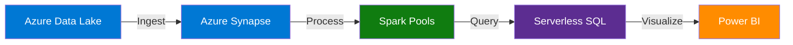

# 🎨 Brand Guidelines - CSA in-a-Box

> **🏠 [Home](../../README.md)** | **📚 Documentation** | **📖 [Guides](./README.md)** | **🎨 Brand Guidelines**


---

## 📋 Overview

This guide defines the visual identity, messaging standards, and brand usage guidelines for the Cloud Scale Analytics (CSA) in-a-Box documentation project. Follow these guidelines to maintain consistency across all documentation, presentations, and communications.

## 📑 Table of Contents

- [Brand Identity](#brand-identity)
- [Color Palette](#color-palette)
- [Typography](#typography)
- [Logo Usage](#logo-usage)
- [Visual Elements](#visual-elements)
- [Messaging Guidelines](#messaging-guidelines)
- [Azure Branding](#azure-branding)
- [Documentation Style](#documentation-style)
- [Best Practices](#best-practices)
- [Troubleshooting](#troubleshooting)
- [Related Documentation](#related-documentation)

---

## 🎯 Brand Identity

### Core Values

The CSA in-a-Box brand represents:

- **Innovation** - Modern, cloud-native analytics solutions
- **Simplicity** - Easy-to-understand, accessible documentation
- **Reliability** - Enterprise-grade, production-ready guidance
- **Azure-First** - Microsoft Azure as the primary cloud platform

### Brand Voice

| Characteristic | Description | Example |
|----------------|-------------|---------|
| **Professional** | Technical accuracy with expertise | "Configure Azure Synapse Analytics workspace" |
| **Clear** | Simple, direct language | "Deploy in 3 steps" not "Facilitate deployment processes" |
| **Helpful** | Solution-oriented guidance | "If you encounter X, try Y" |
| **Confident** | Authoritative without arrogance | "This approach ensures..." not "We think maybe..." |

### Tone Guidelines

✅ **Do:**
- Use active voice
- Be concise and direct
- Focus on user benefits
- Provide actionable guidance

❌ **Don't:**
- Use jargon without explanation
- Be condescending or dismissive
- Make assumptions about user knowledge
- Use marketing hyperbole

---

## 🎨 Color Palette

### Primary Colors

Based on Azure branding and modern data analytics aesthetics:

| Color | Hex Code | RGB | Usage |
|-------|----------|-----|-------|
| **Azure Blue** | `#0078D4` | `0, 120, 212` | Primary actions, links, highlights |
| **Data Lake Green** | `#107C10` | `16, 124, 16` | Success states, positive indicators |
| **Analytics Purple** | `#5C2D91` | `92, 45, 145` | Data visualization, advanced features |
| **Deep Blue** | `#002050` | `0, 32, 80` | Headers, emphasis text |

### Secondary Colors

| Color | Hex Code | RGB | Usage |
|-------|----------|-----|-------|
| **Warning Orange** | `#FF8C00` | `255, 140, 0` | Warnings, caution notices |
| **Error Red** | `#D13438` | `209, 52, 56` | Errors, critical alerts |
| **Info Cyan** | `#00BCF2` | `0, 188, 242` | Information callouts |
| **Neutral Gray** | `#605E5C` | `96, 94, 92` | Body text, secondary content |

### Background Colors

| Color | Hex Code | Usage |
|-------|----------|-------|
| **White** | `#FFFFFF` | Primary background |
| **Light Gray** | `#F3F2F1` | Alternate backgrounds, sections |
| **Code Background** | `#F5F5F5` | Code blocks, technical content |
| **Dark Background** | `#252526` | Dark mode (optional) |

### Usage Examples

```markdown
<!-- Success Callout -->
> **💡 Tip:** Use Azure Blue (#0078D4) for primary call-to-action buttons.

<!-- Warning Callout -->
> **⚠️ Warning:** Orange (#FF8C00) indicates caution areas.

<!-- Code Example with Proper Background -->
```python
# Code background: #F5F5F5
connection_string = "DefaultEndpointsProtocol=https;..."
```
```

---

## 📝 Typography

### Font Families

#### Primary Font: Segoe UI

```css
font-family: 'Segoe UI', Tahoma, Geneva, Verdana, sans-serif;
```

**Usage:**
- Body text
- Headings
- Navigation
- UI elements

**Why:** Native Microsoft/Azure font, excellent readability, cross-platform support

#### Code Font: Consolas / Fira Code

```css
font-family: 'Consolas', 'Fira Code', 'Courier New', monospace;
```

**Usage:**
- Code blocks
- Command-line examples
- Configuration files
- Technical identifiers

### Font Sizes

| Element | Size | Line Height | Example |
|---------|------|-------------|---------|
| **H1** | 32px | 1.25 | `# Main Title` |
| **H2** | 28px | 1.3 | `## Section Title` |
| **H3** | 24px | 1.4 | `### Subsection` |
| **H4** | 20px | 1.5 | `#### Detail Level` |
| **Body** | 16px | 1.6 | Regular paragraph text |
| **Small** | 14px | 1.5 | Captions, footnotes |
| **Code** | 14px | 1.4 | Code blocks |

### Font Weights

- **Regular (400)** - Body text
- **Semi-Bold (600)** - Emphasis, UI labels
- **Bold (700)** - Headings, important terms

---

## 🏷️ Logo Usage

### Microsoft Azure Logos

When referencing Azure services:

1. **Use official Azure service icons** from [Azure Architecture Center](https://learn.microsoft.com/en-us/azure/architecture/icons/)
2. **Maintain aspect ratio** - Never stretch or distort
3. **Provide clear space** - Minimum 20px padding around logos
4. **Use approved colors** - Don't recolor official logos

### CSA in-a-Box Project Identity

#### Text-Based Logo

```
╔═══════════════════════════════════╗
║  CLOUD SCALE ANALYTICS IN-A-BOX  ║
║     Modern Data Analytics on      ║
║          Microsoft Azure          ║
╚═══════════════════════════════════╝
```

#### Markdown Badge Style

```markdown

```

**Result:**


---

## 🎨 Visual Elements

### Icons and Emojis

Use consistent icons throughout documentation:

| Category | Icon | Usage |
|----------|------|-------|
| **Architecture** | 🏗️ | System design, patterns |
| **Code** | 💻 | Code examples, development |
| **Security** | 🔒 | Security topics, authentication |
| **Performance** | ⚡ | Optimization, speed |
| **Best Practice** | 💡 | Tips, recommendations |
| **Warning** | ⚠️ | Cautions, important notices |
| **Success** | ✅ | Completed, working |
| **Error** | ❌ | Failed, broken |
| **Documentation** | 📚 | Text content, guides |
| **Data** | 📊 | Analytics, metrics |

See [Markdown Style Guide](./MARKDOWN_STYLE_GUIDE.md#visual-elements) for complete icon reference.

### Badges

Use shields.io badges consistently:

```markdown
<!-- Status Badges -->


<!-- Version Badges -->


<!-- Complexity Badges -->


```

### Diagrams

Use consistent diagram styles:



**Diagram Guidelines:**
- Use Azure blue (#0078D4) for Azure services
- Use green (#107C10) for processing/compute
- Use purple (#5C2D91) for analytics/query
- Keep diagrams simple and focused
- Include alt text for accessibility

---

## 💬 Messaging Guidelines

### Key Messages

Core messages to emphasize:

1. **Azure-First Architecture**
   - "Built for Microsoft Azure"
   - "Leveraging Azure-native services"
   - "Enterprise-grade cloud analytics"

2. **Simplified Analytics**
   - "Analytics made accessible"
   - "Production-ready patterns"
   - "Step-by-step guidance"

3. **Best Practices**
   - "Industry-proven patterns"
   - "Security-first design"
   - "Cost-optimized solutions"

### Terminology Standards

Use consistent terminology:

| ✅ Preferred | ❌ Avoid | Reason |
|------------|---------|--------|
| **Azure Synapse Analytics** | "Synapse", "Azure Synapse" | Use full product name first mention |
| **Spark pool** | "Spark cluster" | Use Azure terminology |
| **Serverless SQL pool** | "SQL on-demand" | Use current product naming |
| **Data Lake Storage Gen2** | "ADLS Gen2", "Data Lake" | Be specific |
| **workspace** | "environment" | Use Azure product terms |

### Acronyms

Define on first use:

```markdown
<!-- First Mention -->
Azure Data Lake Storage Gen2 (ADLS Gen2)

<!-- Subsequent Use -->
ADLS Gen2
```

**Common CSA Acronyms:**
- **CSA** - Cloud Scale Analytics
- **ADLS** - Azure Data Lake Storage
- **ADF** - Azure Data Factory
- **ASA** - Azure Stream Analytics
- **ADB** - Azure Databricks

---

## ☁️ Azure Branding

### Azure Service References

When mentioning Azure services:

```markdown
<!-- Good: Full service name with icon -->
⚡ **Azure Synapse Analytics** provides unified analytics...

<!-- Good: Use Azure terminology -->
Configure the **dedicated SQL pool** for data warehousing...

<!-- Avoid: Incomplete names -->
❌ Use Synapse for analytics...

<!-- Avoid: Non-Azure terminology -->
❌ Set up the data warehouse cluster...
```

### Azure Service Icons

Include service icons in architecture diagrams:

```markdown

```

### Azure Product Links

Link to official Azure documentation:

```markdown
Learn more about [Azure Synapse Analytics](https://learn.microsoft.com/azure/synapse-analytics/)
```

---

## 📚 Documentation Style

### Document Headers

All documentation should follow this header format:

```markdown
# 🎯 Document Title - CSA in-a-Box

> **🏠 [Home](../../README.md)** | **📚 Documentation** | **📖 [Section](./README.md)** | **👤 Current Page**


---

## 📋 Overview

Brief description of the document purpose (1-2 sentences).
```

### Section Formatting

```markdown
## 🔧 Section Title

Content introduction paragraph.

### Subsection Title

Detailed content...

#### Detail Level

Specific details...
```

### Code Examples

Format code examples consistently:

````markdown
```python
# Azure OpenAI Example
from azure.ai.openai import AzureOpenAI

client = AzureOpenAI(
    endpoint="https://your-resource.openai.azure.com/",
    api_key="your-api-key"
)

response = client.chat.completions.create(
    model="gpt-4",
    messages=[{"role": "user", "content": "Hello!"}]
)
```
````

### Callouts

Use consistent callout formatting:

```markdown
> **💡 Tip:** This is helpful information for users.

> **⚠️ Warning:** This requires caution and attention.

> **📝 Note:** Additional context or clarification.

> **🚨 Important:** Critical information that must not be missed.
```

---

## ✅ Best Practices

### Visual Consistency

1. **Use standard icon set** - Follow the icon mappings in Markdown Style Guide
2. **Consistent badge colors** - Green for success, yellow for warning, red for error
3. **Uniform spacing** - Blank lines before/after sections
4. **Table alignment** - Left-align text, center numbers

### Content Guidelines

```markdown
<!-- Good: Clear, action-oriented -->
✅ Deploy Azure Synapse workspace using Azure CLI

<!-- Avoid: Passive, unclear -->
❌ The Azure Synapse workspace can be deployed

<!-- Good: Specific steps -->
✅ 1. Open Azure Portal
   2. Navigate to Azure Synapse Analytics
   3. Click "Create workspace"

<!-- Avoid: Vague instructions -->
❌ Set up the workspace in Azure
```

### Accessibility

1. **Alt text for images** - Always include descriptive alt text
2. **Color contrast** - Ensure WCAG AA compliance (4.5:1 ratio)
3. **Semantic markup** - Use proper heading hierarchy
4. **Link text** - Descriptive, not "click here"

```markdown
<!-- Good: Descriptive alt text -->


<!-- Good: Descriptive link text -->
Learn about [Azure Synapse security best practices](./security.md)

<!-- Avoid: Generic text -->
❌ 
❌ Click [here](./security.md) for security
```

---

## 🔧 Troubleshooting

### Common Branding Issues

#### Problem: Inconsistent Color Usage

**Symptoms:**
- Mixed color schemes across documents
- Non-Azure colors in service references

**Solution:**
```markdown
<!-- Use standardized color palette -->
Primary: #0078D4 (Azure Blue)
Success: #107C10 (Green)
Warning: #FF8C00 (Orange)
Error: #D13438 (Red)
```

**Prevention:**
- Reference this brand guide
- Use predefined badge templates
- Validate with color picker tools

#### Problem: Incorrect Logo Usage

**Symptoms:**
- Distorted Azure logos
- Unauthorized logo modifications
- Missing attribution

**Solution:**
1. Download official logos from [Azure Architecture Center](https://learn.microsoft.com/azure/architecture/icons/)
2. Maintain original aspect ratios
3. Use approved color variations only
4. Include proper attribution

**Prevention:**
- Bookmark official Azure icon library
- Create reusable logo components
- Review logo guidelines annually

#### Problem: Inconsistent Terminology

**Symptoms:**
- Mixed product names (e.g., "Synapse" vs "Azure Synapse Analytics")
- Outdated service names
- Non-standard abbreviations

**Solution:**
1. Reference the [Terminology Standards](#terminology-standards) section
2. Define acronyms on first use
3. Use official Azure product names

**Prevention:**
- Maintain terminology glossary
- Regular documentation reviews
- Automated terminology checking

---

## 📚 Related Documentation

### Internal Guides

- [Markdown Style Guide](./MARKDOWN_STYLE_GUIDE.md) - Complete formatting standards
- [Contributing Guide](./CONTRIBUTING_GUIDE.md) - How to contribute
- [Development Guide](./DEVELOPMENT_GUIDE.md) - Setup and development
- [Documentation Review Process](./documentation-review-process.md) - Review procedures

### External Resources

- [Azure Architecture Center](https://learn.microsoft.com/azure/architecture/) - Architecture patterns
- [Azure Icons](https://learn.microsoft.com/azure/architecture/icons/) - Official Azure icons
- [Microsoft Design System](https://www.microsoft.com/design/fluent/) - Fluent Design principles
- [Azure Branding Guidelines](https://azure.microsoft.com/en-us/blog/azure-brand-guidelines/) - Official Azure branding
- [WCAG 2.1 Guidelines](https://www.w3.org/WAI/WCAG21/quickref/) - Accessibility standards

### Tools

- [Shields.io](https://shields.io/) - Badge generator
- [Mermaid Live Editor](https://mermaid.live/) - Diagram creation
- [Color Contrast Checker](https://webaim.org/resources/contrastchecker/) - Accessibility validation
- [markdownlint](https://github.com/DavidAnson/markdownlint) - Markdown linting

---

## 💬 Feedback

Was this brand guide helpful? Let us know:

- ✅ **Found it useful** - [Give us feedback](https://github.com/fgarofalo56/csa-inabox-docs/discussions)
- ⚠️ **Need clarification** - [Request clarification](https://github.com/fgarofalo56/csa-inabox-docs/issues/new?title=[Brand]+Clarification)
- 💡 **Have suggestions** - [Share your ideas](https://github.com/fgarofalo56/csa-inabox-docs/issues/new?title=[Brand]+Suggestion)

---

*Last Updated: December 2025*
*Version: 1.0.0*
*Maintainer: CSA in-a-Box Documentation Team*
