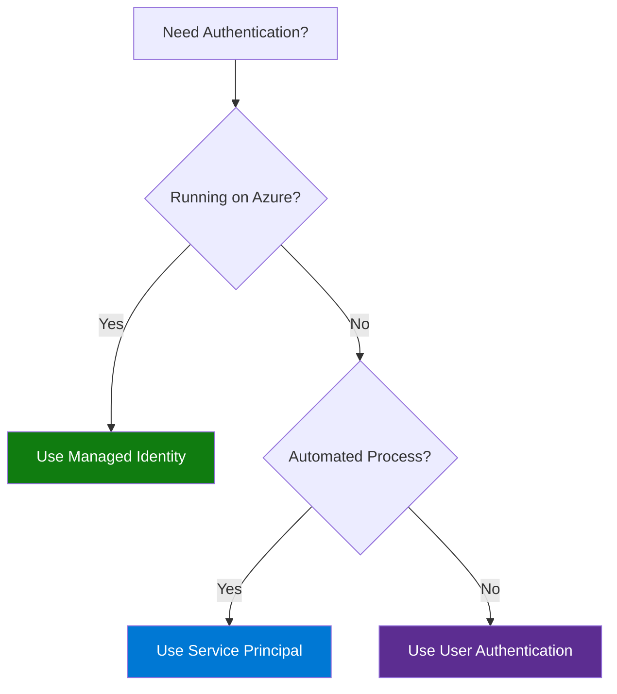

# 🔐 Authentication Guide

> **🏠 [Home](../../../README.md)** | **📚 Documentation** | **📖 [Guides](../README.md)** | **📋 [Docs](./README.md)** | **🔐 Authentication**


---

## 📋 Overview

This guide covers authentication methods for Azure services in the CSA in-a-Box solution. Learn how to securely authenticate applications, manage credentials, and implement best practices for Azure identity and access management.

## 📑 Table of Contents

- [Authentication Methods](#authentication-methods)
- [Managed Identity (Recommended)](#managed-identity-recommended)
- [Service Principal Authentication](#service-principal-authentication)
- [User Authentication](#user-authentication)
- [Azure Key Vault Integration](#azure-key-vault-integration)
- [Code Examples](#code-examples)
- [Best Practices](#best-practices)
- [Troubleshooting](#troubleshooting)
- [Related Documentation](#related-documentation)

---

## 🎯 Authentication Methods

### Overview

| Method | Use Case | Security Level | Complexity |
|--------|----------|----------------|------------|
| **Managed Identity** | Production apps on Azure | ⭐⭐⭐⭐⭐ | Low |
| **Service Principal** | CI/CD, automation | ⭐⭐⭐⭐ | Medium |
| **User Authentication** | Interactive tools, dev | ⭐⭐⭐ | Low |
| **Shared Access Signature** | Limited resource access | ⭐⭐ | Medium |

### Decision Tree



---

## 🌟 Managed Identity (Recommended)

### What is Managed Identity?

Managed Identity eliminates the need for credentials in your code by providing Azure resources with an automatically managed identity in Azure AD.

### Types

**System-Assigned:**
- Created with Azure resource
- Deleted when resource is deleted
- 1:1 relationship with resource

**User-Assigned:**
- Standalone Azure resource
- Can be shared across resources
- Independent lifecycle

### Step 1: Enable Managed Identity

**Azure CLI:**
```bash
# Enable system-assigned managed identity
az synapse workspace update \
  --name <workspace-name> \
  --resource-group <resource-group> \
  --assign-identity

# Create user-assigned managed identity
az identity create \
  --name mi-csa-inabox \
  --resource-group <resource-group>

# Assign user-assigned identity to resource
az synapse workspace update \
  --name <workspace-name> \
  --resource-group <resource-group> \
  --user-assigned-identity <identity-id>
```

**Azure Portal:**
1. Navigate to your resource (e.g., Synapse workspace)
2. Select **Identity** under Settings
3. Toggle **System assigned** to **On**
4. Click **Save**

### Step 2: Grant Permissions

```bash
# Get managed identity object ID
IDENTITY_ID=$(az synapse workspace show \
  --name <workspace-name> \
  --resource-group <resource-group> \
  --query "identity.principalId" -o tsv)

# Grant Storage Blob Data Contributor
az role assignment create \
  --role "Storage Blob Data Contributor" \
  --assignee $IDENTITY_ID \
  --scope /subscriptions/<sub-id>/resourceGroups/<rg>/providers/Microsoft.Storage/storageAccounts/<storage-account>

# Grant Key Vault Secrets User
az role assignment create \
  --role "Key Vault Secrets User" \
  --assignee $IDENTITY_ID \
  --scope /subscriptions/<sub-id>/resourceGroups/<rg>/providers/Microsoft.KeyVault/vaults/<keyvault>
```

### Step 3: Use in Code

**Python:**
```python
from azure.identity import DefaultAzureCredential
from azure.storage.blob import BlobServiceClient
from azure.keyvault.secrets import SecretClient

# DefaultAzureCredential automatically uses Managed Identity
credential = DefaultAzureCredential()

# Access Storage Account
storage_client = BlobServiceClient(
    account_url="https://mystorageaccount.blob.core.windows.net",
    credential=credential
)

# Access Key Vault
kv_client = SecretClient(
    vault_url="https://mykeyvault.vault.azure.net",
    credential=credential
)

# Get secret
secret = kv_client.get_secret("my-secret-name")
print(f"Secret value: {secret.value}")
```

**PySpark:**
```python
# Configure Spark to use Managed Identity
spark.conf.set(
    "fs.azure.account.auth.type.mystorageaccount.dfs.core.windows.net",
    "OAuth"
)
spark.conf.set(
    "fs.azure.account.oauth.provider.type.mystorageaccount.dfs.core.windows.net",
    "org.apache.hadoop.fs.azurebfs.oauth2.MsiTokenProvider"
)

# Read from Data Lake
df = spark.read.format("delta").load(
    "abfss://container@mystorageaccount.dfs.core.windows.net/path/to/data"
)
```

---

## 🔑 Service Principal Authentication

### When to Use

- CI/CD pipelines
- Automated deployments
- Off-Azure applications
- Cross-tenant scenarios

### Step 1: Create Service Principal

```bash
# Create service principal
az ad sp create-for-rbac \
  --name "sp-csa-inabox-prod" \
  --role Contributor \
  --scopes /subscriptions/<subscription-id>/resourceGroups/<resource-group>

# Output (SAVE SECURELY):
# {
#   "appId": "xxxx-xxxx-xxxx-xxxx",
#   "displayName": "sp-csa-inabox-prod",
#   "password": "xxxx-xxxx-xxxx-xxxx",
#   "tenant": "xxxx-xxxx-xxxx-xxxx"
# }
```

### Step 2: Grant Permissions

```bash
# Get service principal object ID
SP_OBJECT_ID=$(az ad sp show --id <app-id> --query id -o tsv)

# Grant specific roles
az role assignment create \
  --role "Storage Blob Data Contributor" \
  --assignee $SP_OBJECT_ID \
  --scope <storage-account-scope>
```

### Step 3: Store Credentials Securely

```bash
# Store in Key Vault
az keyvault secret set \
  --vault-name <keyvault-name> \
  --name "ServicePrincipalAppId" \
  --value "<app-id>"

az keyvault secret set \
  --vault-name <keyvault-name> \
  --name "ServicePrincipalSecret" \
  --value "<password>"

az keyvault secret set \
  --vault-name <keyvault-name> \
  --name "ServicePrincipalTenantId" \
  --value "<tenant-id>"
```

### Step 4: Use in Code

**Python:**
```python
from azure.identity import ClientSecretCredential
from azure.storage.blob import BlobServiceClient
import os

# Load from environment variables (sourced from Key Vault)
credential = ClientSecretCredential(
    tenant_id=os.getenv("AZURE_TENANT_ID"),
    client_id=os.getenv("AZURE_CLIENT_ID"),
    client_secret=os.getenv("AZURE_CLIENT_SECRET")
)

# Use credential
storage_client = BlobServiceClient(
    account_url="https://mystorageaccount.blob.core.windows.net",
    credential=credential
)
```

**Environment Variables (.env):**
```bash
# NEVER commit this file to source control
AZURE_TENANT_ID=xxxx-xxxx-xxxx-xxxx
AZURE_CLIENT_ID=xxxx-xxxx-xxxx-xxxx
AZURE_CLIENT_SECRET=xxxx-xxxx-xxxx-xxxx
```

---

## 👤 User Authentication

### Interactive Authentication

**Azure CLI:**
```bash
# Login interactively
az login

# Login with specific tenant
az login --tenant <tenant-id>

# Use device code flow (for remote/SSH)
az login --use-device-code
```

**Python:**
```python
from azure.identity import InteractiveBrowserCredential, DeviceCodeCredential

# Browser-based login
credential = InteractiveBrowserCredential(
    tenant_id="<tenant-id>"
)

# Device code flow (no browser)
credential = DeviceCodeCredential(
    tenant_id="<tenant-id>"
)

# Use credential
from azure.storage.blob import BlobServiceClient
storage_client = BlobServiceClient(
    account_url="https://mystorageaccount.blob.core.windows.net",
    credential=credential
)
```

### Azure AD User with MFA

```python
from azure.identity import UsernamePasswordCredential

# Note: MFA must be disabled for this account
credential = UsernamePasswordCredential(
    client_id="<app-id>",  # Public client application ID
    username="user@domain.com",
    password="password"  # Not recommended
)
```

> **⚠️ Warning:** Username/password authentication is not recommended for production. Use Managed Identity or Service Principal instead.

---

## 🔐 Azure Key Vault Integration

### Why Use Key Vault?

- **Centralized secret management**
- **Access auditing**
- **Automatic rotation**
- **RBAC-based access**
- **Soft delete protection**

### Storing Secrets

```python
from azure.identity import DefaultAzureCredential
from azure.keyvault.secrets import SecretClient

credential = DefaultAzureCredential()
kv_client = SecretClient(
    vault_url="https://mykeyvault.vault.azure.net",
    credential=credential
)

# Store secret
kv_client.set_secret(
    name="DatabaseConnectionString",
    value="Server=tcp:myserver.database.windows.net,1433;..."
)

# Set expiration
from datetime import datetime, timedelta
expires_on = datetime.utcnow() + timedelta(days=90)
kv_client.set_secret(
    name="TemporaryApiKey",
    value="temp-key-value",
    expires_on=expires_on
)
```

### Retrieving Secrets

```python
# Get secret
secret = kv_client.get_secret("DatabaseConnectionString")
connection_string = secret.value

# List all secrets
for secret_properties in kv_client.list_properties_of_secrets():
    print(f"Secret: {secret_properties.name}")
```

### Using Secrets in Applications

```python
import os
from azure.identity import DefaultAzureCredential
from azure.keyvault.secrets import SecretClient

class ConfigManager:
    """Centralized configuration management."""

    def __init__(self):
        self.credential = DefaultAzureCredential()
        self.kv_client = SecretClient(
            vault_url=os.getenv("KEY_VAULT_URL"),
            credential=self.credential
        )

    def get_storage_connection_string(self) -> str:
        """Get storage account connection string."""
        secret = self.kv_client.get_secret("StorageAccountConnectionString")
        return secret.value

    def get_database_password(self) -> str:
        """Get database password."""
        secret = self.kv_client.get_secret("DatabasePassword")
        return secret.value

# Usage
config = ConfigManager()
connection_string = config.get_storage_connection_string()
```

---

## 💻 Code Examples

### Complete Authentication Example

```python
# auth_manager.py
from azure.identity import (
    DefaultAzureCredential,
    ClientSecretCredential,
    InteractiveBrowserCredential
)
from azure.storage.blob import BlobServiceClient
from azure.keyvault.secrets import SecretClient
from azure.synapse.spark import SparkClient
import os
from typing import Optional

class AzureAuthManager:
    """Manage Azure authentication across different services."""

    def __init__(self, auth_method: str = "managed_identity"):
        """
        Initialize authentication manager.

        Args:
            auth_method: 'managed_identity', 'service_principal', or 'interactive'
        """
        self.auth_method = auth_method
        self.credential = self._get_credential()

    def _get_credential(self):
        """Get appropriate credential based on auth method."""

        if self.auth_method == "managed_identity":
            return DefaultAzureCredential()

        elif self.auth_method == "service_principal":
            return ClientSecretCredential(
                tenant_id=os.getenv("AZURE_TENANT_ID"),
                client_id=os.getenv("AZURE_CLIENT_ID"),
                client_secret=os.getenv("AZURE_CLIENT_SECRET")
            )

        elif self.auth_method == "interactive":
            return InteractiveBrowserCredential()

        else:
            raise ValueError(f"Unknown auth method: {self.auth_method}")

    def get_storage_client(self, storage_account: str) -> BlobServiceClient:
        """Get authenticated storage client."""
        account_url = f"https://{storage_account}.blob.core.windows.net"
        return BlobServiceClient(account_url, credential=self.credential)

    def get_keyvault_client(self, keyvault_name: str) -> SecretClient:
        """Get authenticated Key Vault client."""
        vault_url = f"https://{keyvault_name}.vault.azure.net"
        return SecretClient(vault_url, credential=self.credential)

    def get_synapse_client(self, workspace_name: str) -> SparkClient:
        """Get authenticated Synapse Spark client."""
        endpoint = f"https://{workspace_name}.dev.azuresynapse.net"
        return SparkClient(endpoint, credential=self.credential)

# Usage example
if __name__ == "__main__":
    # In production (on Azure)
    auth = AzureAuthManager(auth_method="managed_identity")

    # Get storage client
    storage = auth.get_storage_client("mystorageaccount")

    # List containers
    for container in storage.list_containers():
        print(f"Container: {container.name}")

    # Get Key Vault client
    kv = auth.get_keyvault_client("mykeyvault")

    # Get secret
    secret = kv.get_secret("MySecret")
    print(f"Secret value: {secret.value}")
```

---

## ✅ Best Practices

### Security Best Practices

```markdown
## Do's and Don'ts

✅ **Do:**
- Use Managed Identity whenever possible
- Store credentials in Azure Key Vault
- Use principle of least privilege
- Rotate secrets regularly
- Enable MFA for user accounts
- Audit access with Azure Monitor
- Use separate identities per environment

❌ **Don't:**
- Hardcode credentials in source code
- Commit secrets to version control
- Use shared service principals across teams
- Grant broad permissions (Owner, Contributor)
- Disable MFA for automation accounts
- Share service principal credentials via email/chat
- Use long-lived access tokens
```

### Credential Hierarchy

```python
# DefaultAzureCredential tries credentials in this order:
# 1. Environment variables (for service principal)
# 2. Managed Identity
# 3. Visual Studio Code
# 4. Azure CLI
# 5. Azure PowerShell
# 6. Interactive browser

from azure.identity import DefaultAzureCredential

# Recommended: Let DefaultAzureCredential handle it
credential = DefaultAzureCredential()

# Works in:
# - Local development (uses Azure CLI)
# - CI/CD (uses service principal from env vars)
# - Azure (uses Managed Identity)
```

### Credential Caching

```python
from azure.identity import DefaultAzureCredential
from azure.identity import TokenCachePersistenceOptions

# Enable persistent token caching
cache_options = TokenCachePersistenceOptions()
credential = DefaultAzureCredential(cache_persistence_options=cache_options)

# Reduces authentication calls
# Improves performance
# Tokens cached securely on disk
```

---

## 🔧 Troubleshooting

### Common Issues

#### Issue: DefaultAzureCredential Fails

**Error:**
```
DefaultAzureCredential failed to retrieve a token from the included credentials.
```

**Solution:**
```bash
# Check which credential is being tried
import logging
logging.basicConfig(level=logging.DEBUG)

from azure.identity import DefaultAzureCredential
credential = DefaultAzureCredential()

# Or specify explicit credential
from azure.identity import ManagedIdentityCredential
credential = ManagedIdentityCredential()
```

#### Issue: Managed Identity Not Enabled

**Error:**
```
ManagedIdentityCredential authentication unavailable. No Managed Identity endpoint found.
```

**Solution:**
```bash
# Enable managed identity
az synapse workspace update \
  --name <workspace-name> \
  --resource-group <resource-group> \
  --assign-identity

# Verify
az synapse workspace show \
  --name <workspace-name> \
  --resource-group <resource-group> \
  --query "identity"
```

#### Issue: Insufficient Permissions

**Error:**
```
AuthorizationPermissionMismatch: This request is not authorized to perform this operation.
```

**Solution:**
```bash
# Check current role assignments
az role assignment list \
  --assignee <identity-object-id> \
  --all

# Grant required role
az role assignment create \
  --role "Storage Blob Data Contributor" \
  --assignee <identity-object-id> \
  --scope <resource-scope>

# Wait 5-10 minutes for propagation
```

#### Issue: Service Principal Secret Expired

**Error:**
```
AADSTS7000222: The provided client secret keys are expired.
```

**Solution:**
```bash
# Create new credential
az ad sp credential reset \
  --id <app-id>

# Update Key Vault secret
az keyvault secret set \
  --vault-name <keyvault-name> \
  --name "ServicePrincipalSecret" \
  --value "<new-password>"
```

---

## 📚 Related Documentation

### Internal Guides

- [Technical Setup Guide](../technical-setup.md) - Azure resource setup
- [Security Best Practices](../../devops/security-best-practices.md) - Security guidelines
- [Best Practices Guide](./best-practices.md) - General best practices

### Azure Documentation

- [Azure Identity SDK](https://learn.microsoft.com/python/api/overview/azure/identity-readme)
- [Managed Identities](https://learn.microsoft.com/azure/active-directory/managed-identities-azure-resources/)
- [Service Principals](https://learn.microsoft.com/azure/active-directory/develop/app-objects-and-service-principals)
- [Azure Key Vault](https://learn.microsoft.com/azure/key-vault/)

---

*Last Updated: December 2025*
*Version: 1.0.0*
*Maintainer: CSA in-a-Box Team*
