# 💡 Best Practices Guide

> **🏠 [Home](../../../README.md)** | **📚 Documentation** | **📖 [Guides](../README.md)** | **📋 [Docs](./README.md)** | **💡 Best Practices**


---

## 📋 Overview

This guide consolidates best practices for building, deploying, and maintaining Cloud Scale Analytics solutions on Azure. Follow these recommendations to ensure your analytics platform is secure, performant, cost-effective, and maintainable.

## 📑 Table of Contents

- [Architecture Best Practices](#architecture-best-practices)
- [Security Best Practices](#security-best-practices)
- [Performance Optimization](#performance-optimization)
- [Cost Management](#cost-management)
- [Data Management](#data-management)
- [Development Workflow](#development-workflow)
- [Monitoring and Operations](#monitoring-and-operations)
- [Disaster Recovery](#disaster-recovery)
- [Related Documentation](#related-documentation)

---

## 🏗️ Architecture Best Practices

### Medallion Architecture

Implement a structured three-tier data lakehouse pattern:

```mermaid
graph LR
    A[Data Sources] --> B[🥉 Bronze<br/>Raw Data]
    B --> C[🥈 Silver<br/>Cleansed Data]
    C --> D[🥇 Gold<br/>Curated Data]
    D --> E[Consumption]

    style B fill:#CD7F32,color:#fff
    style C fill:#C0C0C0,color:#000
    style D fill:#FFD700,color:#000
```



**Bronze Layer:**
```python
# Raw data ingestion - keep original format
df.write.format("delta") \
    .mode("append") \
    .option("mergeSchema", "true") \
    .save("/mnt/delta/bronze/raw_events")
```

**Silver Layer:**
```python
# Cleansed and conformed data
from pyspark.sql.functions import col, to_timestamp

clean_df = bronze_df \
    .dropDuplicates(["id"]) \
    .filter(col("timestamp").isNotNull()) \
    .withColumn("timestamp", to_timestamp("timestamp"))

clean_df.write.format("delta") \
    .mode("overwrite") \
    .save("/mnt/delta/silver/events")
```

**Gold Layer:**
```python
# Business-ready aggregated data
aggregated_df = silver_df.groupBy("date", "category") \
    .agg(
        count("*").alias("event_count"),
        sum("amount").alias("total_amount")
    )

aggregated_df.write.format("delta") \
    .mode("overwrite") \
    .partitionBy("date") \
    .save("/mnt/delta/gold/daily_summary")
```

### Separation of Concerns

```markdown
## Layered Architecture

### Ingestion Layer
- Azure Data Factory for orchestration
- Event Hubs for streaming
- Dedicated pipelines per source

### Processing Layer
- Spark pools for transformations
- Delta Lake for ACID transactions
- Separate pools for batch vs streaming

### Serving Layer
- Serverless SQL for ad-hoc queries
- Dedicated SQL pools for enterprise DW
- Power BI for visualization

### Storage Layer
- ADLS Gen2 with hierarchical namespace
- Separate containers per layer
- Lifecycle management policies
```

---

## 🔒 Security Best Practices

### Identity and Access Management

✅ **Do:**
```python
# Use Managed Identity
from azure.identity import DefaultAzureCredential

credential = DefaultAzureCredential()
```

❌ **Don't:**
```python
# Never hardcode credentials
connection_string = "DefaultEndpointsProtocol=https;AccountName=..."
api_key = "a1b2c3d4..."
```

### Network Security

```bash
# Enable Private Link
az synapse workspace update \
  --name <workspace-name> \
  --resource-group <resource-group> \
  --public-network-access Disabled

# Create private endpoint
az network private-endpoint create \
  --name synapse-pe \
  --resource-group <resource-group> \
  --vnet-name <vnet-name> \
  --subnet <subnet-name> \
  --private-connection-resource-id <synapse-id> \
  --group-id Sql \
  --connection-name synapse-connection
```

### Data Encryption

```markdown
## Encryption at Rest and in Transit

✅ **Encryption at Rest:**
- Azure Storage encryption (default)
- Customer-managed keys in Key Vault
- Transparent Data Encryption (TDE) for SQL

✅ **Encryption in Transit:**
- HTTPS/TLS 1.2 minimum
- Private endpoints
- VNet integration
```

### Key Vault Integration

```python
from azure.identity import DefaultAzureCredential
from azure.keyvault.secrets import SecretClient

# Centralized secret management
credential = DefaultAzureCredential()
kv_client = SecretClient(
    vault_url="https://mykeyvault.vault.azure.net",
    credential=credential
)

# Retrieve secrets
db_password = kv_client.get_secret("DatabasePassword").value
api_key = kv_client.get_secret("ApiKey").value
```

---

## ⚡ Performance Optimization

### Delta Lake Optimization

```python
from delta.tables import DeltaTable

table = DeltaTable.forPath(spark, "/mnt/delta/gold/events")

# Z-Order indexing
table.optimize().executeZOrderBy("date", "user_id")

# Vacuum old files (after retention period)
table.vacuum(retentionHours=168)  # 7 days

# Compact small files
table.optimize().executeCompaction()
```

### Partitioning Strategy

```python
# Good: Partition by date for time-series data
df.write.format("delta") \
    .partitionBy("year", "month", "day") \
    .save("/mnt/delta/events")

# Avoid: Too many partitions
# DON'T partition by high-cardinality columns like user_id
```

### Spark Configuration

```python
# Optimize Spark configuration
spark.conf.set("spark.sql.adaptive.enabled", "true")
spark.conf.set("spark.sql.adaptive.coalescePartitions.enabled", "true")
spark.conf.set("spark.databricks.delta.optimizeWrite.enabled", "true")
spark.conf.set("spark.databricks.delta.autoCompact.enabled", "true")

# Configure parallelism based on cluster size
spark.conf.set("spark.sql.shuffle.partitions", "200")
```

### Query Optimization

```sql
-- Use partition pruning
SELECT *
FROM delta.`/mnt/delta/events`
WHERE date >= '2024-01-01'  -- Partition column
  AND category = 'sales';

-- Create statistics for better query plans
ANALYZE TABLE events COMPUTE STATISTICS FOR COLUMNS category, date;

-- Use Delta caching
CACHE SELECT * FROM events WHERE date = current_date();
```

---

## 💰 Cost Management

### Serverless SQL Optimization

```sql
-- Minimize data scanned
-- Good: Select specific columns
SELECT date, amount, category
FROM OPENROWSET(...)
WHERE date >= '2024-01-01';

-- Bad: SELECT * scans all columns
```

### Spark Pool Management

```bash
# Enable auto-pause
az synapse spark pool update \
  --name <pool-name> \
  --workspace-name <workspace-name> \
  --resource-group <resource-group> \
  --enable-auto-pause true \
  --delay 15

# Enable auto-scale
az synapse spark pool update \
  --name <pool-name> \
  --workspace-name <workspace-name> \
  --resource-group <resource-group> \
  --enable-auto-scale true \
  --min-node-count 3 \
  --max-node-count 10
```

### Storage Lifecycle Management

```json
{
  "rules": [
    {
      "name": "ArchiveOldBronzeData",
      "enabled": true,
      "type": "Lifecycle",
      "definition": {
        "filters": {
          "blobTypes": ["blockBlob"],
          "prefixMatch": ["bronze/"]
        },
        "actions": {
          "baseBlob": {
            "tierToCool": {
              "daysAfterModificationGreaterThan": 30
            },
            "tierToArchive": {
              "daysAfterModificationGreaterThan": 90
            }
          }
        }
      }
    }
  ]
}
```

### Cost Monitoring

```python
# Track query costs
from azure.monitor.query import LogsQueryClient
from azure.identity import DefaultAzureCredential

credential = DefaultAzureCredential()
client = LogsQueryClient(credential)

query = """
SynapseRbacOperations
| where TimeGenerated > ago(7d)
| summarize TotalCost = sum(Cost) by bin(TimeGenerated, 1d)
| order by TimeGenerated desc
"""

response = client.query_workspace(
    workspace_id="<workspace-id>",
    query=query,
    timespan=None
)
```

---

## 📊 Data Management

### Data Quality Checks

```python
# Implement data quality framework
from pyspark.sql.functions import col, count, when

def check_data_quality(df, checks):
    """Run data quality checks."""
    results = []

    for check in checks:
        if check["type"] == "null_check":
            null_count = df.filter(col(check["column"]).isNull()).count()
            results.append({
                "check": f"Null check on {check['column']}",
                "passed": null_count == 0,
                "null_count": null_count
            })

        elif check["type"] == "range_check":
            out_of_range = df.filter(
                (col(check["column"]) < check["min"]) |
                (col(check["column"]) > check["max"])
            ).count()
            results.append({
                "check": f"Range check on {check['column']}",
                "passed": out_of_range == 0,
                "violations": out_of_range
            })

    return results

# Define checks
checks = [
    {"type": "null_check", "column": "customer_id"},
    {"type": "range_check", "column": "amount", "min": 0, "max": 1000000}
]

# Run checks
quality_results = check_data_quality(df, checks)
```

### Schema Management

```python
# Enforce schema on write
from pyspark.sql.types import StructType, StructField, StringType, IntegerType

schema = StructType([
    StructField("id", IntegerType(), False),
    StructField("name", StringType(), False),
    StructField("email", StringType(), True)
])

# Write with schema enforcement
df.write.format("delta") \
    .option("mergeSchema", "false") \
    .option("overwriteSchema", "false") \
    .save("/mnt/delta/customers")
```

### Data Lineage

```python
# Document data lineage
metadata = {
    "source": "erp_system",
    "ingestion_timestamp": "2024-12-10T10:00:00Z",
    "transformation": "cleanse_and_standardize",
    "target_layer": "silver",
    "data_owner": "analytics_team"
}

# Add as Delta table property
spark.sql(f"""
    ALTER TABLE delta.`/mnt/delta/silver/customers`
    SET TBLPROPERTIES ('metadata' = '{json.dumps(metadata)}')
""")
```

---

## 🔄 Development Workflow

### Version Control

```bash
# Branch strategy
main          # Production-ready code
├── dev       # Development integration
├── feature/* # Feature branches
└── hotfix/*  # Production fixes

# Naming conventions
feature/add-streaming-pipeline
hotfix/fix-authentication-issue
```

### Code Review Checklist

```markdown
## Pull Request Checklist

- [ ] Code follows style guide
- [ ] Unit tests added/updated
- [ ] Integration tests pass
- [ ] Documentation updated
- [ ] No hardcoded credentials
- [ ] Error handling implemented
- [ ] Logging added
- [ ] Performance tested
- [ ] Security reviewed
```

### CI/CD Pipeline

```yaml
# azure-pipelines.yml
trigger:
  branches:
    include:
      - main
      - dev

pool:
  vmImage: 'ubuntu-latest'

stages:
  - stage: Test
    jobs:
      - job: UnitTests
        steps:
          - task: UsePythonVersion@0
            inputs:
              versionSpec: '3.9'
          - script: |
              pip install -r requirements.txt
              pytest tests/unit
            displayName: 'Run Unit Tests'

  - stage: Deploy
    dependsOn: Test
    jobs:
      - deployment: DeployToAzure
        environment: 'production'
        strategy:
          runOnce:
            deploy:
              steps:
                - task: AzureCLI@2
                  inputs:
                    azureSubscription: 'Azure Connection'
                    scriptType: 'bash'
                    scriptLocation: 'inlineScript'
                    inlineScript: |
                      az synapse spark job submit ...
```

---

## 📡 Monitoring and Operations

### Application Insights Integration

```python
from applicationinsights import TelemetryClient

# Initialize telemetry
tc = TelemetryClient('<instrumentation-key>')

# Track custom events
tc.track_event('PipelineStarted', {'pipeline': 'daily_etl'})

# Track metrics
tc.track_metric('RecordsProcessed', 1000000)

# Track exceptions
try:
    process_data()
except Exception as e:
    tc.track_exception()

tc.flush()
```

### Alerting Rules

```bash
# Create metric alert
az monitor metrics alert create \
  --name "High Query Cost Alert" \
  --resource-group <resource-group> \
  --scopes <synapse-workspace-id> \
  --condition "avg DataProcessedGB > 100" \
  --window-size 1h \
  --evaluation-frequency 5m \
  --action <action-group-id>
```

### Logging Best Practices

```python
import logging
from azure.monitor.opentelemetry import configure_azure_monitor

# Configure Azure Monitor
configure_azure_monitor()

# Use structured logging
logger = logging.getLogger(__name__)

logger.info(
    "Pipeline execution started",
    extra={
        "pipeline_name": "daily_etl",
        "environment": "production",
        "start_time": datetime.utcnow().isoformat()
    }
)
```

---

## 🔄 Disaster Recovery

### Backup Strategy

```bash
# Enable soft delete
az storage account blob-service-properties update \
  --account-name <storage-account> \
  --enable-delete-retention true \
  --delete-retention-days 7

# Enable versioning
az storage account blob-service-properties update \
  --account-name <storage-account> \
  --enable-versioning true
```

### Geo-Replication

```bash
# Configure GRS
az storage account update \
  --name <storage-account> \
  --resource-group <resource-group> \
  --sku Standard_GRS
```

### Recovery Testing

```markdown
## DR Testing Checklist

- [ ] Document recovery procedures
- [ ] Test backup restoration quarterly
- [ ] Verify RPO/RTO requirements
- [ ] Test failover procedures
- [ ] Document lessons learned
- [ ] Update runbooks
```

---

## 📚 Related Documentation

### Internal Guides

- [Authentication Guide](./authentication.md) - Authentication best practices
- [Technical Setup](../technical-setup.md) - Setup procedures
- [SDK Guide](./sdks.md) - SDK usage

### Azure Documentation

- [Azure Architecture Center](https://learn.microsoft.com/azure/architecture/)
- [Well-Architected Framework](https://learn.microsoft.com/azure/architecture/framework/)
- [Synapse Best Practices](https://learn.microsoft.com/azure/synapse-analytics/sql-data-warehouse/sql-data-warehouse-best-practices)

---

*Last Updated: December 2025*
*Version: 1.0.0*
*Maintainer: CSA in-a-Box Team*
