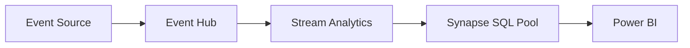

# Documentation Examples

> **Home [Home](../../../README.md)** | **Documentation** | **Guides [Guides](../README.md)** | **Templates**

---

## Overview

This guide provides practical examples and templates for creating high-quality documentation in the CSA-in-a-Box project. Use these examples as a starting point for your own documentation.

## Table of Contents

- [Quick Start Guide Example](#quick-start-guide-example)
- [Tutorial Example](#tutorial-example)
- [How-To Guide Example](#how-to-guide-example)
- [Conceptual Documentation Example](#conceptual-documentation-example)
- [Reference Documentation Example](#reference-documentation-example)
- [Troubleshooting Guide Example](#troubleshooting-guide-example)

---

## Quick Start Guide Example

### Title: Getting Started with Azure Synapse Analytics

> **Home [Home](../../../README.md)** | **Documentation** | **Getting Started**

#### Overview

Get up and running with Azure Synapse Analytics in under 30 minutes. This guide walks you through creating your first workspace and running your first query.

#### Prerequisites

- Azure subscription
- Contributor access to a resource group
- Basic SQL knowledge

#### Steps

**1. Create a Synapse Workspace**

```bash
# Set variables
RESOURCE_GROUP="rg-synapse-demo"
LOCATION="eastus2"
WORKSPACE_NAME="synapse-workspace-demo"

# Create resource group
az group create --name $RESOURCE_GROUP --location $LOCATION

# Create Synapse workspace
az synapse workspace create \
  --name $WORKSPACE_NAME \
  --resource-group $RESOURCE_GROUP \
  --location $LOCATION \
  --storage-account mydatalake \
  --file-system myfilesystem \
  --sql-admin-login-user sqladminuser \
  --sql-admin-login-password MyP@ssw0rd!
```

**2. Open Synapse Studio**

1. Navigate to the Azure Portal
2. Go to your Synapse workspace
3. Click "Open Synapse Studio"

**3. Run Your First Query**

```sql
-- Query sample data
SELECT TOP 10 *
FROM OPENROWSET(
    BULK 'https://mydatalake.dfs.core.windows.net/sample/sales.parquet',
    FORMAT = 'PARQUET'
) AS [result]
```

#### Next Steps

- [Create your first data pipeline](../tutorials/first-pipeline.md)
- [Load data into dedicated SQL pool](../tutorials/data-loading.md)
- [Build your first Spark notebook](../tutorials/spark-basics.md)

---

## Tutorial Example

### Title: Building a Real-Time Analytics Pipeline

> **Home [Home](../../../README.md)** | **Documentation** | **Tutorials**

#### What You'll Learn

By the end of this tutorial, you will:

- Set up Event Hubs for streaming data ingestion
- Create a Stream Analytics job for real-time processing
- Store results in Azure Synapse Analytics
- Visualize data in Power BI

#### Time Required

Approximately 45 minutes

#### Architecture



#### Step 1: Set Up Event Hub

**Create Event Hub Namespace:**

```bash
az eventhubs namespace create \
  --name eh-analytics-demo \
  --resource-group rg-analytics \
  --location eastus2 \
  --sku Standard
```

**Create Event Hub:**

```bash
az eventhubs eventhub create \
  --name sales-events \
  --namespace-name eh-analytics-demo \
  --resource-group rg-analytics \
  --partition-count 4 \
  --message-retention 1
```

**Expected Output:**

```json
{
  "id": "/subscriptions/.../eventhubs/sales-events",
  "name": "sales-events",
  "partitionCount": 4,
  "status": "Active"
}
```

#### Step 2: Configure Stream Analytics

**Create Stream Analytics Job:**

```bash
az stream-analytics job create \
  --name sa-realtime-analytics \
  --resource-group rg-analytics \
  --location eastus2
```

**Define Input:**

```json
{
  "name": "EventHubInput",
  "properties": {
    "type": "Stream",
    "datasource": {
      "type": "Microsoft.ServiceBus/EventHub",
      "properties": {
        "eventHubName": "sales-events",
        "serviceBusNamespace": "eh-analytics-demo",
        "sharedAccessPolicyName": "RootManageSharedAccessKey"
      }
    }
  }
}
```

**Define Query:**

```sql
SELECT
    EventEnqueuedUtcTime AS EventTime,
    ProductId,
    Quantity,
    Price,
    Quantity * Price AS TotalAmount,
    System.Timestamp() AS ProcessedTime
INTO
    SynapseOutput
FROM
    EventHubInput
```

#### Step 3: Test and Validate

**Send test events:**

```python
from azure.eventhub import EventHubProducerClient, EventData

producer = EventHubProducerClient.from_connection_string(
    conn_str="<connection-string>",
    eventhub_name="sales-events"
)

event_data_batch = producer.create_batch()
event_data_batch.add(EventData('{"ProductId": "P001", "Quantity": 2, "Price": 19.99}'))

with producer:
    producer.send_batch(event_data_batch)
```

**Verify results:**

```sql
SELECT TOP 100 *
FROM dbo.RealTimeSales
ORDER BY EventTime DESC
```

#### Summary

You've successfully built a real-time analytics pipeline! You learned how to:

- Set up Event Hubs for data ingestion
- Configure Stream Analytics for processing
- Store results in Synapse
- Query real-time data

---

## How-To Guide Example

### Title: How to Optimize Synapse SQL Pool Performance

> **Home [Home](../../../README.md)** | **Documentation** | **How-To Guides**

#### Problem

Your Synapse SQL pool queries are running slower than expected, and you need to improve performance.

#### Solution

Follow these optimization techniques to improve query performance.

#### Choose the Right Distribution

**Hash Distribution for Large Tables:**

```sql
CREATE TABLE dbo.FactSales
(
    SaleId INT NOT NULL,
    ProductId INT NOT NULL,
    CustomerId INT NOT NULL,
    SaleAmount DECIMAL(18,2),
    SaleDate DATE
)
WITH
(
    DISTRIBUTION = HASH(SaleId),
    CLUSTERED COLUMNSTORE INDEX
);
```

**Replicated Distribution for Small Dimension Tables:**

```sql
CREATE TABLE dbo.DimProduct
(
    ProductId INT NOT NULL,
    ProductName NVARCHAR(100),
    Category NVARCHAR(50)
)
WITH
(
    DISTRIBUTION = REPLICATE,
    CLUSTERED COLUMNSTORE INDEX
);
```

#### Implement Partitioning

```sql
CREATE TABLE dbo.FactOrders
(
    OrderId INT NOT NULL,
    OrderDate DATE NOT NULL,
    Amount DECIMAL(18,2)
)
WITH
(
    DISTRIBUTION = HASH(OrderId),
    PARTITION (OrderDate RANGE RIGHT FOR VALUES
        ('2024-01-01', '2024-02-01', '2024-03-01', '2024-04-01')
    ),
    CLUSTERED COLUMNSTORE INDEX
);
```

#### Update Statistics

```sql
-- Update statistics on all tables
UPDATE STATISTICS dbo.FactSales;
UPDATE STATISTICS dbo.DimProduct;

-- Update specific column statistics
UPDATE STATISTICS dbo.FactSales (SaleId);

-- Create statistics on filter columns
CREATE STATISTICS stat_SaleDate ON dbo.FactSales(SaleDate);
```

#### Verification

Check query performance improvement:

```sql
-- Compare execution plans
EXPLAIN
SELECT p.Category, SUM(s.SaleAmount) AS TotalSales
FROM dbo.FactSales s
INNER JOIN dbo.DimProduct p ON s.ProductId = p.ProductId
GROUP BY p.Category;
```

---

## Conceptual Documentation Example

### Title: Understanding Synapse Spark Pools

> **Home [Home](../../../README.md)** | **Documentation** | **Concepts**

#### Introduction

Apache Spark pools in Azure Synapse Analytics provide a serverless compute environment for big data processing and machine learning workloads.

#### Key Concepts

**Spark Architecture**

Synapse Spark pools use the same architecture as Apache Spark:

- **Driver Node**: Coordinates execution and maintains cluster state
- **Executor Nodes**: Perform actual data processing tasks
- **Cluster Manager**: Allocates resources and monitors health

**Auto-Scaling**

Spark pools automatically scale based on workload:

```yaml
Configuration:
  Min Nodes: 3
  Max Nodes: 50
  Auto-Pause: 15 minutes of inactivity
  Auto-Scale: Enabled
```

**Performance Characteristics**

| Aspect | Description | Impact |
|--------|-------------|--------|
| **In-Memory Processing** | Data cached in RAM | 10-100x faster than disk |
| **Parallel Execution** | Distributed across nodes | Linear scalability |
| **Lazy Evaluation** | Operations optimized before execution | Improved efficiency |

#### When to Use Spark Pools

**Use Spark pools for:**

- Large-scale data transformations (> 1 TB)
- Machine learning model training
- Complex data cleansing operations
- Real-time stream processing

**Don't use Spark pools for:**

- Simple SQL queries (use Serverless SQL instead)
- Small datasets (< 100 GB)
- OLTP workloads
- Real-time dashboards (use dedicated SQL pool)

---

## Reference Documentation Example

### Title: Synapse T-SQL Syntax Reference

> **Home [Home](../../../README.md)** | **Documentation** | **Reference**

#### CREATE TABLE

**Syntax:**

```sql
CREATE TABLE [schema_name.]table_name
(
    column_name data_type [NULL | NOT NULL],
    ...
)
WITH
(
    DISTRIBUTION = { HASH(column_name) | ROUND_ROBIN | REPLICATE },
    [PARTITION (column_name RANGE [LEFT | RIGHT] FOR VALUES (value1, value2, ...))],
    [CLUSTERED COLUMNSTORE INDEX | HEAP]
);
```

**Parameters:**

| Parameter | Description | Required | Default |
|-----------|-------------|----------|---------|
| `schema_name` | Schema name | No | dbo |
| `table_name` | Table name | Yes | - |
| `DISTRIBUTION` | Distribution type | No | ROUND_ROBIN |
| `PARTITION` | Partition definition | No | None |
| `INDEX` | Index type | No | CLUSTERED COLUMNSTORE INDEX |

**Examples:**

```sql
-- Hash distributed table with partitioning
CREATE TABLE dbo.Sales
(
    SaleId INT NOT NULL,
    SaleDate DATE NOT NULL,
    Amount DECIMAL(18,2)
)
WITH
(
    DISTRIBUTION = HASH(SaleId),
    PARTITION (SaleDate RANGE RIGHT FOR VALUES ('2024-01-01', '2024-07-01')),
    CLUSTERED COLUMNSTORE INDEX
);

-- Replicated dimension table
CREATE TABLE dbo.Product
(
    ProductId INT NOT NULL,
    ProductName NVARCHAR(100)
)
WITH
(
    DISTRIBUTION = REPLICATE,
    CLUSTERED COLUMNSTORE INDEX
);
```

---

## Troubleshooting Guide Example

### Title: Troubleshooting Synapse Connection Issues

> **Home [Home](../../../README.md)** | **Documentation** | **Troubleshooting**

#### Problem: Cannot Connect to Synapse Workspace

**Symptoms:**

- Connection timeout errors
- Authentication failures
- "Server not found" errors

**Diagnosis:**

**1. Check firewall rules:**

```bash
az synapse workspace firewall-rule list \
  --workspace-name myworkspace \
  --resource-group myresourcegroup
```

**2. Verify network connectivity:**

```bash
# Test connectivity
Test-NetConnection -ComputerName myworkspace.sql.azuresynapse.net -Port 1433
```

**3. Check credentials:**

```sql
-- Test connection
SELECT @@VERSION AS SqlVersion;
```

**Solutions:**

**Solution 1: Add firewall rule**

```bash
az synapse workspace firewall-rule create \
  --name AllowMyIP \
  --workspace-name myworkspace \
  --resource-group myresourcegroup \
  --start-ip-address 1.2.3.4 \
  --end-ip-address 1.2.3.4
```

**Solution 2: Use private endpoint**

```bash
az network private-endpoint create \
  --name synapse-pe \
  --resource-group myresourcegroup \
  --vnet-name myvnet \
  --subnet pesubnet \
  --private-connection-resource-id /subscriptions/.../workspaces/myworkspace \
  --group-id Sql \
  --connection-name synapse-connection
```

**Solution 3: Reset credentials**

```bash
az synapse workspace update \
  --name myworkspace \
  --resource-group myresourcegroup \
  --sql-admin-login-password 'NewP@ssw0rd!'
```

---

## Best Practices

### Documentation Quality Checklist

- [ ] Clear, descriptive title
- [ ] Navigation breadcrumbs
- [ ] Table of contents
- [ ] Code examples tested and working
- [ ] Screenshots included where helpful
- [ ] Links to related documentation
- [ ] Proper formatting and styling
- [ ] Spell-checked and proofread

---

**Last Updated:** December 9, 2025
**Version:** 1.0.0
**Maintainer:** CSA Documentation Team
