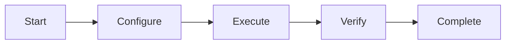

# User Guide Template

> **Home [Home](../../../README.md)** | **Documentation** | **Guides [Guides](../README.md)** | **Templates**

---

## Overview

This template provides a standardized format for creating user guides in the CSA-in-a-Box documentation project. Use this template when creating comprehensive user-facing documentation.

## Table of Contents

- [Getting Started](#getting-started)
- [Core Features](#core-features)
- [Common Tasks](#common-tasks)
- [Advanced Usage](#advanced-usage)
- [Best Practices](#best-practices)
- [Troubleshooting](#troubleshooting)
- [FAQ](#faq)

---

## Getting Started

### What is [Product/Feature Name]?

[Provide a brief, clear explanation of what the product or feature is and what problem it solves.]

**Example:**
Azure Synapse Analytics is an enterprise analytics service that accelerates time to insight across data warehouses and big data systems. It brings together data integration, enterprise data warehousing, and big data analytics in a unified experience.

### Key Benefits

| Benefit | Description | Value Proposition |
|---------|-------------|-------------------|
| **Unified Experience** | Single platform for all analytics needs | Reduced complexity and cost |
| **Serverless Options** | Pay only for what you use | Optimized spending |
| **Enterprise Security** | Built-in security and compliance | Peace of mind |
| **Scalability** | Handle petabyte-scale data | Future-proof solution |

### Prerequisites

Before you begin, ensure you have:

- [ ] Azure subscription with appropriate permissions
- [ ] [Specific tool or software installed]
- [ ] Basic understanding of [relevant concepts]
- [ ] Access to [required resources]

### First-Time Setup

**Step 1: Access the Platform**

1. Navigate to the [Azure Portal](https://portal.azure.com)
2. Search for "Synapse Analytics"
3. Click "Create" to start the setup wizard

**Step 2: Configure Basic Settings**

```bash
# Example configuration
WORKSPACE_NAME="my-synapse-workspace"
RESOURCE_GROUP="rg-analytics"
LOCATION="eastus2"
```

**Step 3: Verify Installation**

Run the following command to verify setup:

```bash
az synapse workspace show \
  --name $WORKSPACE_NAME \
  --resource-group $RESOURCE_GROUP
```

---

## Core Features

### Feature 1: [Feature Name]

**Description:** [Explain what this feature does and why it's useful]

**How to Use:**

1. **Access the feature**
   - Navigate to [location]
   - Click on [button/menu item]

2. **Configure settings**
   ```yaml
   setting_1: value1
   setting_2: value2
   ```

3. **Verify configuration**
   - Check [indicator]
   - Expected result: [description]

**Example Use Case:**

```python
# Example code showing feature usage
from azure.synapse import SynapseClient

client = SynapseClient(workspace_name="my-workspace")
result = client.execute_feature(param1="value1")
print(f"Result: {result}")
```

### Feature 2: [Feature Name]

**Description:** [Explain what this feature does]

**Visual Guide:**



**Configuration Options:**

| Option | Type | Default | Description |
|--------|------|---------|-------------|
| `option1` | string | "default" | [Description] |
| `option2` | integer | 100 | [Description] |
| `option3` | boolean | true | [Description] |

---

## Common Tasks

### Task 1: [Task Name]

**Objective:** [What the user will accomplish]

**Time Required:** [Estimated time]

**Steps:**

1. **Preparation**
   ```bash
   # Prepare environment
   export VARIABLE_NAME="value"
   ```

2. **Execution**
   ```sql
   -- Execute main task
   CREATE TABLE example_table (
       id INT PRIMARY KEY,
       name VARCHAR(100)
   );
   ```

3. **Verification**
   ```sql
   -- Verify results
   SELECT * FROM example_table;
   ```

**Expected Output:**

```text
(0 rows affected)
```

**Common Issues:**

- **Issue:** Permission denied
  - **Solution:** Verify user has appropriate role assignment

- **Issue:** Timeout error
  - **Solution:** Increase timeout setting in configuration

### Task 2: [Task Name]

**Objective:** [What the user will accomplish]

**Prerequisites:**
- Completed Task 1
- [Other prerequisites]

**Procedure:**

**Step 1:** [First step description]

```bash
# Command for step 1
az synapse [command]
```

**Step 2:** [Second step description]

- Sub-step 1
- Sub-step 2
- Sub-step 3

**Step 3:** [Third step description]

> **Note:** [Important information or warning]

---

## Advanced Usage

### Advanced Feature: [Feature Name]

**When to Use:**

Use this advanced feature when you need to:
- [Scenario 1]
- [Scenario 2]
- [Scenario 3]

**Configuration:**

```json
{
  "advanced_settings": {
    "optimization_level": "high",
    "parallel_processing": true,
    "cache_enabled": true,
    "max_concurrency": 10
  }
}
```

**Performance Tuning:**

| Setting | Impact | Recommended Value |
|---------|--------|-------------------|
| `optimization_level` | Query performance | "high" for production |
| `parallel_processing` | Execution speed | true for large datasets |
| `max_concurrency` | Resource usage | 10-20 based on workload |

### Integration with Other Services

**Azure Data Factory Integration:**

```json
{
  "name": "SynapseLinkedService",
  "type": "AzureSynapse",
  "typeProperties": {
    "connectionString": "integrated security=False;encrypt=True;...",
    "authentication": "ManagedIdentity"
  }
}
```

**Power BI Integration:**

1. Open Power BI Desktop
2. Get Data > Azure > Azure Synapse Analytics
3. Enter server name: `workspace-name.sql.azuresynapse.net`
4. Select database and tables

---

## Best Practices

### Performance Optimization

**Do's:**

- [ ] Use appropriate table distribution strategies
- [ ] Implement partition pruning for large tables
- [ ] Keep statistics up to date
- [ ] Use columnstore indexes for analytics workloads

**Don'ts:**

- [ ] Don't use ROUND_ROBIN distribution for frequently joined tables
- [ ] Avoid wide VARCHAR columns when not needed
- [ ] Don't create too many small partitions
- [ ] Avoid excessive indexing

### Security Best Practices

1. **Authentication**
   - Always use Azure Active Directory authentication
   - Enable multi-factor authentication
   - Implement conditional access policies

2. **Authorization**
   - Apply principle of least privilege
   - Use role-based access control (RBAC)
   - Regular access reviews

3. **Network Security**
   - Enable private endpoints
   - Configure firewall rules
   - Use managed virtual networks

### Cost Optimization

```yaml
Cost Saving Strategies:
  - Use serverless SQL pools for ad-hoc queries
  - Auto-pause dedicated SQL pools when not in use
  - Right-size Spark pools based on workload
  - Leverage auto-scale features
  - Monitor and optimize data storage
```

---

## Troubleshooting

### Problem: [Common Issue 1]

**Symptoms:**
- [Symptom 1]
- [Symptom 2]

**Possible Causes:**
- [Cause 1]
- [Cause 2]

**Solutions:**

**Solution 1: [Approach]**

```bash
# Steps to resolve
[command or procedure]
```

**Solution 2: [Alternative approach]**

1. [Step 1]
2. [Step 2]
3. [Step 3]

### Problem: [Common Issue 2]

**Quick Fix:**

```sql
-- Emergency resolution
[SQL command or procedure]
```

**Permanent Solution:**

[Detailed explanation of proper fix]

---

## FAQ

### General Questions

**Q: How do I [common question]?**

A: [Clear, concise answer with example if applicable]

```bash
# Example
[relevant code]
```

**Q: What is the difference between [option A] and [option B]?**

A: [Comparative explanation]

| Aspect | Option A | Option B |
|--------|----------|----------|
| Use Case | [Description] | [Description] |
| Performance | [Comparison] | [Comparison] |
| Cost | [Comparison] | [Comparison] |

### Technical Questions

**Q: Can I [technical capability]?**

A: Yes/No. [Detailed explanation]

**Q: How do I troubleshoot [specific issue]?**

A: Follow these steps:

1. [Diagnostic step]
2. [Resolution step]
3. [Verification step]

---

## Additional Resources

### Documentation

- [Related Guide 1](../path/to/guide1.md)
- [Related Guide 2](../path/to/guide2.md)
- [API Reference](./api-reference.md)

### External Links

- [Official Documentation](https://learn.microsoft.com/azure/synapse-analytics/)
- [Community Forum](https://techcommunity.microsoft.com/)
- [Video Tutorials](https://www.youtube.com/...)

### Support

- **Community Support:** [Discussion Forum Link]
- **Technical Support:** [Support Portal Link]
- **Emergency Contact:** [Contact Information]

---

## Feedback

Help us improve this guide! Please share your feedback:

- Was this guide helpful?
- What could be improved?
- What additional topics should be covered?

[Submit Feedback](https://github.com/fgarofalo56/csa-inabox-docs/issues/new?labels=documentation,user-guide)

---

**Last Updated:** December 9, 2025
**Version:** 1.0.0
**Next Review:** March 2026
**Maintainer:** CSA Documentation Team
