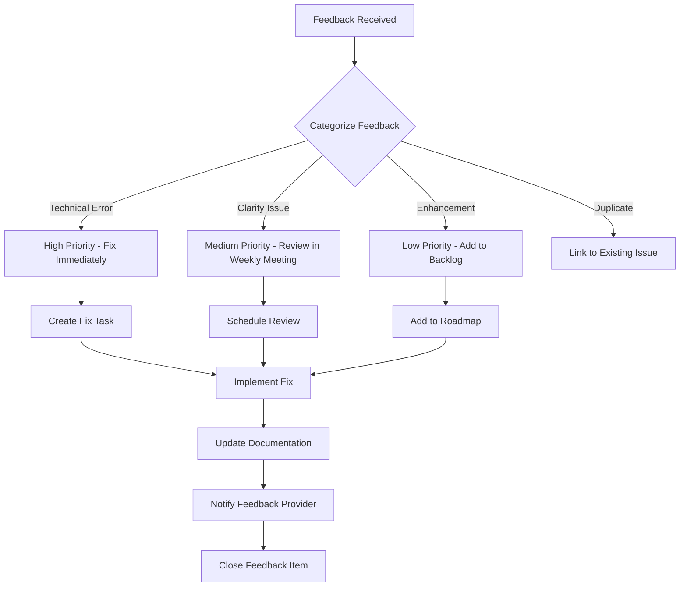
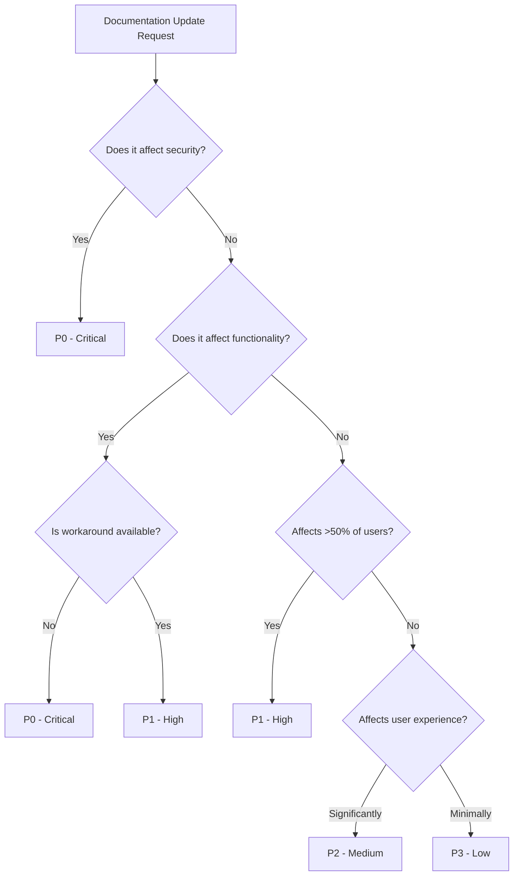

# 📋 Documentation Review Process

[🏠 Home](../../README.md) > [📖 Guides](README.md) > 📋 Documentation Review Process

> 🔄 __Continuous Improvement Framework__
> Establish a systematic approach to maintaining documentation quality through regular reviews, feedback collection, and iterative improvements.

---

## 🎯 Overview

Documentation is a living asset that requires ongoing maintenance and improvement. This guide establishes a structured review process to ensure documentation remains accurate, relevant, and valuable to users.

### 📊 Review Objectives

| Objective | Purpose | Success Metric |
|-----------|---------|----------------|
| ✅ __Accuracy__ | Ensure technical correctness | Zero critical errors |
| 📈 __Relevance__ | Keep content current with Azure updates | Updated within 30 days of changes |
| 🎯 __Usability__ | Improve user experience | Positive feedback >80% |
| 🔗 __Completeness__ | Fill documentation gaps | Coverage >95% |

---

## 📅 Review Schedule

> ⏰ __Systematic Review Cadence__
> Establish regular review intervals to maintain documentation quality.

### 🗓️ Quarterly Review Schedule

| Quarter | Focus Areas | Key Activities | Deliverables |
|---------|-------------|----------------|--------------|
| Q1 | __Architecture & Patterns__ | Review design docs, update diagrams | Updated architecture guides |
| Q2 | __Code Examples & Tutorials__ | Test all code samples, update dependencies | Validated examples |
| Q3 | __Security & Compliance__ | Review security best practices, compliance updates | Updated security guides |
| Q4 | __Performance & Optimization__ | Review optimization techniques, benchmark updates | Performance guidelines |

### 📋 Monthly Review Activities

| Week | Activity | Owner | Output |
|------|----------|-------|--------|
| Week 1 | __Link Validation__ | DevOps Team | Link check report |
| Week 2 | __User Feedback Review__ | Documentation Team | Feedback analysis |
| Week 3 | __Content Updates__ | Subject Matter Experts | Updated content |
| Week 4 | __Quality Checks__ | QA Team | Quality report |

### 🔄 Continuous Activities

- __Daily__: Monitor feedback submissions
- __Weekly__: Review analytics and usage metrics
- __Monthly__: Update changelog with documentation changes
- __Quarterly__: Comprehensive review and planning

---

## ✅ Review Checklist

> 📝 __Comprehensive Quality Assessment__
> Use this checklist to ensure thorough documentation reviews.

### 🔍 Technical Accuracy Checklist

- [ ] __Code Examples__
  - [ ] All code samples execute successfully
  - [ ] Dependencies are current and specified
  - [ ] Error handling is demonstrated
  - [ ] Output examples are provided
  - [ ] Security best practices are followed

- [ ] __Configuration Examples__
  - [ ] All configuration files are valid
  - [ ] Required settings are documented
  - [ ] Optional parameters are clearly marked
  - [ ] Security considerations are noted
  - [ ] Environment-specific values are indicated

- [ ] __Technical Details__
  - [ ] Service names and versions are current
  - [ ] API endpoints are correct
  - [ ] Feature availability is verified
  - [ ] Limitations are documented
  - [ ] Prerequisites are complete

### 📚 Content Quality Checklist

- [ ] __Clarity and Readability__
  - [ ] Language is clear and concise
  - [ ] Technical terms are defined
  - [ ] Acronyms are explained on first use
  - [ ] Sentences are action-oriented
  - [ ] Paragraph length is appropriate

- [ ] __Structure and Organization__
  - [ ] Logical flow of information
  - [ ] Proper heading hierarchy
  - [ ] Table of contents is accurate
  - [ ] Navigation elements work correctly
  - [ ] Related content is cross-referenced

- [ ] __Visual Elements__
  - [ ] Diagrams are current and accurate
  - [ ] Screenshots show latest UI
  - [ ] Icons are consistent
  - [ ] Tables are formatted properly
  - [ ] Code blocks have syntax highlighting

### 🔗 Link and Reference Checklist

- [ ] __Internal Links__
  - [ ] All internal links are valid
  - [ ] Anchor links work correctly
  - [ ] Relative paths are correct
  - [ ] No broken cross-references
  - [ ] Navigation breadcrumbs are accurate

- [ ] __External Links__
  - [ ] Microsoft documentation links are current
  - [ ] Third-party resources are accessible
  - [ ] GitHub links point to correct versions
  - [ ] Community resources are active
  - [ ] Dead links are removed or updated

### 🎨 Style and Formatting Checklist

- [ ] __Markdown Compliance__
  - [ ] Passes markdownlint validation
  - [ ] Heading levels are correct
  - [ ] Lists are properly formatted
  - [ ] Code blocks have language tags
  - [ ] Line length within limits

- [ ] __Style Guide Compliance__
  - [ ] Follows MARKDOWN_STYLE_GUIDE.md
  - [ ] Icons used consistently
  - [ ] Badges formatted correctly
  - [ ] Callouts properly structured
  - [ ] Tables aligned and formatted

---

## 📊 Feedback Collection Process

> 💬 __User-Driven Improvement__
> Systematic collection and analysis of user feedback to drive documentation improvements.

### 🔄 Feedback Channels

| Channel | Purpose | Response Time | Priority |
|---------|---------|---------------|----------|
| 📝 __Inline Feedback__ | Page-level "Was this helpful?" | 48 hours | High |
| 🐛 __GitHub Issues__ | Bug reports and suggestions | 72 hours | Medium |
| 💬 __Community Forums__ | General questions and discussions | 1 week | Low |
| 📧 __Direct Feedback__ | Email submissions | 48 hours | High |

### 📝 Feedback Collection Template

```markdown
## Documentation Feedback

**Page**: [URL or document name]
**Section**: [Specific section if applicable]
**Feedback Type**: [Bug/Suggestion/Question/General]

**Issue Description**:
[Detailed description of the issue or suggestion]

**Expected Outcome**:
[What you expected to find or understand]

**Actual Outcome**:
[What you actually found or understood]

**Suggested Improvement**:
[Your suggestion for improvement, if any]

**User Context**:
- Role: [Developer/Admin/Architect/etc.]
- Experience Level: [Beginner/Intermediate/Advanced]
- Use Case: [What you were trying to accomplish]
```

### 📊 Feedback Analysis Process



### 📈 Feedback Metrics

| Metric | Target | Measurement | Action Threshold |
|--------|--------|-------------|------------------|
| __Response Rate__ | >90% | Feedback acknowledged | <80% requires process review |
| __Resolution Time__ | <7 days average | Time to close feedback | >14 days requires escalation |
| __User Satisfaction__ | >80% helpful ratings | "Was this helpful?" responses | <70% requires content review |
| __Feedback Volume__ | Trending down | Monthly submission count | Increase indicates quality issues |

---

## 🎯 Update Prioritization Criteria

> ⚖️ __Strategic Decision Framework__
> Prioritize documentation updates based on impact, urgency, and resource availability.

### 📊 Priority Matrix

| Priority | Criteria | Response Time | Examples |
|----------|----------|---------------|----------|
| 🔴 __P0 - Critical__ | Incorrect information causing issues | Immediate (same day) | Security vulnerabilities, broken critical workflows |
| 🟠 __P1 - High__ | Missing critical information | 1-3 days | New feature documentation, significant updates |
| 🟡 __P2 - Medium__ | Improvement opportunities | 1-2 weeks | Clarity improvements, additional examples |
| 🟢 __P3 - Low__ | Nice-to-have enhancements | Next quarter | Cosmetic improvements, supplementary content |

### 🎯 Impact Assessment

Calculate priority score using this formula:

```text
Priority Score = (User Impact × 3) + (Technical Complexity × 2) + Urgency

Where:
- User Impact: 1-10 (how many users affected)
- Technical Complexity: 1-10 (difficulty to implement)
- Urgency: 1-10 (time sensitivity)

Score Ranges:
- 40-50: P0 - Critical
- 30-39: P1 - High
- 20-29: P2 - Medium
- 0-19: P3 - Low
```

### 📋 Update Decision Tree



### 🔄 Update Workflow

| Stage | Activity | Reviewer | Timeline |
|-------|----------|----------|----------|
| 1️⃣ __Triage__ | Assess and prioritize | Documentation Lead | Day 1 |
| 2️⃣ __Assignment__ | Assign to SME | Team Lead | Day 1-2 |
| 3️⃣ __Research__ | Investigate and validate | SME | Days 2-5 |
| 4️⃣ __Draft__ | Create updated content | SME | Days 3-7 |
| 5️⃣ __Review__ | Technical and editorial review | Peer + Editor | Days 7-10 |
| 6️⃣ __Approval__ | Final approval | Documentation Lead | Day 11 |
| 7️⃣ __Publish__ | Update and deploy | DevOps | Day 12 |
| 8️⃣ __Notify__ | Inform stakeholders | Documentation Lead | Day 12 |

---

## 📈 Quality Metrics and Reporting

> 📊 __Measure and Improve__
> Track documentation quality through measurable metrics.

### 🎯 Key Performance Indicators (KPIs)

| KPI | Target | Measurement Method | Reporting Frequency |
|-----|--------|-------------------|---------------------|
| __Documentation Coverage__ | 95% | % of features documented | Monthly |
| __Link Validity__ | 100% | Automated link checker | Weekly |
| __User Satisfaction__ | >80% | Feedback ratings | Weekly |
| __Page Views__ | Trending up | Analytics | Monthly |
| __Search Success Rate__ | >70% | Search analytics | Monthly |
| __Time to Find Information__ | <3 min average | User surveys | Quarterly |

### 📊 Quarterly Report Template

```markdown
# Documentation Quality Report - Q[X] 20XX

## Executive Summary
[High-level overview of documentation health]

## Metrics Dashboard

### Content Metrics
- Total Pages: [X]
- New Pages Added: [X]
- Pages Updated: [X]
- Pages Deprecated: [X]

### Quality Metrics
- Link Validity: [X%]
- Documentation Coverage: [X%]
- User Satisfaction: [X%]
- Average Response Time: [X days]

### User Engagement
- Total Page Views: [X]
- Unique Visitors: [X]
- Average Time on Page: [X min]
- Bounce Rate: [X%]

## Key Achievements
- [Achievement 1]
- [Achievement 2]
- [Achievement 3]

## Areas for Improvement
- [Issue 1]
- [Issue 2]
- [Issue 3]

## Action Items for Next Quarter
- [Action 1]
- [Action 2]
- [Action 3]

## Feedback Summary
- Total Feedback Items: [X]
- Positive Feedback: [X%]
- Issues Resolved: [X]
- Average Resolution Time: [X days]
```

---

## 🛠️ Tools and Resources

> ⚙️ __Automation and Support Tools__
> Leverage tools to streamline the review process.

### 🔧 Automated Tools

| Tool | Purpose | Frequency | Command |
|------|---------|-----------|---------|
| __markdownlint__ | Markdown syntax validation | Pre-commit | `markdownlint docs/**/*.md` |
| __Link Checker__ | Validate all links | Weekly | `python scripts/maintenance/link_checker.py` |
| __Spell Checker__ | Check spelling and grammar | On-demand | `cspell docs/**/*.md` |
| __Build Test__ | Verify MkDocs builds | Pre-deploy | `mkdocs build --strict` |

### 📚 Reference Resources

- [MARKDOWN_STYLE_GUIDE.md](MARKDOWN_STYLE_GUIDE.md) - Style standards
- [DIRECTORY_STRUCTURE_GUIDE.md](DIRECTORY_STRUCTURE_GUIDE.md) - Organization guidelines
- [CONTRIBUTING_GUIDE.md](CONTRIBUTING_GUIDE.md) - Contribution process
- [CODE_REVIEW_GUIDE.md](CODE_REVIEW_GUIDE.md) - Review guidelines

---

## 👥 Roles and Responsibilities

> 🎭 __Clear Ownership__
> Define roles to ensure accountability in the review process.

### 📋 Team Structure

| Role | Responsibilities | Time Commitment |
|------|-----------------|-----------------|
| __Documentation Lead__ | Overall strategy, prioritization, final approval | 20% |
| __Subject Matter Experts (SMEs)__ | Technical accuracy, content creation | 10% |
| __Technical Editors__ | Style, clarity, consistency | 15% |
| __DevOps Team__ | Automation, tooling, deployment | 5% |
| __QA Team__ | Testing, validation, quality checks | 10% |

### 🔄 Review Rotation

Establish a rotating review schedule to prevent bottlenecks:

```markdown
## Monthly Review Rotation - Q1 2025

| Month | Primary Reviewer | Secondary Reviewer | Focus Area |
|-------|-----------------|-------------------|------------|
| January | SME: Azure Architecture | Editor: Tech Writer | Architecture docs |
| February | SME: Security | Editor: Tech Writer | Security guides |
| March | SME: Performance | Editor: Tech Writer | Optimization docs |
```

---

## 🚀 Getting Started

> ✅ __Implementation Checklist__
> Steps to implement this review process.

### 📝 Initial Setup

- [ ] __Week 1: Planning__
  - [ ] Review and customize this process for your team
  - [ ] Assign roles and responsibilities
  - [ ] Set up feedback channels
  - [ ] Configure automated tools

- [ ] __Week 2: Training__
  - [ ] Train team on review process
  - [ ] Conduct sample review session
  - [ ] Document team-specific procedures
  - [ ] Create review templates

- [ ] __Week 3: Launch__
  - [ ] Announce review process to stakeholders
  - [ ] Begin first quarterly review
  - [ ] Schedule recurring review meetings
  - [ ] Start tracking metrics

- [ ] __Week 4: Refinement__
  - [ ] Gather team feedback on process
  - [ ] Adjust as needed
  - [ ] Document lessons learned
  - [ ] Plan next quarter

---

## 📚 Additional Resources

- [Azure Documentation Best Practices](https://learn.microsoft.com/en-us/style-guide/welcome/)
- [Write the Docs - Documentation Guide](https://www.writethedocs.org/guide/)
- [Google Developer Documentation Style Guide](https://developers.google.com/style)

---

> 🔄 __Continuous Improvement__
> This review process itself should be reviewed and updated quarterly to ensure it remains effective and aligned with team needs.

__Last Updated__: December 2025
__Next Review__: March 2026
__Process Owner__: Documentation Lead
