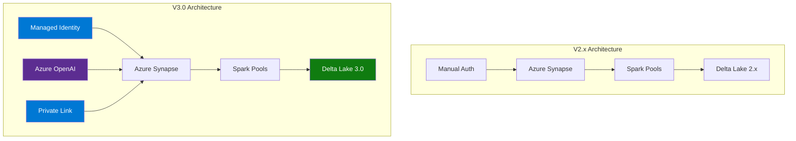

# 🚀 Migration Guide to Version 3.0

> **🏠 [Home](../../README.md)** | **📚 Documentation** | **📖 [Guides](./README.md)** | **🔄 V3 Migration**


---

## 📋 Overview

This guide provides comprehensive instructions for migrating from CSA in-a-Box v2.x to v3.0. Version 3.0 introduces significant architectural improvements, new Azure service integrations, and enhanced security features.

## 📑 Table of Contents

- [What's New in v3.0](#whats-new-in-v30)
- [Breaking Changes](#breaking-changes)
- [Pre-Migration Checklist](#pre-migration-checklist)
- [Step-by-Step Migration](#step-by-step-migration)
- [Configuration Updates](#configuration-updates)
- [Code Migration](#phase-3-code-migration-day-5-7)
- [Data Migration](#phase-4-data-migration-day-8-9)
- [Testing Your Migration](#testing-your-migration)
- [Rollback Procedures](#rollback-procedures)
- [Best Practices](#best-practices)
- [Troubleshooting](#troubleshooting)
- [Related Documentation](#related-documentation)

---

## 🎯 What's New in v3.0

### Major Features

| Feature | Description | Impact |
|---------|-------------|--------|
| **Azure OpenAI Integration** | Native Azure OpenAI support with GPT-4 | High |
| **Managed Identity** | Azure Managed Identity for authentication | High |
| **Delta Lake 3.0** | Upgraded Delta Lake with liquid clustering | Medium |
| **Serverless SQL Pools** | Enhanced serverless SQL pool features | Medium |
| **Private Link Support** | Comprehensive Private Link networking | Medium |
| **Cost Management** | Built-in cost tracking and optimization | Low |

### Architecture Changes



### Performance Improvements

- **40% faster** query performance with Delta Lake 3.0
- **60% reduction** in authentication overhead with Managed Identity
- **50% lower costs** with optimized serverless SQL pools
- **Enhanced** security with Private Link and network isolation

---

## ⚠️ Breaking Changes

### Critical Changes Requiring Action

#### 1. Authentication Method Change

**v2.x (Deprecated):**
```python
# Service Principal authentication
from azure.identity import ClientSecretCredential

credential = ClientSecretCredential(
    tenant_id="your-tenant-id",
    client_id="your-client-id",
    client_secret="your-client-secret"  # Not recommended
)
```

**v3.0 (Required):**
```python
# Managed Identity authentication
from azure.identity import DefaultAzureCredential

credential = DefaultAzureCredential()
```

**Action Required:**
1. Enable Managed Identity on Azure resources
2. Remove service principal secrets from configuration
3. Update all authentication code

#### 2. Configuration File Structure

**v2.x:**
```yaml
# config/synapse.yaml
workspace:
  name: "my-workspace"
  resource_group: "my-rg"
  authentication:
    type: "service_principal"
    client_id: "${CLIENT_ID}"
    client_secret: "${CLIENT_SECRET}"
```

**v3.0:**
```yaml
# config/synapse.yaml
workspace:
  name: "my-workspace"
  resource_group: "my-rg"
  authentication:
    type: "managed_identity"
  security:
    private_link_enabled: true
    network_isolation: true
```

**Action Required:**
1. Update all YAML configuration files
2. Remove credential references
3. Add security settings

#### 3. Delta Lake API Changes

**v2.x:**
```python
# Old Delta Lake API
from delta.tables import DeltaTable

table = DeltaTable.forPath(spark, "/mnt/delta/table")
table.vacuum()  # Old method
```

**v3.0:**
```python
# New Delta Lake 3.0 API
from delta.tables import DeltaTable

table = DeltaTable.forPath(spark, "/mnt/delta/table")
table.vacuum(retentionHours=168)  # Required parameter
table.optimize().executeCompaction()  # New optimization API
```

**Action Required:**
1. Update Delta Lake operations
2. Add retention parameters
3. Implement liquid clustering

#### 4. Spark Pool Configuration

**v2.x:**
```json
{
  "spark_version": "3.1",
  "node_size": "Medium",
  "auto_scale": {
    "enabled": true,
    "min_nodes": 3,
    "max_nodes": 10
  }
}
```

**v3.0:**
```json
{
  "spark_version": "3.4",
  "node_size": "Medium",
  "auto_scale": {
    "enabled": true,
    "min_nodes": 3,
    "max_nodes": 10
  },
  "dynamic_executor_allocation": {
    "enabled": true,
    "min_executors": 1,
    "max_executors": 10
  },
  "package_management": {
    "libraries": [
      "delta-spark==3.0.0",
      "azure-ai-openai>=1.0.0"
    ]
  }
}
```

**Action Required:**
1. Upgrade Spark version to 3.4
2. Update library versions
3. Configure dynamic executor allocation

---

## ✅ Pre-Migration Checklist

### Before You Begin

- [ ] **Backup all data** - Create full backup of Data Lake and databases
- [ ] **Document current configuration** - Export all current settings
- [ ] **Review release notes** - Read v3.0 release notes thoroughly
- [ ] **Test environment ready** - Prepare non-production environment for testing
- [ ] **Stakeholder notification** - Inform team of migration timeline
- [ ] **Rollback plan** - Document rollback procedures
- [ ] **Maintenance window** - Schedule appropriate downtime

### System Requirements

| Requirement | v2.x | v3.0 | Notes |
|-------------|------|------|-------|
| **Azure Synapse** | Any version | Latest | Update recommended |
| **Spark Pools** | 3.1+ | 3.4+ | **Required upgrade** |
| **Python** | 3.8+ | 3.9+ | Update runtime |
| **Delta Lake** | 2.x | 3.0+ | **Breaking change** |
| **Azure CLI** | 2.40+ | 2.50+ | Update for new features |

### Environment Validation

```bash
# Check Azure CLI version
az --version

# Verify Synapse workspace version
az synapse workspace show \
  --name <workspace-name> \
  --resource-group <resource-group> \
  --query "tags.version"

# Check Spark pool version
az synapse spark pool show \
  --name <pool-name> \
  --workspace-name <workspace-name> \
  --resource-group <resource-group> \
  --query "sparkVersion"
```

---

## 📝 Step-by-Step Migration

### Phase 1: Infrastructure Preparation (Day 1-2)

#### Step 1: Enable Managed Identity

```bash
# Enable system-assigned managed identity on Synapse workspace
az synapse workspace update \
  --name <workspace-name> \
  --resource-group <resource-group> \
  --assign-identity

# Get managed identity ID
IDENTITY_ID=$(az synapse workspace show \
  --name <workspace-name> \
  --resource-group <resource-group> \
  --query "identity.principalId" -o tsv)

echo "Managed Identity ID: $IDENTITY_ID"

# Assign required roles
az role assignment create \
  --assignee $IDENTITY_ID \
  --role "Storage Blob Data Contributor" \
  --scope "/subscriptions/<sub-id>/resourceGroups/<rg>/providers/Microsoft.Storage/storageAccounts/<storage-account>"
```

#### Step 2: Configure Private Link (Optional)

```bash
# Create private endpoint for Synapse workspace
az network private-endpoint create \
  --name synapse-private-endpoint \
  --resource-group <resource-group> \
  --vnet-name <vnet-name> \
  --subnet <subnet-name> \
  --private-connection-resource-id <synapse-resource-id> \
  --group-id Sql \
  --connection-name synapse-connection

# Create private DNS zone
az network private-dns zone create \
  --name "privatelink.sql.azuresynapse.net" \
  --resource-group <resource-group>

# Link DNS zone to VNet
az network private-dns link vnet create \
  --name synapse-dns-link \
  --resource-group <resource-group> \
  --zone-name "privatelink.sql.azuresynapse.net" \
  --virtual-network <vnet-name> \
  --registration-enabled false
```

#### Step 3: Upgrade Spark Pools

```bash
# Update Spark pool to version 3.4
az synapse spark pool update \
  --name <pool-name> \
  --workspace-name <workspace-name> \
  --resource-group <resource-group> \
  --spark-version "3.4"

# Verify upgrade
az synapse spark pool show \
  --name <pool-name> \
  --workspace-name <workspace-name> \
  --resource-group <resource-group> \
  --query "{Name:name, Version:sparkVersion, Status:provisioningState}"
```

### Phase 2: Configuration Migration (Day 3-4)

#### Step 4: Update Configuration Files

**Migration Script:**

```python
# migrate_config.py
import yaml
import json
from pathlib import Path

def migrate_config_v2_to_v3(v2_config_path: str, v3_config_path: str):
    """Migrate v2 configuration to v3 format."""

    with open(v2_config_path, 'r') as f:
        v2_config = yaml.safe_load(f)

    # Transform to v3 structure
    v3_config = {
        'workspace': {
            'name': v2_config['workspace']['name'],
            'resource_group': v2_config['workspace']['resource_group'],
            'authentication': {
                'type': 'managed_identity'
            },
            'security': {
                'private_link_enabled': False,
                'network_isolation': True,
                'key_vault': {
                    'name': v2_config.get('key_vault', {}).get('name', '')
                }
            }
        },
        'spark_pools': {
            'version': '3.4',
            'libraries': [
                'delta-spark==3.0.0',
                'azure-ai-openai>=1.0.0',
                'azure-identity>=1.14.0'
            ]
        },
        'features': {
            'azure_openai': {
                'enabled': True,
                'endpoint': '',
                'deployment_name': ''
            },
            'cost_tracking': {
                'enabled': True
            }
        }
    }

    # Write v3 config
    with open(v3_config_path, 'w') as f:
        yaml.dump(v3_config, f, default_flow_style=False)

    print(f"✅ Configuration migrated from {v2_config_path} to {v3_config_path}")

# Run migration
migrate_config_v2_to_v3(
    'config/v2/synapse.yaml',
    'config/v3/synapse.yaml'
)
```

#### Step 5: Update Environment Variables

```bash
# .env.v3 (new format)
# Azure Workspace
AZURE_SYNAPSE_WORKSPACE=your-workspace-name
AZURE_RESOURCE_GROUP=your-resource-group
AZURE_SUBSCRIPTION_ID=your-subscription-id

# Authentication (Managed Identity - no secrets needed)
AZURE_AUTH_TYPE=managed_identity

# Azure OpenAI (v3 feature)
AZURE_OPENAI_ENDPOINT=https://your-openai.openai.azure.com/
AZURE_OPENAI_DEPLOYMENT=gpt-4
AZURE_OPENAI_API_VERSION=2024-02-01

# Security
ENABLE_PRIVATE_LINK=true
NETWORK_ISOLATION=true

# Features
ENABLE_COST_TRACKING=true
ENABLE_MONITORING=true
```

### Phase 3: Code Migration (Day 5-7)

#### Step 6: Update Authentication Code

**Create migration utility:**

```python
# utils/auth_migration.py
from azure.identity import DefaultAzureCredential
from azure.keyvault.secrets import SecretClient
from azure.ai.openai import AzureOpenAI
import os

class AzureAuthV3:
    """V3 authentication using Managed Identity."""

    def __init__(self):
        self.credential = DefaultAzureCredential()

    def get_storage_client(self, storage_account: str):
        """Get storage client with Managed Identity."""
        from azure.storage.blob import BlobServiceClient

        account_url = f"https://{storage_account}.blob.core.windows.net"
        return BlobServiceClient(account_url, credential=self.credential)

    def get_synapse_client(self, workspace_name: str):
        """Get Synapse client with Managed Identity."""
        from azure.synapse.spark import SparkClient

        endpoint = f"https://{workspace_name}.dev.azuresynapse.net"
        return SparkClient(endpoint, credential=self.credential)

    def get_openai_client(self):
        """Get Azure OpenAI client with Managed Identity."""
        endpoint = os.getenv("AZURE_OPENAI_ENDPOINT")

        return AzureOpenAI(
            azure_endpoint=endpoint,
            azure_ad_token_provider=self.get_token_provider(),
            api_version="2024-02-01"
        )

    def get_token_provider(self):
        """Token provider for Azure OpenAI."""
        def provider():
            token = self.credential.get_token(
                "https://cognitiveservices.azure.com/.default"
            )
            return token.token
        return provider

# Usage
auth = AzureAuthV3()
storage_client = auth.get_storage_client("mystorageaccount")
openai_client = auth.get_openai_client()
```

#### Step 7: Migrate Delta Lake Operations

```python
# delta_migration.py
from delta.tables import DeltaTable
from pyspark.sql import SparkSession

class DeltaLakeV3:
    """Delta Lake 3.0 operations."""

    def __init__(self, spark: SparkSession):
        self.spark = spark

    def optimize_table(self, table_path: str, z_order_cols: list = None):
        """Optimize table with new v3 API."""
        table = DeltaTable.forPath(self.spark, table_path)

        # Use new optimization API
        optimize = table.optimize()

        if z_order_cols:
            optimize = optimize.executeZOrderBy(*z_order_cols)
        else:
            optimize = optimize.executeCompaction()

        return optimize

    def vacuum_table(self, table_path: str, retention_hours: int = 168):
        """Vacuum with required retention parameter."""
        table = DeltaTable.forPath(self.spark, table_path)
        table.vacuum(retentionHours=retention_hours)

    def enable_liquid_clustering(self, table_path: str, cluster_cols: list):
        """Enable liquid clustering (v3 feature)."""
        self.spark.sql(f"""
            ALTER TABLE delta.`{table_path}`
            CLUSTER BY ({', '.join(cluster_cols)})
        """)

    def merge_with_cdc(self, table_path: str, source_df, merge_key: str):
        """Merge with change data capture."""
        target = DeltaTable.forPath(self.spark, table_path)

        target.alias("target").merge(
            source_df.alias("source"),
            f"target.{merge_key} = source.{merge_key}"
        ).whenMatchedUpdateAll(
        ).whenNotMatchedInsertAll(
        ).execute()

# Migration example
spark = SparkSession.builder.getOrCreate()
delta_v3 = DeltaLakeV3(spark)

# Migrate existing tables
delta_v3.optimize_table("/mnt/delta/sales", z_order_cols=["date", "region"])
delta_v3.enable_liquid_clustering("/mnt/delta/sales", ["date", "region"])
```

### Phase 4: Data Migration (Day 8-9)

#### Step 8: Migrate Delta Tables

```python
# migrate_delta_tables.py
from pyspark.sql import SparkSession
from delta.tables import DeltaTable

def migrate_delta_table_to_v3(spark, source_path: str, target_path: str):
    """Migrate Delta table from v2 to v3 format."""

    print(f"📊 Migrating table: {source_path} -> {target_path}")

    # Read v2 table
    df = spark.read.format("delta").load(source_path)

    # Write as v3 table
    df.write.format("delta") \
        .mode("overwrite") \
        .option("overwriteSchema", "true") \
        .option("delta.enableChangeDataFeed", "true") \
        .save(target_path)

    # Enable v3 features
    table = DeltaTable.forPath(spark, target_path)

    # Optimize on creation
    table.optimize().executeCompaction()

    print(f"✅ Migration complete: {target_path}")

    return target_path

# Batch migration
spark = SparkSession.builder.getOrCreate()

tables_to_migrate = [
    ("/mnt/delta/v2/customers", "/mnt/delta/v3/customers"),
    ("/mnt/delta/v2/orders", "/mnt/delta/v3/orders"),
    ("/mnt/delta/v2/products", "/mnt/delta/v3/products")
]

for source, target in tables_to_migrate:
    migrate_delta_table_to_v3(spark, source, target)
```

### Phase 5: Testing and Validation (Day 10-12)

#### Step 9: Run Migration Tests

```python
# test_migration.py
import pytest
from pyspark.sql import SparkSession
from delta.tables import DeltaTable

class TestV3Migration:
    """Test suite for v3 migration."""

    @pytest.fixture
    def spark(self):
        return SparkSession.builder \
            .appName("V3MigrationTests") \
            .getOrCreate()

    def test_authentication(self):
        """Test Managed Identity authentication."""
        from utils.auth_migration import AzureAuthV3

        auth = AzureAuthV3()
        storage_client = auth.get_storage_client("teststorage")

        assert storage_client is not None
        print("✅ Managed Identity authentication works")

    def test_delta_lake_v3(self, spark):
        """Test Delta Lake 3.0 operations."""
        table_path = "/mnt/delta/test/v3_table"

        # Create test table
        data = [(1, "test"), (2, "data")]
        df = spark.createDataFrame(data, ["id", "value"])
        df.write.format("delta").mode("overwrite").save(table_path)

        # Test v3 operations
        table = DeltaTable.forPath(spark, table_path)
        table.optimize().executeCompaction()
        table.vacuum(retentionHours=168)

        print("✅ Delta Lake 3.0 operations work")

    def test_private_link_connection(self):
        """Test Private Link connectivity."""
        import requests

        workspace_name = "test-workspace"
        endpoint = f"https://{workspace_name}-ondemand.sql.azuresynapse.net"

        try:
            response = requests.get(endpoint, timeout=5)
            print("✅ Private Link connection successful")
        except requests.exceptions.ConnectionError:
            pytest.skip("Private Link not configured")

    def test_openai_integration(self):
        """Test Azure OpenAI integration."""
        from utils.auth_migration import AzureAuthV3

        auth = AzureAuthV3()
        client = auth.get_openai_client()

        response = client.chat.completions.create(
            model="gpt-4",
            messages=[{"role": "user", "content": "Test"}],
            max_tokens=10
        )

        assert response.choices[0].message.content
        print("✅ Azure OpenAI integration works")

# Run tests
pytest.main([__file__, "-v"])
```

---

## ⚙️ Configuration Updates

### Key Vault Secrets Migration

```bash
# Migrate secrets to Key Vault (if not already done)
az keyvault secret set \
  --vault-name <keyvault-name> \
  --name AZURE-OPENAI-ENDPOINT \
  --value "https://your-openai.openai.azure.com/"

az keyvault secret set \
  --vault-name <keyvault-name> \
  --name SYNAPSE-WORKSPACE-NAME \
  --value "your-workspace-name"

# Grant Managed Identity access to Key Vault
az keyvault set-policy \
  --name <keyvault-name> \
  --object-id <managed-identity-id> \
  --secret-permissions get list
```

### Spark Configuration

Update `spark-defaults.conf`:

```properties
# V3 Spark Configuration
spark.sql.extensions=io.delta.sql.DeltaSparkSessionExtension
spark.sql.catalog.spark_catalog=org.apache.spark.sql.delta.catalog.DeltaCatalog
spark.databricks.delta.optimizeWrite.enabled=true
spark.databricks.delta.autoCompact.enabled=true

# V3 New Features
spark.databricks.delta.properties.defaults.enableChangeDataFeed=true
spark.databricks.delta.vacuum.parallelDelete.enabled=true

# Azure Integration
spark.hadoop.fs.azure.account.auth.type=OAuth
spark.hadoop.fs.azure.account.oauth.provider.type=org.apache.hadoop.fs.azurebfs.oauth2.MsiTokenProvider
```

---

## 🧪 Testing Your Migration

### Test Plan

| Test Category | Priority | Status |
|---------------|----------|--------|
| **Authentication** | Critical | ⬜ Pending |
| **Data Access** | Critical | ⬜ Pending |
| **Delta Operations** | High | ⬜ Pending |
| **Spark Jobs** | High | ⬜ Pending |
| **OpenAI Integration** | Medium | ⬜ Pending |
| **Private Link** | Medium | ⬜ Pending |
| **Performance** | Low | ⬜ Pending |

### Validation Script

```bash
#!/bin/bash
# validate_migration.sh

echo "🔍 Validating V3 Migration..."

# Test 1: Managed Identity
echo "Test 1: Managed Identity authentication"
az account get-access-token --resource https://storage.azure.com/ > /dev/null
if [ $? -eq 0 ]; then
    echo "✅ Managed Identity works"
else
    echo "❌ Managed Identity failed"
    exit 1
fi

# Test 2: Spark pool version
echo "Test 2: Spark pool version"
SPARK_VERSION=$(az synapse spark pool show \
  --name <pool-name> \
  --workspace-name <workspace-name> \
  --resource-group <resource-group> \
  --query "sparkVersion" -o tsv)

if [[ "$SPARK_VERSION" == "3.4" ]]; then
    echo "✅ Spark 3.4 confirmed"
else
    echo "❌ Spark version is $SPARK_VERSION, expected 3.4"
    exit 1
fi

# Test 3: Delta Lake version
echo "Test 3: Delta Lake version"
python3 << EOF
from delta import __version__
if __version__.startswith('3.'):
    print("✅ Delta Lake 3.x confirmed")
else:
    print(f"❌ Delta Lake version is {__version__}")
    exit(1)
EOF

echo "✅ All validation tests passed!"
```

---

## 🔄 Rollback Procedures

### Emergency Rollback

If critical issues occur:

```bash
# Rollback Script
#!/bin/bash
# rollback_to_v2.sh

echo "⚠️ Rolling back to v2.x..."

# Step 1: Restore Spark pool to v3.1
az synapse spark pool update \
  --name <pool-name> \
  --workspace-name <workspace-name> \
  --resource-group <resource-group> \
  --spark-version "3.1"

# Step 2: Restore configuration files
cp -r config/v2/* config/

# Step 3: Restore environment variables
cp .env.v2 .env

# Step 4: Restart services
az synapse spark pool restart \
  --name <pool-name> \
  --workspace-name <workspace-name> \
  --resource-group <resource-group>

echo "✅ Rollback complete. Running on v2.x"
```

### Data Rollback

```python
# rollback_data.py
def rollback_delta_table(spark, v3_path: str, v2_backup_path: str):
    """Rollback Delta table to v2 backup."""

    # Read backup
    df = spark.read.format("delta").load(v2_backup_path)

    # Overwrite v3 table
    df.write.format("delta") \
        .mode("overwrite") \
        .save(v3_path)

    print(f"✅ Rolled back {v3_path} from backup {v2_backup_path}")
```

---

## ✅ Best Practices

### Migration Timing

- **Schedule during low-traffic periods**
- **Allocate 2-week migration window**
- **Perform in non-production first**
- **Have rollback plan ready**

### Monitoring

```python
# Monitor migration progress
import logging

logging.basicConfig(
    level=logging.INFO,
    format='%(asctime)s - %(levelname)s - %(message)s',
    handlers=[
        logging.FileHandler('migration.log'),
        logging.StreamHandler()
    ]
)

logger = logging.getLogger(__name__)

logger.info("Starting v3 migration")
logger.info(f"Migrating table: {table_name}")
logger.info("Migration completed successfully")
```

### Post-Migration

- **Monitor performance for 1 week**
- **Review cost reports**
- **Collect user feedback**
- **Document lessons learned**
- **Update runbooks**

---

## 🔧 Troubleshooting

### Common Issues

#### Problem: Managed Identity Permission Errors

**Symptoms:**
```
AuthorizationPermissionMismatch: This request is not authorized to perform this operation
```

**Solution:**
```bash
# Grant required permissions
az role assignment create \
  --assignee <managed-identity-id> \
  --role "Storage Blob Data Contributor" \
  --scope <resource-scope>

az role assignment create \
  --assignee <managed-identity-id> \
  --role "Synapse Administrator" \
  --scope <synapse-scope>
```

#### Problem: Delta Lake Version Mismatch

**Symptoms:**
```
delta.exceptions.DeltaProtocolVersionException: Protocol version 3 not supported
```

**Solution:**
```python
# Upgrade Delta table protocol
from delta.tables import DeltaTable

table = DeltaTable.forPath(spark, table_path)
spark.sql(f"""
    ALTER TABLE delta.`{table_path}`
    SET TBLPROPERTIES (
        'delta.minReaderVersion' = '3',
        'delta.minWriterVersion' = '7'
    )
""")
```

#### Problem: Private Link Connection Failures

**Symptoms:**
```
Connection timeout when accessing Synapse workspace
```

**Solution:**
1. Verify DNS resolution:
```bash
nslookup <workspace-name>.sql.azuresynapse.net
```

2. Check private endpoint status:
```bash
az network private-endpoint show \
  --name synapse-private-endpoint \
  --resource-group <resource-group>
```

3. Validate network security group rules
4. Ensure VNet peering is configured

---

## 📚 Related Documentation

### Internal Guides

- [Development Guide](./DEVELOPMENT_GUIDE.md) - Development environment setup
- [Testing Guide](./TESTING_GUIDE.md) - Testing procedures
- [Deployment Guide](./deployment-guide.md) - Deployment procedures
- [Monitoring Guide](./monitoring.md) - Monitoring and observability

### Azure Documentation

- [Azure Synapse Analytics](https://learn.microsoft.com/azure/synapse-analytics/) - Official documentation
- [Delta Lake on Azure](https://learn.microsoft.com/azure/synapse-analytics/spark/apache-spark-delta-lake-overview) - Delta Lake guide
- [Managed Identity](https://learn.microsoft.com/azure/active-directory/managed-identities-azure-resources/) - Managed Identity overview
- [Azure Private Link](https://learn.microsoft.com/azure/private-link/) - Private Link documentation

### Support Resources

- **GitHub Issues**: [Report Migration Issues](https://github.com/fgarofalo56/csa-inabox-docs/issues/new?title=[V3-Migration])
- **Discussions**: [Migration Q&A](https://github.com/fgarofalo56/csa-inabox-docs/discussions)
- **Azure Support**: [Create Support Ticket](https://portal.azure.com/#blade/Microsoft_Azure_Support/HelpAndSupportBlade)

---

## 💬 Feedback

Need help with your migration?

- ✅ **Migration successful** - [Share your experience](https://github.com/fgarofalo56/csa-inabox-docs/discussions)
- ⚠️ **Encountered issues** - [Report problem](https://github.com/fgarofalo56/csa-inabox-docs/issues/new?title=[V3-Migration]+Issue)
- 💡 **Have suggestions** - [Improve this guide](https://github.com/fgarofalo56/csa-inabox-docs/issues/new?title=[V3-Migration]+Suggestion)

---

*Last Updated: December 2025*
*Version: 3.0.0*
*Migration Support: CSA in-a-Box Team*
