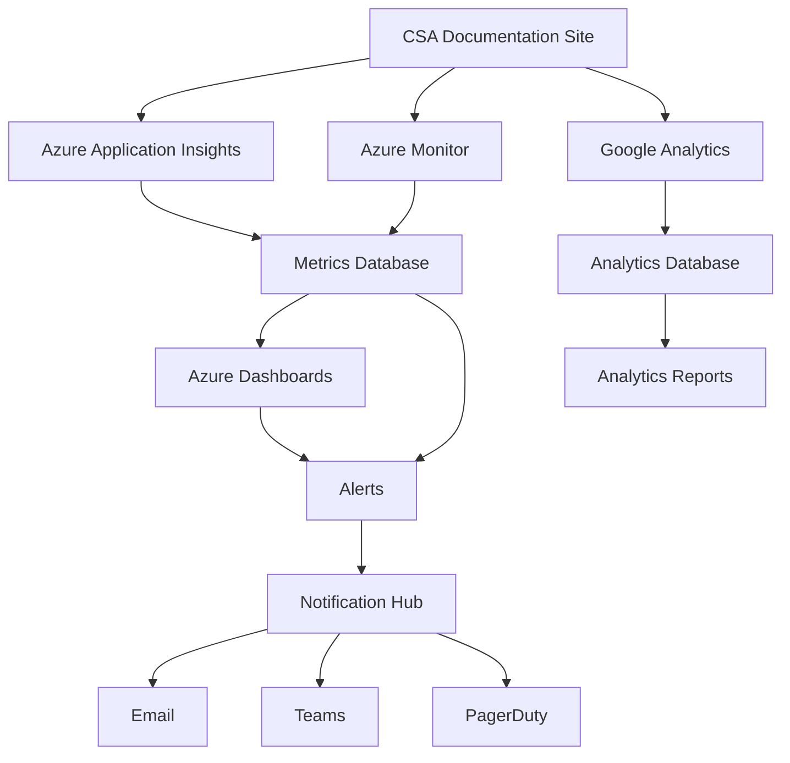

# Monitoring Guide

> **Home [Home](../../README.md)** | **Documentation** | **Guides [Guides](./README.md)**

---

## Overview

This guide provides comprehensive monitoring strategies for the CSA-in-a-Box documentation infrastructure, covering application performance, site health, user analytics, and operational metrics.

## Table of Contents

- [Monitoring Architecture](#monitoring-architecture)
- [Application Performance](#application-performance)
- [Site Health Monitoring](#site-health-monitoring)
- [User Analytics](#user-analytics)
- [Log Management](#log-management)
- [Alerting](#alerting)
- [Dashboards](#dashboards)
- [Troubleshooting](#troubleshooting)

---

## Monitoring Architecture

### Monitoring Stack



### Monitoring Components

| Component | Purpose | Data Retention | Cost |
|-----------|---------|----------------|------|
| **Application Insights** | Performance, errors, dependencies | 90 days | Standard tier |
| **Azure Monitor** | Infrastructure metrics | 30 days | Free tier |
| **Google Analytics** | User behavior, traffic | Unlimited | Free |
| **Log Analytics** | Centralized logging | 90 days | Pay-per-GB |

---

## Application Performance

### Performance Metrics

#### Key Performance Indicators

| Metric | Target | Warning | Critical | Action |
|--------|--------|---------|----------|--------|
| **Page Load Time** | < 2s | > 3s | > 5s | Optimize assets |
| **Time to First Byte** | < 500ms | > 1s | > 2s | Check server |
| **First Contentful Paint** | < 1.5s | > 2.5s | > 4s | Optimize CSS |
| **Largest Contentful Paint** | < 2.5s | > 3.5s | > 5s | Optimize images |
| **Cumulative Layout Shift** | < 0.1 | > 0.15 | > 0.25 | Fix layout |

### Application Insights Configuration

**applicationinsights.config:**

```xml
<?xml version="1.0" encoding="utf-8"?>
<ApplicationInsights xmlns="http://schemas.microsoft.com/ApplicationInsights/2013/Settings">
  <InstrumentationKey>YOUR_INSTRUMENTATION_KEY</InstrumentationKey>
  <TelemetryModules>
    <Add Type="Microsoft.ApplicationInsights.Web.RequestTrackingTelemetryModule"/>
    <Add Type="Microsoft.ApplicationInsights.Web.DependencyTrackingTelemetryModule"/>
    <Add Type="Microsoft.ApplicationInsights.Web.ExceptionTrackingTelemetryModule"/>
  </TelemetryModules>
  <TelemetryProcessors>
    <Add Type="Microsoft.ApplicationInsights.WindowsServer.TelemetryChannel.AdaptiveSamplingTelemetryProcessor">
      <MaxTelemetryItemsPerSecond>5</MaxTelemetryItemsPerSecond>
    </Add>
  </TelemetryProcessors>
</ApplicationInsights>
```

### Performance Queries

```kusto
// Average page load time by page
requests
| where timestamp > ago(24h)
| summarize
    AvgDuration = avg(duration),
    P95Duration = percentile(duration, 95),
    Count = count()
    by name
| order by AvgDuration desc

// Slowest pages in last hour
requests
| where timestamp > ago(1h)
| top 10 by duration desc
| project timestamp, name, duration, resultCode

// Failed requests
requests
| where timestamp > ago(24h)
| where success == false
| summarize Count = count() by resultCode, name
| order by Count desc
```

---

## Site Health Monitoring

### Health Endpoints

#### Health Check Configuration

```python
# health_check.py
from typing import Dict
import time

def check_site_health() -> Dict[str, any]:
    """Comprehensive health check for documentation site."""

    checks = {
        "status": "healthy",
        "timestamp": time.time(),
        "checks": {
            "database": check_database(),
            "storage": check_storage(),
            "cdn": check_cdn(),
            "search": check_search()
        }
    }

    # Overall status
    if any(c["status"] == "unhealthy" for c in checks["checks"].values()):
        checks["status"] = "unhealthy"
    elif any(c["status"] == "degraded" for c in checks["checks"].values()):
        checks["status"] = "degraded"

    return checks

def check_database() -> Dict:
    """Check database connectivity."""
    try:
        # Database check logic
        return {"status": "healthy", "latency_ms": 50}
    except Exception as e:
        return {"status": "unhealthy", "error": str(e)}

def check_storage() -> Dict:
    """Check Azure Storage availability."""
    try:
        # Storage check logic
        return {"status": "healthy", "latency_ms": 100}
    except Exception as e:
        return {"status": "unhealthy", "error": str(e)}

def check_cdn() -> Dict:
    """Check CDN endpoint."""
    try:
        # CDN check logic
        return {"status": "healthy", "cache_hit_rate": 0.85}
    except Exception as e:
        return {"status": "degraded", "error": str(e)}

def check_search() -> Dict:
    """Check search functionality."""
    try:
        # Search check logic
        return {"status": "healthy", "index_size": 1000}
    except Exception as e:
        return {"status": "degraded", "error": str(e)}
```

### Availability Monitoring

```bash
# Availability test script
#!/bin/bash

# Check site availability
RESPONSE=$(curl -s -o /dev/null -w "%{http_code}" https://csa-docs.azurewebsites.net)

if [ $RESPONSE -eq 200 ]; then
    echo "Site is available"
    exit 0
else
    echo "Site is down (HTTP $RESPONSE)"
    exit 1
fi
```

---

## User Analytics

### Google Analytics Configuration

**analytics.js:**

```javascript
// Google Analytics 4 Configuration
window.dataLayer = window.dataLayer || [];
function gtag(){dataLayer.push(arguments);}
gtag('js', new Date());

gtag('config', 'G-XXXXXXXXXX', {
  'anonymize_ip': true,
  'cookie_flags': 'SameSite=None;Secure'
});

// Custom event tracking
function trackDocumentView(pagePath, pageTitle) {
  gtag('event', 'page_view', {
    'page_path': pagePath,
    'page_title': pageTitle,
    'page_location': window.location.href
  });
}

// Search tracking
function trackSearch(searchTerm, resultsCount) {
  gtag('event', 'search', {
    'search_term': searchTerm,
    'results_count': resultsCount
  });
}

// Link click tracking
function trackExternalLink(url, linkText) {
  gtag('event', 'click', {
    'event_category': 'external_link',
    'event_label': url,
    'link_text': linkText
  });
}
```

### Analytics Dashboards

#### Key Metrics

| Metric | Description | Target |
|--------|-------------|--------|
| **Page Views** | Total page views | > 1000/day |
| **Unique Visitors** | Unique users | > 500/day |
| **Avg Session Duration** | Time on site | > 3 minutes |
| **Bounce Rate** | Single-page sessions | < 40% |
| **Pages per Session** | Pages viewed per visit | > 3 |
| **Search Usage** | Search feature usage | > 20% |

---

## Log Management

### Log Collection

**Azure Monitor Logs Query:**

```kusto
// All logs from last 24 hours
AzureDiagnostics
| where TimeGenerated > ago(24h)
| where ResourceType == "MICROSOFT.WEB/SITES"
| project TimeGenerated, Level, Message, _ResourceId

// Error logs
AzureDiagnostics
| where TimeGenerated > ago(24h)
| where Level == "Error"
| summarize Count = count() by Message
| order by Count desc

// Performance logs
AzureDiagnostics
| where TimeGenerated > ago(1h)
| where Category == "Performance"
| summarize avg(todouble(Duration)) by bin(TimeGenerated, 5m)
| render timechart
```

### Log Retention Policy

```bash
# Configure log retention
az monitor log-analytics workspace update \
  --resource-group rg-csa-docs-prod \
  --workspace-name law-csa-docs \
  --retention-time 90
```

---

## Alerting

### Alert Rules

#### Critical Alerts

**High Error Rate:**

```json
{
  "name": "HighErrorRate",
  "description": "Alert when error rate exceeds threshold",
  "severity": "Critical",
  "condition": {
    "allOf": [
      {
        "metric": "requests/failed",
        "operator": "GreaterThan",
        "threshold": 10,
        "timeAggregation": "Total",
        "windowSize": "PT5M"
      }
    ]
  },
  "actions": [
    {
      "actionGroupId": "/subscriptions/.../actionGroups/critical-alerts"
    }
  ]
}
```

**Site Down:**

```json
{
  "name": "SiteDown",
  "description": "Alert when site is unavailable",
  "severity": "Critical",
  "condition": {
    "allOf": [
      {
        "metric": "availability/availabilityResults/availabilityPercentage",
        "operator": "LessThan",
        "threshold": 99,
        "timeAggregation": "Average",
        "windowSize": "PT5M"
      }
    ]
  },
  "actions": [
    {
      "actionGroupId": "/subscriptions/.../actionGroups/critical-alerts"
    }
  ]
}
```

### Action Groups

```bash
# Create action group
az monitor action-group create \
  --name critical-alerts \
  --resource-group rg-csa-docs-prod \
  --short-name CritAlerts \
  --email-receiver name="Admin" email-address="admin@company.com" \
  --webhook-receiver name="Teams" service-uri="https://outlook.office.com/webhook/..."
```

---

## Dashboards

### Azure Dashboard Configuration

**dashboard.json:**

```json
{
  "lenses": {
    "0": {
      "order": 0,
      "parts": {
        "0": {
          "position": {
            "x": 0,
            "y": 0,
            "colSpan": 6,
            "rowSpan": 4
          },
          "metadata": {
            "type": "Extension/HubsExtension/PartType/MonitorChartPart",
            "settings": {
              "content": {
                "metrics": [
                  {
                    "resourceMetadata": {
                      "id": "/subscriptions/.../staticSites/csa-docs-prod"
                    },
                    "name": "requests/count",
                    "aggregationType": "Sum"
                  }
                ]
              }
            }
          }
        }
      }
    }
  }
}
```

### Custom Dashboard Widgets

- **Request Volume** - Total requests over time
- **Response Times** - P50, P95, P99 percentiles
- **Error Rate** - Failed requests percentage
- **Availability** - Uptime percentage
- **User Activity** - Active users and sessions
- **Search Usage** - Search queries and results

---

## Troubleshooting

### Common Issues

#### High Response Times

**Diagnosis:**

```kusto
// Identify slow pages
requests
| where timestamp > ago(1h)
| where duration > 2000
| summarize count() by name
| order by count_ desc
```

**Resolution:**

1. Check CDN cache hit rate
2. Optimize slow pages
3. Review database queries
4. Scale infrastructure if needed

#### Increased Error Rate

**Diagnosis:**

```kusto
// Analyze errors
exceptions
| where timestamp > ago(1h)
| summarize count() by type, outerMessage
| order by count_ desc
```

**Resolution:**

1. Review recent deployments
2. Check external dependencies
3. Analyze error patterns
4. Rollback if necessary

---

## Best Practices

### Monitoring Checklist

- [ ] Application Insights configured
- [ ] Health endpoints implemented
- [ ] Alerts configured for critical metrics
- [ ] Dashboards created and shared
- [ ] Log retention policies set
- [ ] Analytics tracking enabled
- [ ] On-call rotation established
- [ ] Runbooks documented

### Regular Reviews

- **Daily**: Check dashboard for anomalies
- **Weekly**: Review performance trends
- **Monthly**: Analyze user behavior patterns
- **Quarterly**: Optimize monitoring strategy

---

## Additional Resources

- [Azure Monitor Documentation](https://learn.microsoft.com/azure/azure-monitor/)
- [Application Insights](https://learn.microsoft.com/azure/azure-monitor/app/app-insights-overview)
- [Google Analytics](https://support.google.com/analytics)

---

**Last Updated:** December 9, 2025
**Version:** 1.0.0
**Maintainer:** CSA Operations Team
