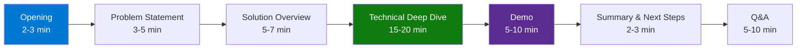
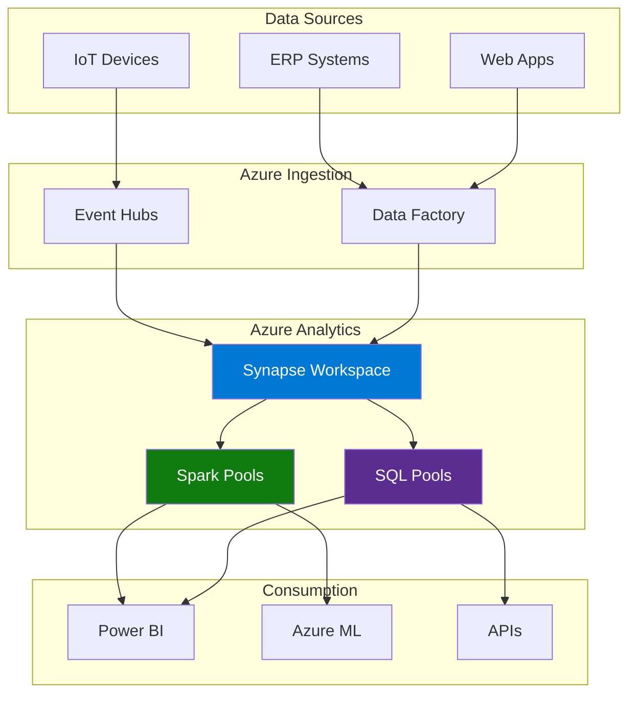

# 🎤 Presentation Skills Guide

> **🏠 [Home](../../README.md)** | **📚 Documentation** | **📖 [Guides](./README.md)** | **🎤 Presentation Skills**


---

## 📋 Overview

This guide provides comprehensive guidance for creating and delivering effective technical presentations about Cloud Scale Analytics solutions on Azure. Learn how to communicate complex analytics concepts clearly and engage your audience effectively.

## 📑 Table of Contents

- [Understanding Your Audience](#understanding-your-audience)
- [Presentation Structure](#presentation-structure)
- [Content Development](#content-development)
- [Visual Design](#visual-design)
- [Demo Preparation](#demo-preparation)
- [Delivery Techniques](#delivery-techniques)
- [Technical Presentation Tools](#technical-presentation-tools)
- [Handling Questions](#handling-questions)
- [Best Practices](#best-practices)
- [Troubleshooting](#troubleshooting)
- [Related Documentation](#related-documentation)

---

## 👥 Understanding Your Audience

### Audience Types

| Audience | Focus Areas | Technical Level | Key Messages |
|----------|-------------|-----------------|--------------|
| **Executives** | Business value, ROI, strategic alignment | Low | Cost savings, time to market, competitive advantage |
| **Technical Architects** | Architecture, scalability, integration | High | Design patterns, best practices, technical details |
| **Data Engineers** | Implementation, operations, tools | High | Hands-on guidance, code examples, troubleshooting |
| **Data Analysts** | Query patterns, reporting, visualization | Medium | SQL examples, Power BI integration, data access |
| **IT Operations** | Deployment, monitoring, security | Medium | DevOps, security, compliance, monitoring |

### Pre-Presentation Checklist

```markdown
- [ ] Who is the primary audience?
- [ ] What is their technical background?
- [ ] What are their pain points?
- [ ] What decisions do they need to make?
- [ ] What constraints do they have (budget, timeline, resources)?
- [ ] What prior knowledge can I assume?
- [ ] What outcomes do they expect?
```

### Tailoring Content

**For Executives:**
```markdown
✅ Do:
- Lead with business outcomes
- Use clear metrics and ROI
- Show competitive advantages
- Keep technical details minimal
- Focus on "what" and "why"

❌ Don't:
- Deep-dive into code
- Use technical jargon
- Show detailed architecture diagrams
- Focus on implementation details
```

**For Technical Audiences:**
```markdown
✅ Do:
- Show detailed architecture
- Include code examples
- Demonstrate best practices
- Discuss trade-offs
- Provide technical depth
- Share lessons learned

❌ Don't:
- Oversimplify concepts
- Skip technical details
- Use marketing language
- Avoid difficult questions
```

---

## 📊 Presentation Structure

### Standard Format (30-45 minutes)



### Opening (2-3 minutes)

```markdown
## Opening Template

1. **Introduction**
   - Your name and role
   - Brief background/credibility
   - Presentation purpose

2. **Agenda Overview**
   - What you'll cover
   - Time allocation
   - Q&A approach

3. **Engagement Hook**
   - Compelling statistic
   - Real-world problem
   - Audience question

### Example:
"Good morning! I'm [Name], a Solutions Architect specializing in Azure Analytics.

Today, I'll show you how one of our customers reduced their analytics costs by 60%
while improving query performance by 3x using Azure Synapse Analytics.

We'll cover:
- Current challenges in cloud analytics (5 min)
- Architecture overview (10 min)
- Live demo (10 min)
- Implementation roadmap (5 min)

Questions are welcome throughout, but I'll save detailed technical discussions for the end."
```

### Problem Statement (3-5 minutes)

**Structure:**

1. Current state pain points
2. Business impact
3. Why now?
4. What's at stake?

**Example Slide:**

```markdown
## The Analytics Challenge

### Current State
- 🐌 Queries taking 30+ minutes
- 💰 Monthly costs exceeding $50K
- 🔧 Manual data pipeline maintenance
- 📊 Limited real-time insights

### Business Impact
- ⏱️ Delayed decision making
- 💸 Budget overruns
- 😫 Analyst frustration
- 📉 Lost opportunities

### The Question
**How do we deliver faster analytics at lower cost?**
```

### Solution Overview (5-7 minutes)

```markdown
## CSA in-a-Box Solution

### Architecture Principles
1. **Serverless-First** - Pay only for what you use
2. **Delta Lake Foundation** - Unified data lake and warehouse
3. **Azure-Native** - Integrated security and monitoring

### Key Components
- Azure Synapse Analytics
- Delta Lake on Spark
- Serverless SQL Pools
- Private Link Security

### Value Proposition
✅ 60% cost reduction
✅ 3x query performance
✅ 80% less manual work
✅ Enterprise security
```

---

## 📝 Content Development

### Slide Design Principles

#### Less is More

**Bad Slide:**
```markdown
# Data Lake Architecture

Our data lake architecture leverages Azure Data Lake Storage Gen2 as the
foundational storage layer, implementing a medallion architecture pattern
with bronze, silver, and gold layers, utilizing Delta Lake format for ACID
transactions, schema evolution, and time travel capabilities, integrated
with Azure Synapse Analytics for unified analytics experiences, connecting
to various data sources through Azure Data Factory pipelines with incremental
loading patterns, implementing data quality checks...

[Text continues for entire slide...]
```

**Good Slide:**
```markdown
# Data Lake Architecture

## Three-Tier Medallion Pattern

🥉 **Bronze** - Raw data ingestion
🥈 **Silver** - Cleaned and conformed
🥇 **Gold** - Business-ready analytics

### Key Benefits
- ACID transactions
- Schema evolution
- Time travel queries
```

### Visual Hierarchy

```markdown
# Use Heading Levels Effectively

## Main Section (H2)
Primary concepts and major topics

### Subsection (H3)
Supporting details and examples

#### Fine Details (H4)
Specific technical points

**Bold** for emphasis
*Italic* for definitions
`Code` for technical terms
```

### Code Examples

**Guidelines:**

```python
# ✅ Good: Concise, commented, complete example
from azure.identity import DefaultAzureCredential
from azure.storage.blob import BlobServiceClient

# Authenticate using Managed Identity
credential = DefaultAzureCredential()
client = BlobServiceClient(
    account_url="https://mystorageaccount.blob.core.windows.net",
    credential=credential
)

# List containers
for container in client.list_containers():
    print(container.name)
```

```python
# ❌ Bad: Too long, uncommented, incomplete
def process_data_lake_files_with_complex_logic_and_error_handling_and_retry_mechanisms_that_spans_multiple_lines_and_makes_it_hard_to_fit_on_a_slide(storage_account_name, container_name, file_pattern, batch_size, max_retries, timeout_seconds, error_handling_strategy):
    # [100+ lines of code...]
    pass
```

### Data Visualization

**Choose the Right Chart:**

| Data Type | Best Chart | Example Use Case |
|-----------|-----------|------------------|
| **Trends over time** | Line chart | Query performance over weeks |
| **Comparisons** | Bar chart | Cost comparison: v2 vs v3 |
| **Proportions** | Pie/Donut | Resource utilization breakdown |
| **Relationships** | Scatter plot | Cost vs performance correlation |
| **Flow/Process** | Sankey/Flowchart | Data pipeline architecture |

---

## 🎨 Visual Design

### Azure-Themed Templates

**Color Palette:**

```css
/* Primary Colors */
--azure-blue: #0078D4;
--data-green: #107C10;
--analytics-purple: #5C2D91;

/* Background */
--white: #FFFFFF;
--light-gray: #F3F2F1;

/* Text */
--dark-gray: #605E5C;
--black: #000000;
```

### Slide Layouts

**Title Slide:**
```markdown
---
# Cloud Scale Analytics in-a-Box
## Modern Data Analytics on Microsoft Azure

**Presenter:** [Your Name]
**Date:** [Date]
**Contact:** [Email]


---
```

**Content Slide:**
```markdown
---
## Section Title

### Key Points
- Point 1 with icon 🎯
- Point 2 with icon ⚡
- Point 3 with icon 🔒


> **💡 Tip:** Keep slides visual and concise
---
```

**Architecture Diagram Slide:**


---

## 💻 Demo Preparation

### Demo Planning

**The 3-Rule Demo:**

1. **Show, Don't Tell** - Live demonstrations trump explanations
2. **Keep It Simple** - One clear scenario, executed flawlessly
3. **Have Backup** - Recorded video if live demo fails

### Demo Script Template

```markdown
## Demo: Real-Time Analytics Pipeline

### Setup (Before Presentation)
- [ ] Azure Synapse workspace running
- [ ] Sample data loaded
- [ ] SQL scripts prepared
- [ ] Power BI dashboard open
- [ ] Network connectivity verified
- [ ] Backup recording ready

### Demo Flow (8 minutes)

**Step 1: Ingest Data (2 min)**
"Let me show you how we ingest streaming data from Event Hubs..."

```bash
# Start streaming data generator
python simulate_events.py --rate 1000
```

**Step 2: Process with Spark (3 min)**
"Now we'll process this data using Delta Lake on Spark..."

```python
# Show Delta Lake transformation
df = spark.readStream \
    .format("eventhubs") \
    .load()

df.writeStream \
    .format("delta") \
    .outputMode("append") \
    .start("/mnt/delta/events")
```

**Step 3: Query with Serverless SQL (2 min)**
"Let's query this data immediately with Serverless SQL..."

```sql
-- Real-time analytics query
SELECT
    CAST(timestamp AS DATE) as date,
    event_type,
    COUNT(*) as event_count
FROM OPENROWSET(
    BULK '/mnt/delta/events',
    FORMAT = 'DELTA'
) AS events
GROUP BY CAST(timestamp AS DATE), event_type
ORDER BY date DESC;
```

**Step 4: Visualize in Power BI (1 min)**
"Finally, let's see this live in our Power BI dashboard..."

[Show Power BI dashboard refreshing]

### Talking Points
- Highlight ease of use
- Point out security features
- Mention cost optimization
- Show performance metrics

### Backup Plan
If live demo fails:
1. Show pre-recorded video
2. Walk through static screenshots
3. Focus on architecture discussion
```

### Demo Best Practices

```markdown
✅ Do:
- Test demo 3x before presentation
- Have backup recording ready
- Use realistic data volumes
- Show actual performance metrics
- Highlight error handling
- Keep browser tabs organized
- Use zoom/highlight tools

❌ Don't:
- Use "fake" or trivial data
- Skip error handling
- Rely on unstable services
- Show credentials/secrets
- Navigate too quickly
- Switch contexts too often
- Ignore audience cues
```

---

## 🎯 Delivery Techniques

### Body Language

```markdown
## Confident Presence

✅ Do:
- Stand tall, shoulders back
- Make eye contact (2-3 seconds per person)
- Use open hand gestures
- Move purposefully (not pacing)
- Face the audience (not the screen)
- Smile naturally

❌ Don't:
- Cross arms (defensive)
- Put hands in pockets
- Read from slides
- Turn your back to audience
- Fidget or sway
- Block the screen
```

### Voice Control

**Pacing and Pauses:**

```markdown
# Effective Speaking Pattern

Normal pace: 130-150 words per minute

🎤 "Azure Synapse Analytics... [pause 2 sec]
    provides unified analytics... [pause 1 sec]
    across data warehousing and big data systems."

Use pauses for:
- Emphasis (after key points)
- Transitions (between sections)
- Audience processing (after complex concepts)
- Questions (before answering)
```

**Volume and Tone:**

```markdown
## Voice Modulation

📢 **Louder** for:
- Key points
- Emphasis
- Call to action

🔉 **Softer** for:
- Confidential information
- Building anticipation
- Intimate examples

⚡ **Faster** for:
- Known information
- Less critical details
- Building energy

🐢 **Slower** for:
- Complex concepts
- Important points
- Technical details
```

### Handling Nervousness

```markdown
## Pre-Presentation Calm

### 30 Minutes Before:
- Review key points (not full script)
- Do physical warm-up (stretch, walk)
- Practice breathing exercises
- Visualize success
- Test all equipment

### 5 Minutes Before:
- Deep breathing (4-7-8 technique)
  - Inhale: 4 seconds
  - Hold: 7 seconds
  - Exhale: 8 seconds
- Positive self-talk
- Smile (triggers endorphins)

### During Presentation:
- Focus on friendly faces
- Treat it as conversation
- Remember: audience wants you to succeed
- If nervous, acknowledge it briefly then move on
```

---

## 🛠️ Technical Presentation Tools

### Recommended Software

| Tool | Purpose | Azure Integration |
|------|---------|-------------------|
| **PowerPoint** | Slides | Azure themes available |
| **Azure Portal** | Live demos | Native |
| **VS Code** | Code examples | Azure extensions |
| **Azure Data Studio** | SQL demos | Native |
| **Power BI Desktop** | Visualizations | Native |
| **OBS Studio** | Screen recording | Compatible |

### Live Demo Tools

```markdown
## Essential Tools

### Screen Annotation
- **ZoomIt** (Windows) - Zoom and annotate
- **Presentify** (Mac) - Highlight and annotate

### Terminal/PowerShell
- **Windows Terminal** - Modern terminal
- **Oh My Posh** - Beautiful prompts
- Font size: 18-20pt minimum

### Browser Setup
- Chrome/Edge with bookmark bar hidden
- Pre-open necessary tabs
- Clear history/cache
- Disable notifications
- Use incognito mode (clean environment)

### Code Editor
- VS Code with Azure extensions
- Font: Consolas, 16-18pt
- Theme: High contrast
- Hide unnecessary panels
```

### Recording Setup

```bash
# OBS Studio Settings for Technical Demos

## Video
- Resolution: 1920x1080 (1080p)
- FPS: 30
- Encoder: x264 or NVENC

## Audio
- Sample rate: 48 kHz
- Microphone: Noise suppression ON
- Desktop audio: Enabled

## Scenes
Scene 1: Full screen (demos)
Scene 2: Picture-in-picture (talking head + demo)
Scene 3: Slide presentation

## Hotkeys
- Start/Stop Recording: F9
- Start/Stop Streaming: F10
- Switch Scene: F1-F4
```

---

## ❓ Handling Questions

### Question Types and Responses

#### Technical Deep-Dive Questions

**Question:** "How does Delta Lake handle schema evolution compared to Parquet?"

**Good Response:**
```markdown
"Great question about Delta Lake's schema evolution capabilities.

[Pause - acknowledge]

Delta Lake handles schema evolution in three ways:

1. **Automatic Schema Merge** - New columns added automatically
2. **Schema Enforcement** - Invalid data rejected
3. **Schema Evolution** - Explicit column additions/modifications

Unlike plain Parquet, Delta maintains a transaction log that tracks
all schema changes with full history.

[Show code example if time permits]

Does that answer your question, or would you like me to elaborate on
any specific aspect?"
```

**Poor Response:**
```markdown
"Um, yeah, so Delta Lake is like, really good with schema stuff and
it's better than Parquet because it has this log thing... and you can
do merge schemas or whatever..."
```

#### Business Value Questions

**Question:** "What's the ROI timeline for implementing this solution?"

**Good Response:**
```markdown
"Excellent question about ROI. Based on our customer deployments:

**Immediate (Month 1):**
- 30-40% cost reduction from pay-per-use serverless

**Short-term (Months 2-6):**
- 50-60% productivity gains from unified analytics
- Reduced data engineering effort

**Long-term (6+ months):**
- Full 60% cost optimization
- 3x query performance improvements
- Faster time-to-insight

Typical breakeven: 3-4 months

[Show specific customer case study if available]

Would you like me to share a detailed ROI calculator?"
```

### Difficult Questions

```markdown
## Handling Challenging Questions

### "I Don't Know"
✅ "That's a great question. I don't have that specific information
    right now, but I'll find out and follow up with you after the
    presentation. Can I get your email?"

❌ "Uh... I'm not sure... maybe... possibly... I think..."

### Hostile Questions
✅ Stay calm and professional
   "I understand your concern. Let's discuss that specific scenario..."

❌ Get defensive or argumentative
   "That's not true!" or "You're wrong about that!"

### Off-Topic Questions
✅ "That's an interesting point, but it's beyond the scope of today's
    discussion. Can we address it offline?"

❌ Go down rabbit holes that derail presentation

### Multiple Questions at Once
✅ "You've raised several important points. Let me address them one by one:
    First, regarding [Question 1]..."

❌ Try to answer all at once and confuse everyone
```

---

## ✅ Best Practices

### Preparation Checklist

**1 Week Before:**
```markdown
- [ ] Outline finalized
- [ ] Slides drafted
- [ ] Demo environment set up
- [ ] Practice run-through (alone)
- [ ] Backup recording created
```

**1 Day Before:**
```markdown
- [ ] Slides finalized
- [ ] Demo tested 3x
- [ ] Questions anticipated
- [ ] Handouts prepared
- [ ] Equipment tested
- [ ] Practice with colleague
```

**Day Of:**
```markdown
- [ ] Arrive 30 min early
- [ ] Test all equipment
- [ ] Verify network connectivity
- [ ] Check room setup
- [ ] Review key points
- [ ] Breathing exercises
```

### Engagement Techniques

```markdown
## Keep Audience Engaged

### Interactive Elements
- Polls/surveys (raise hands)
- Quick demos with participation
- Real-time Q&A
- Analogies to familiar concepts
- Stories and case studies

### Energy Management
**High Energy:** Opening, demos, key points
**Medium Energy:** Explanations, examples
**Low Energy:** Transition, setup, administrative

### Transitions
"Now that we've covered [Topic A], let's move to [Topic B]..."
"This leads us naturally to..."
"Building on that concept..."
```

---

## 🔧 Troubleshooting

### Common Problems

#### Problem: Demo Failure

**Prevention:**
- Test 3x before presentation
- Have recorded backup
- Use stable environments
- Pre-load data

**Recovery:**
```markdown
"It looks like we're having a connectivity issue. While I resolve that,
let me show you the recorded version of this demo, and I'll come back
to the live environment if we have time."

[Switch to backup video]

Stay calm, acknowledge briefly, move on.
```

#### Problem: Difficult Audience

**Symptoms:**
- Distracted (phones, laptops)
- Hostile questions
- Disengaged body language

**Solutions:**
```markdown
### For Distraction:
- Use interactive elements
- Call on specific people
- Take short breaks
- Change pace/format

### For Hostility:
- Stay professional
- Acknowledge concerns
- Offer offline discussion
- Don't get defensive

### For Disengagement:
- Ask questions
- Show surprising data
- Tell stories
- Relate to their problems
```

#### Problem: Running Over Time

**Prevention:**
```markdown
- Allocate time per section
- Practice with timer
- Mark "must cover" vs "nice to have"
- Have abbreviated versions ready
```

**Recovery:**
```markdown
"I see we're running short on time. Let me cover the key points:

1. [Essential Point 1]
2. [Essential Point 2]
3. [Essential Point 3]

I'll make the full presentation available and stay after for
detailed discussions."
```

---

## 📚 Related Documentation

### Internal Resources

- [Brand Guidelines](./brand-guidelines.md) - Visual identity and branding
- [Markdown Style Guide](./MARKDOWN_STYLE_GUIDE.md) - Documentation formatting
- [Contributing Guide](./CONTRIBUTING_GUIDE.md) - Contribution guidelines

### External Resources

- [Microsoft Presenter Coach](https://support.microsoft.com/en-us/office/rehearse-your-slide-show-with-presenter-coach-cd7fc941-5c3b-498c-a225-83ef3f64f07b) - AI-powered presentation feedback
- [Azure Architecture Icons](https://learn.microsoft.com/azure/architecture/icons/) - Official Azure icons for diagrams
- [Speaking.io](https://speaking.io/) - Public speaking tips
- [TED Talks](https://www.ted.com/talks) - Presentation inspiration

### Presentation Templates

- [Azure-themed PowerPoint Templates](https://www.microsoft.com/en-us/download/details.aspx?id=41937)
- [CSA in-a-Box Templates](#) - Internal templates (coming soon)

---

## 💬 Feedback

How was this guide for your presentation preparation?

- ✅ **Found it helpful** - [Share feedback](https://github.com/fgarofalo56/csa-inabox-docs/discussions)
- ⚠️ **Need more guidance** - [Request topics](https://github.com/fgarofalo56/csa-inabox-docs/issues/new?title=[Presentation]+Request)
- 💡 **Have suggestions** - [Contribute ideas](https://github.com/fgarofalo56/csa-inabox-docs/issues/new?title=[Presentation]+Suggestion)

---

*Last Updated: December 2025*
*Version: 1.0.0*
*Maintainer: CSA in-a-Box Documentation Team*
