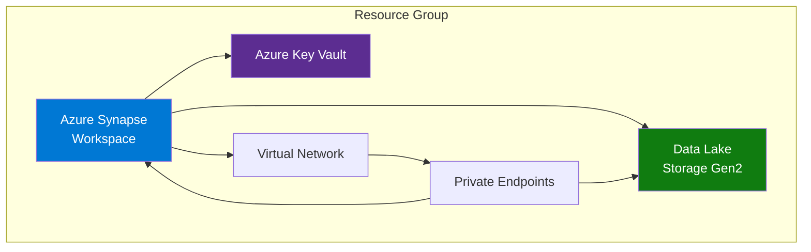

# 🔧 Technical Setup Guide

> **🏠 [Home](../../README.md)** | **📚 Documentation** | **📖 [Guides](./README.md)** | **🔧 Technical Setup**


---

## 📋 Overview

This comprehensive guide walks through the complete technical setup process for the Cloud Scale Analytics (CSA) in-a-Box solution on Microsoft Azure. Follow these steps to configure your development environment, Azure resources, and deployment pipeline.

## 📑 Table of Contents

- [Prerequisites](#prerequisites)
- [Development Environment Setup](#development-environment-setup)
- [Azure Account Configuration](#azure-account-configuration)
- [Azure Resource Deployment](#azure-resource-deployment)
- [Security Setup](#security-setup)
- [Data Lake Configuration](#data-lake-configuration)
- [Verification and Testing](#verification-and-testing)
- [Best Practices](#best-practices)
- [Troubleshooting](#troubleshooting)
- [Related Documentation](#related-documentation)

---

## ✅ Prerequisites

### Required Accounts

| Service | Requirement | Purpose |
|---------|-------------|---------|
| **Azure Subscription** | Owner or Contributor role | Resource deployment |
| **Azure AD** | Application Admin rights | Service principal creation |
| **GitHub** | Account with repo access | Source control |
| **VS Code** | Latest version | Development IDE |

### Required Software

```markdown
## Development Tools

### Core Requirements
- **Python 3.9+** - [Download](https://www.python.org/downloads/)
- **Azure CLI 2.50+** - [Install Guide](https://learn.microsoft.com/cli/azure/install-azure-cli)
- **Git 2.40+** - [Download](https://git-scm.com/downloads)
- **VS Code** - [Download](https://code.visualstudio.com/)

### Optional but Recommended
- **Docker Desktop** - For containerized development
- **Azure Data Studio** - SQL query tool
- **Power BI Desktop** - Data visualization
- **Postman** - API testing

### Python Packages
```bash
pip install azure-cli azure-identity azure-storage-blob azure-synapse-spark
```
```

### System Requirements

| Component | Minimum | Recommended |
|-----------|---------|-------------|
| **CPU** | 4 cores | 8 cores |
| **RAM** | 8 GB | 16 GB |
| **Storage** | 50 GB free | 100 GB SSD |
| **OS** | Windows 10/11, macOS 12+, Ubuntu 20.04+ | Latest stable |
| **Network** | Broadband | High-speed, low latency |

---

## 💻 Development Environment Setup

### Step 1: Install Python

**Windows:**
```powershell
# Download and install Python 3.9+
# Visit https://www.python.org/downloads/

# Verify installation
python --version

# Install pip packages
python -m pip install --upgrade pip
pip install virtualenv
```

**macOS:**
```bash
# Using Homebrew
brew install python@3.9

# Verify installation
python3 --version

# Install pip packages
pip3 install --upgrade pip virtualenv
```

**Linux (Ubuntu):**
```bash
# Install Python
sudo apt update
sudo apt install python3.9 python3.9-venv python3-pip

# Verify installation
python3 --version
```

### Step 2: Install Azure CLI

**Windows:**
```powershell
# Download and run the MSI installer
# Visit https://learn.microsoft.com/cli/azure/install-azure-cli-windows

# Or using winget
winget install Microsoft.AzureCLI

# Verify installation
az --version
```

**macOS:**
```bash
# Using Homebrew
brew update && brew install azure-cli

# Verify installation
az --version
```

**Linux:**
```bash
# Install using script
curl -sL https://aka.ms/InstallAzureCLIDeb | sudo bash

# Verify installation
az --version
```

### Step 3: Configure VS Code

**Install Required Extensions:**

```bash
# Install VS Code extensions via command line
code --install-extension ms-python.python
code --install-extension ms-azuretools.vscode-azuresynapse
code --install-extension ms-azuretools.vscode-azurestorage
code --install-extension ms-vscode.azurecli
code --install-extension ms-toolsai.jupyter
code --install-extension ms-python.vscode-pylance
```

**VS Code Settings (settings.json):**

```json
{
  "python.defaultInterpreterPath": "${workspaceFolder}/venv/bin/python",
  "python.linting.enabled": true,
  "python.linting.pylintEnabled": true,
  "python.formatting.provider": "black",
  "editor.formatOnSave": true,
  "editor.rulers": [88],
  "files.exclude": {
    "**/__pycache__": true,
    "**/*.pyc": true,
    "**/venv": true
  },
  "azure.cloud": "AzureCloud",
  "azureSynapse.showGettingStarted": false
}
```

### Step 4: Set Up Python Virtual Environment

```bash
# Navigate to project directory
cd csa-inabox-docs

# Create virtual environment
python -m venv venv

# Activate virtual environment
# Windows
venv\Scripts\activate

# macOS/Linux
source venv/bin/activate

# Install project dependencies
pip install -r requirements.txt

# Verify installation
pip list
```

### Step 5: Configure Git

```bash
# Set global Git config
git config --global user.name "Your Name"
git config --global user.email "your.email@company.com"

# Configure line endings
# Windows
git config --global core.autocrlf true

# macOS/Linux
git config --global core.autocrlf input

# Set default branch name
git config --global init.defaultBranch main

# Verify configuration
git config --list
```

---

## ☁️ Azure Account Configuration

### Step 1: Azure Login

```bash
# Login to Azure
az login

# If using multiple tenants
az login --tenant <tenant-id>

# Verify logged in account
az account show

# List available subscriptions
az account list --output table
```

### Step 2: Set Default Subscription

```bash
# Set default subscription
az account set --subscription "<subscription-name-or-id>"

# Verify default subscription
az account show --query "{Name:name, ID:id, TenantID:tenantId}" --output table
```

### Step 3: Register Resource Providers

```bash
# Register required Azure resource providers
az provider register --namespace Microsoft.Synapse
az provider register --namespace Microsoft.Storage
az provider register --namespace Microsoft.EventHub
az provider register --namespace Microsoft.StreamAnalytics
az provider register --namespace Microsoft.Databricks
az provider register --namespace Microsoft.Network

# Verify registration status
az provider show --namespace Microsoft.Synapse --query "registrationState"
```

### Step 4: Create Service Principal (Optional)

```bash
# Create service principal for automation
az ad sp create-for-rbac \
  --name "csa-inabox-sp" \
  --role Contributor \
  --scopes /subscriptions/<subscription-id>

# Output will include:
# {
#   "appId": "xxxx-xxxx-xxxx-xxxx",
#   "displayName": "csa-inabox-sp",
#   "password": "xxxx-xxxx-xxxx-xxxx",
#   "tenant": "xxxx-xxxx-xxxx-xxxx"
# }

# Store these securely in Azure Key Vault (see Security Setup section)
```

---

## 🚀 Azure Resource Deployment

### Architecture Overview



### Step 1: Create Resource Group

```bash
# Set variables
RESOURCE_GROUP="rg-csa-inabox-prod"
LOCATION="eastus"

# Create resource group
az group create \
  --name $RESOURCE_GROUP \
  --location $LOCATION

# Verify creation
az group show --name $RESOURCE_GROUP
```

### Step 2: Deploy Storage Account

```bash
# Set variables
STORAGE_ACCOUNT="csainaboxstorage$(date +%s)"  # Unique name
SKU="Standard_LRS"  # Or Premium_LRS for production

# Create storage account with Data Lake Gen2
az storage account create \
  --name $STORAGE_ACCOUNT \
  --resource-group $RESOURCE_GROUP \
  --location $LOCATION \
  --sku $SKU \
  --kind StorageV2 \
  --enable-hierarchical-namespace true \
  --enable-large-file-share \
  --default-action Deny \
  --allow-blob-public-access false

# Enable soft delete
az storage account blob-service-properties update \
  --account-name $STORAGE_ACCOUNT \
  --resource-group $RESOURCE_GROUP \
  --enable-delete-retention true \
  --delete-retention-days 7

# Create containers
az storage container create \
  --account-name $STORAGE_ACCOUNT \
  --name bronze \
  --auth-mode login

az storage container create \
  --account-name $STORAGE_ACCOUNT \
  --name silver \
  --auth-mode login

az storage container create \
  --account-name $STORAGE_ACCOUNT \
  --name gold \
  --auth-mode login
```

### Step 3: Deploy Azure Key Vault

```bash
# Set variables
KEY_VAULT_NAME="kv-csa-inabox-$(date +%s)"

# Create Key Vault
az keyvault create \
  --name $KEY_VAULT_NAME \
  --resource-group $RESOURCE_GROUP \
  --location $LOCATION \
  --enable-soft-delete true \
  --soft-delete-retention-days 90 \
  --enable-purge-protection true \
  --enable-rbac-authorization true

# Get your user object ID
USER_OBJECT_ID=$(az ad signed-in-user show --query id -o tsv)

# Grant yourself Key Vault Administrator role
az role assignment create \
  --role "Key Vault Administrator" \
  --assignee $USER_OBJECT_ID \
  --scope $(az keyvault show --name $KEY_VAULT_NAME --query id -o tsv)
```

### Step 4: Deploy Synapse Workspace

```bash
# Set variables
SYNAPSE_WORKSPACE="synapse-csa-inabox-$(date +%s)"
FILE_SYSTEM="synapsefilesystem"
SQL_ADMIN_USER="sqladmin"
SQL_ADMIN_PASSWORD="P@ssw0rd123!"  # Change this!

# Create file system for Synapse
az storage fs create \
  --account-name $STORAGE_ACCOUNT \
  --name $FILE_SYSTEM \
  --auth-mode login

# Create Synapse workspace
az synapse workspace create \
  --name $SYNAPSE_WORKSPACE \
  --resource-group $RESOURCE_GROUP \
  --location $LOCATION \
  --storage-account $STORAGE_ACCOUNT \
  --file-system $FILE_SYSTEM \
  --sql-admin-login-user $SQL_ADMIN_USER \
  --sql-admin-login-password $SQL_ADMIN_PASSWORD

# Wait for workspace creation
echo "Waiting for workspace creation..."
az synapse workspace wait --created --name $SYNAPSE_WORKSPACE --resource-group $RESOURCE_GROUP

# Enable managed identity
az synapse workspace update \
  --name $SYNAPSE_WORKSPACE \
  --resource-group $RESOURCE_GROUP \
  --assign-identity
```

### Step 5: Configure Firewall Rules

```bash
# Get your public IP
MY_IP=$(curl -s https://api.ipify.org)

# Add firewall rule for your IP
az synapse workspace firewall-rule create \
  --name "AllowMyIP" \
  --workspace-name $SYNAPSE_WORKSPACE \
  --resource-group $RESOURCE_GROUP \
  --start-ip-address $MY_IP \
  --end-ip-address $MY_IP

# Allow Azure services
az synapse workspace firewall-rule create \
  --name "AllowAllWindowsAzureIps" \
  --workspace-name $SYNAPSE_WORKSPACE \
  --resource-group $RESOURCE_GROUP \
  --start-ip-address 0.0.0.0 \
  --end-ip-address 0.0.0.0
```

### Step 6: Create Spark Pool

```bash
# Set variables
SPARK_POOL_NAME="sparkpool01"
NODE_SIZE="Small"  # Small, Medium, Large
MIN_NODES=3
MAX_NODES=10

# Create Spark pool
az synapse spark pool create \
  --name $SPARK_POOL_NAME \
  --workspace-name $SYNAPSE_WORKSPACE \
  --resource-group $RESOURCE_GROUP \
  --spark-version 3.4 \
  --node-count $MIN_NODES \
  --node-size $NODE_SIZE \
  --enable-auto-scale true \
  --min-node-count $MIN_NODES \
  --max-node-count $MAX_NODES \
  --enable-auto-pause true \
  --delay 15

# Wait for creation
az synapse spark pool wait --created \
  --name $SPARK_POOL_NAME \
  --workspace-name $SYNAPSE_WORKSPACE \
  --resource-group $RESOURCE_GROUP
```

---

## 🔒 Security Setup

### Step 1: Configure Managed Identity

```bash
# Get Synapse workspace managed identity
SYNAPSE_IDENTITY=$(az synapse workspace show \
  --name $SYNAPSE_WORKSPACE \
  --resource-group $RESOURCE_GROUP \
  --query "identity.principalId" -o tsv)

echo "Synapse Managed Identity: $SYNAPSE_IDENTITY"

# Grant Storage Blob Data Contributor role
az role assignment create \
  --role "Storage Blob Data Contributor" \
  --assignee $SYNAPSE_IDENTITY \
  --scope $(az storage account show --name $STORAGE_ACCOUNT --query id -o tsv)

# Grant Key Vault Secrets User role
az role assignment create \
  --role "Key Vault Secrets User" \
  --assignee $SYNAPSE_IDENTITY \
  --scope $(az keyvault show --name $KEY_VAULT_NAME --query id -o tsv)
```

### Step 2: Store Secrets in Key Vault

```bash
# Store connection strings
STORAGE_CONNECTION_STRING=$(az storage account show-connection-string \
  --name $STORAGE_ACCOUNT \
  --resource-group $RESOURCE_GROUP \
  --query connectionString -o tsv)

az keyvault secret set \
  --vault-name $KEY_VAULT_NAME \
  --name "StorageAccountConnectionString" \
  --value "$STORAGE_CONNECTION_STRING"

# Store SQL admin password
az keyvault secret set \
  --vault-name $KEY_VAULT_NAME \
  --name "SynapseSqlAdminPassword" \
  --value "$SQL_ADMIN_PASSWORD"
```

### Step 3: Configure Network Security

```bash
# Create network security group
NSG_NAME="nsg-csa-inabox"

az network nsg create \
  --name $NSG_NAME \
  --resource-group $RESOURCE_GROUP \
  --location $LOCATION

# Add security rules
# Allow HTTPS from your IP
az network nsg rule create \
  --name "AllowHTTPSFromMyIP" \
  --nsg-name $NSG_NAME \
  --resource-group $RESOURCE_GROUP \
  --priority 100 \
  --source-address-prefixes $MY_IP \
  --source-port-ranges '*' \
  --destination-address-prefixes '*' \
  --destination-port-ranges 443 \
  --access Allow \
  --protocol Tcp

# Deny all other inbound traffic
az network nsg rule create \
  --name "DenyAllInbound" \
  --nsg-name $NSG_NAME \
  --resource-group $RESOURCE_GROUP \
  --priority 4096 \
  --source-address-prefixes '*' \
  --source-port-ranges '*' \
  --destination-address-prefixes '*' \
  --destination-port-ranges '*' \
  --access Deny \
  --protocol '*'
```

---

## 📊 Data Lake Configuration

### Medallion Architecture Setup

```python
# setup_data_lake.py
from azure.identity import DefaultAzureCredential
from azure.storage.filedatalake import DataLakeServiceClient

def setup_medallion_architecture(storage_account: str):
    """Set up bronze, silver, gold layers."""

    credential = DefaultAzureCredential()
    service_client = DataLakeServiceClient(
        account_url=f"https://{storage_account}.dfs.core.windows.net",
        credential=credential
    )

    # Define folder structure
    layers = {
        'bronze': ['raw', 'landing', 'archive'],
        'silver': ['cleansed', 'conformed', 'enriched'],
        'gold': ['curated', 'reporting', 'ml']
    }

    for container, folders in layers.items():
        file_system = service_client.get_file_system_client(container)

        for folder in folders:
            directory_client = file_system.get_directory_client(folder)
            try:
                directory_client.create_directory()
                print(f"✅ Created: {container}/{folder}")
            except Exception as e:
                print(f"⚠️ {container}/{folder} may already exist: {e}")

    print("✅ Medallion architecture setup complete!")

if __name__ == "__main__":
    setup_medallion_architecture("your-storage-account")
```

---

## 🧪 Verification and Testing

### Connectivity Tests

```bash
# Test Azure CLI connectivity
az account show

# Test storage account access
az storage blob list \
  --account-name $STORAGE_ACCOUNT \
  --container-name bronze \
  --auth-mode login

# Test Synapse workspace access
az synapse workspace show \
  --name $SYNAPSE_WORKSPACE \
  --resource-group $RESOURCE_GROUP

# Test Key Vault access
az keyvault secret list --vault-name $KEY_VAULT_NAME
```

### Python Connectivity Test

```python
# test_connectivity.py
from azure.identity import DefaultAzureCredential
from azure.storage.blob import BlobServiceClient
from azure.keyvault.secrets import SecretClient

def test_azure_connectivity():
    """Test connectivity to Azure services."""

    credential = DefaultAzureCredential()

    # Test Storage Account
    print("Testing Storage Account...")
    storage_client = BlobServiceClient(
        account_url="https://YOUR_STORAGE.blob.core.windows.net",
        credential=credential
    )
    containers = list(storage_client.list_containers())
    print(f"✅ Found {len(containers)} containers")

    # Test Key Vault
    print("\nTesting Key Vault...")
    kv_client = SecretClient(
        vault_url="https://YOUR_KEYVAULT.vault.azure.net",
        credential=credential
    )
    secrets = list(kv_client.list_properties_of_secrets())
    print(f"✅ Found {len(secrets)} secrets")

    print("\n✅ All connectivity tests passed!")

if __name__ == "__main__":
    test_azure_connectivity()
```

---

## ✅ Best Practices

### Resource Naming Conventions

```markdown
## Azure Naming Standards

Format: `{resource-type}-{workload}-{environment}-{region}-{instance}`

Examples:
- Resource Group: `rg-csa-inabox-prod-eastus-001`
- Storage Account: `stcsainaboxprod001`  # No hyphens, lowercase
- Synapse Workspace: `synapse-csa-inabox-prod-001`
- Key Vault: `kv-csa-inabox-prod-001`
- Spark Pool: `sparkpool-csa-prod-001`
```

### Cost Optimization

```bash
# Enable auto-pause for Spark pools
# Set appropriate retention periods
# Use lifecycle management for storage
# Implement resource tagging

# Add cost tags
az resource tag \
  --resource-group $RESOURCE_GROUP \
  --name $SYNAPSE_WORKSPACE \
  --resource-type "Microsoft.Synapse/workspaces" \
  --tags Environment=Production CostCenter=Analytics Project=CSA-InABox
```

---

## 🔧 Troubleshooting

### Common Issues

#### Issue: Azure CLI Login Fails

```bash
# Clear cached credentials
az account clear
az login --use-device-code

# Or use tenant-specific login
az login --tenant <tenant-id>
```

#### Issue: Storage Account Access Denied

```bash
# Verify role assignments
az role assignment list \
  --assignee <user-or-identity-id> \
  --scope <storage-account-id>

# Add required role
az role assignment create \
  --role "Storage Blob Data Contributor" \
  --assignee <user-or-identity-id> \
  --scope <storage-account-id>
```

#### Issue: Synapse Workspace Connection Timeout

```bash
# Check firewall rules
az synapse workspace firewall-rule list \
  --workspace-name $SYNAPSE_WORKSPACE \
  --resource-group $RESOURCE_GROUP

# Add your current IP
az synapse workspace firewall-rule create \
  --name "AllowMyCurrentIP" \
  --workspace-name $SYNAPSE_WORKSPACE \
  --resource-group $RESOURCE_GROUP \
  --start-ip-address $(curl -s https://api.ipify.org) \
  --end-ip-address $(curl -s https://api.ipify.org)
```

---

## 📚 Related Documentation

### Internal Guides

- [Development Guide](./DEVELOPMENT_GUIDE.md) - Development workflow
- [Deployment Guide](./deployment-guide.md) - Production deployment
- [Security Best Practices](../devops/security-best-practices.md) - Security guidelines
- [Monitoring Guide](./monitoring.md) - Monitoring setup

### Azure Documentation

- [Azure Synapse Analytics](https://learn.microsoft.com/azure/synapse-analytics/)
- [Data Lake Storage Gen2](https://learn.microsoft.com/azure/storage/blobs/data-lake-storage-introduction)
- [Azure CLI Reference](https://learn.microsoft.com/cli/azure/)

---

*Last Updated: December 2025*
*Version: 1.0.0*
*Maintainer: CSA in-a-Box Team*
