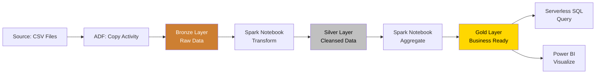

# 🚀 First Pipeline Tutorial

> **🏠 [Home](../../../README.md)** | **📚 Documentation** | **📖 [Guides](../README.md)** | **🎓 [Tutorials](./README.md)** | **🚀 First Pipeline**


---

## 📋 Overview

Build your first end-to-end data pipeline on Azure Synapse Analytics. This tutorial guides you through creating a complete ETL pipeline from data ingestion to visualization.

## 🎯 Learning Objectives

By the end of this tutorial, you will:

- ✅ Create an Azure Data Factory pipeline
- ✅ Ingest data from multiple sources
- ✅ Transform data using Spark notebooks
- ✅ Load data into Delta Lake
- ✅ Query data with Serverless SQL
- ✅ Visualize results in Power BI

## 📑 Table of Contents

- [Prerequisites](#prerequisites)
- [Pipeline Architecture](#pipeline-architecture)
- [Step 1: Create Source Data](#step-1-create-source-data)
- [Step 2: Build Ingestion Pipeline](#step-2-build-ingestion-pipeline)
- [Step 3: Create Transformation Notebook](#step-3-create-transformation-notebook)
- [Step 4: Configure Pipeline Orchestration](#step-4-configure-pipeline-orchestration)
- [Step 5: Query with Serverless SQL](#step-5-query-with-serverless-sql)
- [Step 6: Visualize in Power BI](#step-6-visualize-in-power-bi)
- [Best Practices](#best-practices)
- [Troubleshooting](#troubleshooting)
- [Next Steps](#next-steps)

---

## ✅ Prerequisites

### Required Resources

- [ ] Azure Synapse Analytics workspace
- [ ] Azure Data Lake Storage Gen2
- [ ] Spark pool (Small size minimum)
- [ ] Power BI Desktop (optional, for Step 6)

### Required Permissions

- [ ] Synapse Administrator role
- [ ] Storage Blob Data Contributor
- [ ] Synapse SQL Administrator

### Estimated Time

⏱️ **45 minutes**

---

## 🏗️ Pipeline Architecture

Our pipeline follows the Medallion architecture:



**Pipeline Flow:**
1. **Ingest** - Copy CSV files to Bronze layer
2. **Cleanse** - Transform and validate data to Silver layer
3. **Aggregate** - Create business metrics in Gold layer
4. **Serve** - Query and visualize data

---

## 📝 Step 1: Create Source Data

### Generate Sample Sales Data

```python
# Run this in a Synapse notebook

from pyspark.sql.functions import *
from datetime import datetime, timedelta
import random

# Generate sample sales data
num_records = 10000
start_date = datetime(2024, 1, 1)

data = []
products = ["Product A", "Product B", "Product C", "Product D"]
regions = ["North", "South", "East", "West"]
sales_reps = ["Alice", "Bob", "Charlie", "Diana", "Eve"]

for i in range(num_records):
    record = {
        "order_id": i + 1,
        "order_date": (start_date + timedelta(days=random.randint(0, 364))).strftime("%Y-%m-%d"),
        "product": random.choice(products),
        "quantity": random.randint(1, 100),
        "unit_price": round(random.uniform(10, 500), 2),
        "region": random.choice(regions),
        "sales_rep": random.choice(sales_reps)
    }
    record["total_amount"] = round(record["quantity"] * record["unit_price"], 2)
    data.append(record)

# Create DataFrame
df = spark.createDataFrame(data)

# Save to landing zone
storage_account = "your_storage_account"  # Replace
landing_path = f"abfss://bronze@{storage_account}.dfs.core.windows.net/landing/sales/"

df.coalesce(1).write \
    .mode("overwrite") \
    .option("header", "true") \
    .csv(landing_path)

print(f"✅ Created {num_records} sales records")
df.show(10)
```

---

## 📥 Step 2: Build Ingestion Pipeline

### Create Linked Services

1. **Navigate to Synapse Studio**
   - Go to **Manage** → **Linked services**

2. **Create Storage Linked Service**
   - Click **+ New**
   - Select **Azure Data Lake Storage Gen2**
   - Name: `ls_adls_bronze`
   - Authentication: **Managed Identity**
   - Test connection
   - Click **Create**

### Create Datasets

1. **Source Dataset (Landing)**
   - Go to **Data** → **Linked** → **+ Dataset**
   - Select **Azure Data Lake Storage Gen2**
   - Format: **DelimitedText**
   - Name: `ds_landing_sales_csv`
   - Linked service: `ls_adls_bronze`
   - File path: `bronze/landing/sales/*.csv`
   - First row as header: **Yes**

2. **Sink Dataset (Bronze)**
   - Create new dataset
   - Format: **Delta**
   - Name: `ds_bronze_sales_delta`
   - File path: `bronze/raw/sales/`

### Create Copy Pipeline

1. **Create Pipeline**
   - Go to **Integrate** → **+ Pipeline**
   - Name: `pl_ingest_sales_data`

2. **Add Copy Activity**
   - Drag **Copy data** activity to canvas
   - Name: `Copy Sales to Bronze`

3. **Configure Source**
   - Source dataset: `ds_landing_sales_csv`
   - Wildcard paths: `*.csv`

4. **Configure Sink**
   - Sink dataset: `ds_bronze_sales_delta`
   - Copy method: **Merge**
   - Pre-copy script: None

5. **Add Metadata Columns**
   - In Source settings, click **+ New**
   - Add columns:
     ```
     Name: ingestion_timestamp
     Value: @{utcnow()}

     Name: source_file
     Value: @{item().name}
     ```

6. **Validate and Debug**
   - Click **Validate**
   - Click **Debug** to test
   - Monitor execution

---

## 🔄 Step 3: Create Transformation Notebook

### Bronze to Silver Transformation

Create a new notebook: `nb_bronze_to_silver`

```python
# Cell 1: Initialize
from pyspark.sql.functions import *
from pyspark.sql.types import *
from delta.tables import DeltaTable

storage_account = "your_storage_account"
bronze_path = f"abfss://bronze@{storage_account}.dfs.core.windows.net/raw/sales"
silver_path = f"abfss://silver@{storage_account}.dfs.core.windows.net/cleansed/sales"

print("✅ Initialized transformation")
```

```python
# Cell 2: Read Bronze data
bronze_df = spark.read.format("delta").load(bronze_path)

print(f"📊 Bronze record count: {bronze_df.count()}")
bronze_df.printSchema()
bronze_df.show(5)
```

```python
# Cell 3: Data Quality Checks
# Check for nulls
null_checks = bronze_df.select([
    count(when(col(c).isNull(), c)).alias(c)
    for c in bronze_df.columns
])
print("Null counts per column:")
null_checks.show()

# Check for duplicates
duplicate_count = bronze_df.count() - bronze_df.dropDuplicates(["order_id"]).count()
print(f"Duplicate records: {duplicate_count}")

# Validate data ranges
invalid_records = bronze_df.filter(
    (col("quantity") <= 0) |
    (col("unit_price") <= 0) |
    (col("total_amount") <= 0)
)
print(f"Invalid records: {invalid_records.count()}")
```

```python
# Cell 4: Cleanse and Transform
silver_df = bronze_df \
    .dropDuplicates(["order_id"]) \
    .filter(col("quantity") > 0) \
    .filter(col("unit_price") > 0) \
    .withColumn("order_date", to_date(col("order_date"))) \
    .withColumn("year", year(col("order_date"))) \
    .withColumn("month", month(col("order_date"))) \
    .withColumn("quarter", quarter(col("order_date"))) \
    .withColumn("processed_timestamp", current_timestamp()) \
    .select(
        "order_id",
        "order_date",
        "year",
        "month",
        "quarter",
        "product",
        "quantity",
        "unit_price",
        "total_amount",
        "region",
        "sales_rep",
        "processed_timestamp"
    )

print("✅ Data cleansed and transformed")
silver_df.show(5)
```

```python
# Cell 5: Write to Silver
silver_df.write \
    .format("delta") \
    .mode("overwrite") \
    .partitionBy("year", "month") \
    .option("overwriteSchema", "true") \
    .save(silver_path)

print(f"✅ Written {silver_df.count()} records to Silver")
```

### Silver to Gold Transformation

Create a new notebook: `nb_silver_to_gold`

```python
# Cell 1: Read Silver data
silver_df = spark.read.format("delta").load(silver_path)
print(f"📊 Silver record count: {silver_df.count()}")
```

```python
# Cell 2: Aggregate by Product and Region
gold_product_region = silver_df.groupBy("product", "region", "year", "month") \
    .agg(
        count("order_id").alias("order_count"),
        sum("quantity").alias("total_quantity"),
        sum("total_amount").alias("total_revenue"),
        avg("unit_price").alias("avg_unit_price"),
        avg("quantity").alias("avg_order_quantity")
    ) \
    .withColumn("calculated_timestamp", current_timestamp())

print("✅ Product-Region aggregation complete")
gold_product_region.show(10)
```

```python
# Cell 3: Aggregate by Sales Rep
gold_sales_rep = silver_df.groupBy("sales_rep", "year", "month") \
    .agg(
        count("order_id").alias("order_count"),
        sum("total_amount").alias("total_sales"),
        avg("total_amount").alias("avg_order_value"),
        countDistinct("product").alias("unique_products")
    ) \
    .withColumn("calculated_timestamp", current_timestamp())

print("✅ Sales Rep aggregation complete")
gold_sales_rep.show(10)
```

```python
# Cell 4: Write to Gold
gold_path_product = f"abfss://gold@{storage_account}.dfs.core.windows.net/curated/sales_by_product_region"
gold_path_rep = f"abfss://gold@{storage_account}.dfs.core.windows.net/curated/sales_by_rep"

gold_product_region.write \
    .format("delta") \
    .mode("overwrite") \
    .partitionBy("year", "month") \
    .save(gold_path_product)

gold_sales_rep.write \
    .format("delta") \
    .mode("overwrite") \
    .partitionBy("year", "month") \
    .save(gold_path_rep)

print("✅ Gold tables created")
```

---

## 🎯 Step 4: Configure Pipeline Orchestration

### Create Master Pipeline

1. **Create New Pipeline**
   - Name: `pl_master_etl_pipeline`

2. **Add Notebook Activities**
   - Drag 3 **Notebook** activities to canvas
   - Configure each:

   **Activity 1: Bronze to Silver**
   - Name: `Transform Bronze to Silver`
   - Notebook: `nb_bronze_to_silver`
   - Spark pool: Select your pool

   **Activity 2: Silver to Gold**
   - Name: `Transform Silver to Gold`
   - Notebook: `nb_silver_to_gold`
   - Spark pool: Select your pool

3. **Link Activities**
   - Connect activities: Ingest → Bronze to Silver → Silver to Gold

4. **Add Parameters**
   - In Pipeline, add parameters:
     ```
     execution_date (String): @{utcnow()}
     storage_account (String): your_storage_account
     ```

5. **Add Logging**
   - Add **Set Variable** activities to log status

6. **Test Pipeline**
   - Click **Debug**
   - Monitor in **Monitor** → **Pipeline runs**

---

## 🔍 Step 5: Query with Serverless SQL

### Create SQL Views

```sql
-- Run in Synapse SQL script

-- View 1: Sales by Product and Region
CREATE OR ALTER VIEW gold.sales_by_product_region
AS
SELECT
    product,
    region,
    year,
    month,
    order_count,
    total_quantity,
    total_revenue,
    avg_unit_price,
    avg_order_quantity
FROM OPENROWSET(
    BULK 'https://your_storage_account.dfs.core.windows.net/gold/curated/sales_by_product_region/',
    FORMAT = 'DELTA'
) AS gold_data;

-- View 2: Sales by Rep
CREATE OR ALTER VIEW gold.sales_by_rep
AS
SELECT
    sales_rep,
    year,
    month,
    order_count,
    total_sales,
    avg_order_value,
    unique_products
FROM OPENROWSET(
    BULK 'https://your_storage_account.dfs.core.windows.net/gold/curated/sales_by_rep/',
    FORMAT = 'DELTA'
) AS gold_data;
```

### Run Analytics Queries

```sql
-- Top performing products by revenue
SELECT TOP 10
    product,
    SUM(total_revenue) as total_revenue,
    SUM(total_quantity) as total_quantity
FROM gold.sales_by_product_region
GROUP BY product
ORDER BY total_revenue DESC;

-- Monthly sales trend
SELECT
    CONCAT(year, '-', FORMAT(month, '00')) as month,
    SUM(total_revenue) as revenue
FROM gold.sales_by_product_region
GROUP BY year, month
ORDER BY year, month;

-- Top sales reps
SELECT TOP 5
    sales_rep,
    SUM(total_sales) as total_sales,
    AVG(avg_order_value) as avg_order_value
FROM gold.sales_by_rep
GROUP BY sales_rep
ORDER BY total_sales DESC;
```

---

## 📊 Step 6: Visualize in Power BI

### Connect Power BI

1. **Open Power BI Desktop**

2. **Get Data from Synapse**
   - Click **Get Data** → **Azure** → **Azure Synapse Analytics (SQL DW)**
   - Server: `your-workspace-ondemand.sql.azuresynapse.net`
   - Database: `default`
   - Data Connectivity: **DirectQuery**

3. **Select Tables**
   - Choose `gold.sales_by_product_region`
   - Choose `gold.sales_by_rep`
   - Click **Load**

### Create Dashboard

1. **Create Visualizations**

   **Chart 1: Revenue by Product**
   - Visualization: **Bar Chart**
   - Axis: `product`
   - Values: `total_revenue`

   **Chart 2: Monthly Trend**
   - Visualization: **Line Chart**
   - Axis: `year`, `month`
   - Values: `total_revenue`

   **Chart 3: Sales by Region**
   - Visualization: **Map**
   - Location: `region`
   - Values: `total_revenue`

   **Chart 4: Top Sales Reps**
   - Visualization: **Table**
   - Columns: `sales_rep`, `total_sales`, `avg_order_value`

2. **Add Filters**
   - Add slicers for `year`, `region`, `product`

3. **Apply Theme**
   - View → Themes → Select Azure theme

4. **Save Report**
   - File → Save As → `Sales Dashboard`

---

## ✅ Best Practices

### Pipeline Design

```markdown
## Best Practices

✅ **Do:**
- Use parameters for reusability
- Implement error handling
- Add logging activities
- Test with small datasets first
- Use pipeline templates

❌ **Don't:**
- Hardcode values
- Skip validation steps
- Ignore error outputs
- Run without testing
```

### Performance

```python
# Optimize Spark operations
df.coalesce(10) \  # Reduce partitions before write
    .write.format("delta") \
    .option("optimizeWrite", "true") \
    .save(path)

# Use partition pruning
df.filter(col("year") == 2024) \  # Partition column
    .filter(col("region") == "North")
```

---

## 🔧 Troubleshooting

### Issue: Pipeline Fails

**Check:**
- Pipeline run details in Monitor tab
- Notebook execution logs
- Storage account permissions
- Spark pool status

### Issue: No Data in Power BI

**Solution:**
```sql
-- Verify data exists
SELECT COUNT(*) FROM gold.sales_by_product_region;

-- Check view definition
SELECT * FROM gold.sales_by_product_region LIMIT 10;
```

### Issue: Slow Performance

**Solution:**
- Increase Spark pool size
- Optimize partition strategy
- Use Z-Order indexing on Gold tables

---

## 🎓 Next Steps

Congratulations! You've built your first complete pipeline. Continue learning:

1. ✅ **[Spark Basics Tutorial](./spark-basics.md)** - Deep dive into PySpark
2. ✅ **[Data Loading Tutorial](./data-loading.md)** - Advanced loading patterns
3. ✅ **[Delta Lake Guide](../../code-examples/delta-lake/README.md)** - Delta Lake features

---

## 💬 Feedback

How was this tutorial?

- ✅ **Completed successfully** - [Share your pipeline](https://github.com/fgarofalo56/csa-inabox-docs/discussions)
- ⚠️ **Had issues** - [Get help](https://github.com/fgarofalo56/csa-inabox-docs/issues/new?title=[Tutorial]+First-Pipeline)
- 💡 **Improvements** - [Suggest changes](https://github.com/fgarofalo56/csa-inabox-docs/issues/new?title=[Tutorial]+Suggestion)

---

*Last Updated: December 2025*
*Version: 1.0.0*
*Maintainer: CSA in-a-Box Team*
