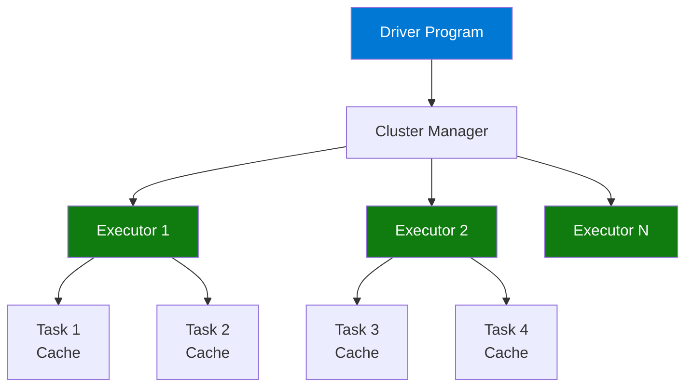

# ⚡ Spark Basics Tutorial

> **🏠 [Home](../../../README.md)** | **📚 Documentation** | **📖 [Guides](../README.md)** | **🎓 [Tutorials](./README.md)** | **⚡ Spark Basics**


---

## 📋 Overview

Master the fundamentals of Apache Spark and PySpark on Azure Synapse Analytics. This hands-on tutorial covers DataFrame operations, transformations, actions, and optimization techniques.

## 🎯 Learning Objectives

By the end of this tutorial, you will:

- ✅ Understand Spark architecture and execution model
- ✅ Create and manipulate DataFrames
- ✅ Perform common transformations
- ✅ Execute actions and collect results
- ✅ Optimize Spark jobs
- ✅ Work with different data formats

## 📑 Table of Contents

- [Prerequisites](#prerequisites)
- [Spark Architecture](#spark-architecture)
- [Step 1: Spark Session and Context](#step-1-spark-session-and-context)
- [Step 2: Creating DataFrames](#step-2-creating-dataframes)
- [Step 3: DataFrame Transformations](#step-3-dataframe-transformations)
- [Step 4: DataFrame Actions](#step-4-dataframe-actions)
- [Step 5: Working with SQL](#step-5-working-with-sql)
- [Step 6: Aggregations and GroupBy](#step-6-aggregations-and-groupby)
- [Step 7: Joins](#step-7-joins)
- [Step 8: Performance Optimization](#step-8-performance-optimization)
- [Best Practices](#best-practices)
- [Troubleshooting](#troubleshooting)
- [Next Steps](#next-steps)

---

## ✅ Prerequisites

### Required Resources

- [ ] Azure Synapse Analytics workspace
- [ ] Spark pool (Small or Medium)
- [ ] Basic Python knowledge

### Estimated Time

⏱️ **60 minutes**

---

## 🏗️ Spark Architecture

### Understanding Spark Components



**Key Concepts:**
- **Driver**: Coordinates execution
- **Executors**: Perform computations
- **Tasks**: Units of work
- **Partitions**: Data splits

---

## 🚀 Step 1: Spark Session and Context

### Initialize Spark Session

Create a new Synapse notebook and run:

```python
# Cell 1: Check Spark session
from pyspark.sql import SparkSession
from pyspark import SparkContext

# In Synapse, spark session is pre-created
print("Spark Version:", spark.version)
print("Spark App Name:", spark.sparkContext.appName)
print("Spark Master:", spark.sparkContext.master)

# View Spark configuration
print("\nKey Configurations:")
print("Driver Memory:", spark.conf.get("spark.driver.memory"))
print("Executor Memory:", spark.conf.get("spark.executor.memory"))
print("Executor Cores:", spark.conf.get("spark.executor.cores"))
```

### Configure Spark

```python
# Cell 2: Set Spark configurations
# These configs optimize for typical analytics workloads

# Enable adaptive query execution
spark.conf.set("spark.sql.adaptive.enabled", "true")

# Enable dynamic partition pruning
spark.conf.set("spark.sql.optimizer.dynamicPartitionPruning.enabled", "true")

# Set shuffle partitions based on data size
spark.conf.set("spark.sql.shuffle.partitions", "200")

# Enable broadcast join optimization
spark.conf.set("spark.sql.autoBroadcastJoinThreshold", "10485760")  # 10MB

print("✅ Spark configured for optimal performance")
```

---

## 📊 Step 2: Creating DataFrames

### Method 1: From Python Collections

```python
# Cell 3: Create DataFrame from list
data = [
    ("Alice", 29, "Engineering", 95000),
    ("Bob", 35, "Sales", 75000),
    ("Charlie", 42, "Engineering", 120000),
    ("Diana", 28, "Marketing", 65000),
    ("Eve", 31, "Sales", 80000)
]

columns = ["name", "age", "department", "salary"]

# Create DataFrame
df = spark.createDataFrame(data, columns)

print("✅ DataFrame created from list")
df.show()
df.printSchema()
```

### Method 2: From Pandas

```python
# Cell 4: Create DataFrame from Pandas
import pandas as pd
import numpy as np

# Create Pandas DataFrame
pandas_df = pd.DataFrame({
    'product_id': range(1, 101),
    'product_name': [f'Product {i}' for i in range(1, 101)],
    'price': np.random.uniform(10, 500, 100).round(2),
    'category': np.random.choice(['Electronics', 'Clothing', 'Food'], 100)
})

# Convert to Spark DataFrame
spark_df = spark.createDataFrame(pandas_df)

print("✅ DataFrame created from Pandas")
spark_df.show(5)
```

### Method 3: Read from Storage

```python
# Cell 5: Read from various sources
storage_account = "your_storage_account"

# Read CSV
csv_df = spark.read \
    .option("header", "true") \
    .option("inferSchema", "true") \
    .csv(f"abfss://container@{storage_account}.dfs.core.windows.net/data.csv")

# Read JSON
json_df = spark.read \
    .option("multiline", "true") \
    .json(f"abfss://container@{storage_account}.dfs.core.windows.net/data.json")

# Read Parquet
parquet_df = spark.read \
    .parquet(f"abfss://container@{storage_account}.dfs.core.windows.net/data.parquet")

# Read Delta
delta_df = spark.read \
    .format("delta") \
    .load(f"abfss://container@{storage_account}.dfs.core.windows.net/delta/table")

print("✅ DataFrames loaded from storage")
```

### Method 4: With Schema

```python
# Cell 6: Create DataFrame with explicit schema
from pyspark.sql.types import StructType, StructField, StringType, IntegerType, DoubleType

# Define schema
schema = StructType([
    StructField("employee_id", IntegerType(), False),
    StructField("name", StringType(), False),
    StructField("department", StringType(), True),
    StructField("salary", DoubleType(), True)
])

data = [
    (1, "Alice", "Engineering", 95000.0),
    (2, "Bob", "Sales", 75000.0),
    (3, "Charlie", "Engineering", 120000.0)
]

df_with_schema = spark.createDataFrame(data, schema)

print("✅ DataFrame created with explicit schema")
df_with_schema.printSchema()
```

---

## 🔄 Step 3: DataFrame Transformations

Transformations are **lazy** - they don't execute until an action is called.

### Select and Column Operations

```python
# Cell 7: Select columns
# Select specific columns
df.select("name", "salary").show()

# Select with column expressions
from pyspark.sql.functions import col

df.select(
    col("name"),
    col("salary"),
    (col("salary") * 1.1).alias("salary_with_bonus")
).show()

# Add new column
df.withColumn("salary_k", col("salary") / 1000).show()

# Rename column
df.withColumnRenamed("name", "employee_name").show()

# Drop column
df.drop("age").show()
```

### Filter Operations

```python
# Cell 8: Filter rows
# Simple filter
df.filter(col("age") > 30).show()

# Multiple conditions
df.filter(
    (col("age") > 30) & (col("department") == "Engineering")
).show()

# Using SQL expression
df.filter("salary > 80000 AND department = 'Sales'").show()

# Not equal
df.filter(col("department") != "Marketing").show()

# In list
df.filter(col("department").isin(["Engineering", "Sales"])).show()

# Null checks
df.filter(col("department").isNotNull()).show()
```

### String Operations

```python
# Cell 9: String operations
from pyspark.sql.functions import upper, lower, length, trim, concat, lit

string_df = df.select(
    col("name"),
    upper(col("name")).alias("name_upper"),
    lower(col("name")).alias("name_lower"),
    length(col("name")).alias("name_length"),
    concat(col("name"), lit(" - "), col("department")).alias("name_dept")
)

string_df.show(truncate=False)
```

### Date and Time Operations

```python
# Cell 10: Date operations
from pyspark.sql.functions import current_date, current_timestamp, date_add, date_sub, datediff, year, month, dayofmonth

# Create DataFrame with dates
from datetime import datetime, timedelta

date_data = [
    (1, datetime(2024, 1, 15)),
    (2, datetime(2024, 6, 20)),
    (3, datetime(2024, 12, 5))
]

date_df = spark.createDataFrame(date_data, ["id", "date"])

# Date operations
date_df.select(
    col("date"),
    year(col("date")).alias("year"),
    month(col("date")).alias("month"),
    dayofmonth(col("date")).alias("day"),
    date_add(col("date"), 30).alias("date_plus_30"),
    datediff(current_date(), col("date")).alias("days_ago")
).show()
```

---

## ⚡ Step 4: DataFrame Actions

Actions **trigger execution** and return results.

### Common Actions

```python
# Cell 11: DataFrame actions
# Show first n rows
df.show(2)

# Count rows
count = df.count()
print(f"Row count: {count}")

# Collect all data (USE WITH CAUTION on large datasets)
rows = df.collect()
print(f"First row: {rows[0]}")

# Take first n rows
first_rows = df.take(2)
print(f"First 2 rows: {first_rows}")

# Get first row
first_row = df.first()
print(f"First row: {first_row}")

# Describe statistics
df.describe().show()

# Get distinct values
df.select("department").distinct().show()
```

### Write Operations

```python
# Cell 12: Write data
output_path = f"abfss://container@{storage_account}.dfs.core.windows.net/output"

# Write as Parquet
df.write.mode("overwrite").parquet(f"{output_path}/parquet/employees")

# Write as CSV
df.write.mode("overwrite") \
    .option("header", "true") \
    .csv(f"{output_path}/csv/employees")

# Write as Delta
df.write.mode("overwrite") \
    .format("delta") \
    .save(f"{output_path}/delta/employees")

# Write with partitioning
df.write.mode("overwrite") \
    .partitionBy("department") \
    .parquet(f"{output_path}/partitioned/employees")

print("✅ Data written to storage")
```

---

## 📝 Step 5: Working with SQL

### Register and Query

```python
# Cell 13: SQL operations
# Register DataFrame as temp view
df.createOrReplaceTempView("employees")

# Run SQL query
sql_df = spark.sql("""
    SELECT
        department,
        COUNT(*) as employee_count,
        AVG(salary) as avg_salary,
        MAX(salary) as max_salary
    FROM employees
    GROUP BY department
    ORDER BY avg_salary DESC
""")

sql_df.show()

# Complex SQL query
complex_query = spark.sql("""
    SELECT
        name,
        salary,
        department,
        CASE
            WHEN salary > 100000 THEN 'High'
            WHEN salary > 70000 THEN 'Medium'
            ELSE 'Low'
        END as salary_category
    FROM employees
    WHERE age > 28
    ORDER BY salary DESC
""")

complex_query.show()
```

---

## 📊 Step 6: Aggregations and GroupBy

### GroupBy Operations

```python
# Cell 14: Aggregations
from pyspark.sql.functions import count, sum, avg, min, max, stddev, collect_list

# Simple groupBy
dept_agg = df.groupBy("department") \
    .agg(
        count("*").alias("count"),
        avg("salary").alias("avg_salary"),
        min("salary").alias("min_salary"),
        max("salary").alias("max_salary")
    )

dept_agg.show()

# Multiple aggregations
multi_agg = df.groupBy("department") \
    .agg(
        count("name").alias("employee_count"),
        sum("salary").alias("total_payroll"),
        avg("age").alias("avg_age"),
        stddev("salary").alias("salary_std")
    ) \
    .orderBy("total_payroll", ascending=False)

multi_agg.show()

# Collect list of values
list_agg = df.groupBy("department") \
    .agg(collect_list("name").alias("employees"))

list_agg.show(truncate=False)
```

### Window Functions

```python
# Cell 15: Window functions
from pyspark.sql.window import Window
from pyspark.sql.functions import row_number, rank, dense_rank, lag, lead

# Define window
window_spec = Window.partitionBy("department").orderBy(col("salary").desc())

# Apply window functions
windowed_df = df.select(
    col("name"),
    col("department"),
    col("salary"),
    row_number().over(window_spec).alias("row_num"),
    rank().over(window_spec).alias("rank"),
    dense_rank().over(window_spec).alias("dense_rank"),
    lag("salary").over(window_spec).alias("prev_salary"),
    lead("salary").over(window_spec).alias("next_salary")
)

windowed_df.show()

# Rank employees within department
ranked_df = df.withColumn(
    "dept_rank",
    row_number().over(window_spec)
).filter(col("dept_rank") <= 2)

print("Top 2 earners per department:")
ranked_df.show()
```

---

## 🔗 Step 7: Joins

### Join Types

```python
# Cell 16: Create datasets for joins
# Employees
employees = spark.createDataFrame([
    (1, "Alice", 101),
    (2, "Bob", 102),
    (3, "Charlie", 101),
    (4, "Diana", 103)
], ["emp_id", "name", "dept_id"])

# Departments
departments = spark.createDataFrame([
    (101, "Engineering"),
    (102, "Sales"),
    (103, "Marketing"),
    (104, "HR")
], ["dept_id", "dept_name"])

# Inner join (default)
inner_join = employees.join(departments, "dept_id", "inner")
print("Inner Join:")
inner_join.show()

# Left outer join
left_join = employees.join(departments, "dept_id", "left")
print("Left Join:")
left_join.show()

# Right outer join
right_join = employees.join(departments, "dept_id", "right")
print("Right Join:")
right_join.show()

# Full outer join
full_join = employees.join(departments, "dept_id", "outer")
print("Full Outer Join:")
full_join.show()

# Left anti join (rows in left without match in right)
anti_join = departments.join(employees, "dept_id", "left_anti")
print("Left Anti Join (Departments with no employees):")
anti_join.show()
```

### Join Optimization

```python
# Cell 17: Broadcast join for small tables
from pyspark.sql.functions import broadcast

# Broadcast small table for performance
optimized_join = employees.join(
    broadcast(departments),
    "dept_id",
    "inner"
)

print("✅ Broadcast join executed")
optimized_join.explain()
```

---

## ⚡ Step 8: Performance Optimization

### Caching

```python
# Cell 18: Caching strategies
# Cache frequently accessed DataFrame
cached_df = df.cache()

# Perform multiple operations
cached_df.filter(col("salary") > 80000).count()
cached_df.filter(col("department") == "Engineering").count()
cached_df.groupBy("department").count().show()

# Unpersist when done
cached_df.unpersist()

# Persist with storage level
from pyspark import StorageLevel

persisted_df = df.persist(StorageLevel.MEMORY_AND_DISK)
# ... operations ...
persisted_df.unpersist()

print("✅ Caching demonstrated")
```

### Repartitioning

```python
# Cell 19: Repartitioning
# Check current partitions
print(f"Current partitions: {df.rdd.getNumPartitions()}")

# Repartition (shuffle)
repartitioned = df.repartition(10)
print(f"After repartition: {repartitioned.rdd.getNumPartitions()}")

# Repartition by column (for better distribution)
dept_partitioned = df.repartition("department")

# Coalesce (reduce partitions without shuffle)
coalesced = df.coalesce(2)
print(f"After coalesce: {coalesced.rdd.getNumPartitions()}")
```

### Explain Query Plans

```python
# Cell 20: Understand execution
# Physical plan
df.filter(col("salary") > 80000) \
    .select("name", "department") \
    .explain()

# Detailed explanation
df.groupBy("department") \
    .agg(avg("salary")) \
    .explain(extended=True)
```

---

## ✅ Best Practices

### Performance Tips

```python
# ✅ Good: Filter early
df.filter(col("date") > "2024-01-01") \
    .select("name", "amount") \
    .groupBy("name").sum()

# ❌ Bad: Filter late
df.groupBy("name").sum() \
    .filter(col("date") > "2024-01-01")

# ✅ Good: Use column pruning
df.select("col1", "col2", "col3")

# ❌ Bad: Select all columns
df.select("*")

# ✅ Good: Broadcast small tables
large_df.join(broadcast(small_df), "key")

# ❌ Bad: Regular join with small table
large_df.join(small_df, "key")
```

### Code Organization

```python
# Use method chaining for readability
result = df \
    .filter(col("active") == True) \
    .select("name", "amount") \
    .withColumn("amount_usd", col("amount") * 1.1) \
    .groupBy("name") \
    .agg(sum("amount_usd").alias("total")) \
    .orderBy("total", ascending=False)
```

---

## 🔧 Troubleshooting

### Common Issues

#### Issue: Out of Memory

```python
# Increase partitions
spark.conf.set("spark.sql.shuffle.partitions", "400")

# Use coalesce after filter
df.filter(col("condition")) \
    .coalesce(10) \
    .write.parquet(path)
```

#### Issue: Slow Joins

```python
# Check data skew
df.groupBy("join_key").count().show()

# Use broadcast for small tables
df1.join(broadcast(df2), "key")

# Salting for skewed keys
df1.withColumn("salt", (rand() * 10).cast("int"))
```

#### Issue: Task Failures

```python
# Check executor logs in Spark UI
# Increase executor memory
# Add error handling

from pyspark.sql.functions import when

safe_df = df.withColumn(
    "safe_value",
    when(col("value").isNull(), 0).otherwise(col("value"))
)
```

---

## 🎓 Next Steps

You've completed Spark basics! Continue learning:

1. ✅ **[Data Loading Tutorial](./data-loading.md)** - Advanced loading patterns
2. ✅ **[First Pipeline Tutorial](./first-pipeline.md)** - Build complete pipelines
3. ✅ **[Delta Lake Deep Dive](../../code-examples/delta-lake/README.md)** - Advanced Delta features

### Additional Resources

- [PySpark API Documentation](https://spark.apache.org/docs/latest/api/python/)
- [Spark SQL Guide](https://spark.apache.org/docs/latest/sql-programming-guide.html)
- [Performance Tuning](https://spark.apache.org/docs/latest/sql-performance-tuning.html)

---

## 💬 Feedback

How was this tutorial?

- ✅ **Completed successfully** - [Share your learnings](https://github.com/fgarofalo56/csa-inabox-docs/discussions)
- ⚠️ **Had questions** - [Ask for help](https://github.com/fgarofalo56/csa-inabox-docs/issues/new?title=[Tutorial]+Spark-Basics)
- 💡 **Suggestions** - [Improve tutorial](https://github.com/fgarofalo56/csa-inabox-docs/issues/new?title=[Tutorial]+Suggestion)

---

*Last Updated: December 2025*
*Version: 1.0.0*
*Maintainer: CSA in-a-Box Team*
