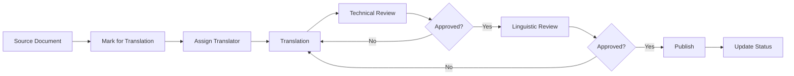

# Translation Status

> **Home [Home](../../README.md)** | **Documentation** | **Internationalization**

---

## Overview

This document tracks the translation status of the CSA-in-a-Box documentation across supported languages. It provides visibility into translation progress, identifies gaps, and coordinates translation efforts.

## Table of Contents

- [Supported Languages](#supported-languages)
- [Translation Progress](#translation-progress)
- [Priority Documents](#priority-documents)
- [Translation Workflow](#translation-workflow)
- [Contributing Translations](#contributing-translations)
- [Quality Assurance](#quality-assurance)
- [Translation Tools](#translation-tools)

---

## Supported Languages

### Primary Languages

| Language | Code | Status | Maintainer | Last Updated |
|----------|------|--------|------------|--------------|
| **English** | `en` | Primary | CSA Team | 2025-12-09 |
| **Spanish** | `es` | In Progress | TBD | 2025-11-15 |
| **French** | `fr` | Planned | TBD | - |
| **German** | `de` | Planned | TBD | - |
| **Japanese** | `ja` | Planned | TBD | - |
| **Chinese (Simplified)** | `zh-CN` | Planned | TBD | - |
| **Portuguese (Brazil)** | `pt-BR` | Planned | TBD | - |

### Regional Variants

| Language | Variant | Code | Status |
|----------|---------|------|--------|
| **English** | US | `en-US` | Complete |
| **English** | UK | `en-GB` | Not Started |
| **Spanish** | Spain | `es-ES` | In Progress |
| **Spanish** | Latin America | `es-LA` | Planned |
| **Portuguese** | Brazil | `pt-BR` | Planned |
| **Portuguese** | Portugal | `pt-PT` | Planned |

---

## Translation Progress

### Overall Statistics

```yaml
Total Documents: 150
Total Words: 250,000
Average Completion: 15%

Languages:
  en (English): 100%
  es (Spanish): 25%
  fr (French): 0%
  de (German): 0%
  ja (Japanese): 0%
  zh-CN (Chinese): 0%
  pt-BR (Portuguese): 0%
```

### Progress by Language

#### Spanish (es) - 25% Complete

| Document Category | Total Docs | Translated | In Progress | Not Started | Completion % |
|-------------------|------------|------------|-------------|-------------|--------------|
| **Getting Started** | 5 | 4 | 1 | 0 | 80% |
| **Guides** | 15 | 2 | 3 | 10 | 13% |
| **Best Practices** | 20 | 0 | 5 | 15 | 0% |
| **Reference** | 30 | 0 | 2 | 28 | 0% |
| **Tutorials** | 25 | 0 | 0 | 25 | 0% |
| **Architecture** | 10 | 0 | 1 | 9 | 0% |
| **API Docs** | 15 | 0 | 0 | 15 | 0% |
| **Troubleshooting** | 30 | 0 | 0 | 30 | 0% |

**Last Updated:** 2025-11-15

**Recent Translations:**
- ✅ `docs/README.md` → `docs/es/README.md` (2025-11-15)
- ✅ `docs/getting-started.md` → `docs/es/getting-started.md` (2025-11-10)
- 🔄 `docs/guides/CONTRIBUTING.md` → `docs/es/guides/CONTRIBUTING.md` (In Progress)

---

## Priority Documents

### High Priority (Complete First)

| Document | Path | Status | Assignee | Target Date |
|----------|------|--------|----------|-------------|
| **Main README** | `README.md` | ✅ Complete (es) | - | 2025-11-01 |
| **Getting Started** | `docs/getting-started.md` | ✅ Complete (es) | - | 2025-11-10 |
| **Quick Start** | `docs/quick-start.md` | 🔄 In Progress (es) | Maria G. | 2025-12-15 |
| **Installation Guide** | `docs/installation.md` | ⏳ Not Started | - | 2026-01-15 |
| **Contributing Guide** | `docs/guides/CONTRIBUTING.md` | 🔄 In Progress (es) | Carlos R. | 2025-12-20 |

### Medium Priority

| Document | Path | Status | Assignee | Target Date |
|----------|------|--------|----------|-------------|
| **Best Practices** | `docs/best-practices/` | ⏳ Not Started | - | 2026-02-01 |
| **Security Guide** | `docs/best-practices/security.md` | ⏳ Not Started | - | 2026-02-15 |
| **API Reference** | `docs/api/` | ⏳ Not Started | - | 2026-03-01 |

### Low Priority

| Document | Path | Status | Assignee | Target Date |
|----------|------|--------|----------|-------------|
| **Advanced Tutorials** | `docs/tutorials/advanced/` | ⏳ Not Started | - | 2026-Q2 |
| **Architecture Details** | `docs/architecture/` | ⏳ Not Started | - | 2026-Q2 |

**Legend:**
- ✅ Complete
- 🔄 In Progress
- ⏳ Not Started
- ⚠️ Needs Review
- 🔴 Blocked

---

## Translation Workflow

### Process Overview



### Translation Steps

**Step 1: Preparation**

```bash
# Create translation branch
git checkout -b translations/es/quick-start

# Copy source document
cp docs/quick-start.md docs/es/quick-start.md
```

**Step 2: Translation**

- Translate content while preserving:
  - Markdown formatting
  - Code blocks (keep code unchanged)
  - Links and references
  - Technical terminology

**Step 3: Technical Review**

```yaml
Technical Review Checklist:
  - [ ] All code examples tested
  - [ ] Commands and syntax verified
  - [ ] Links functional
  - [ ] Technical terms accurate
  - [ ] Formatting preserved
```

**Step 4: Linguistic Review**

```yaml
Linguistic Review Checklist:
  - [ ] Grammar and spelling correct
  - [ ] Natural language flow
  - [ ] Appropriate formality level
  - [ ] Cultural sensitivity
  - [ ] Consistent terminology
```

**Step 5: Publication**

```bash
# Commit translation
git add docs/es/quick-start.md
git commit -m "docs(es): translate quick-start guide"

# Push and create PR
git push origin translations/es/quick-start
```

---

## Contributing Translations

### Getting Started as a Translator

**Prerequisites:**

- Native or fluent in target language
- Technical understanding of Azure/cloud computing
- Familiarity with Markdown
- GitHub account

**Registration:**

1. Join the [CSA Translation Team](https://github.com/fgarofalo56/csa-inabox-docs/discussions)
2. Introduce yourself and specify languages
3. Request access to translation tools
4. Review translation guidelines

### Translation Guidelines

**General Principles:**

1. **Preserve Technical Accuracy**
   - Don't translate code, commands, or APIs
   - Keep technical terminology consistent
   - Use glossary for standard terms

2. **Maintain Formatting**
   - Keep all Markdown syntax
   - Preserve code block language tags
   - Maintain heading hierarchy

3. **Cultural Adaptation**
   - Use culturally appropriate examples
   - Adapt idioms and expressions
   - Consider local regulations

**Example Translation:**

```markdown
<!-- English (Source) -->
# Getting Started

To install Azure Synapse, run:

```bash
az synapse workspace create --name myworkspace
```

For more information, see the [installation guide](./installation.md).

<!-- Spanish (Translation) -->
# Comenzar

Para instalar Azure Synapse, ejecute:

```bash
az synapse workspace create --name myworkspace
```

Para más información, consulte la [guía de instalación](./installation.md).
```

### Translation Glossary

| English | Spanish | French | German | Notes |
|---------|---------|--------|--------|-------|
| Workspace | Espacio de trabajo | Espace de travail | Arbeitsbereich | Azure Synapse |
| Pipeline | Canalización | Pipeline | Pipeline | Keep as "pipeline" |
| Linked Service | Servicio vinculado | Service lié | Verknüpfter Dienst | Azure Data Factory |
| Dataset | Conjunto de datos | Jeu de données | Datensatz | General term |
| Notebook | Cuaderno | Cahier | Notizbuch | Spark notebook |

---

## Quality Assurance

### Automated Checks

```bash
# Check translation completeness
python scripts/i18n/check_translations.py --lang es

# Validate links
python scripts/i18n/validate_links.py --lang es

# Check formatting
python scripts/i18n/check_formatting.py --lang es
```

### Review Criteria

| Criterion | Weight | Description |
|-----------|--------|-------------|
| **Technical Accuracy** | 40% | Correct technical terminology |
| **Linguistic Quality** | 30% | Natural language flow |
| **Completeness** | 20% | All content translated |
| **Formatting** | 10% | Proper Markdown structure |

---

## Translation Tools

### Recommended Tools

| Tool | Purpose | License | Link |
|------|---------|---------|------|
| **CAT Tools** | Translation memory | Various | - |
| **Weblate** | Collaborative translation | Open Source | [weblate.org](https://weblate.org) |
| **Crowdin** | Translation platform | Commercial | [crowdin.com](https://crowdin.com) |
| **DeepL** | Machine translation (draft only) | Freemium | [deepl.com](https://deepl.com) |

### Translation Memory

**Benefits:**

- Consistency across documents
- Faster translation
- Cost reduction
- Quality improvement

**Setup:**

```bash
# Initialize translation memory
tmutil create --source en --target es --name csa-docs

# Import existing translations
tmutil import --file docs/es/*.md

# Export for reuse
tmutil export --format tmx --output csa-translations.tmx
```

---

## Metrics and Reporting

### Monthly Progress Report

```yaml
Month: December 2025

New Translations:
  Spanish: 5 documents (12,500 words)
  French: 0 documents
  German: 0 documents

Reviews Completed:
  Spanish: 3 documents
  French: 0 documents

Active Contributors:
  Spanish: 2 translators
  French: 0 translators
  German: 0 translators

Target for Next Month:
  Spanish: 8 documents (20,000 words)
  French: 2 documents (5,000 words)
```

---

## Contact and Support

### Translation Team

- **Coordinator:** TBD
- **Spanish Lead:** TBD
- **French Lead:** TBD
- **German Lead:** TBD

### Getting Help

- **Questions:** [GitHub Discussions](https://github.com/fgarofalo56/csa-inabox-docs/discussions)
- **Issues:** [GitHub Issues](https://github.com/fgarofalo56/csa-inabox-docs/issues)
- **Email:** translations@csa-docs.com

---

## Future Plans

### Q1 2026

- [ ] Complete Spanish translation (50% coverage)
- [ ] Begin French translation
- [ ] Set up translation platform (Weblate/Crowdin)
- [ ] Create comprehensive glossary

### Q2 2026

- [ ] Complete Spanish translation (100% coverage)
- [ ] French translation (30% coverage)
- [ ] Begin German translation
- [ ] Establish regular review cycles

### Q3 2026

- [ ] Maintain Spanish translations
- [ ] French translation (80% coverage)
- [ ] German translation (30% coverage)
- [ ] Begin Japanese translation

---

**Last Updated:** December 9, 2025
**Version:** 1.0.0
**Maintainer:** CSA Internationalization Team
