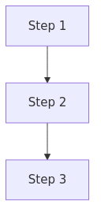

# Diagram Image Files

This directory contains static image files for Mermaid diagrams to ensure GitHub compatibility.

## Purpose

These images serve as fallbacks for Mermaid diagrams when viewing the documentation directly on GitHub, where Mermaid rendering is not supported.

## Image Generation Process

1. Create Mermaid diagrams in markdown files using standard Mermaid syntax
2. Export the rendered diagrams as PNG files
3. Store the images in this directory with descriptive filenames
4. Reference both the Mermaid source and the static image in documentation

## Image List

- `delta-lake-write-flow.png` - Diagram showing Delta Lake data flow
- `serverless-sql-query-flow.png` - Diagram showing Serverless SQL query flow
- `security-rbac-flow.png` - Diagram showing security RBAC implementation
- `troubleshooting-process.png` - Diagram showing troubleshooting workflow
- `data-governance-architecture.png` - Diagram showing data governance architecture

## How to Generate New Images

To generate new static images from Mermaid diagrams:

1. Use Mermaid Live Editor [https://mermaid.live/](https://mermaid.live/) to create and preview the diagram
2. Export as PNG with appropriate dimensions
3. Save the file to this directory
4. Update the documentation with both Mermaid source and image reference

## GitHub Compatibility Notes

GitHub doesn't natively render Mermaid diagrams, so both the diagram code and static image are provided:

```markdown
<!-- Mermaid diagram for MkDocs rendering -->


<!-- Static image fallback for GitHub -->


```
