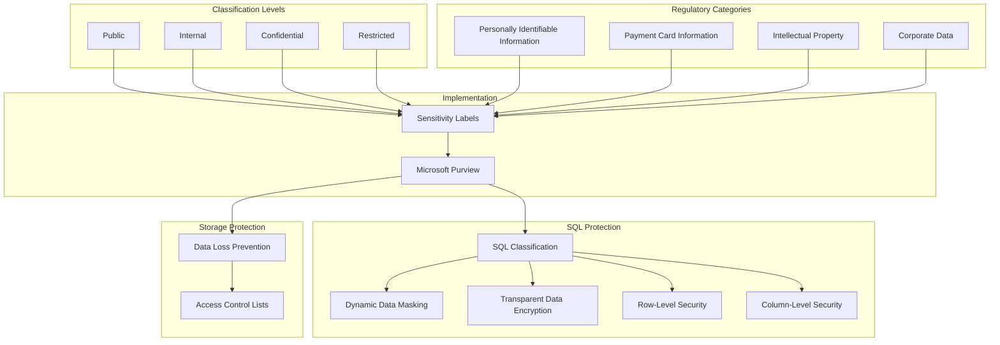

# PLACEHOLDER FOR DATA CLASSIFICATION FRAMEWORK

This file serves as a placeholder for the static image rendering of the Data Classification Framework diagram.

## Diagram Description

This diagram illustrates a comprehensive data classification framework for Azure Synapse Analytics, featuring:

- Classification Levels (Public, Internal, Confidential, Restricted)
- Regulatory Categories (PII, PCI DSS, IP, Corporate Data)
- Implementation through Sensitivity Labels in Microsoft Purview
- Protection methods including SQL Classification, Data Loss Prevention, Row-Level Security, Column-Level Security, Dynamic Data Masking, and Encryption

## Original Mermaid Code

## Instructions for Implementation

Replace this markdown file with an actual PNG image exported from a Mermaid rendering tool.
