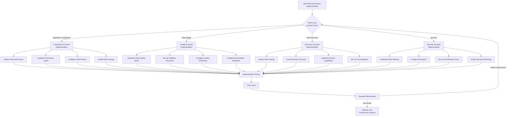

# PLACEHOLDER FOR DATA GOVERNANCE IMPLEMENTATION DECISION TREE

This file serves as a placeholder for the static image rendering of the Data Governance Implementation Decision Tree flowchart.

## Diagram Description

This flowchart helps users decide which data governance features to implement based on their requirements, featuring:

- Decision paths for four primary focuses: Regulatory Compliance, Data Quality, Data Discovery, Security
- Specific implementation components for each focus area
- Integration of Microsoft Purview and other governance tools
- Implementation, training, evaluation, and maintenance phases

## Original Mermaid Code

## Instructions for Implementation

Replace this markdown file with an actual PNG image exported from a Mermaid rendering tool.
