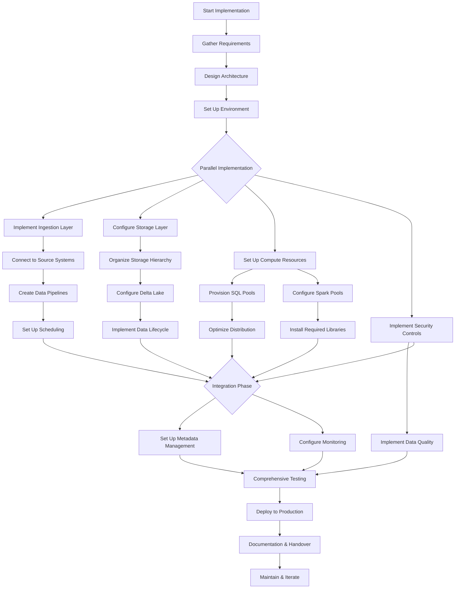

# PLACEHOLDER FOR END-TO-END DATA PIPELINE IMPLEMENTATION FLOWCHART

This file serves as a placeholder for the static image rendering of the End-to-End Data Pipeline Implementation Flowchart.

## Diagram Description

This flowchart outlines the implementation process for a complete data pipeline in Azure Synapse Analytics, featuring:

- Initial planning phases (Requirements, Architecture Design)
- Parallel implementation tracks for different components
- Detailed implementation steps for each component
- Integration and testing phases
- Deployment and maintenance workflows

## Original Mermaid Code

## Instructions for Implementation

Replace this markdown file with an actual PNG image exported from a Mermaid rendering tool.
