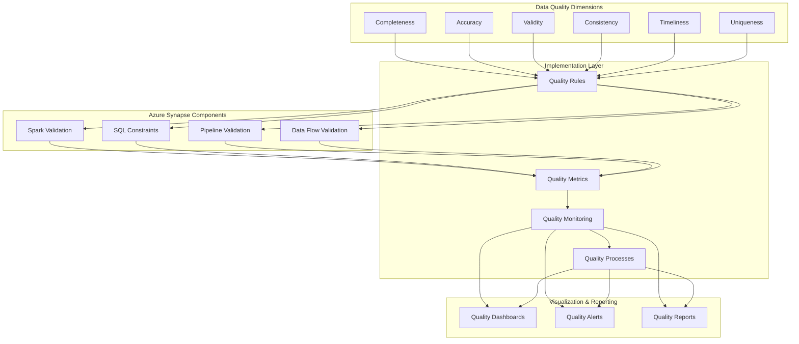

# PLACEHOLDER FOR DATA QUALITY FRAMEWORK DIAGRAM

This file serves as a placeholder for the static image rendering of the Data Quality Framework diagram.

## Diagram Description

This diagram illustrates a comprehensive data quality framework for Azure Synapse Analytics, featuring:

- Data Quality Dimensions (Completeness, Accuracy, Validity, Consistency, Timeliness, Uniqueness)
- Implementation Layer (Quality Rules, Metrics, Monitoring, Processes)
- Azure Synapse Components for validation (Spark Validation, SQL Constraints, Pipeline Validation, Data Flow Validation)
- Visualization & Reporting options (Dashboards, Alerts, Reports)

## Original Mermaid Code

## Instructions for Implementation

Replace this markdown file with an actual PNG image exported from a Mermaid rendering tool.
