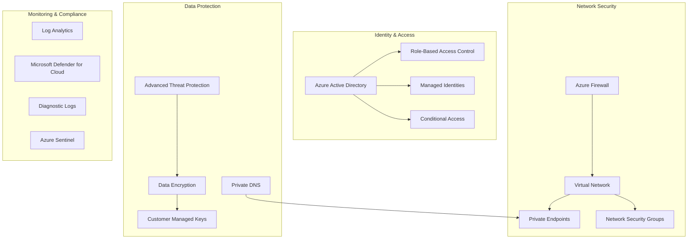

# PLACEHOLDER FOR DEFENSE-IN-DEPTH SECURITY ARCHITECTURE DIAGRAM

This file serves as a placeholder for the static image rendering of the Defense-in-Depth Security Architecture diagram.

## Diagram Description

This diagram illustrates the defense-in-depth security model for Azure Synapse Analytics with four key layers:

- Network Security layer with Private Endpoints, Network Security Groups, Azure Firewall, and Virtual Network
- Identity & Access layer with Azure Active Directory, RBAC, Managed Identities, and Conditional Access
- Data Protection layer with Customer Managed Keys, Data Encryption, Advanced Threat Protection, and Private DNS
- Monitoring & Compliance layer with Log Analytics, Microsoft Defender for Cloud, Diagnostic Logs, and Azure Sentinel

## Instructions for Implementation

Replace this markdown file with an actual PNG image exported from a Mermaid rendering tool.

Original Mermaid Source:

