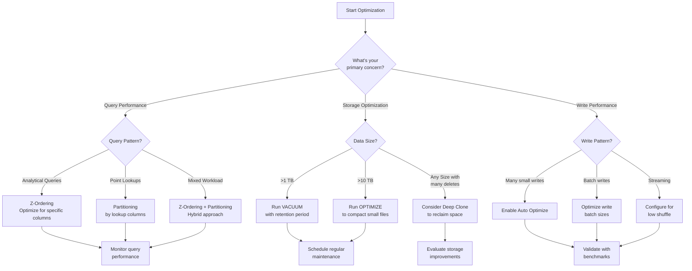

# PLACEHOLDER FOR DELTA LAKE OPTIMIZATION DECISION TREE

This file serves as a placeholder for the static image rendering of the Delta Lake Optimization Decision Tree diagram.

## Diagram Description

This flowchart helps users decide which Delta Lake optimization techniques to apply based on different workload characteristics with three main decision paths:

- Query Performance (Z-Ordering, Partitioning, Hybrid approach)
- Storage Optimization (VACUUM, OPTIMIZE compact, Deep Clone)
- Write Performance (Auto Optimize, Optimize write batch sizes, Low shuffle configuration)

## Original Mermaid Code

## Instructions for Implementation

Replace this markdown file with an actual PNG image exported from a Mermaid rendering tool.
