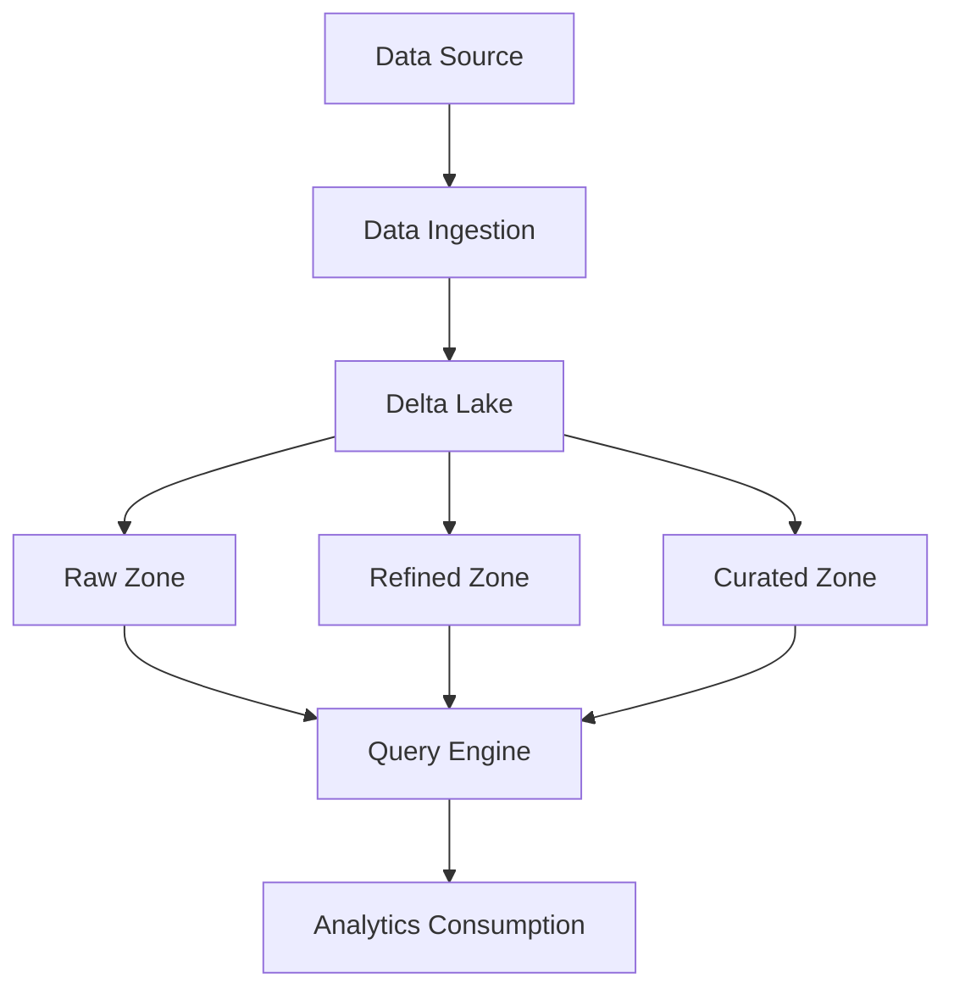

# PLACEHOLDER FOR DELTA LAKE WRITE FLOW DIAGRAM

This file serves as a placeholder for the static image rendering of the Delta Lake Write Flow diagram.

 

## Diagram Description

 

This diagram shows the data flow in a Delta Lake architecture:

 
- Data Source -> Data Ingestion -> Delta Lake
- Delta Lake branches to Raw Zone, Refined Zone, and Curated Zone
- All zones feed into the Query Engine
- Query Engine outputs to Analytics Consumption

 

## Instructions for Implementation

 

Replace this markdown file with an actual PNG image exported from a Mermaid rendering tool.

 

Original Mermaid Source:

