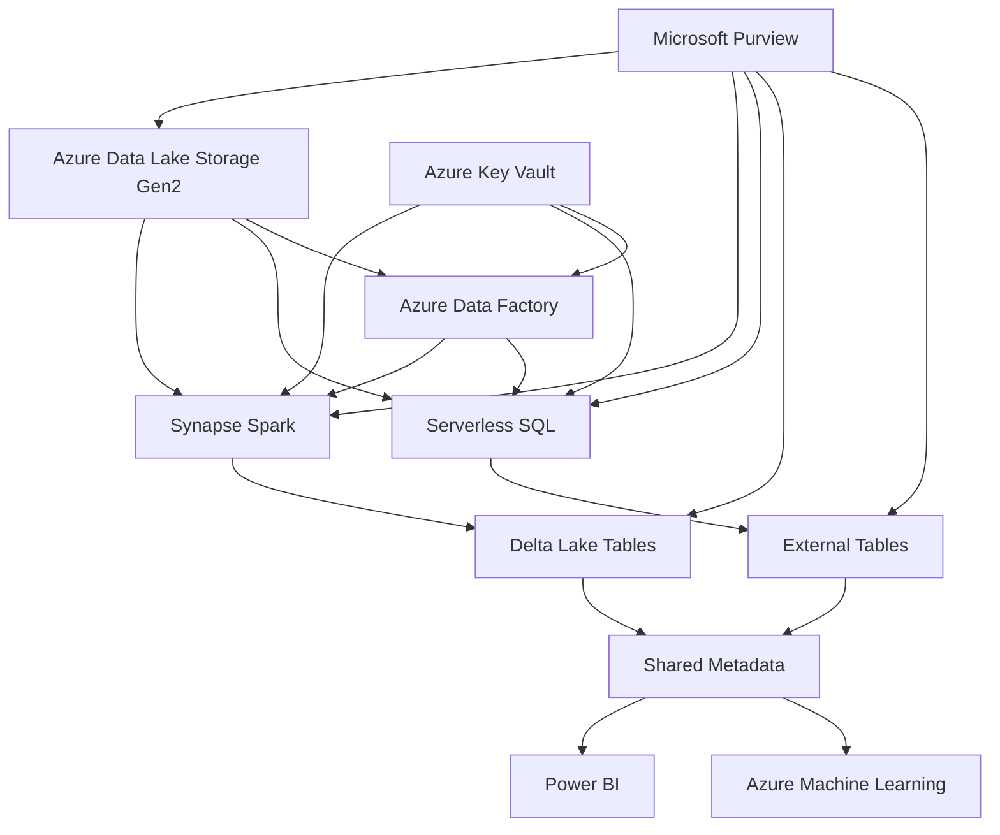

# PLACEHOLDER FOR ENTERPRISE-SCALE REFERENCE ARCHITECTURE DIAGRAM

This file serves as a placeholder for the static image rendering of the Enterprise-Scale Reference Architecture diagram.

## Diagram Description

This diagram illustrates a comprehensive enterprise implementation of Azure Synapse Analytics, featuring:

- Azure Data Lake Storage Gen2 as the central storage repository
- Synapse Spark and Serverless SQL for data processing
- Delta Lake Tables and External Tables for data organization
- Shared Metadata for consistent access across services
- Integration with Power BI and Azure Machine Learning
- Security implementation with Azure Key Vault
- Governance through Microsoft Purview

## Original Mermaid Code

## Instructions for Implementation

Replace this markdown file with an actual PNG image exported from a Mermaid rendering tool.
