# PLACEHOLDER FOR DATA GOVERNANCE ROLES AND RESPONSIBILITIES DIAGRAM

This file serves as a placeholder for the static image rendering of the Data Governance Roles and Responsibilities diagram.

## Diagram Description

This diagram illustrates the roles and responsibilities within a data governance framework for Azure Synapse Analytics, featuring:

- Executive Layer (Chief Data Officer, Executive Sponsors, Steering Committee)
- Management Layer (Data Governance Office, Data Owners, Domain Leads)
- Operational Layer (Data Stewards, Data Custodians, Data Specialists)
- Technical Layer (Data Architects, Data Engineers, DevOps Engineers, Data Analysts)
- Governance Activities (Strategy & Vision, Policy Management, Standards Definition, Quality Management, Security & Compliance, Metadata Management)

## Original Mermaid Code

```mermaid
graph TD
    subgraph "Executive Layer"
        CDO[Chief Data Officer]
        EXEC[Executive Sponsors]
        STEER[Steering Committee]
    end
    
    subgraph "Management Layer"
        DGO[Data Governance Office]
        DATA_OWNERS[Data Owners]
        DOMAIN_LEADS[Domain Leads]
    end
    
    subgraph "Operational Layer"
        DATA_STEWARDS[Data Stewards]
        DATA_CUSTODIANS[Data Custodians]
        DATA_SPECIALISTS[Data Specialists]
    end
    
    subgraph "Technical Layer"
        ARCHITECTS[Data Architects]
        ENGINEERS[Data Engineers]
        DEVOPS[DevOps Engineers]
        ANALYSTS[Data Analysts]
    end
    
    subgraph "Governance Activities"
        STRATEGY[Strategy & Vision]
        POLICY[Policy Management]
        STANDARDS[Standards Definition]
        QUALITY[Quality Management]
        SECURITY[Security & Compliance]
        METADATA[Metadata Management]
    end
    
    CDO --> STRATEGY
    EXEC --> STRATEGY
    STEER --> POLICY
    
    DGO --> POLICY
    DGO --> STANDARDS
    DATA_OWNERS --> POLICY
    DOMAIN_LEADS --> STANDARDS
    
    DATA_STEWARDS --> QUALITY
    DATA_CUSTODIANS --> SECURITY
    DATA_SPECIALISTS --> METADATA
    
    ARCHITECTS --> STANDARDS
    ENGINEERS --> QUALITY
    DEVOPS --> SECURITY
    ANALYSTS --> METADATA
```

## Instructions for Implementation

Replace this markdown file with an actual PNG image exported from a Mermaid rendering tool.
