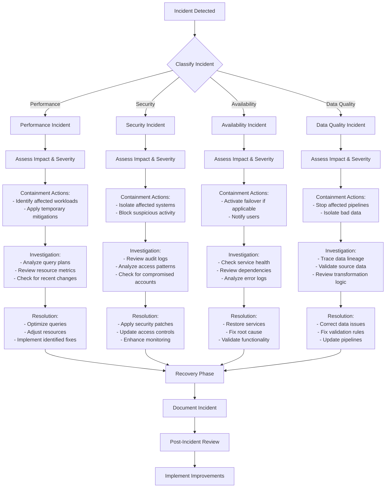

# PLACEHOLDER FOR INCIDENT RESPONSE PROCESS DIAGRAM

This file serves as a placeholder for the static image rendering of the Incident Response Process flowchart for Azure Synapse.

## Diagram Description

This flowchart outlines the incident response process for handling Azure Synapse Analytics-related issues, featuring:

- Incident classification (Performance, Security, Availability, Data Quality)
- Assessment and containment steps for each incident type
- Investigation procedures tailored to different incident types
- Resolution and recovery phases
- Documentation, review, and improvement cycle

## Original Mermaid Code

## Instructions for Implementation

Replace this markdown file with an actual PNG image exported from a Mermaid rendering tool.
