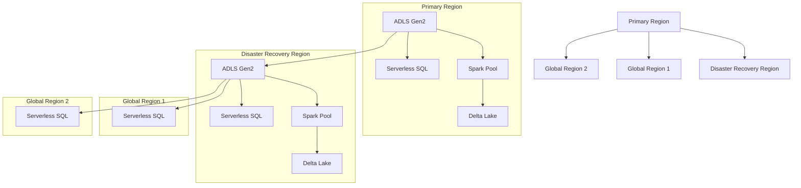

# PLACEHOLDER FOR MULTI-REGION DEPLOYMENT ARCHITECTURE DIAGRAM

This file serves as a placeholder for the static image rendering of the Multi-Region Deployment Architecture diagram.

## Diagram Description

This diagram illustrates an enterprise deployment of Azure Synapse Analytics requiring high availability and global distribution, featuring:

- Primary Region with core components (ADLS Gen2, Spark Pool, Serverless SQL, Delta Lake)
- Disaster Recovery Region with replicated components
- Global Regions with Serverless SQL endpoints for regional data access
- Data replication paths between the Primary Region and other regions
- Region-to-region relationships for failover and data distribution

## Original Mermaid Code

## Instructions for Implementation

Replace this markdown file with an actual PNG image exported from a Mermaid rendering tool.
