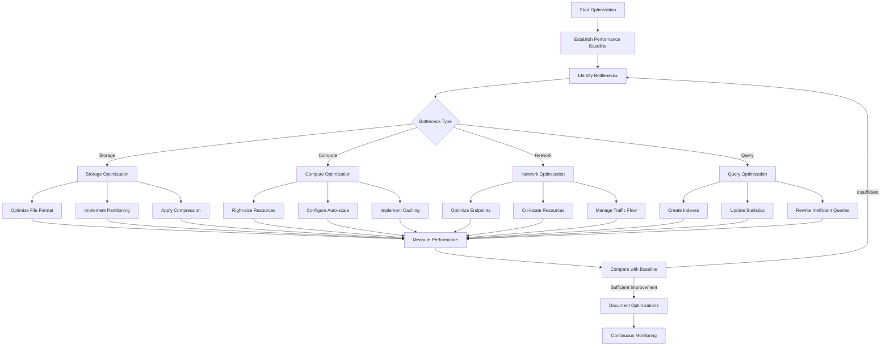

# PLACEHOLDER FOR PERFORMANCE OPTIMIZATION PROCESS DIAGRAM

This file serves as a placeholder for the static image rendering of the Performance Optimization Process flowchart.

## Diagram Description

This flowchart outlines the systematic process for optimizing the performance of Azure Synapse Analytics workloads, featuring:

- Performance baseline establishment
- Bottleneck identification across four areas: Storage, Compute, Network, and Query
- Specific optimization techniques for each bottleneck type
- Measurement and comparison with baseline
- Documentation and continuous monitoring

## Original Mermaid Code

## Instructions for Implementation

Replace this markdown file with an actual PNG image exported from a Mermaid rendering tool.
