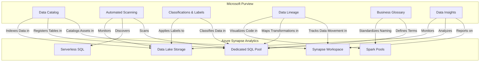

# PLACEHOLDER FOR MICROSOFT PURVIEW INTEGRATION ARCHITECTURE

This file serves as a placeholder for the static image rendering of the Microsoft Purview Integration Architecture diagram.

## Diagram Description

This diagram illustrates how Microsoft Purview integrates with Azure Synapse Analytics for comprehensive data governance, featuring:

- Microsoft Purview components (Data Catalog, Scanning, Classifications, Glossary, Insights)
- Azure Synapse Analytics components (Workspace, SQL Pools, Serverless SQL, Spark Pools, ADLS)
- Integration points showing how Purview catalogs, scans, classifies, and monitors Synapse resources
- Data lineage tracking across the entire Synapse environment

## Original Mermaid Code

## Instructions for Implementation

Replace this markdown file with an actual PNG image exported from a Mermaid rendering tool.
