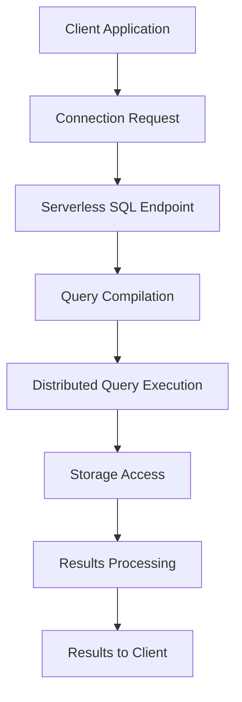

# PLACEHOLDER FOR SERVERLESS SQL QUERY FLOW DIAGRAM

This file serves as a placeholder for the static image rendering of the Serverless SQL Query Flow diagram.

## Diagram Description
This diagram shows the query flow in a Serverless SQL architecture:
- Client Application -> Connection Request -> Serverless SQL Endpoint
- Serverless SQL Endpoint -> Query Compilation -> Distributed Query Execution
- Distributed Query Execution -> Storage Access -> Results Processing
- Results Processing -> Results to Client

## Instructions for Implementation
Replace this markdown file with an actual PNG image exported from a Mermaid rendering tool.

Original Mermaid Source:

