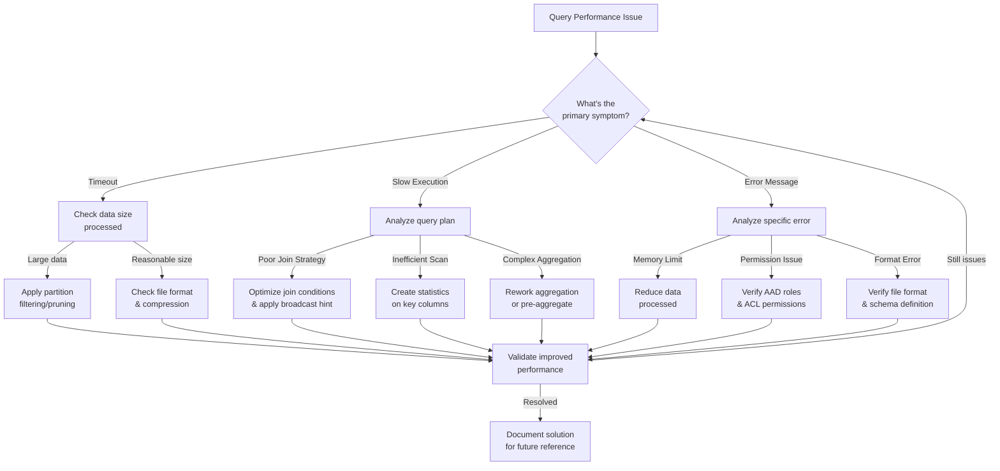

# PLACEHOLDER FOR SERVERLESS SQL QUERY TROUBLESHOOTING FLOWCHART

This file serves as a placeholder for the static image rendering of the Serverless SQL Query Troubleshooting Flowchart.

## Diagram Description

This flowchart provides a systematic approach to troubleshooting performance issues with Serverless SQL queries, featuring:

- Symptom identification (Timeout, Slow Execution, Error Messages)
- Diagnostic paths for each symptom type
- Resolution steps for different root causes
- Validation process for verifying fixes

## Original Mermaid Code

## Instructions for Implementation

Replace this markdown file with an actual PNG image exported from a Mermaid rendering tool.
