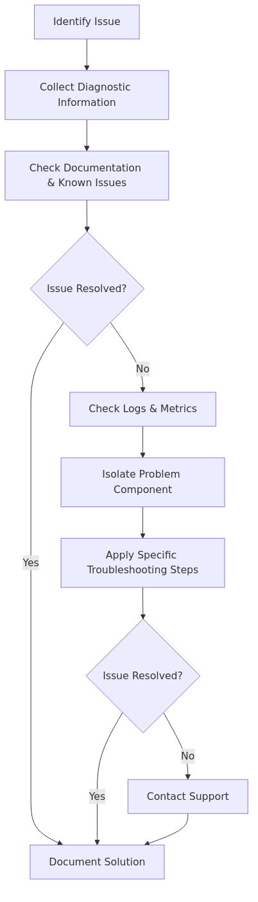

# Troubleshooting Process Diagram

[Home](../../../README.md) > [Images](../../README.md) > Troubleshooting > Troubleshooting Process

This diagram represents the standard troubleshooting process for Azure Synapse Analytics issues.
