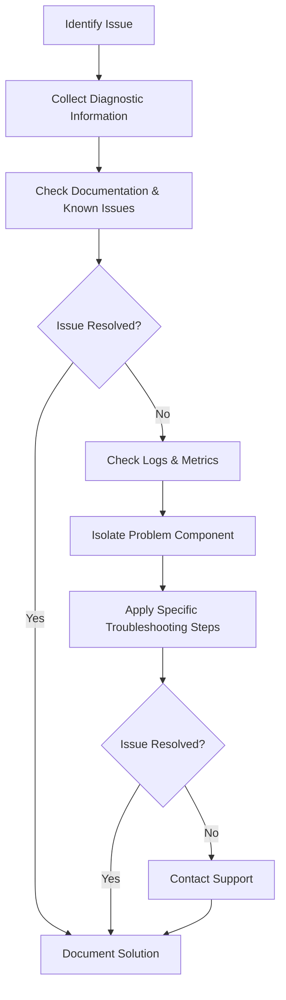

# Troubleshooting Process Diagram

```mermaid
graph TD
    A[Identify Issue] --> B[Collect Diagnostic Information]
    B --> C[Check Documentation & Known Issues]
    C --> D{Issue Resolved?}
    D -- Yes --> E[Document Solution]
    D -- No --> F[Check Logs & Metrics]
    F --> G[Isolate Problem Component]
    G --> H[Apply Specific Troubleshooting Steps]
    H --> I{Issue Resolved?}
    I -- Yes --> E
    I -- No --> J[Contact Support]
    J --> E
```

This diagram represents the standard troubleshooting process for Azure Synapse Analytics issues.
