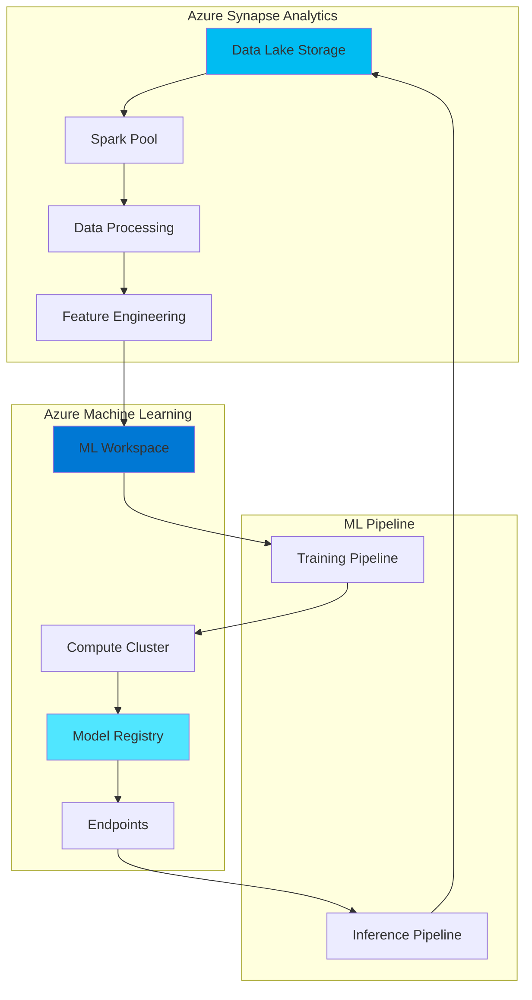

# Azure Machine Learning Integration Guide

> **Home [Home](../../README.md)** | **Documentation** | **Integration**

---

## Overview

This guide provides comprehensive instructions for integrating Azure Machine Learning (Azure ML) with Azure Synapse Analytics in the CSA-in-a-Box architecture, enabling end-to-end machine learning workflows from data preparation to model deployment.

## Table of Contents

- [Architecture Overview](#architecture-overview)
- [Prerequisites](#prerequisites)
- [Setting Up Integration](#setting-up-integration)
- [Data Preparation](#data-preparation)
- [Model Training](#model-training)
- [Model Deployment](#model-deployment)
- [Batch Scoring](#batch-scoring)
- [MLOps Integration](#mlops-integration)
- [Best Practices](#best-practices)
- [Troubleshooting](#troubleshooting)

---

## Architecture Overview

### Integration Architecture



### Key Components

| Component | Purpose | Integration Point |
|-----------|---------|-------------------|
| **Synapse Spark Pools** | Data processing and feature engineering | Dataset creation |
| **Azure ML Workspace** | Centralized ML environment | Linked service |
| **ML Compute** | Training and inference compute | Synapse-triggered jobs |
| **Model Registry** | Model versioning and management | Synapse pipelines |
| **Endpoints** | Model serving | Synapse prediction |

---

## Prerequisites

### Required Azure Resources

```yaml
Azure Resources:
  - Azure Synapse Workspace
  - Azure Machine Learning Workspace
  - Azure Storage Account (ADLS Gen2)
  - Azure Key Vault
  - Azure Container Registry (for custom environments)

Required Permissions:
  - Contributor on Synapse workspace
  - Contributor on ML workspace
  - Storage Blob Data Contributor
  - Key Vault Secrets Officer
```

### Required Software

- Python 3.8 or later
- Azure ML SDK v2
- Synapse SDK
- Azure CLI

```bash
# Install required packages
pip install azure-ai-ml
pip install azure-synapse-artifacts
pip install azure-synapse-spark
pip install azureml-core
```

---

## Setting Up Integration

### Step 1: Create Linked Service

**Create ML Linked Service in Synapse:**

```json
{
  "name": "AzureMLLinkedService",
  "properties": {
    "type": "AzureMLService",
    "typeProperties": {
      "subscriptionId": "your-subscription-id",
      "resourceGroupName": "rg-ml-workspace",
      "mlWorkspaceName": "ml-workspace-prod",
      "authentication": "MSI"
    },
    "annotations": ["production", "ml"]
  }
}
```

**PowerShell Setup:**

```powershell
# Create linked service
$linkedService = @{
    name = "AzureMLLinkedService"
    properties = @{
        type = "AzureMLService"
        typeProperties = @{
            subscriptionId = $subscriptionId
            resourceGroupName = "rg-ml-workspace"
            mlWorkspaceName = "ml-workspace-prod"
            authentication = "MSI"
        }
    }
} | ConvertTo-Json -Depth 10

Set-AzSynapseLinkedService `
    -WorkspaceName "synapse-workspace" `
    -Name "AzureMLLinkedService" `
    -DefinitionFile $linkedService
```

### Step 2: Configure Authentication

**Managed Identity Setup:**

```bash
# Enable Synapse managed identity
az synapse workspace update \
  --name synapse-workspace \
  --resource-group rg-synapse \
  --identity-type SystemAssigned

# Grant ML workspace access
SYNAPSE_IDENTITY=$(az synapse workspace show \
  --name synapse-workspace \
  --resource-group rg-synapse \
  --query identity.principalId -o tsv)

az role assignment create \
  --assignee $SYNAPSE_IDENTITY \
  --role "Contributor" \
  --scope /subscriptions/{sub-id}/resourceGroups/rg-ml-workspace/providers/Microsoft.MachineLearningServices/workspaces/ml-workspace-prod
```

### Step 3: Create Azure ML Workspace Connection

**Python SDK Configuration:**

```python
# configure_ml_workspace.py
from azure.ai.ml import MLClient
from azure.identity import DefaultAzureCredential
from azure.ai.ml.entities import WorkspaceConnection

# Initialize ML Client
credential = DefaultAzureCredential()
ml_client = MLClient(
    credential=credential,
    subscription_id="your-subscription-id",
    resource_group_name="rg-ml-workspace",
    workspace_name="ml-workspace-prod"
)

# Create connection to Synapse
synapse_connection = WorkspaceConnection(
    name="synapse-connection",
    type="synapse",
    target="https://synapse-workspace.dev.azuresynapse.net",
    credentials={
        "type": "ManagedIdentity"
    }
)

ml_client.connections.create_or_update(synapse_connection)
print("Synapse connection created successfully")
```

---

## Data Preparation

### Read Data from Synapse

**PySpark in Synapse Notebook:**

```python
# synapse_data_prep.py
from pyspark.sql import SparkSession
from pyspark.sql.functions import col, when, avg
from pyspark.ml.feature import VectorAssembler, StandardScaler

# Initialize Spark session
spark = SparkSession.builder.appName("MLDataPrep").getOrCreate()

# Read data from Synapse SQL Pool
df = spark.read \
    .format("synapsesql") \
    .option("url", "jdbc:sqlserver://synapse-workspace.sql.azuresynapse.net:1433") \
    .option("dbtable", "dbo.CustomerData") \
    .option("user", "sqladminuser") \
    .option("password", mssparkutils.credentials.getSecret("keyvault", "sql-password")) \
    .load()

# Data cleaning
df_clean = df \
    .dropDuplicates() \
    .filter(col("Age").between(18, 100)) \
    .fillna({"Income": 0})

# Feature engineering
df_features = df_clean \
    .withColumn("IncomeCategory",
                when(col("Income") < 30000, "Low")
                .when(col("Income") < 80000, "Medium")
                .otherwise("High")) \
    .withColumn("AgeGroup",
                when(col("Age") < 30, "Young")
                .when(col("Age") < 50, "Middle")
                .otherwise("Senior"))

# Prepare features for ML
feature_columns = ["Age", "Income", "CreditScore", "AccountBalance"]
assembler = VectorAssembler(inputCols=feature_columns, outputCol="features")
df_assembled = assembler.transform(df_features)

# Scale features
scaler = StandardScaler(inputCol="features", outputCol="scaled_features")
scaler_model = scaler.fit(df_assembled)
df_scaled = scaler_model.transform(df_assembled)

# Split data
train_df, test_df = df_scaled.randomSplit([0.8, 0.2], seed=42)

# Write to Data Lake
train_df.write \
    .mode("overwrite") \
    .format("delta") \
    .save("abfss://ml-data@datalake.dfs.core.windows.net/training/customer_features")

test_df.write \
    .mode("overwrite") \
    .format("delta") \
    .save("abfss://ml-data@datalake.dfs.core.windows.net/testing/customer_features")

print(f"Training data: {train_df.count()} rows")
print(f"Testing data: {test_df.count()} rows")
```

---

## Model Training

### Azure ML Training Pipeline

**training_pipeline.py:**

```python
from azure.ai.ml import MLClient, command, Input, Output
from azure.ai.ml.entities import Environment, ComputeCluster
from azure.identity import DefaultAzureCredential

# Initialize ML Client
credential = DefaultAzureCredential()
ml_client = MLClient(
    credential=credential,
    subscription_id="your-subscription-id",
    resource_group_name="rg-ml-workspace",
    workspace_name="ml-workspace-prod"
)

# Create compute cluster
compute_cluster = ComputeCluster(
    name="ml-compute-cluster",
    size="STANDARD_DS3_V2",
    min_instances=0,
    max_instances=4,
    idle_time_before_scale_down=300
)

ml_client.compute.begin_create_or_update(compute_cluster).result()

# Define training environment
env = Environment(
    name="sklearn-env",
    conda_file="environment.yml",
    image="mcr.microsoft.com/azureml/openmpi4.1.0-ubuntu20.04:latest"
)

# Create training job
training_job = command(
    code="./src",
    command="python train.py \
            --data ${{inputs.training_data}} \
            --test-data ${{inputs.test_data}} \
            --model-output ${{outputs.model_output}}",
    environment=env,
    compute="ml-compute-cluster",
    inputs={
        "training_data": Input(
            type="uri_folder",
            path="azureml://datastores/workspaceblobstore/paths/training/customer_features"
        ),
        "test_data": Input(
            type="uri_folder",
            path="azureml://datastores/workspaceblobstore/paths/testing/customer_features"
        )
    },
    outputs={
        "model_output": Output(type="mlflow_model")
    }
)

# Submit job
job = ml_client.jobs.create_or_update(training_job)
print(f"Training job submitted: {job.name}")

# Wait for completion
ml_client.jobs.stream(job.name)
```

**Training Script (train.py):**

```python
# train.py
import argparse
import pandas as pd
import mlflow
from sklearn.ensemble import RandomForestClassifier
from sklearn.metrics import accuracy_score, precision_score, recall_score

# Parse arguments
parser = argparse.ArgumentParser()
parser.add_argument("--data", type=str, help="Path to training data")
parser.add_argument("--test-data", type=str, help="Path to test data")
parser.add_argument("--model-output", type=str, help="Path to save model")
args = parser.parse_args()

# Load data
train_df = pd.read_parquet(args.data)
test_df = pd.read_parquet(args.test_data)

X_train = train_df.drop(columns=["target"])
y_train = train_df["target"]
X_test = test_df.drop(columns=["target"])
y_test = test_df["target"]

# Start MLflow run
with mlflow.start_run():
    # Train model
    model = RandomForestClassifier(
        n_estimators=100,
        max_depth=10,
        random_state=42
    )
    model.fit(X_train, y_train)

    # Make predictions
    y_pred = model.predict(X_test)

    # Calculate metrics
    accuracy = accuracy_score(y_test, y_pred)
    precision = precision_score(y_test, y_pred, average='weighted')
    recall = recall_score(y_test, y_pred, average='weighted')

    # Log metrics
    mlflow.log_metric("accuracy", accuracy)
    mlflow.log_metric("precision", precision)
    mlflow.log_metric("recall", recall)

    # Log parameters
    mlflow.log_param("n_estimators", 100)
    mlflow.log_param("max_depth", 10)

    # Log model
    mlflow.sklearn.log_model(model, "model")

    print(f"Model trained successfully")
    print(f"Accuracy: {accuracy:.4f}")
    print(f"Precision: {precision:.4f}")
    print(f"Recall: {recall:.4f}")
```

---

## Model Deployment

### Deploy Model to Managed Endpoint

**deploy_model.py:**

```python
from azure.ai.ml import MLClient
from azure.ai.ml.entities import (
    ManagedOnlineEndpoint,
    ManagedOnlineDeployment,
    Model,
    CodeConfiguration,
    Environment
)
from azure.identity import DefaultAzureCredential

# Initialize client
credential = DefaultAzureCredential()
ml_client = MLClient(
    credential=credential,
    subscription_id="your-subscription-id",
    resource_group_name="rg-ml-workspace",
    workspace_name="ml-workspace-prod"
)

# Register model
model = Model(
    path="./model",
    name="customer-churn-model",
    description="Random Forest model for customer churn prediction",
    type="mlflow_model"
)

registered_model = ml_client.models.create_or_update(model)

# Create endpoint
endpoint = ManagedOnlineEndpoint(
    name="customer-churn-endpoint",
    description="Endpoint for customer churn prediction",
    auth_mode="key"
)

ml_client.online_endpoints.begin_create_or_update(endpoint).result()

# Create deployment
deployment = ManagedOnlineDeployment(
    name="blue",
    endpoint_name="customer-churn-endpoint",
    model=registered_model,
    instance_type="Standard_DS3_v2",
    instance_count=1,
    code_configuration=CodeConfiguration(
        code="./scoring",
        scoring_script="score.py"
    ),
    environment=Environment(
        conda_file="./scoring/conda.yml",
        image="mcr.microsoft.com/azureml/openmpi4.1.0-ubuntu20.04:latest"
    )
)

ml_client.online_deployments.begin_create_or_update(deployment).result()

# Set traffic to 100% for blue deployment
endpoint.traffic = {"blue": 100}
ml_client.online_endpoints.begin_create_or_update(endpoint).result()

print(f"Model deployed successfully to endpoint: {endpoint.name}")
```

**Scoring Script (score.py):**

```python
# score.py
import json
import numpy as np
import mlflow

def init():
    """Initialize model."""
    global model
    model_path = "./model"
    model = mlflow.sklearn.load_model(model_path)

def run(raw_data):
    """Score data."""
    try:
        data = json.loads(raw_data)
        input_data = np.array(data["data"])

        # Make predictions
        predictions = model.predict(input_data)
        probabilities = model.predict_proba(input_data)

        return json.dumps({
            "predictions": predictions.tolist(),
            "probabilities": probabilities.tolist()
        })
    except Exception as e:
        return json.dumps({"error": str(e)})
```

---

## Batch Scoring

### Synapse Pipeline for Batch Prediction

**batch_scoring_pipeline.json:**

```json
{
  "name": "BatchScoringPipeline",
  "properties": {
    "activities": [
      {
        "name": "LoadDataFromSynapse",
        "type": "Copy",
        "inputs": [
          {
            "referenceName": "SynapseSQLDataset",
            "type": "DatasetReference"
          }
        ],
        "outputs": [
          {
            "referenceName": "ADLSDataset",
            "type": "DatasetReference"
          }
        ]
      },
      {
        "name": "BatchPrediction",
        "type": "AzureMLBatchExecution",
        "dependsOn": [
          {
            "activity": "LoadDataFromSynapse",
            "dependencyConditions": ["Succeeded"]
          }
        ],
        "linkedServiceName": {
          "referenceName": "AzureMLLinkedService",
          "type": "LinkedServiceReference"
        },
        "typeProperties": {
          "mlEndpointName": "customer-churn-batch-endpoint",
          "inputDatasets": [
            {
              "name": "input_data",
              "dataset": {
                "referenceName": "ADLSDataset",
                "type": "DatasetReference"
              }
            }
          ],
          "outputDatasets": [
            {
              "name": "predictions",
              "dataset": {
                "referenceName": "PredictionsDataset",
                "type": "DatasetReference"
              }
            }
          ]
        }
      },
      {
        "name": "LoadPredictionsToSynapse",
        "type": "Copy",
        "dependsOn": [
          {
            "activity": "BatchPrediction",
            "dependencyConditions": ["Succeeded"]
          }
        ],
        "inputs": [
          {
            "referenceName": "PredictionsDataset",
            "type": "DatasetReference"
          }
        ],
        "outputs": [
          {
            "referenceName": "SynapsePredictionsTable",
            "type": "DatasetReference"
          }
        ]
      }
    ]
  }
}
```

---

## MLOps Integration

### Automated Retraining Pipeline

```yaml
# .github/workflows/ml-retraining.yml
name: Model Retraining

on:
  schedule:
    - cron: '0 2 * * 0'  # Weekly on Sunday at 2 AM
  workflow_dispatch:

jobs:
  retrain:
    runs-on: ubuntu-latest
    steps:
      - uses: actions/checkout@v3

      - name: Azure Login
        uses: azure/login@v1
        with:
          creds: ${{ secrets.AZURE_CREDENTIALS }}

      - name: Setup Python
        uses: actions/setup-python@v4
        with:
          python-version: '3.11'

      - name: Install dependencies
        run: |
          pip install -r requirements.txt

      - name: Trigger training pipeline
        run: |
          python scripts/trigger_training.py

      - name: Monitor training job
        run: |
          python scripts/monitor_job.py

      - name: Deploy if performance improved
        run: |
          python scripts/deploy_if_better.py
```

---

## Best Practices

### Performance Optimization

- [ ] Use Synapse Spark pools for data preprocessing
- [ ] Leverage Azure ML compute clusters for training
- [ ] Implement caching for frequently used datasets
- [ ] Use batch endpoints for large-scale scoring
- [ ] Monitor and optimize compute costs

### Security Best Practices

- [ ] Store credentials in Azure Key Vault
- [ ] Use managed identities for authentication
- [ ] Implement network isolation with private endpoints
- [ ] Enable audit logging for ML workspace
- [ ] Implement RBAC for model access

---

## Troubleshooting

### Common Issues

**Issue: Authentication Failure**

```python
# Verify managed identity
from azure.identity import DefaultAzureCredential

credential = DefaultAzureCredential()
token = credential.get_token("https://management.azure.com/.default")
print(f"Token acquired: {token.token[:20]}...")
```

**Issue: Data Access Error**

```bash
# Check storage permissions
az role assignment list \
  --assignee <managed-identity-id> \
  --scope /subscriptions/{sub-id}/resourceGroups/{rg}/providers/Microsoft.Storage/storageAccounts/{storage}
```

---

## Additional Resources

- [Azure ML Documentation](https://learn.microsoft.com/azure/machine-learning/)
- [Synapse ML Integration](https://learn.microsoft.com/azure/synapse-analytics/machine-learning/)
- [MLOps Best Practices](https://learn.microsoft.com/azure/architecture/example-scenario/mlops/mlops-technical-paper)

---

**Last Updated:** December 9, 2025
**Version:** 1.0.0
**Maintainer:** CSA ML Team
