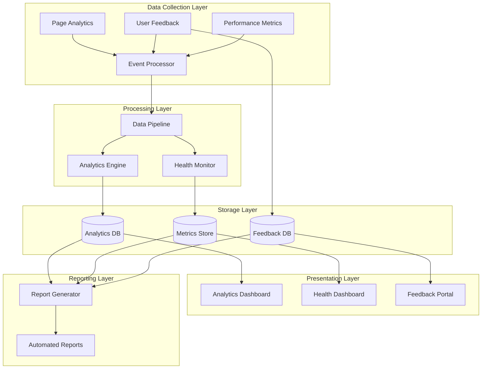

# Documentation Monitoring & Analytics

## Overview

The Cloud Scale Analytics documentation monitoring system provides comprehensive analytics, health monitoring, user feedback collection, and performance tracking capabilities. This system ensures documentation quality, tracks user engagement, and generates actionable insights for continuous improvement.

## Architecture



## Components

### 1. Documentation Analytics System

- __Usage Tracking__: Monitors page visits, unique users, and session duration
- __Journey Mapping__: Tracks user navigation paths through documentation
- __Search Analytics__: Analyzes search queries and result effectiveness
- __Content Performance__: Measures engagement with different documentation sections

### 2. Health Monitoring Dashboard

- __Quality Scores__: Tracks documentation completeness and accuracy
- __Link Health__: Monitors broken links and redirects
- __Build Status__: Displays documentation build success/failure
- __Performance Metrics__: Shows page load times and resource usage

### 3. User Feedback System

- __Page-Level Feedback__: Collects ratings and comments per page
- __Issue Reporting__: Streamlined workflow for documentation issues
- __Suggestions Portal__: Community-driven improvement ideas
- __Contribution Tracking__: Monitors community contributions

### 4. Performance Monitoring

- __Load Times__: Tracks page and asset loading performance
- __Search Response__: Measures search functionality speed
- __Image Optimization__: Monitors image loading and compression
- __Mobile Performance__: Tracks responsiveness across devices

### 5. Automated Reporting

- __Daily Health Reports__: System status and critical issues
- __Weekly Summaries__: Usage patterns and trends
- __Monthly Analysis__: Deep dive into metrics and insights
- __Custom Reports__: Configurable reports for stakeholders

## Privacy & Compliance

### GDPR Compliance

- Anonymous data collection by default
- User consent management
- Data retention policies
- Right to erasure support

### Data Protection

- Encrypted storage for sensitive data
- IP anonymization
- Cookie-less tracking options
- Privacy-preserving analytics

## Quick Start

1. __Enable Monitoring__

   ```bash
   ./scripts/enable-monitoring.sh
   ```

2. __Configure Analytics__

   ```yaml
   # config/analytics.yml
   analytics:
     enabled: true
     privacy_mode: strict
     retention_days: 90
   ```

3. __Access Dashboards__
   - Analytics: `/monitoring/dashboards/analytics`
   - Health: `/monitoring/dashboards/health`
   - Feedback: `/monitoring/feedback/portal`

## Directory Structure

```text
monitoring/
├── analytics/           # Analytics implementation
│   ├── tracker.js      # Client-side tracking
│   ├── processor.py    # Server-side processing
│   └── models.py       # Data models
├── dashboards/         # Dashboard implementations
│   ├── analytics/      # Analytics dashboard
│   ├── health/        # Health monitoring
│   └── performance/   # Performance metrics
├── feedback/          # User feedback system
│   ├── collector.js   # Feedback collection
│   ├── portal.html    # Feedback portal
│   └── workflow.py    # Issue workflow
├── performance/       # Performance monitoring
│   ├── metrics.js     # Client metrics
│   ├── analyzer.py    # Performance analysis
│   └── optimizer.py   # Optimization engine
├── reports/          # Automated reporting
│   ├── generator.py   # Report generation
│   ├── templates/     # Report templates
│   └── scheduler.py   # Report scheduling
└── config/           # Configuration files
    ├── analytics.yml  # Analytics config
    ├── privacy.yml    # Privacy settings
    └── reports.yml    # Reporting config
```

## Metrics Overview

| Metric Category | Key Indicators | Update Frequency |
|----------------|---------------|------------------|
| __Usage__ | Page views, Unique users, Session duration | Real-time |
| __Engagement__ | Scroll depth, Time on page, Bounce rate | Real-time |
| __Search__ | Query volume, Result clicks, Zero results | Real-time |
| __Quality__ | Broken links, Missing pages, Outdated content | Daily |
| __Performance__ | Load time, TTFB, Core Web Vitals | Real-time |
| __Feedback__ | Ratings, Comments, Issues reported | Real-time |

## Integration Points

### MkDocs Integration

```yaml
plugins:
  - search
  - monitoring:
      analytics: true
      feedback: true
      performance: true
```

### CI/CD Integration

```yaml
- name: Documentation Health Check
  uses: ./monitoring/actions/health-check
  with:
    threshold: 90
    metrics: all
```

## Support

- __Documentation__: [Monitoring Guide](./guides/monitoring.md)
- __Issues__: [GitHub Issues](https://github.com/microsoft/csa-inabox-docs/issues)
- __Contact__: <csa-docs-team@microsoft.com>
