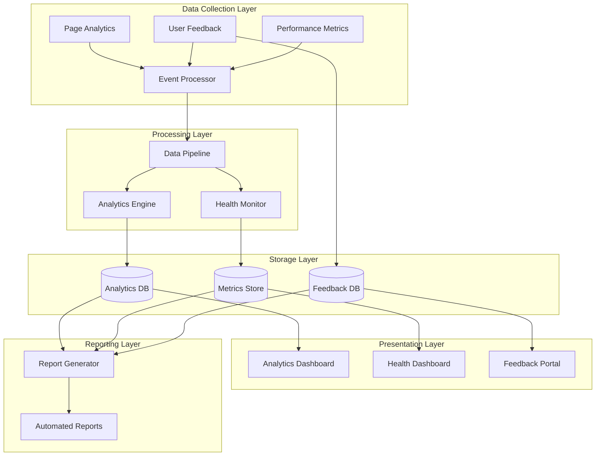

# Documentation Monitoring & Analytics

## Overview

The Cloud Scale Analytics documentation monitoring system provides comprehensive analytics, health monitoring, user feedback collection, and performance tracking capabilities. This system ensures documentation quality, tracks user engagement, and generates actionable insights for continuous improvement.

## Architecture



## Components

### 1. Documentation Analytics System
- **Usage Tracking**: Monitors page visits, unique users, and session duration
- **Journey Mapping**: Tracks user navigation paths through documentation
- **Search Analytics**: Analyzes search queries and result effectiveness
- **Content Performance**: Measures engagement with different documentation sections

### 2. Health Monitoring Dashboard
- **Quality Scores**: Tracks documentation completeness and accuracy
- **Link Health**: Monitors broken links and redirects
- **Build Status**: Displays documentation build success/failure
- **Performance Metrics**: Shows page load times and resource usage

### 3. User Feedback System
- **Page-Level Feedback**: Collects ratings and comments per page
- **Issue Reporting**: Streamlined workflow for documentation issues
- **Suggestions Portal**: Community-driven improvement ideas
- **Contribution Tracking**: Monitors community contributions

### 4. Performance Monitoring
- **Load Times**: Tracks page and asset loading performance
- **Search Response**: Measures search functionality speed
- **Image Optimization**: Monitors image loading and compression
- **Mobile Performance**: Tracks responsiveness across devices

### 5. Automated Reporting
- **Daily Health Reports**: System status and critical issues
- **Weekly Summaries**: Usage patterns and trends
- **Monthly Analysis**: Deep dive into metrics and insights
- **Custom Reports**: Configurable reports for stakeholders

## Privacy & Compliance

### GDPR Compliance
- Anonymous data collection by default
- User consent management
- Data retention policies
- Right to erasure support

### Data Protection
- Encrypted storage for sensitive data
- IP anonymization
- Cookie-less tracking options
- Privacy-preserving analytics

## Quick Start

1. **Enable Monitoring**
   ```bash
   ./scripts/enable-monitoring.sh
   ```

2. **Configure Analytics**
   ```yaml
   # config/analytics.yml
   analytics:
     enabled: true
     privacy_mode: strict
     retention_days: 90
   ```

3. **Access Dashboards**
   - Analytics: `/monitoring/dashboards/analytics`
   - Health: `/monitoring/dashboards/health`
   - Feedback: `/monitoring/feedback/portal`

## Directory Structure

```
monitoring/
├── analytics/           # Analytics implementation
│   ├── tracker.js      # Client-side tracking
│   ├── processor.py    # Server-side processing
│   └── models.py       # Data models
├── dashboards/         # Dashboard implementations
│   ├── analytics/      # Analytics dashboard
│   ├── health/        # Health monitoring
│   └── performance/   # Performance metrics
├── feedback/          # User feedback system
│   ├── collector.js   # Feedback collection
│   ├── portal.html    # Feedback portal
│   └── workflow.py    # Issue workflow
├── performance/       # Performance monitoring
│   ├── metrics.js     # Client metrics
│   ├── analyzer.py    # Performance analysis
│   └── optimizer.py   # Optimization engine
├── reports/          # Automated reporting
│   ├── generator.py   # Report generation
│   ├── templates/     # Report templates
│   └── scheduler.py   # Report scheduling
└── config/           # Configuration files
    ├── analytics.yml  # Analytics config
    ├── privacy.yml    # Privacy settings
    └── reports.yml    # Reporting config
```

## Metrics Overview

| Metric Category | Key Indicators | Update Frequency |
|----------------|---------------|------------------|
| **Usage** | Page views, Unique users, Session duration | Real-time |
| **Engagement** | Scroll depth, Time on page, Bounce rate | Real-time |
| **Search** | Query volume, Result clicks, Zero results | Real-time |
| **Quality** | Broken links, Missing pages, Outdated content | Daily |
| **Performance** | Load time, TTFB, Core Web Vitals | Real-time |
| **Feedback** | Ratings, Comments, Issues reported | Real-time |

## Integration Points

### MkDocs Integration
```yaml
plugins:
  - search
  - monitoring:
      analytics: true
      feedback: true
      performance: true
```

### CI/CD Integration
```yaml
- name: Documentation Health Check
  uses: ./monitoring/actions/health-check
  with:
    threshold: 90
    metrics: all
```

## Support

- **Documentation**: [Monitoring Guide](./guides/monitoring.md)
- **Issues**: [GitHub Issues](https://github.com/microsoft/csa-inabox-docs/issues)
- **Contact**: csa-docs-team@microsoft.com