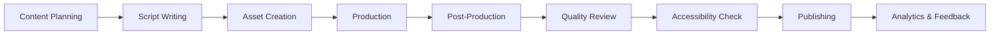

# 🎬 Multimedia Content & Tutorials Hub

> __🏠 [Home](../../README.md)__ | __📖 Documentation__ | __🎬 Multimedia Hub__

## 📋 Overview

Welcome to the Cloud Scale Analytics Multimedia Content Hub - your comprehensive resource for video tutorials, interactive demos, animations, and accessible learning materials. This hub provides diverse content formats to support all learning styles and accessibility needs.

## 🎯 Content Categories

### 📹 [Video Tutorials](./video-tutorials/README.md)

- Architecture walkthroughs with visual narration
- Step-by-step implementation guides
- Troubleshooting scenarios with live debugging
- Best practices demonstrations

### 🎮 [Interactive Demos](./interactive-demos/README.md)

- Embedded code playgrounds
- Live configuration builders
- Decision tree wizards
- Cost/performance calculators

### 🎨 [Animations & Motion Graphics](./animations/README.md)

- Data flow visualizations
- Architecture evolution sequences
- Process workflow animations
- Service interaction patterns

### 📊 [Presentation Templates](./presentations/README.md)

- Executive summary decks
- Technical deep-dive presentations
- Training workshop materials
- Customer demo templates

### 🎧 [Audio Content](./audio-content/README.md)

- Podcast episode scripts
- Voice-over narration guides
- Audio descriptions for accessibility
- Technical discussion formats

## 🚀 Quick Start Guide

### For Content Creators

1. __Choose Your Format__: Select the appropriate content type from our templates
2. __Review Guidelines__: Check our [production standards](./production-guide/README.md)
3. __Use Templates__: Start with our pre-built [templates](./templates/README.md)
4. __Test Accessibility__: Validate with our [accessibility tools](./tools/accessibility/README.md)

### For Learners

1. __Browse by Topic__: Explore content organized by Azure service
2. __Select Format__: Choose your preferred learning medium
3. __Track Progress__: Use our learning path tracker
4. __Provide Feedback__: Help us improve with the feedback widget

## 📱 Supported Formats

| Format | Extensions | Accessibility | Mobile Support |
|--------|-----------|---------------|----------------|
| __Video__ | MP4, WebM, MOV | ✅ Captions, Transcripts | ✅ Responsive |
| __Audio__ | MP3, WAV, OGG | ✅ Transcripts | ✅ Streaming |
| __Interactive__ | HTML5, JS | ✅ Keyboard Nav | ✅ Touch |
| __Presentations__ | PPTX, PDF | ✅ Alt Text | ✅ Download |
| __Animations__ | SVG, Lottie | ✅ Descriptions | ✅ Optimized |

## 🎬 Content Production Pipeline

## 📊 Learning Paths

### 🎯 Architecture Fundamentals

1. __Video__: Cloud Scale Analytics Overview (20 min)
2. __Interactive__: Build Your First Pipeline (30 min)
3. __Animation__: Data Flow Visualization (5 min)
4. __Quiz__: Test Your Knowledge (10 min)

### 🚀 Advanced Implementation

1. __Video Series__: Enterprise Patterns (6 x 15 min)
2. __Code Labs__: Performance Optimization (45 min)
3. __Case Study__: Real-world Scenarios (30 min)
4. __Certification Prep__: Practice Exercises (60 min)

## 🛠️ Production Tools

- __Video__: OBS Studio, DaVinci Resolve, Adobe Premiere
- __Animation__: After Effects, Blender, Lottie
- __Interactive__: CodePen, StackBlitz, CodeSandbox
- __Audio__: Audacity, Adobe Audition
- __Accessibility__: WAVE, axe DevTools, NVDA

## ♿ Accessibility Standards

All multimedia content must meet WCAG 2.1 Level AA standards:

- ✅ __Captions__: All videos include accurate captions
- ✅ __Transcripts__: Full text alternatives for audio/video
- ✅ __Audio Descriptions__: Visual elements described in audio
- ✅ __Keyboard Navigation__: All interactive elements accessible
- ✅ __Screen Reader Support__: Proper ARIA labels and semantics
- ✅ __Color Contrast__: Minimum 4.5:1 ratio for text
- ✅ __Playback Controls__: Pause, stop, volume controls

## 📈 Analytics & Metrics

Track engagement and effectiveness:

- __Completion Rates__: Monitor tutorial completion
- __Engagement Metrics__: Time watched, interactions
- __Learning Outcomes__: Quiz scores, lab completions
- __Accessibility Usage__: Caption/transcript utilization
- __Feedback Scores__: User satisfaction ratings

## 🤝 Contributing

We welcome contributions! See our [contribution guide](./CONTRIBUTING.md) for:

- Content submission guidelines
- Quality standards checklist
- Review and approval process
- Licensing requirements

## 📚 Resources

- [Production Guide](./production-guide/README.md)
- [Template Library](./templates/README.md)
- [Brand Guidelines](./brand/README.md)
- [Accessibility Toolkit](./tools/accessibility/README.md)
- [Analytics Dashboard](./analytics/README.md)

## 📞 Support

- __Technical Issues__: [GitHub Issues](https://github.com/csa-inabox-docs/issues)
- __Content Requests__: [Request Form](./requests/README.md)
- __Accessibility__: <accessibility@cloudscaleanalytics.com>
- __Production Support__: <multimedia@cloudscaleanalytics.com>

---

*Last Updated: January 2025 | Version: 1.0.0*
