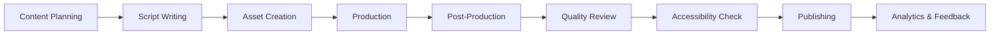

# 🎬 Multimedia Content & Tutorials Hub

> **🏠 [Home](../../README.md)** | **📖 [Documentation](../README.md)** | **🎬 Multimedia Hub**

## 📋 Overview

Welcome to the Cloud Scale Analytics Multimedia Content Hub - your comprehensive resource for video tutorials, interactive demos, animations, and accessible learning materials. This hub provides diverse content formats to support all learning styles and accessibility needs.

## 🎯 Content Categories

### 📹 [Video Tutorials](./video-tutorials/README.md)
- Architecture walkthroughs with visual narration
- Step-by-step implementation guides
- Troubleshooting scenarios with live debugging
- Best practices demonstrations

### 🎮 [Interactive Demos](./interactive-demos/README.md)
- Embedded code playgrounds
- Live configuration builders
- Decision tree wizards
- Cost/performance calculators

### 🎨 [Animations & Motion Graphics](./animations/README.md)
- Data flow visualizations
- Architecture evolution sequences
- Process workflow animations
- Service interaction patterns

### 📊 [Presentation Templates](./presentations/README.md)
- Executive summary decks
- Technical deep-dive presentations
- Training workshop materials
- Customer demo templates

### 🎧 [Audio Content](./audio-content/README.md)
- Podcast episode scripts
- Voice-over narration guides
- Audio descriptions for accessibility
- Technical discussion formats

## 🚀 Quick Start Guide

### For Content Creators

1. **Choose Your Format**: Select the appropriate content type from our templates
2. **Review Guidelines**: Check our [production standards](./production-guide/README.md)
3. **Use Templates**: Start with our pre-built [templates](./templates/README.md)
4. **Test Accessibility**: Validate with our [accessibility tools](./tools/accessibility/README.md)

### For Learners

1. **Browse by Topic**: Explore content organized by Azure service
2. **Select Format**: Choose your preferred learning medium
3. **Track Progress**: Use our learning path tracker
4. **Provide Feedback**: Help us improve with the feedback widget

## 📱 Supported Formats

| Format | Extensions | Accessibility | Mobile Support |
|--------|-----------|---------------|----------------|
| **Video** | MP4, WebM, MOV | ✅ Captions, Transcripts | ✅ Responsive |
| **Audio** | MP3, WAV, OGG | ✅ Transcripts | ✅ Streaming |
| **Interactive** | HTML5, JS | ✅ Keyboard Nav | ✅ Touch |
| **Presentations** | PPTX, PDF | ✅ Alt Text | ✅ Download |
| **Animations** | SVG, Lottie | ✅ Descriptions | ✅ Optimized |

## 🎬 Content Production Pipeline

## 📊 Learning Paths

### 🎯 Architecture Fundamentals
1. **Video**: Cloud Scale Analytics Overview (20 min)
2. **Interactive**: Build Your First Pipeline (30 min)
3. **Animation**: Data Flow Visualization (5 min)
4. **Quiz**: Test Your Knowledge (10 min)

### 🚀 Advanced Implementation
1. **Video Series**: Enterprise Patterns (6 x 15 min)
2. **Code Labs**: Performance Optimization (45 min)
3. **Case Study**: Real-world Scenarios (30 min)
4. **Certification Prep**: Practice Exercises (60 min)

## 🛠️ Production Tools

- **Video**: OBS Studio, DaVinci Resolve, Adobe Premiere
- **Animation**: After Effects, Blender, Lottie
- **Interactive**: CodePen, StackBlitz, CodeSandbox
- **Audio**: Audacity, Adobe Audition
- **Accessibility**: WAVE, axe DevTools, NVDA

## ♿ Accessibility Standards

All multimedia content must meet WCAG 2.1 Level AA standards:

- ✅ **Captions**: All videos include accurate captions
- ✅ **Transcripts**: Full text alternatives for audio/video
- ✅ **Audio Descriptions**: Visual elements described in audio
- ✅ **Keyboard Navigation**: All interactive elements accessible
- ✅ **Screen Reader Support**: Proper ARIA labels and semantics
- ✅ **Color Contrast**: Minimum 4.5:1 ratio for text
- ✅ **Playback Controls**: Pause, stop, volume controls

## 📈 Analytics & Metrics

Track engagement and effectiveness:

- **Completion Rates**: Monitor tutorial completion
- **Engagement Metrics**: Time watched, interactions
- **Learning Outcomes**: Quiz scores, lab completions
- **Accessibility Usage**: Caption/transcript utilization
- **Feedback Scores**: User satisfaction ratings

## 🤝 Contributing

We welcome contributions! See our [contribution guide](./CONTRIBUTING.md) for:

- Content submission guidelines
- Quality standards checklist
- Review and approval process
- Licensing requirements

## 📚 Resources

- [Production Guide](./production-guide/README.md)
- [Template Library](./templates/README.md)
- [Brand Guidelines](./brand/README.md)
- [Accessibility Toolkit](./tools/accessibility/README.md)
- [Analytics Dashboard](./analytics/README.md)

## 📞 Support

- **Technical Issues**: [GitHub Issues](https://github.com/csa-inabox-docs/issues)
- **Content Requests**: [Request Form](./requests/README.md)
- **Accessibility**: accessibility@cloudscaleanalytics.com
- **Production Support**: multimedia@cloudscaleanalytics.com

---

*Last Updated: January 2025 | Version: 1.0.0*