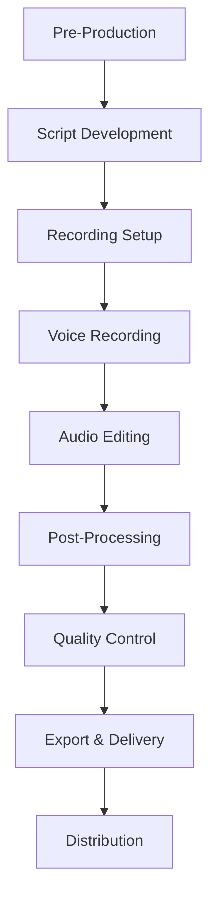

# 🎬 Audio Production Guide

> **🏠 [Home](../../../../README.md)** | **📖 [Documentation](../../../README.md)** | **🎬 [Multimedia](../../README.md)** | **🎧 [Audio Content](../README.md)** | **🎬 Production Guide**


## 📋 Overview

This comprehensive guide covers the complete audio production workflow for creating high-quality educational and technical audio content for Cloud Scale Analytics documentation. From pre-production planning through final delivery, this guide ensures consistent, professional results across all audio projects.

## 🎯 Production Workflow Overview

### Complete Production Pipeline



## 📝 Pre-Production Phase

### Project Planning

```markdown
## Audio Project Brief Template

**Project Title**: [Descriptive name]
**Project Type**: [ ] Podcast [ ] Tutorial Narration [ ] Demo Audio [ ] Other
**Duration**: [Target length]
**Audience**: [Technical level and role]
**Deadline**: [Completion date]

**Content Overview**:
- Purpose and goals
- Key messages
- Target outcomes

**Technical Requirements**:
- Format specifications
- Delivery platforms
- Accessibility requirements

**Resources Needed**:
- Script writer
- Voice talent
- Audio engineer
- Reviewer/SME
```

### Script Development

```markdown
## Script Writing Standards

**Structure**:
1. **Introduction** (10% of total time)
   - Hook: Capture attention in first 10 seconds
   - Context: Set the stage for content
   - Preview: What listeners will learn

2. **Main Content** (75-80% of total time)
   - Logical flow from simple to complex
   - Clear transitions between sections
   - Practical examples throughout
   - Technical accuracy verified

3. **Conclusion** (10-15% of total time)
   - Recap key points
   - Call to action
   - Next steps or resources

**Writing Style**:
- Conversational tone (write for the ear, not the eye)
- Short sentences (15-20 words maximum)
- Active voice preferred
- Technical terms defined on first use
- Natural rhythm and flow
```

### Script Example Template

```markdown
# Audio Script: [Title]

**Target Duration**: [X minutes]
**Word Count**: [Approximately 150 words per minute]
**Narrator**: [Voice talent name]
**Production Date**: [Date]

---

## [00:00] INTRODUCTION

[MUSIC: Intro theme fades in - 5 seconds]

**NARRATOR** [Warm, welcoming tone]:
"Welcome to Cloud Scale Analytics insights. I'm [name], and in the next
[X] minutes, we'll explore [topic]. Whether you're [audience description],
this guide will help you [specific outcome]."

[MUSIC: Fades to background]

## [00:30] SECTION 1: [Topic Name]

**NARRATOR** [Conversational, professional]:
"Let's start with [concept]. [Explain using simple language].

For example, imagine you're [relatable scenario]. This is similar to
how [technical concept] works in Azure Synapse.

[PAUSE - 2 seconds]

Here's what makes this important: [key benefit or insight]."

[SOUND EFFECT: Subtle transition whoosh - 0.5 seconds]

## [02:00] SECTION 2: [Next Topic]

[Continue with remaining content...]

## [XX:XX] CONCLUSION

**NARRATOR** [Enthusiastic but professional]:
"To recap, we've covered:
- [Key point 1]
- [Key point 2]
- [Key point 3]

Your next steps are simple: [actionable advice].

For more information, visit [resource]. Thanks for listening!"

[MUSIC: Outro theme fades in - 5 seconds, then fade out]

---

**PRODUCTION NOTES**:
- Total estimated duration: [X:XX]
- Emphasis on: [specific terms or concepts]
- Pronunciation guide: [any complex terms]
- Music cues: [specific timing requirements]
```

## 🎙️ Recording Phase

### Studio Setup Checklist

```markdown
## Professional Recording Environment

**Acoustic Treatment**:
- [ ] Acoustic foam panels on walls (minimum 25% coverage)
- [ ] Bass traps in corners
- [ ] Reflection filter behind microphone
- [ ] Carpet or rug on floor
- [ ] Minimal hard reflective surfaces
- [ ] Door seals to prevent sound leakage

**Equipment Setup**:
- [ ] Microphone: Condenser or dynamic (XLR connection)
- [ ] Audio Interface: Minimum 24-bit/48kHz
- [ ] Pop filter positioned 2-3 inches from mic
- [ ] Shock mount to reduce vibration
- [ ] Boom arm or mic stand (stable positioning)
- [ ] Studio headphones (closed-back preferred)
- [ ] Cables: XLR, balanced connections

**Recording Software Configuration**:
- [ ] DAW: Audacity, Adobe Audition, Reaper, or similar
- [ ] Sample rate: 48 kHz
- [ ] Bit depth: 24-bit
- [ ] Buffer size: 256-512 samples (low latency)
- [ ] Track format: Mono for voice
- [ ] Auto-save enabled (every 5 minutes)
- [ ] Backup recording path configured
```

### Microphone Techniques

```markdown
## Optimal Microphone Positioning

**Distance**:
- Standard: 6-8 inches from mouth
- Intimate: 3-5 inches (close, personal tone)
- Broadcast: 8-12 inches (professional distance)

**Angle**:
- Slightly off-axis (15-30 degrees)
- Reduces plosive impacts
- Minimizes sibilance
- Natural tone capture

**Height**:
- Microphone at mouth level
- Diaphragm aligned with lips
- Narrator looks straight ahead

**Pop Filter**:
- 2-3 inches from microphone
- Between mouth and mic
- Reduces plosives effectively

**Common Mistakes to Avoid**:
- ❌ Too close (< 4 inches) - muddy, bassy sound
- ❌ Too far (> 12 inches) - thin, room noise increases
- ❌ Directly on-axis - harsh plosives, sibilance
- ❌ Moving during recording - inconsistent tone
```

### Recording Session Best Practices

```markdown
## Professional Recording Workflow

**Pre-Session Preparation** (15-30 minutes before):
1. **Environmental**:
   - Turn off HVAC/air conditioning
   - Close windows and doors
   - Silence all phones and devices
   - Post "Recording in Progress" sign
   - Eliminate ticking clocks, computers with fans

2. **Personal**:
   - Remove jewelry, keys, accessories
   - Avoid rustling clothing
   - Hydrate with room temperature water
   - Avoid dairy products (mucus-producing)
   - Warm up voice for 5-10 minutes

3. **Technical**:
   - Test microphone and interface
   - Set proper input levels (-12 to -6 dBFS peak)
   - Record test file and verify quality
   - Ensure adequate hard drive space
   - Disable system notifications

**During Recording**:
- **Take Slating**: "Take 1, Section 2, Azure Synapse overview"
- **Continuous Recording**: Keep recording between takes
- **Mark Mistakes**: Clap or verbal marker "Pick up from..."
- **Natural Breaks**: Pause 3-5 seconds between sections
- **Stay Hydrated**: Water breaks every 20 minutes
- **Monitor Levels**: Watch for clipping (red indicators)

**Between Takes**:
- Review last take quality
- Note any issues or retakes needed
- Adjust if energy drops
- Rest voice as needed
- Save project frequently

**Post-Session**:
- Record 30-60 seconds of room tone (silence)
- Save all raw files
- Export backup WAV file
- Log session notes and take numbers
- Clear session for next recording
```

### Recording Levels & Monitoring

```markdown
## Proper Audio Levels

**Target Levels During Recording**:
- Peak: -12 to -6 dBFS (leaves headroom)
- Average: -18 to -12 dBFS
- Noise floor: Below -60 dBFS

**Level Indicators**:
- 🟢 Green zone (-18 to -12 dB): Perfect
- 🟡 Yellow zone (-12 to -6 dB): Acceptable
- 🔴 Red zone (above -6 dB): Too hot, reduce gain

**Setting Input Gain**:
1. Ask narrator to read at performance level
2. Observe peak levels during rehearsal
3. Adjust interface preamp gain
4. Aim for peaks hitting -12 to -6 dBFS
5. Test with loudest expected delivery

**Monitoring During Recording**:
- Use headphones to monitor live input
- Listen for: Background noise, mouth clicks, plosives
- Watch: Level meters, clipping indicators
- Check: Consistent tone and quality
```

## ✂️ Editing Phase

### Audio Editing Workflow

```markdown
## Step-by-Step Editing Process

**1. Organization** (10% of time):
- Import all recorded takes
- Label tracks clearly
- Mark good takes with markers
- Delete obvious unusable sections
- Organize by script section

**2. Rough Assembly** (20% of time):
- Select best takes for each section
- Arrange in script order
- Remove long pauses (keep natural rhythm)
- Delete false starts and major errors
- Create basic structure

**3. Detailed Editing** (40% of time):
- Remove mouth clicks and pops
- Eliminate breaths where excessive
- Tighten pacing (remove unnecessary pauses)
- Smooth transitions between takes
- Fix pronunciation issues
- Ensure consistent energy throughout

**4. Music & Effects** (15% of time):
- Add intro/outro music
- Insert transition effects
- Place background music (where appropriate)
- Create music ducking for voice
- Balance all audio elements

**5. Final Polish** (15% of time):
- Listen to complete piece
- Fine-tune edits for smoothness
- Check for any remaining issues
- Verify script accuracy
- Add markers for chapters/sections
```

### Editing Techniques

```markdown
## Professional Editing Methods

**Crossfading Between Takes**:
- Duration: 5-20 milliseconds typical
- Type: Equal power crossfade
- Placement: During pauses or breaths
- Purpose: Seamless transitions

**Breath Control**:
- Don't remove all breaths (sounds unnatural)
- Reduce breath volume by -6 to -12 dB
- Remove breaths only between sentences
- Keep breaths before emphasis
- Maintain natural speaking rhythm

**Pause Management**:
- Short pause: 0.3-0.5 seconds (between phrases)
- Medium pause: 0.8-1.2 seconds (between sentences)
- Long pause: 1.5-2.5 seconds (between sections)
- Excessive pauses: Shorten but don't eliminate

**Fixing Mistakes**:
- Use punch-in recording for small fixes
- Match room tone for edits
- Crossfade carefully to avoid audible seams
- Re-record entire section if needed

**Music Ducking**:
- Fade music -20 to -30 dB when voice starts
- Smooth transition over 1-2 seconds
- Return music to normal level after voice
- Automate rather than manual fades
```

## 🎚️ Post-Processing Phase

### Audio Processing Chain

```markdown
## Standard Processing Order

**1. Noise Reduction** (if needed):
- Capture noise profile from room tone
- Apply gentle reduction (6-10 dB maximum)
- Preserve natural voice character
- Listen for artifacts or "underwater" sound

**2. High-Pass Filter**:
- Frequency: 80-100 Hz
- Slope: 12-18 dB/octave
- Purpose: Remove low-frequency rumble
- Preserves vocal fundamentals

**3. Equalization (EQ)**:
```yaml
eq_settings:
  low_cut:
    frequency: 80Hz
    type: "High-pass"
    slope: "12 dB/octave"

  low_mid_reduction:
    frequency: 200-300Hz
    adjustment: "-2 to -4 dB"
    q_factor: 1.5
    purpose: "Reduce muddiness"

  presence_boost:
    frequency: 3000-5000Hz
    adjustment: "+2 to +4 dB"
    q_factor: 1.0
    purpose: "Enhance clarity and intelligibility"

  high_shelf:
    frequency: 8000Hz
    adjustment: "+1 to +2 dB"
    purpose: "Add air and brightness"
```

**4. De-Esser**:
- Frequency: 6000-8000 Hz
- Threshold: Adjust to taste
- Reduction: 3-6 dB typical
- Purpose: Tame harsh sibilance

**5. Compression**:
```yaml
compression_settings:
  ratio: "3:1 to 4:1"
  threshold: "-20 to -15 dB"
  attack: "10-30 ms (slower for natural sound)"
  release: "50-100 ms (auto release acceptable)"
  knee: "Soft (3-6 dB)"
  makeup_gain: "Adjust to compensate for reduction"
  target: "3-6 dB gain reduction on average"
```

**6. Final Limiting**:
- Threshold: Set for desired loudness
- Ceiling: -1.0 to -0.3 dBFS
- Release: 50-100 ms
- Purpose: Catch peaks, maximize loudness

**7. Loudness Normalization**:
- Target: -16 LUFS (podcast standard)
- Alternative: -14 LUFS (streaming)
- Measure: Integrated loudness
- Tools: Loudness Meter plugin
```

### Processing Tools & Plugins

```markdown
## Recommended Audio Software & Plugins

**Digital Audio Workstations (DAW)**:
- **Audacity**: Free, open-source, beginner-friendly
- **Adobe Audition**: Professional, comprehensive features
- **Reaper**: Affordable, highly customizable
- **Pro Tools**: Industry standard, professional
- **Logic Pro**: Mac only, excellent built-in plugins

**Essential Plugins**:

**Noise Reduction**:
- iZotope RX: Industry-leading restoration
- Audacity Noise Reduction: Built-in, effective
- Waves NS1: Simple, one-knob solution

**EQ**:
- FabFilter Pro-Q 3: Precise, visual
- Waves SSL E-Channel: Classic sound
- Stock DAW EQ: Often sufficient

**Compression**:
- FabFilter Pro-C 2: Transparent, versatile
- Waves CLA-2A: Vintage optical compression
- Stock DAW compressor: Good starting point

**De-Esser**:
- FabFilter Pro-DS: Precise control
- Waves DeEsser: Simple, effective
- Stock de-esser: Basic but functional

**Limiting**:
- iZotope Ozone Maximizer: Transparent
- FabFilter Pro-L 2: Excellent metering
- Waves L2: Classic limiter
```

## 🎯 Quality Control

### QC Checklist

```markdown
## Pre-Delivery Quality Assurance

**Technical Quality**:
- [ ] No clipping or distortion anywhere
- [ ] Consistent volume throughout (±1 dB variance)
- [ ] Background noise below -60 dB
- [ ] No audible pops, clicks, or artifacts
- [ ] Smooth edits, no abrupt transitions
- [ ] Proper stereo imaging (if applicable)
- [ ] Loudness matches target standard (-16 LUFS)
- [ ] File format correct and uncorrupted

**Content Quality**:
- [ ] Script followed accurately
- [ ] All technical information correct
- [ ] Pronunciation consistent and accurate
- [ ] Pacing appropriate for content type
- [ ] Natural, engaging delivery
- [ ] Clear articulation throughout
- [ ] Proper emphasis on key points

**Production Quality**:
- [ ] Music levels appropriate (not distracting)
- [ ] Sound effects support content
- [ ] Transitions smooth and professional
- [ ] Intro/outro polished
- [ ] Overall coherence and flow

**Metadata & Documentation**:
- [ ] Correct title and description
- [ ] ID3 tags complete and accurate
- [ ] Chapter markers added (if applicable)
- [ ] Transcript prepared and synced
- [ ] Show notes written
- [ ] Related resources linked
```

### Listening Environments

```markdown
## Multi-Environment Testing

**Test Playback On**:
1. **Studio Monitors**: Reference quality check
2. **Consumer Headphones**: Common listening scenario
3. **Laptop Speakers**: Worst-case scenario
4. **Car Speakers**: Real-world environment
5. **Phone Speaker**: Mobile consumption
6. **Earbuds**: Portable listening

**What to Listen For**:
- Clarity and intelligibility across all systems
- Appropriate bass/treble balance
- Music doesn't overpower voice
- No harsh or fatiguing frequencies
- Consistent volume perception
```

## 📦 Export & Delivery

### Export Specifications

```markdown
## Output Formats

**Master Archive**:
```yaml
format: WAV
sample_rate: 48kHz
bit_depth: 24-bit
channels: Mono (voice) or Stereo (music)
normalization: None (preserve dynamic range)
purpose: Future editing and re-mastering
storage: Secure backup location
```

**Production Master**:
```yaml
format: WAV
sample_rate: 48kHz
bit_depth: 16-bit
channels: Stereo
loudness: -16 LUFS integrated
true_peak: -1.0 dBFS maximum
purpose: Final mixdown before encoding
```

**Distribution - Podcast**:
```yaml
format: MP3
bitrate: 128 kbps CBR (minimum) or 192-320 kbps
sample_rate: 44.1 kHz
channels: Stereo (or mono encoded as stereo)
loudness: -16 LUFS
metadata: Complete ID3v2.4 tags
  - Title
  - Artist/Author
  - Album/Series
  - Track number
  - Year
  - Cover art (minimum 1400x1400px)
  - Description
  - Website URL
```

**Distribution - Tutorial/Demo**:
```yaml
format: MP3 or M4A
bitrate: 192-320 kbps
sample_rate: 48 kHz
loudness: -16 LUFS
format_preference: M4A for better quality at lower bitrate
```

### File Naming Conventions

```markdown
## Standardized Naming

**Format**: `[ProjectCode]-[Type]-[Title]-[Version].[ext]`

**Examples**:
- `CSA-PODCAST-EP001-Synapse-Introduction-v1.2.mp3`
- `CSA-TUTORIAL-Workspace-Setup-FINAL.wav`
- `CSA-DEMO-Delta-Lake-Optimization-v2.mp3`

**Version Control**:
- `v1.0`: Initial production
- `v1.1`: Minor edits/corrections
- `v2.0`: Major revision
- `FINAL`: Approved for distribution
- `MASTER`: Archive quality file
```

## 📊 Project Documentation

### Production Report Template

```markdown
# Audio Production Report

**Project**: [Name]
**Date**: [Completion date]
**Producer**: [Name]

## Project Overview
- Duration: [Final runtime]
- Format: [Technical specs]
- Delivery: [Platforms/locations]

## Production Details
- Script version: [Version number]
- Recording date: [Date]
- Voice talent: [Name(s)]
- Engineer: [Name]
- Editor: [Name]

## Technical Specifications
- Sample rate: [48 kHz]
- Bit depth: [24-bit master, 16-bit delivery]
- Loudness: [-16 LUFS]
- Peak level: [-1.0 dBFS]

## Assets Delivered
- [ ] Master WAV file
- [ ] Distribution MP3
- [ ] Transcript (plain text + WebVTT)
- [ ] Cover art / thumbnail
- [ ] Show notes
- [ ] Chapter markers

## Post-Production Notes
[Any issues, special techniques used, lessons learned]

## Archive Location
- Master files: [Path/location]
- Distribution files: [Path/location]
- Project files: [DAW session location]
```

## 🔗 Related Resources

- [Narration Guidelines](../narration-guidelines.md)
- [Recording Setup](../recording-setup.md)
- [Editing Guidelines](../editing-guidelines.md)
- [Audio Accessibility](./accessibility.md)
- [Distribution Channels](../distribution-channels.md)

## 💬 Feedback

Questions or suggestions about audio production processes?

- **Production Support**: audioproduction@cloudscaleanalytics.com
- **Technical Issues**: techsupport@cloudscaleanalytics.com
- **Training**: training@cloudscaleanalytics.com

---

*Last Updated: January 2025 | Version: 1.0.0*
