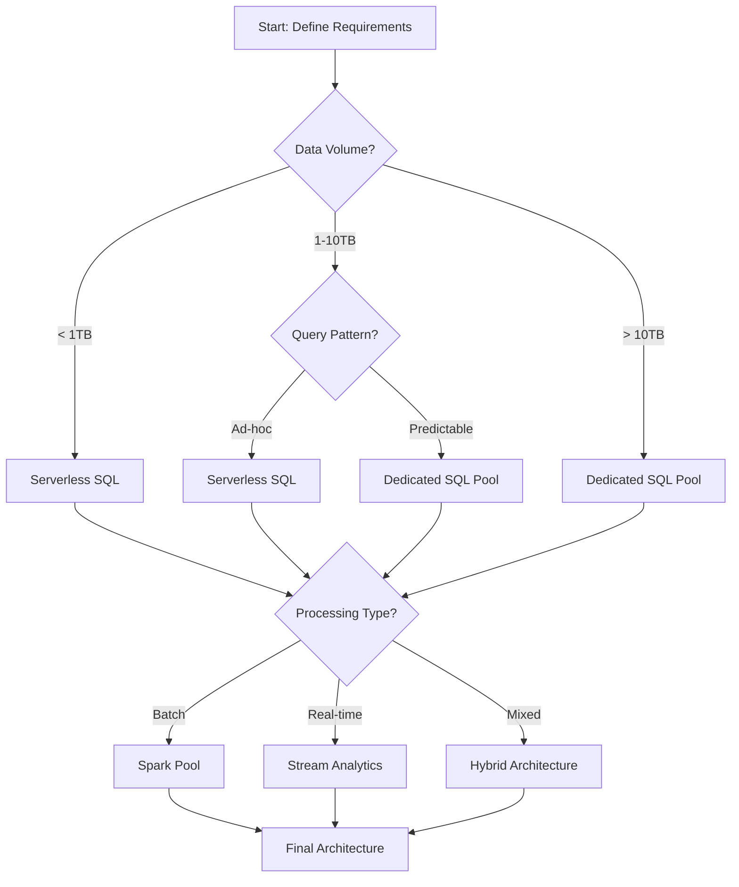

# 🎮 Interactive Demos & Code Playgrounds

> __🏠 [Home](../../../README.md)__ | __📖 [Documentation](../../README.md)__ | __🎬 Multimedia__ | __🎮 Interactive Demos__


## 📋 Overview

Interactive demonstrations and hands-on code playgrounds that allow users to experiment with Cloud Scale Analytics configurations, explore architecture patterns, and test implementations in a safe, sandboxed environment.

## 🚀 Available Interactive Demos

### 🏢 Workspace & Environment

#### [Synapse Workspace Tour](synapse-workspace-tour.md)

Interactive walkthrough of Azure Synapse Analytics workspace components and features. Learn workspace navigation, service integration, and management capabilities.

**Duration:** 20 minutes | **Complexity:** Basic | **Prerequisites:** Azure account

---

### 💻 Development Environments

#### [Spark Notebook Sandbox](spark-notebook-sandbox.md)

Hands-on interactive Spark notebook environment for learning PySpark, Scala, and Delta Lake operations.

**Duration:** 30 minutes | **Complexity:** Intermediate | **Prerequisites:** Basic Python knowledge

#### [SQL Query Playground](sql-query-playground.md)

Interactive SQL query environment for practicing Synapse SQL, performance tuning, and query optimization.

**Duration:** 25 minutes | **Complexity:** Intermediate | **Prerequisites:** Basic SQL knowledge

---

### 🔄 Pipeline & Data Flow

#### [Pipeline Builder Demo](pipeline-builder-demo.md)

Visual drag-and-drop pipeline builder for creating ETL/ELT workflows with Azure Data Factory integration.

**Duration:** 35 minutes | **Complexity:** Intermediate | **Prerequisites:** ETL/ELT concepts

#### [Data Flow Designer](data-flow-designer.md)

Interactive designer for creating data transformation flows with visual mapping and code generation.

**Duration:** 30 minutes | **Complexity:** Intermediate | **Prerequisites:** Data transformation knowledge

---

### 💰 Planning & Optimization

#### [Cost Calculator](cost-calculator.md)

Comprehensive cost estimation tool for Azure Synapse Analytics services with real-time pricing.

**Duration:** 20 minutes | **Complexity:** Basic | **Prerequisites:** Basic Azure knowledge

#### [Resource Planner](resource-planner.md)

Interactive capacity planning calculator for optimizing Spark pools, SQL pools, and storage resources.

**Duration:** 30 minutes | **Complexity:** Intermediate | **Prerequisites:** Capacity planning basics

---

### 🏗️ Architecture & Design

#### [Architecture Explorer](architecture-explorer.md)

Interactive architecture diagram explorer with drill-down capabilities and design pattern examples.

**Duration:** 25 minutes | **Complexity:** Intermediate | **Prerequisites:** Cloud architecture basics

#### [Schema Designer](schema-designer.md)

Visual database schema design tool with data modeling, relationships, and validation features.

**Duration:** 20 minutes | **Complexity:** Basic | **Prerequisites:** Database concepts

---

### 🔒 Security & Configuration

#### [Security Configuration Wizard](security-configuration.md)

Step-by-step security setup wizard covering authentication, authorization, and network security.

**Duration:** 30 minutes | **Complexity:** Advanced | **Prerequisites:** Security concepts

---

### 📊 Monitoring & Optimization

#### [Monitoring Dashboard Builder](monitoring-dashboard-builder.md)

Interactive dashboard builder for creating custom monitoring views and alerts.

**Duration:** 25 minutes | **Complexity:** Intermediate | **Prerequisites:** Monitoring basics

#### [Query Optimizer](query-optimizer.md)

Interactive query optimization demo with performance analysis and tuning recommendations.

**Duration:** 30 minutes | **Complexity:** Advanced | **Prerequisites:** SQL performance tuning

---

### 🔍 Data Governance

#### [Data Lineage Explorer](data-lineage-explorer.md)

Visual data lineage tracking tool showing data flow from source to destination with transformations.

**Duration:** 25 minutes | **Complexity:** Intermediate | **Prerequisites:** Data governance concepts

---

### 🚀 Migration & Assessment

#### [Migration Assessment Wizard](migration-assessment.md)

Comprehensive migration assessment tool for planning Azure Synapse Analytics migrations.

**Duration:** 45 minutes | **Complexity:** Advanced | **Prerequisites:** Migration planning experience

---

## 🎯 Demo Categories

### By Complexity Level

**Basic (Beginner-Friendly)**
- [Synapse Workspace Tour](synapse-workspace-tour.md)
- [Cost Calculator](cost-calculator.md)
- [Schema Designer](schema-designer.md)

**Intermediate (Some Experience Required)**
- [Spark Notebook Sandbox](spark-notebook-sandbox.md)
- [SQL Query Playground](sql-query-playground.md)
- [Pipeline Builder Demo](pipeline-builder-demo.md)
- [Data Flow Designer](data-flow-designer.md)
- [Resource Planner](resource-planner.md)
- [Architecture Explorer](architecture-explorer.md)
- [Monitoring Dashboard Builder](monitoring-dashboard-builder.md)
- [Data Lineage Explorer](data-lineage-explorer.md)

**Advanced (Expert Level)**
- [Security Configuration Wizard](security-configuration.md)
- [Query Optimizer](query-optimizer.md)
- [Migration Assessment Wizard](migration-assessment.md)

### By Use Case

**Learning & Education**
- Synapse Workspace Tour
- Spark Notebook Sandbox
- SQL Query Playground

**Development & Implementation**
- Pipeline Builder Demo
- Data Flow Designer
- Schema Designer
- Architecture Explorer

**Planning & Optimization**
- Cost Calculator
- Resource Planner
- Query Optimizer

**Security & Governance**
- Security Configuration Wizard
- Data Lineage Explorer

**Migration & Modernization**
- Migration Assessment Wizard

---

## 🏗️ Technical Architecture

### Interactive Demo Framework

```javascript
// Architecture Builder Configuration
const architectureBuilder = {
  components: {
    compute: ['Serverless SQL', 'Dedicated SQL', 'Spark Pools'],
    storage: ['Data Lake Gen2', 'Blob Storage', 'Cosmos DB'],
    integration: ['Data Factory', 'Event Hubs', 'IoT Hub'],
    security: ['Private Endpoints', 'Managed VNet', 'AAD Auth']
  },
  features: {
    validation: true,        // Real-time architecture validation
    costEstimation: true,   // Live cost calculator
    bestPractices: true,    // Automatic recommendations
    exportOptions: ['ARM', 'Bicep', 'Terraform']
  },
  constraints: {
    maxComponents: 50,
    regions: ['East US', 'West Europe', 'Southeast Asia'],
    compliance: ['HIPAA', 'GDPR', 'SOC2']
  }
};
```

### 💰 Cost Calculator Tool

__[Open Cost Calculator](./demos/cost-calculator/index.html)__

Interactive calculator for estimating Azure Synapse Analytics costs.

```html
<!DOCTYPE html>
<html lang="en">
<head>
  <title>Azure Synapse Cost Calculator</title>
  <link rel="stylesheet" href="./styles/calculator.css">
</head>
<body>
  <div class="calculator-container">
    <h1>💰 Azure Synapse Cost Calculator</h1>
    
    <div class="input-section">
      <h2>Serverless SQL Pool</h2>
      <label>Data Processed (TB/month):
        <input type="range" id="serverless-data" min="0" max="100" value="10">
        <span id="serverless-value">10 TB</span>
      </label>
    </div>
    
    <div class="input-section">
      <h2>Dedicated SQL Pool</h2>
      <label>DWU Level:
        <select id="dwu-level">
          <option value="100">DW100c</option>
          <option value="500">DW500c</option>
          <option value="1000">DW1000c</option>
          <option value="2000">DW2000c</option>
        </select>
      </label>
      <label>Hours/month:
        <input type="number" id="dedicated-hours" value="720">
      </label>
    </div>
    
    <div class="input-section">
      <h2>Spark Pool</h2>
      <label>Node Size:
        <select id="spark-size">
          <option value="small">Small (4 vCores)</option>
          <option value="medium">Medium (8 vCores)</option>
          <option value="large">Large (16 vCores)</option>
        </select>
      </label>
      <label>Node Count:
        <input type="range" id="spark-nodes" min="3" max="50" value="5">
        <span id="spark-nodes-value">5 nodes</span>
      </label>
    </div>
    
    <div class="results-section">
      <h2>📊 Estimated Monthly Cost</h2>
      <div class="cost-breakdown">
        <div class="cost-item">
          <span>Serverless SQL:</span>
          <span id="serverless-cost">$50</span>
        </div>
        <div class="cost-item">
          <span>Dedicated SQL:</span>
          <span id="dedicated-cost">$1,450</span>
        </div>
        <div class="cost-item">
          <span>Spark Pool:</span>
          <span id="spark-cost">$850</span>
        </div>
        <div class="cost-total">
          <strong>Total:</strong>
          <strong id="total-cost">$2,350</strong>
        </div>
      </div>
    </div>
  </div>
  
  <script src="./scripts/calculator.js"></script>
</body>
</html>
```

### 🎯 Query Optimizer Playground

__[Try Query Optimizer](./demos/query-optimizer/index.html)__

Interactive SQL query optimization tool with real-time performance analysis.

```javascript
// Query Optimizer Configuration
class QueryOptimizer {
  constructor() {
    this.rules = [
      {
        name: 'Index Usage',
        check: (query) => this.checkIndexUsage(query),
        suggestion: 'Consider adding indexes on JOIN columns'
      },
      {
        name: 'Partition Elimination',
        check: (query) => this.checkPartitionElimination(query),
        suggestion: 'Add partition filters to reduce data scan'
      },
      {
        name: 'Distribution Strategy',
        check: (query) => this.checkDistribution(query),
        suggestion: 'Use HASH distribution for large fact tables'
      }
    ];
  }
  
  analyze(query) {
    const results = {
      originalQuery: query,
      issues: [],
      optimizedQuery: '',
      estimatedImprovement: 0
    };
    
    this.rules.forEach(rule => {
      if (!rule.check(query)) {
        results.issues.push({
          rule: rule.name,
          suggestion: rule.suggestion
        });
      }
    });
    
    results.optimizedQuery = this.optimize(query);
    results.estimatedImprovement = this.calculateImprovement(query);
    
    return results;
  }
}
```

### 🔄 Pipeline Designer

__[Open Pipeline Designer](./demos/pipeline-designer/index.html)__

Visual pipeline designer for Azure Data Factory workflows.

### 📊 Data Flow Simulator

__[Launch Data Flow Simulator](./demos/data-flow-simulator/index.html)__

Simulate and visualize data flows through your architecture.

## 🛠️ Code Playground Examples

### Python Spark Notebook

```python
# Interactive Spark DataFrame Operations
from pyspark.sql import SparkSession
from pyspark.sql.functions import col, sum, avg, window
from pyspark.sql.types import *

# Initialize Spark Session
spark = SparkSession.builder \
    .appName("Interactive Demo") \
    .config("spark.sql.adaptive.enabled", "true") \
    .config("spark.sql.adaptive.coalescePartitions.enabled", "true") \
    .getOrCreate()

# Sample Data Generator
def generate_sample_data(num_records=1000):
    """Generate sample sales data for demo"""
    import random
    from datetime import datetime, timedelta
    
    data = []
    products = ['Laptop', 'Phone', 'Tablet', 'Monitor', 'Keyboard']
    regions = ['North', 'South', 'East', 'West']
    
    for i in range(num_records):
        data.append({
            'transaction_id': i + 1,
            'timestamp': datetime.now() - timedelta(days=random.randint(0, 30)),
            'product': random.choice(products),
            'region': random.choice(regions),
            'quantity': random.randint(1, 10),
            'price': random.uniform(100, 2000)
        })
    
    return spark.createDataFrame(data)

# Interactive Analysis
df = generate_sample_data(10000)

# Try these operations:
# 1. Basic aggregations
sales_by_product = df.groupBy("product") \
    .agg(
        sum("quantity").alias("total_quantity"),
        avg("price").alias("avg_price"),
        sum(col("quantity") * col("price")).alias("revenue")
    )

# 2. Window functions
from pyspark.sql.window import Window

window_spec = Window.partitionBy("region").orderBy("timestamp")
df_with_rank = df.withColumn(
    "rank", 
    row_number().over(window_spec)
)

# 3. Time-based aggregations
hourly_sales = df.groupBy(
    window("timestamp", "1 hour"),
    "region"
).agg(
    sum("quantity").alias("items_sold"),
    sum(col("quantity") * col("price")).alias("revenue")
).orderBy("window")

# Visualize results
sales_by_product.show()
print(f"Total Revenue: ${df.agg(sum(col('quantity') * col('price'))).collect()[0][0]:,.2f}")
```

### SQL Query Playground

```sql
-- Interactive SQL Query Examples
-- Try modifying these queries in the playground

-- Example 1: Performance Comparison
-- Before Optimization
SELECT 
    p.ProductName,
    c.CategoryName,
    SUM(od.Quantity * od.UnitPrice) as Revenue
FROM Products p
JOIN Categories c ON p.CategoryID = c.CategoryID
JOIN OrderDetails od ON p.ProductID = od.ProductID
JOIN Orders o ON od.OrderID = o.OrderID
WHERE o.OrderDate >= '2024-01-01'
GROUP BY p.ProductName, c.CategoryName
ORDER BY Revenue DESC;

-- After Optimization (with partitioning and indexing)
WITH ProductRevenue AS (
    SELECT 
        od.ProductID,
        SUM(od.Quantity * od.UnitPrice) as Revenue
    FROM OrderDetails od
    JOIN Orders o ON od.OrderID = o.OrderID
    WHERE o.OrderDate >= '2024-01-01'
        AND o.OrderDate < '2024-02-01'  -- Partition elimination
    GROUP BY od.ProductID
)
SELECT 
    p.ProductName,
    c.CategoryName,
    pr.Revenue
FROM ProductRevenue pr
JOIN Products p ON pr.ProductID = p.ProductID
JOIN Categories c ON p.CategoryID = c.CategoryID
WHERE pr.Revenue > 1000  -- Filter early
ORDER BY pr.Revenue DESC;

-- Example 2: Window Functions
WITH SalesAnalysis AS (
    SELECT 
        Region,
        ProductCategory,
        OrderDate,
        SalesAmount,
        ROW_NUMBER() OVER (PARTITION BY Region ORDER BY SalesAmount DESC) as RankInRegion,
        SUM(SalesAmount) OVER (PARTITION BY Region ORDER BY OrderDate 
            ROWS BETWEEN UNBOUNDED PRECEDING AND CURRENT ROW) as RunningTotal,
        AVG(SalesAmount) OVER (PARTITION BY Region ORDER BY OrderDate 
            ROWS BETWEEN 6 PRECEDING AND CURRENT ROW) as MovingAvg7Day
    FROM Sales
    WHERE OrderDate >= DATEADD(month, -3, GETDATE())
)
SELECT * FROM SalesAnalysis
WHERE RankInRegion <= 10;
```

## 🎯 Decision Tree Wizards

### Architecture Decision Tree



### Implementation Wizard

__[Launch Implementation Wizard](./demos/implementation-wizard/index.html)__

Step-by-step guided setup for common scenarios:

1. __Data Lake Setup__
   - Storage account configuration
   - Container structure
   - Access control setup
   - Sample data upload

2. __Workspace Configuration__
   - Workspace creation
   - Linked services
   - Security settings
   - Git integration

3. __Pipeline Development__
   - Source connection
   - Transformation logic
   - Destination setup
   - Schedule configuration

## 🧮 Interactive Calculators

### Performance Calculator

```javascript
class PerformanceCalculator {
  constructor() {
    this.metrics = {
      dataSize: 0,
      complexity: 'simple',
      concurrency: 1,
      indexing: false,
      partitioning: false,
      caching: false
    };
  }
  
  calculate() {
    let baseTime = this.metrics.dataSize * 0.01; // seconds per GB
    
    // Complexity multiplier
    const complexityFactors = {
      simple: 1,
      moderate: 2.5,
      complex: 5,
      extreme: 10
    };
    baseTime *= complexityFactors[this.metrics.complexity];
    
    // Concurrency impact
    baseTime *= Math.log10(this.metrics.concurrency + 1);
    
    // Optimization benefits
    if (this.metrics.indexing) baseTime *= 0.3;
    if (this.metrics.partitioning) baseTime *= 0.5;
    if (this.metrics.caching) baseTime *= 0.2;
    
    return {
      estimatedTime: baseTime,
      throughput: this.metrics.dataSize / baseTime,
      recommendations: this.getRecommendations()
    };
  }
  
  getRecommendations() {
    const recommendations = [];
    
    if (!this.metrics.indexing && this.metrics.complexity !== 'simple') {
      recommendations.push('Add indexes to improve query performance');
    }
    
    if (!this.metrics.partitioning && this.metrics.dataSize > 100) {
      recommendations.push('Implement partitioning for large datasets');
    }
    
    if (!this.metrics.caching && this.metrics.concurrency > 10) {
      recommendations.push('Enable result caching for high concurrency');
    }
    
    return recommendations;
  }
}
```

### Resource Sizing Calculator

__[Open Resource Calculator](./demos/resource-calculator/index.html)__

Calculate optimal resource allocation based on workload characteristics.

## 🎨 Interactive Visualizations

### Data Flow Animation

```html
<div class="data-flow-container">
  <svg viewBox="0 0 800 400" class="flow-diagram">
    <!-- Animated data flow paths -->
    <defs>
      <marker id="arrowhead" markerWidth="10" markerHeight="10" 
              refX="9" refY="3" orient="auto">
        <polygon points="0 0, 10 3, 0 6" fill="#0078D4" />
      </marker>
    </defs>
    
    <!-- Source -->
    <g class="source-node" transform="translate(100, 200)">
      <rect width="120" height="60" rx="5" fill="#E8F4FD" stroke="#0078D4"/>
      <text x="60" y="35" text-anchor="middle">Data Source</text>
    </g>
    
    <!-- Processing -->
    <g class="processing-node" transform="translate(350, 200)">
      <rect width="120" height="60" rx="5" fill="#E8F4FD" stroke="#0078D4"/>
      <text x="60" y="35" text-anchor="middle">Processing</text>
    </g>
    
    <!-- Destination -->
    <g class="destination-node" transform="translate(600, 200)">
      <rect width="120" height="60" rx="5" fill="#E8F4FD" stroke="#0078D4"/>
      <text x="60" y="35" text-anchor="middle">Destination</text>
    </g>
    
    <!-- Animated paths -->
    <path class="data-flow-path" d="M 220 230 L 350 230" 
          stroke="#0078D4" stroke-width="2" fill="none" 
          marker-end="url(#arrowhead)">
      <animate attributeName="stroke-dasharray" 
               values="0 100;100 0" dur="2s" repeatCount="indefinite"/>
    </path>
    
    <path class="data-flow-path" d="M 470 230 L 600 230" 
          stroke="#0078D4" stroke-width="2" fill="none" 
          marker-end="url(#arrowhead)">
      <animate attributeName="stroke-dasharray" 
               values="0 100;100 0" dur="2s" begin="1s" 
               repeatCount="indefinite"/>
    </path>
  </svg>
</div>
```

## 📦 Embedded Playground Components

### CodeSandbox Integration

```html
<iframe
  src="https://codesandbox.io/embed/azure-synapse-demo-xxxxx?fontsize=14&theme=dark"
  style="width:100%; height:500px; border:0; border-radius: 4px; overflow:hidden;"
  title="Azure Synapse Demo"
  allow="accelerometer; ambient-light-sensor; camera; encrypted-media; geolocation; gyroscope; hid; microphone; midi; payment; usb; vr; xr-spatial-tracking"
  sandbox="allow-forms allow-modals allow-popups allow-presentation allow-same-origin allow-scripts"
></iframe>
```

### StackBlitz Integration

```html
<iframe
  src="https://stackblitz.com/edit/synapse-analytics-demo?embed=1&file=index.ts"
  style="width:100%; height:600px; border:0; border-radius: 4px; overflow:hidden;"
  title="Synapse Analytics Demo"
></iframe>
```

## 🎓 Learning Path Tracker

### Progress Dashboard

```javascript
class LearningPathTracker {
  constructor(userId) {
    this.userId = userId;
    this.progress = this.loadProgress();
  }
  
  loadProgress() {
    return localStorage.getItem(`progress_${this.userId}`) || {
      completed: [],
      inProgress: [],
      bookmarks: [],
      achievements: []
    };
  }
  
  completeModule(moduleId) {
    this.progress.completed.push({
      moduleId,
      completedAt: new Date().toISOString(),
      score: this.calculateScore(moduleId)
    });
    
    this.checkAchievements();
    this.saveProgress();
  }
  
  getRecommendations() {
    // AI-powered recommendation engine
    const completed = this.progress.completed.map(m => m.moduleId);
    const recommendations = [];
    
    // Logic to suggest next modules based on completion
    if (completed.includes('basics')) {
      recommendations.push('intermediate-queries');
    }
    
    if (completed.includes('intermediate-queries')) {
      recommendations.push('performance-optimization');
    }
    
    return recommendations;
  }
}
```

## 🔧 Development Framework

### Interactive Component Template

```javascript
// Base Interactive Component Class
class InteractiveComponent {
  constructor(containerId, config = {}) {
    this.container = document.getElementById(containerId);
    this.config = {
      theme: 'light',
      responsive: true,
      accessibility: true,
      analytics: true,
      ...config
    };
    
    this.init();
  }
  
  init() {
    this.setupDOM();
    this.attachEventListeners();
    this.loadState();
    this.render();
    
    if (this.config.analytics) {
      this.trackUsage();
    }
  }
  
  setupDOM() {
    // Create component structure
    this.container.innerHTML = this.getTemplate();
  }
  
  getTemplate() {
    return `
      <div class="interactive-component">
        <div class="component-header">
          <h3>${this.config.title}</h3>
          <button class="reset-btn" aria-label="Reset">↻</button>
        </div>
        <div class="component-body">
          ${this.getBodyContent()}
        </div>
        <div class="component-footer">
          ${this.getFooterContent()}
        </div>
      </div>
    `;
  }
  
  attachEventListeners() {
    // Add interactivity
    this.container.querySelector('.reset-btn')
      .addEventListener('click', () => this.reset());
  }
  
  trackUsage() {
    // Analytics tracking
    if (window.gtag) {
      window.gtag('event', 'interactive_component_loaded', {
        component_type: this.constructor.name,
        component_id: this.container.id
      });
    }
  }
}
```

## 📊 Analytics & Feedback

### Interaction Tracking

```javascript
// Track user interactions for improvement
const InteractionTracker = {
  track(event, data) {
    const payload = {
      timestamp: new Date().toISOString(),
      event,
      data,
      sessionId: this.getSessionId(),
      userId: this.getUserId()
    };
    
    // Send to analytics endpoint
    fetch('/api/analytics', {
      method: 'POST',
      headers: { 'Content-Type': 'application/json' },
      body: JSON.stringify(payload)
    });
  },
  
  trackDemoUsage(demoId, action) {
    this.track('demo_interaction', {
      demoId,
      action,
      duration: performance.now()
    });
  }
};
```

## 🚀 Quick Start for Developers

### Creating New Interactive Demos

1. __Setup Development Environment__

```bash
npm install @azure/synapse-demo-toolkit
npm install -D webpack webpack-cli typescript
```

1. __Create Demo Component__

```typescript
import { InteractiveDemo } from '@azure/synapse-demo-toolkit';

export class MyCustomDemo extends InteractiveDemo {
  constructor(config) {
    super(config);
  }
  
  async initialize() {
    // Setup demo
  }
  
  async run() {
    // Execute demo logic
  }
}
```

1. __Deploy to Documentation__

```bash
npm run build
npm run deploy-demo --name="my-custom-demo"
```

## 📚 Resources

- [Demo Development Guide](./guides/demo-development.md)
- [Component Library](./components/README.md)
- [API Documentation](./api/README.md)
- [Accessibility Guidelines](./guides/accessibility.md)
- [Performance Best Practices](./guides/performance.md)

---

*Last Updated: January 2025 | Version: 1.0.0*
