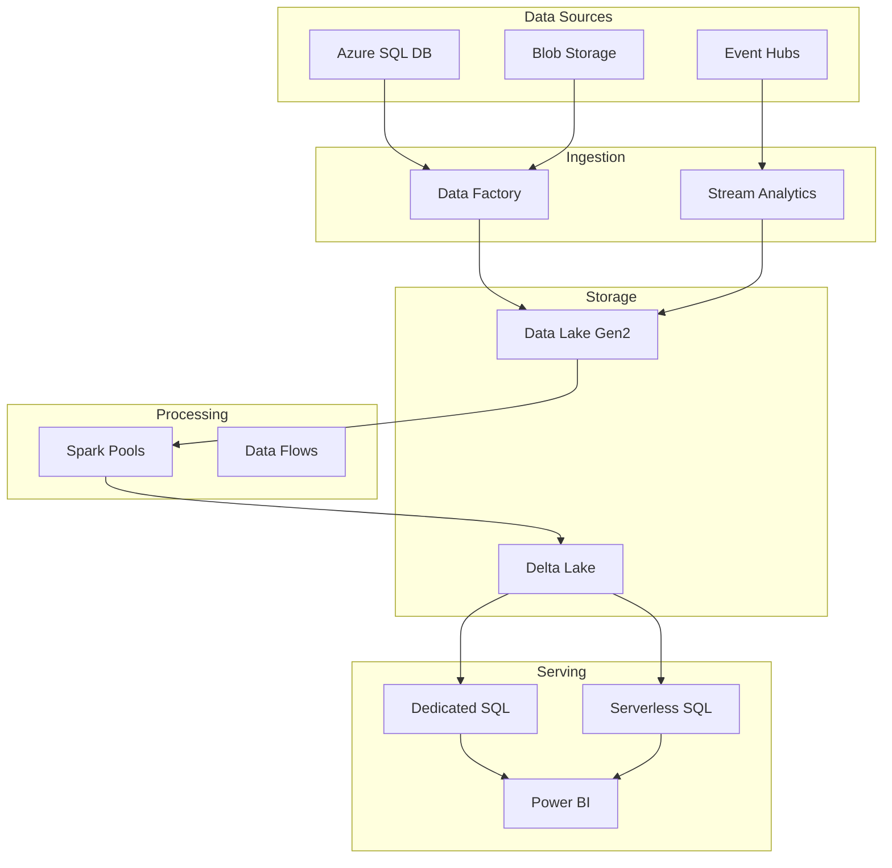

# 🏗️ Interactive Architecture Explorer

> **🏠 [Home](../../../README.md)** | **📖 [Documentation](../../README.md)** | **🎬 [Multimedia](../README.md)** | **🎮 [Interactive Demos](README.md)** | **👤 Architecture Explorer**


## 📋 Overview

Explore Azure Synapse architectures interactively with clickable diagrams, component deep-dives, and real-world reference implementations. Navigate complex architectures visually to understand data flows, integrations, and design patterns.

**Duration:** 30-40 minutes | **Format:** Interactive architecture diagrams | **Prerequisites:** Basic cloud architecture knowledge

## 🎯 Learning Objectives

- Explore different Synapse architecture patterns interactively
- Understand component relationships and data flows
- Navigate from high-level to detailed component views
- Compare architecture options for different scenarios
- Learn best practices through annotated diagrams
- Export architecture diagrams for documentation

## 🚀 Interactive Features

### Clickable Architecture Diagram

```html
<svg id="architecture-diagram" viewBox="0 0 1200 800">
  <!-- Data Sources Layer -->
  <g id="data-sources" class="clickable-layer">
    <rect x="50" y="50" width="150" height="100" class="component" data-component="blob-storage"/>
    <text x="125" y="105">Azure Blob Storage</text>
  </g>

  <!-- Ingestion Layer -->
  <g id="ingestion" class="clickable-layer">
    <rect x="300" y="50" width="150" height="100" class="component" data-component="data-factory"/>
    <text x="375" y="105">Data Factory</text>
  </g>

  <!-- Processing Layer -->
  <g id="processing" class="clickable-layer">
    <rect x="550" y="50" width="150" height="100" class="component" data-component="spark-pool"/>
    <text x="625" y="105">Spark Pool</text>
  </g>

  <!-- Data flows -->
  <path d="M 200 100 L 300 100" class="data-flow animated"/>
  <path d="M 450 100 L 550 100" class="data-flow animated"/>
</svg>

<script>
document.querySelectorAll('.component').forEach(el => {
  el.addEventListener('click', (e) => {
    const component = e.target.getAttribute('data-component');
    showComponentDetails(component);
  });
});
</script>
```

### Architecture Patterns

#### Pattern 1: Lambda Architecture

```javascript
const lambdaArchitecture = {
  layers: {
    batchLayer: {
      components: ['Data Lake', 'Spark Pools', 'Dedicated SQL Pool'],
      description: 'Historical data processing and storage',
      dataFlow: 'Batch ingestion → Processing → Serving layer'
    },
    speedLayer: {
      components: ['Event Hubs', 'Stream Analytics', 'Cosmos DB'],
      description: 'Real-time data processing',
      dataFlow: 'Stream ingestion → Real-time processing → Serving layer'
    },
    servingLayer: {
      components: ['Synapse SQL', 'Power BI', 'APIs'],
      description: 'Query serving and analytics',
      dataFlow: 'Merge batch + real-time views'
    }
  },
  useCase: 'IoT analytics, Real-time dashboards',
  complexity: 'High',
  cost: 'Medium-High'
};
```

#### Pattern 2: Modern Data Warehouse

```javascript
const modernDataWarehouse = {
  stages: {
    ingest: {
      components: ['Data Factory', 'Event Hubs', 'IoT Hub'],
      activities: ['Copy Data', 'Stream Ingestion', 'API Integration']
    },
    store: {
      components: ['Data Lake Gen2', 'Delta Lake'],
      zones: ['Raw', 'Curated', 'Enriched']
    },
    process: {
      components: ['Spark Pools', 'Data Flows', 'Mapping Data Flows'],
      transformations: ['Cleansing', 'Transformation', 'Aggregation']
    },
    serve: {
      components: ['Dedicated SQL Pool', 'Serverless SQL', 'Power BI'],
      consumers: ['BI Tools', 'Machine Learning', 'APIs']
    }
  }
};
```

## 📊 Interactive Component Explorer

### Component Deep Dive

```javascript
const componentCatalog = {
  'dedicated-sql-pool': {
    name: 'Dedicated SQL Pool',
    icon: '🗄️',
    description: 'Massively parallel processing (MPP) engine',
    capabilities: [
      'Petabyte-scale data warehousing',
      'Columnstore indexes',
      'Distributed query processing'
    ],
    useCases: ['Enterprise data warehouse', 'High-performance analytics'],
    pricing: 'Pay for provisioned DWUs',
    bestPractices: [
      'Use distribution for large tables',
      'Implement proper indexing',
      'Pause when not in use'
    ],
    relatedComponents: ['Data Factory', 'Power BI', 'Data Lake'],
    documentationLink: '/docs/architecture/dedicated-sql-pool'
  },

  'serverless-sql-pool': {
    name: 'Serverless SQL Pool',
    icon: '⚡',
    description: 'On-demand query service',
    capabilities: [
      'Query data lake files directly',
      'No infrastructure management',
      'Pay per TB processed'
    ],
    useCases: ['Ad-hoc queries', 'Data exploration', 'Logical data warehouse'],
    pricing: 'Pay per TB scanned',
    bestPractices: [
      'Use partitioning for cost optimization',
      'Create views for frequently accessed data',
      'Use external tables for structured access'
    ]
  },

  'spark-pool': {
    name: 'Apache Spark Pool',
    icon: '✨',
    description: 'Distributed big data processing engine',
    capabilities: [
      'Large-scale data processing',
      'Machine learning',
      'Stream processing'
    ],
    languages: ['Python', 'Scala', 'SparkSQL', '.NET'],
    useCases: ['ETL', 'Machine Learning', 'Data science'],
    pricing: 'Pay per node-hour',
    bestPractices: [
      'Enable auto-pause',
      'Optimize partition size',
      'Use broadcast joins for small tables'
    ]
  }
};

function showComponentDetails(componentId) {
  const component = componentCatalog[componentId];
  if (!component) return;

  const detailsPanel = `
    <div class="component-details">
      <h2>${component.icon} ${component.name}</h2>
      <p>${component.description}</p>

      <h3>Capabilities</h3>
      <ul>
        ${component.capabilities.map(c => `<li>${c}</li>`).join('')}
      </ul>

      <h3>Best Practices</h3>
      <ul>
        ${component.bestPractices.map(bp => `<li>${bp}</li>`).join('')}
      </ul>

      <h3>Use Cases</h3>
      <ul>
        ${component.useCases.map(uc => `<li>${uc}</li>`).join('')}
      </ul>
    </div>
  `;

  document.getElementById('details-panel').innerHTML = detailsPanel;
}
```

## 🎨 Architecture Visualization

### Mermaid Diagrams



## 🔧 Troubleshooting

### Architecture Decision Helper

```javascript
const architectureDecisionTree = {
  question: 'What is your primary use case?',
  options: {
    'Real-time analytics': {
      recommendation: 'Lambda Architecture',
      components: ['Event Hubs', 'Stream Analytics', 'Cosmos DB'],
      estimatedCost: 'Medium-High'
    },
    'Batch analytics': {
      recommendation: 'Modern Data Warehouse',
      components: ['Data Factory', 'Spark Pools', 'Dedicated SQL Pool'],
      estimatedCost: 'Medium'
    },
    'Ad-hoc queries': {
      recommendation: 'Data Lake + Serverless SQL',
      components: ['Data Lake Gen2', 'Serverless SQL Pool'],
      estimatedCost: 'Low'
    }
  }
};
```

## 🔗 Embedded Demo Link

**Launch Architecture Explorer:** [https://demos.csa-inabox.com/architecture-explorer](https://demos.csa-inabox.com/architecture-explorer)

## 📚 Additional Resources

- [Architecture Patterns](../../architecture/README.md)
- [Component Reference](../../02-services/README.md)
- [Best Practices](../../best-practices/README.md)

## 💬 Feedback

> **💡 How useful was the Architecture Explorer?**

- ✅ **Helped understand architectures** - [Share feedback](https://github.com/csa-inabox/docs/discussions)
- ⚠️ **Missing patterns** - [Report issue](https://github.com/csa-inabox/docs/issues/new)

---

*Last Updated: January 2025 | Version: 1.0.0*
