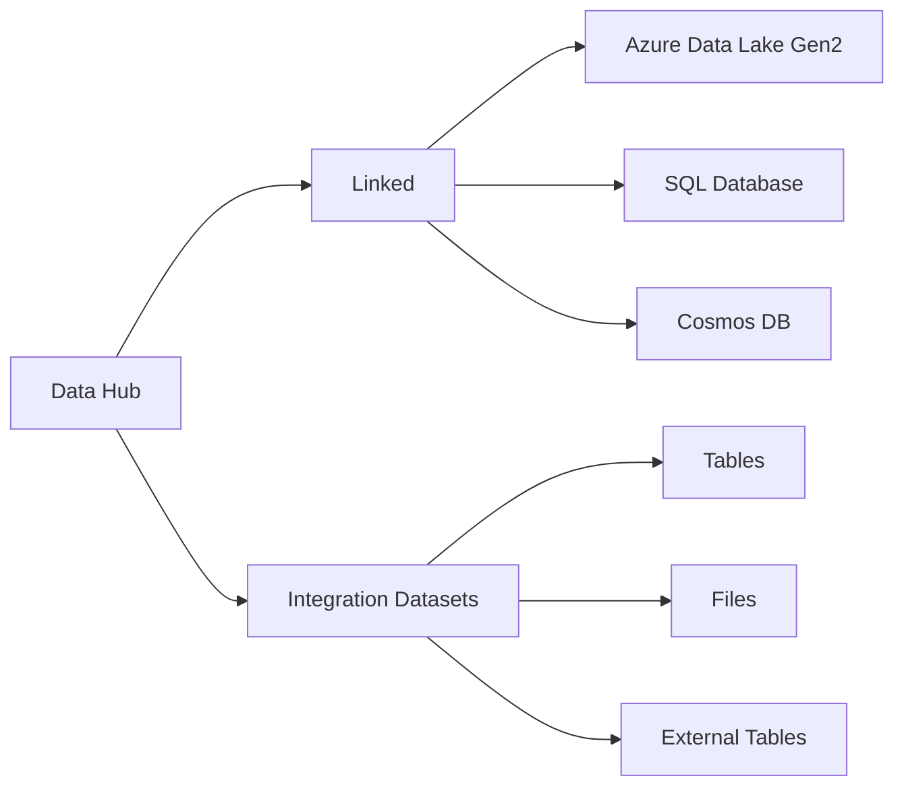

# 🏢 Synapse Workspace Interactive Tour

> **🏠 [Home](../../../README.md)** | **📖 [Documentation](../../README.md)** | **🎬 [Multimedia](../README.md)** | **🎮 [Interactive Demos](README.md)** | **👤 Workspace Tour**


## 📋 Overview

An interactive guided tour of Azure Synapse Analytics Workspace that walks users through key features, interfaces, and capabilities. This hands-on demonstration provides a comprehensive introduction to the Synapse workspace environment.

**Duration:** 20-30 minutes
**Format:** Interactive walkthrough with clickable hotspots
**Prerequisites:** Azure subscription (optional for viewing)

## 🎯 Learning Objectives

By completing this interactive tour, you will:

- Navigate the Synapse workspace interface confidently
- Understand the purpose and location of key workspace components
- Identify where to find tools for data engineering, analytics, and visualization
- Learn workspace organization and management best practices
- Explore integration points with other Azure services

## 🚀 Prerequisites and Setup

### Required Access

- **Viewing Mode:** No Azure account required (demo environment)
- **Hands-On Mode:** Azure subscription with Synapse workspace provisioned
- **Browser:** Modern web browser (Chrome, Edge, Firefox, Safari)

### Optional Setup

```bash
# Azure CLI setup for hands-on exploration
az login
az synapse workspace show --name <workspace-name> --resource-group <rg-name>

# Get workspace URL
az synapse workspace show \
  --name <workspace-name> \
  --resource-group <rg-name> \
  --query connectivityEndpoints.web \
  --output tsv
```

## 🗺️ Tour Structure

### Module 1: Workspace Home

**Key Features:**

- **Dashboard Overview:** Quick access to recent items and favorites
- **Quick Actions:** Common tasks and workflows
- **Resource Status:** Health monitoring and alerts
- **Getting Started:** Tutorials and documentation links

**Interactive Elements:**

```javascript
// Tour Configuration
const workspaceHomeTour = {
  steps: [
    {
      target: '.workspace-home',
      title: 'Welcome to Synapse Workspace',
      content: 'This is your central hub for all data analytics activities.',
      placement: 'center'
    },
    {
      target: '.recent-items',
      title: 'Recent Items',
      content: 'Quick access to notebooks, pipelines, and datasets you recently worked on.',
      placement: 'right'
    },
    {
      target: '.quick-actions',
      title: 'Quick Actions',
      content: 'Create new resources with a single click.',
      placement: 'bottom'
    }
  ],
  options: {
    scrollToElement: true,
    highlightClass: 'tour-highlight',
    showProgress: true
  }
};
```

### Module 2: Data Hub

**Components Explored:**

- **Linked Services:** Connections to external data sources
- **Integration Datasets:** Registered data assets
- **Data Preview:** Quick data exploration
- **Schema Browser:** Table and column metadata

**Navigation Path:**



### Module 3: Develop Hub

**Key Areas:**

- **SQL Scripts:** Query development and management
- **Notebooks:** Spark notebooks for data processing
- **Data Flows:** Visual data transformation
- **Power BI Reports:** Embedded analytics

**Interactive Code Example:**

```sql
-- Sample SQL Script Demo
-- This query demonstrates workspace capabilities

-- Create external table
CREATE EXTERNAL TABLE demo.SalesData
(
    OrderID INT,
    OrderDate DATE,
    CustomerID INT,
    ProductID INT,
    Quantity INT,
    Revenue DECIMAL(10,2)
)
WITH
(
    LOCATION = 'sales/data/',
    DATA_SOURCE = SynapseDataLake,
    FILE_FORMAT = ParquetFormat
);

-- Query with performance optimization
SELECT
    YEAR(OrderDate) as Year,
    MONTH(OrderDate) as Month,
    SUM(Revenue) as TotalRevenue,
    COUNT(DISTINCT CustomerID) as UniqueCustomers
FROM demo.SalesData
WHERE OrderDate >= '2024-01-01'
GROUP BY YEAR(OrderDate), MONTH(OrderDate)
ORDER BY Year DESC, Month DESC;
```

### Module 4: Integrate Hub

**Pipeline Components:**

- **Pipeline Canvas:** Visual pipeline designer
- **Activities Palette:** Available transformations
- **Triggers:** Scheduling and event-based execution
- **Debug Mode:** Testing and troubleshooting

**Sample Pipeline Configuration:**

```json
{
  "name": "DemoDataIngestion",
  "properties": {
    "activities": [
      {
        "name": "CopyFromBlob",
        "type": "Copy",
        "inputs": [
          {
            "referenceName": "SourceBlobDataset",
            "type": "DatasetReference"
          }
        ],
        "outputs": [
          {
            "referenceName": "SinkSynapseDataset",
            "type": "DatasetReference"
          }
        ],
        "typeProperties": {
          "source": {
            "type": "BlobSource"
          },
          "sink": {
            "type": "SqlDWSink",
            "writeBatchSize": 10000
          }
        }
      }
    ],
    "annotations": ["demo", "interactive-tour"]
  }
}
```

### Module 5: Monitor Hub

**Monitoring Capabilities:**

- **Pipeline Runs:** Execution history and status
- **Trigger Runs:** Scheduled job monitoring
- **Integration Runtimes:** Resource utilization
- **SQL Requests:** Query performance tracking
- **Spark Applications:** Job monitoring and logs

**Monitoring Dashboard:**

```javascript
// Sample monitoring query
const monitoringDashboard = {
  refreshInterval: 30000, // 30 seconds

  queries: {
    activePipelines: `
      SELECT
        pipeline_name,
        run_id,
        status,
        start_time,
        duration_ms
      FROM sys.dm_pipeline_runs
      WHERE start_time >= DATEADD(hour, -24, GETDATE())
      ORDER BY start_time DESC
    `,

    failedQueries: `
      SELECT
        request_id,
        submit_time,
        error_message,
        total_elapsed_time_ms
      FROM sys.dm_pdw_exec_requests
      WHERE status = 'Failed'
        AND submit_time >= DATEADD(hour, -24, GETDATE())
    `
  }
};
```

### Module 6: Manage Hub

**Administration Features:**

- **SQL Pools:** Resource provisioning and scaling
- **Spark Pools:** Cluster configuration
- **Linked Services:** Connection management
- **Access Control:** Security and permissions
- **Git Integration:** Version control setup

## 🎮 Step-by-Step Interaction Guide

### Getting Started

1. **Launch the Tour**

   ```html
   <!-- Embed interactive tour -->
   <iframe
     src="https://demos.csa-inabox.com/synapse-workspace-tour"
     width="100%"
     height="800px"
     frameborder="0"
     allow="fullscreen">
   </iframe>
   ```

2. **Choose Your Path**
   - **Guided Tour:** Follow step-by-step instructions
   - **Free Exploration:** Navigate at your own pace
   - **Scenario-Based:** Complete specific tasks

3. **Interactive Controls**
   - **Hotspots:** Click highlighted areas for information
   - **Tooltips:** Hover for quick tips
   - **Side Panel:** Detailed explanations and code samples
   - **Progress Tracker:** Monitor completion status

### Hands-On Exercises

#### Exercise 1: Create Your First SQL Script

```sql
-- Step 1: Connect to serverless SQL pool
USE master;

-- Step 2: Create a database
CREATE DATABASE DemoAnalytics;

-- Step 3: Switch to new database
USE DemoAnalytics;

-- Step 4: Query data lake files
SELECT TOP 10 *
FROM OPENROWSET(
    BULK 'https://<storage-account>.dfs.core.windows.net/data/sales/*.parquet',
    FORMAT = 'PARQUET'
) AS sales_data;

-- Step 5: Create a view for reuse
CREATE VIEW SalesView AS
SELECT
    OrderDate,
    CustomerID,
    SUM(Revenue) as TotalRevenue
FROM OPENROWSET(
    BULK 'https://<storage-account>.dfs.core.windows.net/data/sales/*.parquet',
    FORMAT = 'PARQUET'
) AS sales_data
GROUP BY OrderDate, CustomerID;
```

#### Exercise 2: Create a Simple Pipeline

**Pipeline Steps:**

1. **Add Copy Activity**
   - Source: Azure Blob Storage
   - Sink: Synapse SQL Pool

2. **Configure Source**

   ```json
   {
     "type": "AzureBlobStorage",
     "linkedServiceName": "AzureBlobStorage1",
     "folderPath": "raw-data/sales",
     "fileName": "sales_*.csv"
   }
   ```

3. **Configure Sink**

   ```json
   {
     "type": "AzureSqlDW",
     "linkedServiceName": "SynapseSqlPool1",
     "tableName": "staging.Sales",
     "preCopyScript": "TRUNCATE TABLE staging.Sales"
   }
   ```

4. **Add Data Flow Activity**
   - Transform and cleanse data
   - Apply business rules
   - Load to final tables

#### Exercise 3: Create a Spark Notebook

```python
# Interactive Spark Notebook Example

from pyspark.sql.functions import col, sum, count, avg
from pyspark.sql.types import *

# Read data from Data Lake
df = spark.read \
    .format("parquet") \
    .option("header", "true") \
    .load("abfss://<container>@<storage>.dfs.core.windows.net/sales/")

# Display schema
print("Schema:")
df.printSchema()

# Show sample data
print("\nSample Data:")
df.show(10)

# Perform aggregations
sales_summary = df.groupBy("ProductCategory") \
    .agg(
        count("OrderID").alias("OrderCount"),
        sum("Revenue").alias("TotalRevenue"),
        avg("Revenue").alias("AvgRevenue")
    ) \
    .orderBy(col("TotalRevenue").desc())

# Display results
sales_summary.show()

# Write results back to Data Lake
sales_summary.write \
    .mode("overwrite") \
    .format("delta") \
    .save("abfss://<container>@<storage>.dfs.core.windows.net/analytics/sales_summary")
```

## 🎓 Key Learning Points

### Workspace Organization

- **Hub-Based Navigation:** Five main hubs organize functionality
- **Contextual Actions:** Right-click menus for quick operations
- **Search Functionality:** Global search for all resources
- **Favorites:** Pin frequently used items

### Best Practices Demonstrated

1. **Resource Naming Conventions**

   ```text
   pipelines/    -> pl_<source>_to_<destination>_<frequency>
   datasets/     -> ds_<system>_<entity>
   dataflows/    -> df_<transformation_purpose>
   notebooks/    -> nb_<analysis_purpose>
   sql_scripts/  -> sql_<query_purpose>
   ```

2. **Folder Organization**

   ```text
   develop/
   ├── notebooks/
   │   ├── exploratory/
   │   ├── production/
   │   └── templates/
   ├── sql_scripts/
   │   ├── ddl/
   │   ├── queries/
   │   └── procedures/
   └── dataflows/
       ├── ingestion/
       ├── transformation/
       └── quality/
   ```

3. **Security Practices**
   - Use managed identities for authentication
   - Implement least privilege access
   - Enable audit logging
   - Configure network security

## 💡 Technical Implementation Notes

### Tour Framework

```javascript
// Custom tour implementation using Shepherd.js
import Shepherd from 'shepherd.js';
import 'shepherd.js/dist/css/shepherd.css';

class SynapseWorkspaceTour {
  constructor() {
    this.tour = new Shepherd.Tour({
      useModalOverlay: true,
      defaultStepOptions: {
        classes: 'synapse-tour-step',
        scrollTo: { behavior: 'smooth', block: 'center' },
        cancelIcon: {
          enabled: true
        }
      }
    });

    this.initializeTourSteps();
  }

  initializeTourSteps() {
    // Add all tour steps
    this.tour.addStep({
      id: 'workspace-intro',
      text: 'Welcome to Azure Synapse Analytics Workspace!',
      attachTo: {
        element: '.workspace-header',
        on: 'bottom'
      },
      buttons: [
        {
          text: 'Start Tour',
          action: this.tour.next
        }
      ]
    });

    // Add more steps for each workspace component
    this.addDataHubSteps();
    this.addDevelopHubSteps();
    this.addIntegrateHubSteps();
    this.addMonitorHubSteps();
    this.addManageHubSteps();
  }

  start() {
    this.tour.start();
    this.trackTourStart();
  }

  trackTourStart() {
    if (window.gtag) {
      window.gtag('event', 'tour_started', {
        tour_name: 'synapse_workspace_tour',
        timestamp: new Date().toISOString()
      });
    }
  }
}

// Initialize tour
const workspaceTour = new SynapseWorkspaceTour();
```

### Embedded Demo Environment

```html
<!DOCTYPE html>
<html lang="en">
<head>
  <meta charset="UTF-8">
  <meta name="viewport" content="width=device-width, initial-scale=1.0">
  <title>Synapse Workspace Tour</title>
  <link rel="stylesheet" href="./assets/css/tour.css">
</head>
<body>
  <div id="workspace-container">
    <!-- Mock Synapse workspace interface -->
    <header class="workspace-header">
      <nav class="main-nav">
        <div class="nav-item" data-hub="home">🏠 Home</div>
        <div class="nav-item" data-hub="data">📊 Data</div>
        <div class="nav-item" data-hub="develop">💻 Develop</div>
        <div class="nav-item" data-hub="integrate">🔄 Integrate</div>
        <div class="nav-item" data-hub="monitor">📈 Monitor</div>
        <div class="nav-item" data-hub="manage">⚙️ Manage</div>
      </nav>
    </header>

    <main id="hub-content">
      <!-- Dynamic content loaded based on selected hub -->
    </main>

    <div id="tour-controls">
      <button id="start-tour">Start Tour</button>
      <button id="reset-tour">Reset Progress</button>
      <div id="tour-progress"></div>
    </div>
  </div>

  <script src="./assets/js/workspace-tour.js"></script>
</body>
</html>
```

## 🔧 Troubleshooting

### Common Issues

#### Issue: Tour Not Loading

**Symptoms:**

- Blank screen or loading spinner
- JavaScript console errors

**Solution:**

```bash
# Check browser console for errors
# Ensure all dependencies are loaded
# Verify network connectivity

# Clear browser cache
Ctrl + Shift + Delete (Windows/Linux)
Cmd + Shift + Delete (Mac)

# Try different browser
```

#### Issue: Interactive Elements Not Responding

**Symptoms:**

- Hotspots not clickable
- Navigation not working

**Solution:**

```javascript
// Check event listeners
console.log('Event listeners attached:',
  document.querySelectorAll('[data-tour-step]').length);

// Re-initialize tour
workspaceTour.tour.cancel();
workspaceTour = new SynapseWorkspaceTour();
workspaceTour.start();
```

#### Issue: Progress Not Saving

**Symptoms:**

- Tour resets on page reload
- Completed steps not marked

**Solution:**

```javascript
// Manually save progress
localStorage.setItem('tour_progress', JSON.stringify({
  currentStep: workspaceTour.tour.getCurrentStep().id,
  completedSteps: workspaceTour.getCompletedSteps(),
  timestamp: new Date().toISOString()
}));

// Load saved progress
const savedProgress = JSON.parse(
  localStorage.getItem('tour_progress')
);
```

## 🔗 Embedded Demo Links

### Live Demo Environment

**Primary Demo:** [Launch Interactive Tour](https://demos.csa-inabox.com/workspace-tour)

**Alternative Formats:**

- **Video Walkthrough:** [Watch on YouTube](https://youtube.com/placeholder)
- **PDF Guide:** [Download Static Guide](./assets/workspace-tour-guide.pdf)
- **Slides:** [View Presentation](./assets/workspace-tour-slides.pptx)

### Code Samples Repository

```bash
# Clone demo repository
git clone https://github.com/csa-inabox/demos.git
cd demos/workspace-tour

# Install dependencies
npm install

# Run locally
npm start

# Access at http://localhost:3000
```

## 📚 Additional Resources

### Related Documentation

- [Synapse Workspace Concepts](../../architecture/README.md)
- [Security Best Practices](../../best-practices/security.md)
- [Workspace Management Guide](../../administration/workspace-management.md)

### Microsoft Documentation

- [Azure Synapse Analytics Overview](https://docs.microsoft.com/azure/synapse-analytics/)
- [Workspace Security](https://docs.microsoft.com/azure/synapse-analytics/security/)
- [Monitoring with Azure Monitor](https://docs.microsoft.com/azure/synapse-analytics/monitoring/)

### Video Tutorials

- [Getting Started with Synapse Workspace](../video-tutorials/README.md)
- [Advanced Workspace Features](../video-tutorials/advanced-features.md)

## 💬 Feedback

> **💡 Help us improve this interactive tour!**

Your feedback helps us create better learning experiences:

- ✅ **Tour was helpful** - [Give us a star](https://github.com/csa-inabox/docs)
- ⚠️ **Found an issue** - [Report a problem](https://github.com/csa-inabox/docs/issues/new?title=[Tour]+Issue)
- 💡 **Have suggestions** - [Share your ideas](https://github.com/csa-inabox/docs/issues/new?title=[Tour]+Suggestion)

---

*Last Updated: January 2025 | Version: 1.0.0*
