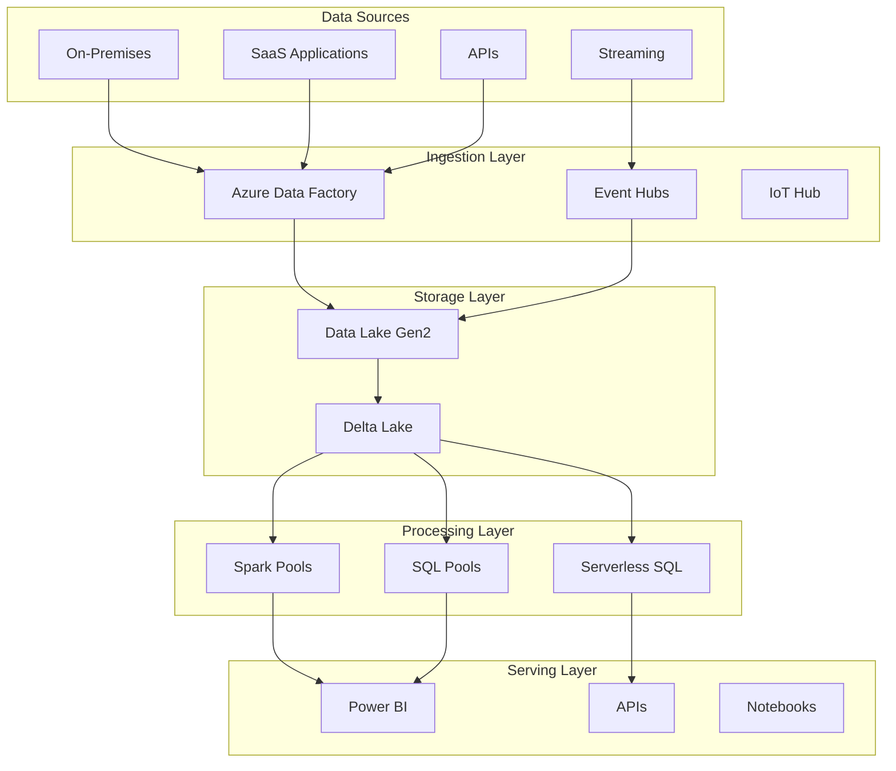

# 🔧 Technical Deep Dive Presentation - CSA-in-a-Box

> **🏠 [Home](../../../README.md)** | **📖 [Documentation](../../README.md)** | **🎬 [Multimedia](../README.md)** | **📊 [Presentations](README.md)** | **👤 Technical Deep Dive**


## 📋 Overview

Comprehensive technical presentation for architects, engineers, and technical leadership. Deep dive into architecture, implementation patterns, and technical capabilities.

## 🎯 Presentation Objectives

- Explain detailed technical architecture and components
- Demonstrate implementation patterns and best practices
- Address technical feasibility and integration concerns
- Showcase performance, scalability, and security capabilities
- Enable technical decision-making and planning

## 🎬 Slide Deck Outline

### Opening (Slides 1-3)

#### Slide 1: Title Slide

**Visual**: Technical diagram backdrop, modern design

**Content**:

- Cloud Scale Analytics in-a-Box
- Technical Architecture & Implementation
- [Presenter Name], [Technical Title]
- [Date]

**Speaker Notes**: Set technical context. Acknowledge audience expertise. Outline deep-dive format.

---

#### Slide 2: Agenda

**Visual**: Structured technical agenda with icons

**Content**:

1. 🏗️ Architecture Overview
2. 🔧 Core Components
3. 📊 Data Platform
4. ⚡ Processing & Analytics
5. 🔒 Security & Governance
6. 🚀 Performance & Scale
7. 🔄 Integration Patterns
8. 💻 Implementation Guide

**Speaker Notes**: 60-90 minute deep dive. Demos and code examples included. Q&A throughout.

---

#### Slide 3: Technical Summary

**Visual**: High-level architecture diagram

**Content**:

**Platform Foundation**:

- Azure Synapse Analytics (unified analytics platform)
- Delta Lake (lakehouse architecture)
- Azure Data Factory (data integration)
- Power BI (visualization and reporting)

**Key Capabilities**:

- Petabyte-scale data processing
- Sub-second query performance
- Real-time streaming and batch processing
- Enterprise-grade security and compliance

**Technology Stack**:

- Languages: SQL, Python, Scala, .NET
- Compute: Spark, SQL Serverless/Dedicated
- Storage: Azure Data Lake Gen2, Delta Lake
- Orchestration: Synapse Pipelines, ADF

**Speaker Notes**: Establish technical credibility. Reference Microsoft partnership and Azure foundation.

---

### Architecture Overview (Slides 4-10)

#### Slide 4: Reference Architecture

**Visual**: Detailed architecture diagram with layers

**Content**:



**Speaker Notes**: Walk through data flow. Explain layer responsibilities. Highlight Azure-native integration.

---

#### Slide 5: Lakehouse Architecture

**Visual**: Lakehouse medallion architecture diagram

**Content**:

**Bronze Layer (Raw)**:

- Immutable source data
- Schema-on-read
- Full history preserved
- Minimal transformation

**Silver Layer (Refined)**:

- Validated and cleansed
- Standardized schemas
- Quality checks applied
- Integrated datasets

**Gold Layer (Curated)**:

- Business-ready
- Aggregated and modeled
- Optimized for queries
- Domain-specific

**Delta Lake Benefits**:

- ACID transactions
- Time travel
- Schema evolution
- Unified batch and streaming

**Speaker Notes**: Explain medallion architecture pattern. Discuss when to use each layer.

---

#### Slide 6: Compute Architecture

**Visual**: Compute resources diagram

**Content**:

**Spark Pools**:

- Distributed processing
- Batch and streaming workloads
- Python, Scala, .NET support
- Auto-scaling

**Dedicated SQL Pools**:

- MPP architecture
- Data warehousing
- Predictable performance
- Reserved capacity

**Serverless SQL**:

- On-demand queries
- Pay-per-query
- No infrastructure management
- Optimized for ad-hoc analysis

**When to Use Each**:

- Spark: Complex transformations, ML, streaming
- Dedicated SQL: High-concurrency reporting, known workloads
- Serverless SQL: Exploration, ad-hoc queries, cost optimization

**Speaker Notes**: Explain compute selection criteria. Show cost-performance tradeoffs.

---

#### Slide 7: Integration Architecture

**Visual**: Integration patterns diagram

**Content**:

**Ingestion Patterns**:

- **Batch**: Scheduled ETL/ELT pipelines
- **Streaming**: Real-time event processing
- **API**: REST/GraphQL integration
- **Change Data Capture**: Database sync

**Data Sources Supported**:

- Relational databases (SQL Server, Oracle, PostgreSQL)
- NoSQL (Cosmos DB, MongoDB)
- SaaS (Salesforce, Dynamics, SAP)
- Files (CSV, JSON, Parquet, ORC)
- Streaming (Kafka, Event Hubs, IoT Hub)

**Integration Technologies**:

- Azure Data Factory
- Synapse Pipelines
- Logic Apps
- API Management

**Speaker Notes**: Show 90+ connectors. Discuss hybrid and multi-cloud scenarios.

---

#### Slide 8: Security Architecture

**Visual**: Security layers diagram

**Content**:

**Network Security**:

- Private Link
- Virtual Networks
- Managed VNets
- Firewall rules

**Identity & Access**:

- Azure Active Directory
- Role-based access control (RBAC)
- Managed identities
- Service principals

**Data Protection**:

- Encryption at rest (Microsoft-managed/customer-managed keys)
- Encryption in transit (TLS 1.2+)
- Column-level security
- Row-level security
- Dynamic data masking

**Compliance**:

- SOC 2, ISO 27001
- HIPAA, GDPR
- Industry-specific certifications

**Speaker Notes**: Emphasize security-by-design. Reference Microsoft security baselines.

---

#### Slide 9: Governance Architecture

**Visual**: Governance framework diagram

**Content**:

**Data Governance**:

- Azure Purview integration
- Data catalog
- Lineage tracking
- Sensitivity classification

**Metadata Management**:

- Shared metadata store
- Cross-engine metadata
- Schema evolution tracking
- Documentation

**Quality Management**:

- Data quality rules
- Validation frameworks
- Quality metrics
- Issue tracking

**Operational Governance**:

- Monitoring and alerting
- Performance management
- Cost management
- Capacity planning

**Speaker Notes**: Show Purview integration. Discuss importance of metadata management.

---

#### Slide 10: High Availability & DR

**Visual**: HA/DR architecture diagram

**Content**:

**High Availability**:

- Zone-redundant storage
- Automatic failover
- 99.95% SLA
- Built-in redundancy

**Disaster Recovery**:

- Geo-redundant storage
- Cross-region replication
- Backup and restore
- RPO/RTO targets

**Business Continuity**:

- Multi-region deployment (optional)
- Failover procedures
- Testing protocols
- Documentation

**Monitoring**:

- Azure Monitor
- Log Analytics
- Application Insights
- Custom dashboards

**Speaker Notes**: Discuss SLA commitments. Reference recovery procedures and testing.

---

### Core Components (Slides 11-18)

#### Slide 11: Azure Synapse Analytics

**Visual**: Synapse workspace screenshot

**Content**:

**Unified Platform**:

- Single workspace for data integration, warehousing, big data
- Integrated development experience
- Built-in version control (Git integration)
- Collaborative notebooks

**Key Features**:

- Studio interface
- Synapse SQL (serverless and dedicated)
- Apache Spark pools
- Data Explorer (Kusto)
- Pipelines

**Benefits**:

- Reduced complexity
- Faster time to insight
- Lower TCO
- Integrated security

**Speaker Notes**: Demo Synapse workspace. Show unified experience.

---

#### Slide 12: Delta Lake

**Visual**: Delta Lake architecture diagram

**Content**:

**Core Capabilities**:

- ACID transactions on data lake
- Scalable metadata handling
- Time travel (data versioning)
- Schema enforcement and evolution
- Audit history

**Technical Implementation**:

- Parquet files + transaction log
- Optimistic concurrency control
- Efficient upserts and deletes
- Compaction and optimization

**Code Example**:

```python
# Create Delta table
df.write.format("delta") \
    .mode("overwrite") \
    .save("/delta/table")

# Read with time travel
df = spark.read.format("delta") \
    .option("versionAsOf", 0) \
    .load("/delta/table")

# Optimize table
spark.sql("OPTIMIZE delta.`/delta/table`")
```

**Speaker Notes**: Explain Delta Lake value. Show how it enables lakehouse architecture.

---

#### Slide 13: Spark Processing

**Visual**: Spark architecture with executors

**Content**:

**Distributed Processing**:

- Driver and executor model
- In-memory computation
- Lazy evaluation
- DAG execution

**Spark Components**:

- Spark SQL (structured data)
- Spark Streaming (real-time)
- MLlib (machine learning)
- GraphX (graph processing)

**Performance Optimizations**:

- Auto-scaling
- Intelligent caching
- Adaptive query execution
- Dynamic partition pruning

**Code Example**:

```python
# Read Delta table
df = spark.read.format("delta").load("/path/to/table")

# Transform with optimizations
result = df.filter(col("status") == "active") \
    .groupBy("category") \
    .agg(sum("revenue").alias("total_revenue")) \
    .orderBy(desc("total_revenue"))

# Write optimized output
result.write.format("delta") \
    .mode("overwrite") \
    .partitionBy("category") \
    .save("/path/to/output")
```

**Speaker Notes**: Discuss Spark optimization techniques. Show performance tuning strategies.

---

#### Slide 14: SQL Processing

**Visual**: SQL engine comparison diagram

**Content**:

**Serverless SQL**:

- **Use Case**: Ad-hoc queries, exploration, cost optimization
- **Pricing**: Pay-per-TB processed
- **Performance**: Optimized for data lake queries
- **Limitations**: No data caching, variable performance

**Dedicated SQL Pools**:

- **Use Case**: High-concurrency, predictable performance
- **Pricing**: Reserved DWU capacity
- **Performance**: Consistent, optimized for warehousing
- **Features**: Statistics, indexes, materialized views

**Code Example**:

```sql
-- Serverless SQL query
SELECT
    customer_id,
    SUM(order_total) as total_spent,
    COUNT(*) as order_count
FROM OPENROWSET(
    BULK 'https://datalake.dfs.core.windows.net/data/orders/*.parquet',
    FORMAT = 'PARQUET'
) AS orders
GROUP BY customer_id;

-- Dedicated SQL Pool with optimization
CREATE TABLE Sales_Fact
WITH (
    DISTRIBUTION = HASH(customer_id),
    CLUSTERED COLUMNSTORE INDEX
)
AS SELECT * FROM Staging_Sales;
```

**Speaker Notes**: Explain when to use serverless vs. dedicated. Discuss cost-performance tradeoffs.

---

#### Slide 15: Data Integration

**Visual**: Data Factory pipeline example

**Content**:

**Pipeline Capabilities**:

- 90+ built-in connectors
- Code-free transformations
- Parameterization and expressions
- Control flow (loops, conditions, branching)
- Error handling and retry logic

**Data Flows**:

- Visual data transformation
- Spark-based execution
- Schema drift handling
- Data quality checks

**Orchestration**:

- Scheduling and triggers
- Event-driven execution
- Tumbling windows
- Dependency management

**Example Pipeline**:

```json
{
  "name": "IngestSalesData",
  "activities": [
    {
      "type": "Copy",
      "source": {"type": "SqlServerSource"},
      "sink": {"type": "ParquetSink"},
      "enableStaging": true
    },
    {
      "type": "DatabricksNotebook",
      "notebookPath": "/Transform/CleanData"
    }
  ]
}
```

**Speaker Notes**: Demo pipeline authoring. Show monitoring and debugging capabilities.

---

#### Slide 16: Real-Time Processing

**Visual**: Streaming architecture diagram

**Content**:

**Streaming Technologies**:

- Azure Event Hubs (Kafka-compatible)
- Azure IoT Hub (device telemetry)
- Spark Structured Streaming
- Stream Analytics

**Processing Patterns**:

- Tumbling windows
- Sliding windows
- Session windows
- Watermarking

**Code Example - Structured Streaming**:

```python
# Define streaming source
stream_df = spark.readStream \
    .format("eventhubs") \
    .option("connectionString", connection_string) \
    .load()

# Transform stream
processed = stream_df \
    .select(col("body").cast("string").alias("message")) \
    .withColumn("timestamp", current_timestamp()) \
    .withWatermark("timestamp", "10 minutes") \
    .groupBy(window("timestamp", "5 minutes")) \
    .agg(count("*").alias("event_count"))

# Write to Delta Lake
query = processed.writeStream \
    .format("delta") \
    .outputMode("append") \
    .option("checkpointLocation", "/checkpoints/") \
    .start("/delta/streaming")
```

**Speaker Notes**: Explain streaming use cases. Discuss exactly-once processing guarantees.

---

#### Slide 17: Analytics & ML

**Visual**: ML workflow diagram

**Content**:

**Built-in ML Capabilities**:

- Azure Machine Learning integration
- MLflow tracking
- AutoML
- Model deployment

**ML Frameworks**:

- Scikit-learn
- TensorFlow
- PyTorch
- SparkML

**ML Pipeline Example**:

```python
from pyspark.ml import Pipeline
from pyspark.ml.feature import VectorAssembler
from pyspark.ml.classification import RandomForestClassifier

# Feature engineering
assembler = VectorAssembler(
    inputCols=["feature1", "feature2", "feature3"],
    outputCol="features"
)

# Model training
rf = RandomForestClassifier(
    numTrees=100,
    maxDepth=10
)

# Create pipeline
pipeline = Pipeline(stages=[assembler, rf])
model = pipeline.fit(training_data)

# Save model
model.write().overwrite().save("/models/churn_predictor")
```

**Speaker Notes**: Show end-to-end ML workflow. Discuss model serving options.

---

#### Slide 18: Visualization & Reporting

**Visual**: Power BI dashboard screenshots

**Content**:

**Power BI Integration**:

- Direct query to Synapse SQL
- Import mode optimizations
- Dataflows for ETL
- Paginated reports

**Advanced Features**:

- AI visuals
- Natural language Q&A
- Mobile layouts
- Row-level security

**Embedding Options**:

- Publish to web
- Embedded analytics
- API access
- Power BI Embedded

**Performance Optimization**:

- Aggregations
- Incremental refresh
- Hybrid tables
- DirectQuery optimizations

**Speaker Notes**: Demo Power BI capabilities. Show mobile and embedding scenarios.

---

### Data Platform (Slides 19-24)

#### Slide 19: Data Lake Design

**Visual**: Data lake folder structure

**Content**:

**Folder Organization**:

```text
/datalake
  /bronze
    /source_system_1
      /table_name
        /year=2025
          /month=01
            /day=15
              data.parquet
  /silver
    /domain_1
      /entity_name
        data.delta
  /gold
    /analytics
      /fact_tables
      /dimension_tables
```

**Naming Conventions**:

- Lowercase with underscores
- Date partitioning (year/month/day)
- Descriptive names
- Consistent structure

**Best Practices**:

- Partition strategy planning
- File size optimization (128MB-1GB)
- Avoid small files
- Regular compaction

**Speaker Notes**: Explain partitioning strategies. Discuss performance implications.

---

#### Slide 20: Schema Management

**Visual**: Schema evolution diagram

**Content**:

**Schema Enforcement**:

```python
# Define schema
from pyspark.sql.types import *

schema = StructType([
    StructField("id", IntegerType(), False),
    StructField("name", StringType(), True),
    StructField("created_date", TimestampType(), True)
])

# Write with schema enforcement
df.write.format("delta") \
    .option("mergeSchema", "false") \
    .save("/delta/table")
```

**Schema Evolution**:

```python
# Allow schema evolution
df_new.write.format("delta") \
    .option("mergeSchema", "true") \
    .mode("append") \
    .save("/delta/table")

# View schema history
spark.sql("DESCRIBE HISTORY delta.`/delta/table`").show()
```

**Best Practices**:

- Version schemas with metadata
- Document schema changes
- Test backward compatibility
- Plan for evolution

**Speaker Notes**: Discuss schema governance. Show migration strategies.

---

#### Slide 21: Data Quality Framework

**Visual**: Quality checks framework

**Content**:

**Quality Dimensions**:

- **Completeness**: No missing required fields
- **Accuracy**: Values within expected ranges
- **Consistency**: Data conforms to business rules
- **Timeliness**: Data freshness meets SLAs
- **Uniqueness**: No duplicate records

**Implementation Example**:

```python
from pyspark.sql.functions import col, count, when

# Quality checks
quality_checks = df.agg(
    count("*").alias("total_records"),
    count(when(col("customer_id").isNull(), 1)).alias("null_ids"),
    count(when(col("revenue") < 0, 1)).alias("invalid_revenue"),
    countDistinct("customer_id").alias("unique_customers")
)

# Validation rules
if quality_checks.first()["null_ids"] > 0:
    raise Exception("Data quality check failed: null customer_ids found")
```

**Automation**:

- Pipeline validation steps
- Automated alerts
- Quality dashboards
- Historical trending

**Speaker Notes**: Show quality check implementations. Discuss monitoring and alerting.

---

#### Slide 22: Data Lifecycle Management

**Visual**: Lifecycle management flow

**Content**:

**Retention Policies**:

- Bronze: 90 days
- Silver: 2 years
- Gold: 7 years (compliance-dependent)
- Archives: Long-term cold storage

**Lifecycle Actions**:

```python
# Archive old data
old_data = spark.sql("""
    SELECT * FROM delta.`/bronze/table`
    WHERE date < current_date() - INTERVAL 90 DAYS
""")
old_data.write.parquet("/archive/bronze/table/")

# Vacuum Delta tables (remove old versions)
spark.sql("VACUUM delta.`/bronze/table` RETAIN 168 HOURS")
```

**Cost Optimization**:

- Hot: Frequently accessed (premium storage)
- Cool: Infrequent access (standard storage)
- Archive: Long-term retention (archive storage)

**Speaker Notes**: Explain lifecycle automation. Discuss compliance requirements.

---

#### Slide 23: Performance Optimization

**Visual**: Performance tuning checklist

**Content**:

**Partitioning**:

```python
# Partition by high-cardinality column
df.write.format("delta") \
    .partitionBy("year", "month") \
    .save("/delta/table")
```

**Z-Ordering**:

```sql
-- Optimize for common query patterns
OPTIMIZE delta.`/delta/table`
ZORDER BY (customer_id, product_id);
```

**Caching**:

```python
# Cache frequently accessed data
df.cache()
df.count()  # Trigger caching
```

**File Optimization**:

```sql
-- Compact small files
OPTIMIZE delta.`/delta/table`;

-- View file statistics
DESCRIBE DETAIL delta.`/delta/table`;
```

**Best Practices**:

- Right-size partitions (1GB ideal)
- Limit partition columns (< 3)
- Regular optimization
- Monitor file counts

**Speaker Notes**: Show performance before/after optimizations. Discuss monitoring approach.

---

#### Slide 24: Metadata Management

**Visual**: Metadata architecture

**Content**:

**Shared Metadata**:

- Unity Catalog (cross-platform)
- Hive Metastore (Spark)
- SQL metadata (Synapse SQL)
- Purview integration

**Metadata Operations**:

```sql
-- Create external table
CREATE EXTERNAL TABLE sales_data
USING delta
LOCATION '/delta/sales';

-- View table metadata
DESCRIBE EXTENDED sales_data;

-- Show table history
DESCRIBE HISTORY delta.`/delta/sales`;
```

**Documentation**:

- Table descriptions
- Column descriptions
- Business glossary
- Lineage information

**Speaker Notes**: Explain metadata importance. Show cross-engine metadata sharing.

---

### Security & Governance (Slides 25-30)

#### Slide 25: Authentication & Authorization

**Visual**: AAD integration diagram

**Content**:

**Authentication Methods**:

- Azure Active Directory (SSO)
- Service Principals (automated processes)
- Managed Identities (Azure resources)
- SQL authentication (legacy, not recommended)

**Authorization Levels**:

```text
Synapse Workspace
├── Workspace Admin
├── SQL Admin
├── Apache Spark Admin
└── Reader

Data Lake
├── Storage Blob Data Owner
├── Storage Blob Data Contributor
└── Storage Blob Data Reader
```

**Code Example**:

```python
from azure.identity import DefaultAzureCredential

# Use managed identity
credential = DefaultAzureCredential()

# Configure Spark with AAD
spark.conf.set(
    "fs.azure.account.auth.type",
    "OAuth"
)
spark.conf.set(
    "fs.azure.account.oauth.provider.type",
    "org.apache.hadoop.fs.azurebfs.oauth2.MsiTokenProvider"
)
```

**Speaker Notes**: Emphasize AAD integration benefits. Discuss least-privilege principle.

---

#### Slide 26: Data Protection

**Visual**: Encryption layers

**Content**:

**Encryption at Rest**:

- Microsoft-managed keys (default)
- Customer-managed keys (Azure Key Vault)
- Infrastructure encryption (double encryption)

**Encryption in Transit**:

- TLS 1.2+ for all connections
- Private endpoints
- VPN/ExpressRoute

**Column-Level Security**:

```sql
-- Grant access to specific columns
GRANT SELECT ON Sales(customer_id, order_date, amount)
TO [DataAnalyst];
```

**Row-Level Security**:

```sql
-- Create security predicate
CREATE FUNCTION dbo.SalesFilter(@Region varchar(50))
RETURNS TABLE
WITH SCHEMABINDING
AS RETURN
    SELECT 1 AS result
    WHERE @Region = USER_NAME();

-- Apply security policy
CREATE SECURITY POLICY SalesFilter
ADD FILTER PREDICATE dbo.SalesFilter(Region)
ON dbo.Sales
WITH (STATE = ON);
```

**Speaker Notes**: Demonstrate security features. Discuss compliance requirements.

---

#### Slide 27: Network Security

**Visual**: Network architecture with Private Link

**Content**:

**Network Isolation**:

- Managed Virtual Network
- Private endpoints
- Firewall rules
- IP whitelisting

**Private Link Configuration**:

```python
# Connect via private endpoint
connection_string = (
    "Server=tcp:synapse-workspace.privatelink.sql.azuresynapse.net;"
    "Database=sqlpool1;"
    "Authentication=ActiveDirectoryIntegrated;"
)
```

**Network Architecture**:

```text
On-Premises
    ↓ (ExpressRoute/VPN)
Hub VNet
    ↓ (Peering)
Spoke VNet (Synapse Managed VNet)
    ├── Private Endpoint → Storage
    ├── Private Endpoint → SQL Pool
    └── Private Endpoint → Spark Pool
```

**Security Baselines**:

- Disable public access
- Enable firewall
- Require private endpoints
- Audit network access

**Speaker Notes**: Explain network security layers. Discuss hybrid connectivity options.

---

#### Slide 28: Compliance & Auditing

**Visual**: Compliance framework

**Content**:

**Compliance Certifications**:

- SOC 2 Type II
- ISO 27001, ISO 27018
- HIPAA BAA
- GDPR, CCPA compliant

**Audit Logging**:

```python
# Enable diagnostic settings
from azure.mgmt.monitor import MonitorManagementClient

diagnostic_settings = {
    "logs": [
        {"category": "SQLSecurityAuditEvents", "enabled": True},
        {"category": "SynapseBuiltinSqlPoolRequestsEnded", "enabled": True}
    ],
    "workspace_id": log_analytics_workspace_id
}
```

**Audit Queries**:

```sql
-- Query audit logs
SELECT
    TimeGenerated,
    OperationName,
    Identity,
    CallerIpAddress,
    ResultType
FROM AuditLogs
WHERE TimeGenerated > ago(24h)
ORDER BY TimeGenerated DESC;
```

**Compliance Monitoring**:

- Azure Policy
- Azure Security Center
- Compliance Manager
- Regular assessments

**Speaker Notes**: Reference compliance documentation. Discuss audit retention policies.

---

#### Slide 29: Data Governance with Purview

**Visual**: Purview integration architecture

**Content**:

**Purview Capabilities**:

- Data catalog
- Data lineage
- Sensitivity classification
- Data insights

**Integration**:

```python
# Purview REST API integration
import requests

purview_endpoint = "https://{account-name}.purview.azure.com"
headers = {"Authorization": f"Bearer {access_token}"}

# Register data source
response = requests.put(
    f"{purview_endpoint}/scan/datasources/{datasource_name}",
    headers=headers,
    json=datasource_config
)
```

**Lineage Tracking**:

- Source-to-target mapping
- Transformation lineage
- Impact analysis
- Data flow visualization

**Classification**:

- Automatic classification
- Custom classification rules
- Sensitivity labels
- Access policies based on sensitivity

**Speaker Notes**: Demo Purview capabilities. Show lineage and classification examples.

---

#### Slide 30: Security Best Practices

**Visual**: Security checklist

**Content**:

**Identity**:

- ✅ Use Azure AD authentication
- ✅ Implement RBAC with least privilege
- ✅ Enable MFA for all users
- ✅ Use managed identities for services
- ❌ Avoid SQL authentication
- ❌ Don't share credentials

**Network**:

- ✅ Use private endpoints
- ✅ Enable firewall rules
- ✅ Implement VNet integration
- ✅ Use ExpressRoute for hybrid
- ❌ Avoid public internet exposure
- ❌ Don't allow all IP addresses

**Data**:

- ✅ Enable encryption at rest
- ✅ Use TLS 1.2+ for transit
- ✅ Implement column/row-level security
- ✅ Enable data classification
- ❌ Don't store secrets in code
- ❌ Don't disable security features

**Operations**:

- ✅ Enable audit logging
- ✅ Monitor security alerts
- ✅ Regular security assessments
- ✅ Patch management
- ❌ Don't ignore security warnings
- ❌ Don't skip security reviews

**Speaker Notes**: Emphasize security-by-default. Reference Azure Security Benchmark.

---

### Performance & Scale (Slides 31-35)

#### Slide 31: Performance Architecture

**Visual**: Performance tuning diagram

**Content**:

**Performance Factors**:

- Compute resources (DWU, Spark cores)
- Data distribution strategies
- Query optimization
- Caching strategies
- Partitioning schemes

**Scaling Options**:

**Vertical Scaling**:

- Increase DWU for SQL pools
- Larger Spark pool node sizes
- More memory per executor

**Horizontal Scaling**:

- More Spark executors
- Distributed query execution
- Parallel pipeline activities

**Auto-Scaling**:

```python
# Spark auto-scaling configuration
spark_config = {
    "minNodeCount": 3,
    "maxNodeCount": 20,
    "autoScaleEnabled": True,
    "autoPauseEnabled": True,
    "autoPauseDelayInMinutes": 15
}
```

**Speaker Notes**: Explain scaling strategies. Discuss cost-performance optimization.

---

#### Slide 32: Query Performance Optimization

**Visual**: Query execution plan comparison

**Content**:

**SQL Pool Optimization**:

```sql
-- Distribution strategy
CREATE TABLE Sales_Fact
WITH (
    DISTRIBUTION = HASH(customer_id),
    CLUSTERED COLUMNSTORE INDEX,
    PARTITION (order_date RANGE RIGHT FOR VALUES
        ('2024-01-01', '2024-02-01', '2024-03-01'))
);

-- Statistics management
CREATE STATISTICS stat_customer ON Sales_Fact(customer_id);
UPDATE STATISTICS Sales_Fact;

-- Materialized views
CREATE MATERIALIZED VIEW MV_Sales_Summary
WITH (
    DISTRIBUTION = HASH(customer_id)
)
AS
SELECT customer_id, SUM(revenue) as total_revenue
FROM Sales_Fact
GROUP BY customer_id;
```

**Spark Optimization**:

```python
# Broadcast joins for small tables
from pyspark.sql.functions import broadcast

result = large_df.join(
    broadcast(small_df),
    "customer_id"
)

# Repartition for balanced processing
df.repartition(200, "customer_id") \
    .write.format("delta").save("/output")
```

**Speaker Notes**: Show query plans before/after optimization. Discuss common anti-patterns.

---

#### Slide 33: Spark Performance Tuning

**Visual**: Spark tuning parameters

**Content**:

**Executor Configuration**:

```python
spark.conf.set("spark.executor.memory", "8g")
spark.conf.set("spark.executor.cores", "4")
spark.conf.set("spark.dynamicAllocation.enabled", "true")
spark.conf.set("spark.dynamicAllocation.minExecutors", "2")
spark.conf.set("spark.dynamicAllocation.maxExecutors", "20")
```

**Memory Tuning**:

```python
# Optimize shuffle partitions
spark.conf.set("spark.sql.shuffle.partitions", "200")

# Broadcast threshold
spark.conf.set("spark.sql.autoBroadcastJoinThreshold", "10485760")

# Memory overhead
spark.conf.set("spark.executor.memoryOverhead", "1g")
```

**Adaptive Query Execution**:

```python
# Enable AQE (enabled by default in Synapse)
spark.conf.set("spark.sql.adaptive.enabled", "true")
spark.conf.set("spark.sql.adaptive.coalescePartitions.enabled", "true")
```

**Performance Monitoring**:

- Spark UI
- Metrics and logs
- Query execution plans
- Stage-level details

**Speaker Notes**: Explain each configuration parameter. Show Spark UI examples.

---

#### Slide 34: Data Distribution Strategies

**Visual**: Distribution comparison diagram

**Content**:

**Distribution Types**:

**Hash Distribution** (Most Common):

```sql
-- Distribute on join key
CREATE TABLE Orders
WITH (DISTRIBUTION = HASH(customer_id))
AS SELECT * FROM staging;
```

- Use for: Large tables, frequent joins
- Benefits: Parallel processing, co-located joins
- Choose: High-cardinality column, common join key

**Round Robin** (Default):

```sql
CREATE TABLE Staging
WITH (DISTRIBUTION = ROUND_ROBIN)
AS SELECT * FROM source;
```

- Use for: Staging tables, no joins
- Benefits: Even distribution, fast loads
- Limitation: Data movement on joins

**Replicated** (Small Tables):

```sql
CREATE TABLE Dimension_Date
WITH (DISTRIBUTION = REPLICATE)
AS SELECT * FROM staging;
```

- Use for: Small dimension tables (< 2GB)
- Benefits: No data movement, faster joins
- Cost: Storage overhead

**Speaker Notes**: Explain distribution selection criteria. Show performance impact examples.

---

#### Slide 35: Scalability Metrics

**Visual**: Scalability dashboard

**Content**:

**Tested Scale**:

- **Data Volume**: Petabyte-scale (tested to 100+ PB)
- **Query Performance**: Sub-second to seconds (depending on complexity)
- **Concurrent Users**: 1,000+ simultaneous queries
- **Ingestion Rate**: Terabytes per hour
- **Spark Jobs**: 10,000+ concurrent tasks

**Performance Benchmarks**:

| Workload | Data Size | Performance | Concurrent Users |
|----------|-----------|-------------|------------------|
| **Reporting** | 10 TB | < 5 sec | 500 |
| **Analytics** | 50 TB | < 30 sec | 200 |
| **ML Training** | 100 TB | Minutes | 50 |
| **Real-time** | Streaming | < 1 sec latency | 100 |

**Monitoring Metrics**:

- Query execution time
- Resource utilization
- Queue wait times
- Data movement
- Cache hit rates

**Speaker Notes**: Reference performance testing results. Discuss scalability patterns.

---

### Integration Patterns (Slides 36-40)

#### Slide 36: Integration Overview

**Visual**: Integration patterns matrix

**Content**:

**Integration Types**:

1. **Batch Integration** - Scheduled ETL/ELT
2. **Real-Time Integration** - Streaming and CDC
3. **API Integration** - REST/GraphQL
4. **Event-Driven** - Event-based triggers
5. **Hybrid** - Combination of patterns

**Common Scenarios**:

- On-premises to cloud migration
- SaaS application integration
- Multi-cloud data exchange
- Hybrid analytics
- Partner data sharing

**Technologies Used**:

- Azure Data Factory
- Event Hubs / IoT Hub
- Logic Apps
- API Management
- Service Bus

**Speaker Notes**: Explain when to use each integration pattern. Show decision tree.

---

#### Slide 37: Batch Integration Pattern

**Visual**: Batch pipeline diagram

**Content**:

**Architecture**:

```text
Source System → ADF Pipeline → Data Lake (Bronze) →
Transformation → Silver → Aggregation → Gold
```

**Implementation**:

```json
{
  "name": "BatchIngestionPipeline",
  "activities": [
    {
      "name": "CopyFromSQL",
      "type": "Copy",
      "source": {"type": "SqlServerSource"},
      "sink": {
        "type": "ParquetSink",
        "storeSettings": {
          "type": "AzureBlobFSWriteSettings",
          "copyBehavior": "PreserveHierarchy"
        }
      }
    },
    {
      "name": "TransformData",
      "type": "SynapseNotebook",
      "notebookPath": "/Transform/Bronze_to_Silver"
    }
  ],
  "triggers": [
    {
      "name": "DailyTrigger",
      "type": "ScheduleTrigger",
      "recurrence": {"frequency": "Day", "interval": 1}
    }
  ]
}
```

**Best Practices**:

- Incremental loading
- Idempotent operations
- Error handling and retries
- Watermark tracking

**Speaker Notes**: Show full pipeline implementation. Discuss scheduling strategies.

---

#### Slide 38: Real-Time Integration Pattern

**Visual**: Streaming architecture

**Content**:

**Event Streaming Architecture**:

```text
Event Source → Event Hub → Stream Processing →
Delta Lake → Real-Time Dashboard
```

**Structured Streaming Implementation**:

```python
# Read from Event Hub
df = spark.readStream \
    .format("eventhubs") \
    .option("connectionString", connection_string) \
    .load()

# Parse and transform
parsed = df.select(
    col("body").cast("string").alias("json_data")
).select(
    from_json("json_data", schema).alias("data")
).select("data.*")

# Aggregate with windowing
aggregated = parsed \
    .withWatermark("timestamp", "10 minutes") \
    .groupBy(
        window("timestamp", "5 minutes"),
        "sensor_id"
    ) \
    .agg(
        avg("temperature").alias("avg_temp"),
        max("temperature").alias("max_temp")
    )

# Write to Delta Lake
query = aggregated.writeStream \
    .format("delta") \
    .outputMode("append") \
    .option("checkpointLocation", "/checkpoints/") \
    .trigger(processingTime="1 minute") \
    .start("/delta/sensor_data")
```

**Speaker Notes**: Explain exactly-once guarantees. Discuss checkpointing and recovery.

---

#### Slide 39: API Integration Pattern

**Visual**: API integration architecture

**Content**:

**REST API Integration**:

```python
import requests
from pyspark.sql import Row

# Fetch data from API
def fetch_api_data(page):
    response = requests.get(
        f"https://api.example.com/data?page={page}",
        headers={"Authorization": f"Bearer {token}"}
    )
    return response.json()

# Parallelize API calls
pages = range(1, 101)
rdd = sc.parallelize(pages, numSlices=10)
data = rdd.flatMap(fetch_api_data)

# Convert to DataFrame
df = spark.createDataFrame(data)

# Write to Delta Lake
df.write.format("delta") \
    .mode("overwrite") \
    .save("/delta/api_data")
```

**Rate Limiting**:

```python
import time

def rate_limited_fetch(page):
    time.sleep(0.1)  # 10 requests/second
    return fetch_api_data(page)
```

**Error Handling**:

```python
def safe_api_call(page, max_retries=3):
    for attempt in range(max_retries):
        try:
            return fetch_api_data(page)
        except Exception as e:
            if attempt == max_retries - 1:
                raise
            time.sleep(2 ** attempt)
```

**Speaker Notes**: Discuss API best practices. Show pagination and error handling.

---

#### Slide 40: Hybrid & Multi-Cloud

**Visual**: Hybrid architecture diagram

**Content**:

**On-Premises Connectivity**:

- Azure ExpressRoute
- VPN Gateway
- Self-hosted Integration Runtime
- Azure Arc

**Self-Hosted IR Configuration**:

```json
{
  "name": "OnPremisesIR",
  "type": "SelfHosted",
  "properties": {
    "description": "On-premises data gateway",
    "linkedIntegrationRuntimes": [
      {
        "location": "East US",
        "nodeCount": 4
      }
    ]
  }
}
```

**Multi-Cloud Data Access**:

```python
# AWS S3 access from Synapse
df = spark.read.format("parquet") \
    .option("fs.s3a.access.key", aws_access_key) \
    .option("fs.s3a.secret.key", aws_secret_key) \
    .load("s3a://bucket-name/path/")

# Write to Azure Data Lake
df.write.format("delta") \
    .save("abfss://container@storage.dfs.core.windows.net/path/")
```

**Speaker Notes**: Explain hybrid scenarios. Discuss network bandwidth considerations.

---

### Implementation Guide (Slides 41-45)

#### Slide 41: Deployment Architecture

**Visual**: Deployment topology

**Content**:

**Environment Strategy**:

```text
Development → Test → UAT → Production
```

**Infrastructure as Code**:

```bicep
// Synapse Workspace
resource synapseWorkspace 'Microsoft.Synapse/workspaces@2021-06-01' = {
  name: workspaceName
  location: location
  identity: {
    type: 'SystemAssigned'
  }
  properties: {
    defaultDataLakeStorage: {
      accountUrl: 'https://${storageAccountName}.dfs.core.windows.net'
      filesystem: filesystemName
    }
    managedResourceGroupName: managedRGName
    sqlAdministratorLogin: sqlAdmin
    sqlAdministratorLoginPassword: sqlPassword
  }
}

// Spark Pool
resource sparkPool 'Microsoft.Synapse/workspaces/bigDataPools@2021-06-01' = {
  parent: synapseWorkspace
  name: sparkPoolName
  location: location
  properties: {
    nodeCount: 3
    nodeSizeFamily: 'MemoryOptimized'
    nodeSize: 'Small'
    autoScale: {
      enabled: true
      minNodeCount: 3
      maxNodeCount: 20
    }
    autoPause: {
      enabled: true
      delayInMinutes: 15
    }
  }
}
```

**Speaker Notes**: Explain IaC benefits. Show deployment pipeline.

---

#### Slide 42: CI/CD Pipeline

**Visual**: CI/CD workflow diagram

**Content**:

**Azure DevOps Pipeline**:

```yaml
trigger:
  branches:
    include:
      - main
      - develop

stages:
  - stage: Build
    jobs:
      - job: ValidateNotebooks
        steps:
          - task: UsePythonVersion@0
            inputs:
              versionSpec: '3.9'
          - script: |
              pip install pytest nbconvert
              pytest tests/

  - stage: Deploy_Dev
    dependsOn: Build
    condition: succeeded()
    jobs:
      - job: DeployToDev
        steps:
          - task: Synapse workspace deployment@2
            inputs:
              workspaceName: 'synapse-dev'
              resourceGroupName: 'rg-dev'

  - stage: Deploy_Prod
    dependsOn: Deploy_Dev
    condition: and(succeeded(), eq(variables['Build.SourceBranch'], 'refs/heads/main'))
    jobs:
      - job: DeployToProd
        steps:
          - task: Synapse workspace deployment@2
            inputs:
              workspaceName: 'synapse-prod'
              resourceGroupName: 'rg-prod'
```

**Speaker Notes**: Explain deployment stages. Discuss approval gates and rollback strategies.

---

#### Slide 43: Monitoring & Observability

**Visual**: Monitoring dashboard

**Content**:

**Monitoring Stack**:

- Azure Monitor
- Log Analytics
- Application Insights
- Synapse Studio monitoring

**Custom Monitoring**:

```python
from azure.monitor.opentelemetry import configure_azure_monitor
from opentelemetry import trace

# Configure monitoring
configure_azure_monitor(
    connection_string=app_insights_connection_string
)

tracer = trace.get_tracer(__name__)

# Instrument code
with tracer.start_as_current_span("process_data"):
    df = spark.read.format("delta").load("/path")
    result = df.transform(process_pipeline)
    result.write.format("delta").save("/output")
```

**Key Metrics**:

- Pipeline success rate
- Query execution time
- Resource utilization
- Data quality metrics
- Cost metrics

**Alerting**:

```kusto
// Failed pipeline alert
SynapsePipelines
| where Status == "Failed"
| where TimeGenerated > ago(1h)
| summarize FailureCount = count() by PipelineName
| where FailureCount > 3
```

**Speaker Notes**: Show monitoring dashboards. Discuss alerting strategies.

---

#### Slide 44: Cost Management

**Visual**: Cost optimization strategies

**Content**:

**Cost Components**:

- Compute (SQL pools, Spark pools)
- Storage (Data Lake Gen2)
- Data movement (ingress/egress)
- Pipelines (activity runs)

**Optimization Strategies**:

**Auto-Pause Spark Pools**:

```python
spark_config = {
    "autoPauseEnabled": True,
    "autoPauseDelayInMinutes": 15
}
```

**Serverless SQL for Ad-Hoc Queries**:

```sql
-- Use serverless instead of dedicated for exploration
SELECT * FROM OPENROWSET(
    BULK 'https://storage.dfs.core.windows.net/data/*.parquet',
    FORMAT = 'PARQUET'
) AS data;
```

**Right-Size Resources**:

- Monitor utilization metrics
- Scale down during off-hours
- Use reserved capacity for predictable workloads
- Optimize query performance to reduce compute time

**Cost Monitoring**:

```kusto
AzureDiagnostics
| where ResourceProvider == "MICROSOFT.SYNAPSE"
| summarize TotalCost = sum(Cost) by bin(TimeGenerated, 1d), ResourceType
| render timechart
```

**Speaker Notes**: Show cost analysis reports. Discuss FinOps practices.

---

#### Slide 45: Best Practices Summary

**Visual**: Best practices checklist

**Content**:

**Architecture**:

- ✅ Use medallion architecture (Bronze/Silver/Gold)
- ✅ Implement Delta Lake for ACID transactions
- ✅ Separate compute and storage
- ✅ Design for scalability from the start

**Development**:

- ✅ Version control all artifacts (Git integration)
- ✅ Modular notebook design
- ✅ Parameterize pipelines and notebooks
- ✅ Comprehensive error handling

**Security**:

- ✅ Azure AD authentication only
- ✅ Private endpoints for network isolation
- ✅ Encryption at rest and in transit
- ✅ Row/column-level security

**Performance**:

- ✅ Optimize partitioning strategies
- ✅ Use appropriate distribution methods
- ✅ Regular table optimization (OPTIMIZE, VACUUM)
- ✅ Monitor and tune query performance

**Operations**:

- ✅ Comprehensive monitoring and alerting
- ✅ Automated deployments (CI/CD)
- ✅ Cost optimization practices
- ✅ Disaster recovery planning

**Speaker Notes**: Emphasize non-negotiable best practices. Reference documentation.

---

### Closing (Slides 46-48)

#### Slide 46: Technical Roadmap

**Visual**: Technology evolution timeline

**Content**:

**Current Capabilities** (Available Now):

- Synapse Analytics with Spark 3.x
- Delta Lake 2.x
- Serverless SQL
- Private Link

**Near Term** (Next 6 months):

- Unity Catalog integration
- Enhanced Spark performance
- Additional AI/ML capabilities
- Improved monitoring

**Future Vision** (12+ months):

- Next-gen query engine
- Advanced governance features
- Deeper Azure integration
- Enhanced automation

**Speaker Notes**: Share Microsoft roadmap insights. Discuss upgrade paths.

---

#### Slide 47: Resources & Documentation

**Visual**: Resource links organized by category

**Content**:

**Official Documentation**:

- Azure Synapse Documentation
- Delta Lake Documentation
- Spark Documentation
- Best Practices Guides

**Training & Certification**:

- Microsoft Learn paths
- Synapse certification (DP-203)
- Hands-on labs
- Community workshops

**Community Resources**:

- GitHub repositories
- Stack Overflow tags
- Tech Community forums
- User groups

**Internal Resources**:

- Architecture decision records
- Runbooks and playbooks
- Sample code repository
- Internal training materials

**Speaker Notes**: Provide curated resource list. Highlight most valuable resources.

---

#### Slide 48: Q&A and Next Steps

**Visual**: Contact information and next steps

**Content**:

**Questions?**

Technical deep-dive discussion and Q&A

**Next Steps**:

1. **Proof of Concept**: 4-week technical validation
2. **Architecture Review**: Detailed design sessions
3. **Pilot Implementation**: Production use case
4. **Training Plan**: Technical team enablement

**Contact Information**:

- Technical Lead: [Name], [Email]
- Architecture Team: [Email]
- Documentation: [Internal Wiki Link]
- Support: [Ticket System]

**Speaker Notes**: Prepare for technical deep-dive questions. Be ready to discuss specific implementation scenarios.

---

## 📊 Appendix Slides (Technical)

### A1: Detailed Component Specifications

**Content**: Technical specifications, limits, quotas

### A2: Performance Benchmarks

**Content**: Detailed benchmark results, test methodologies

### A3: Security Hardening Guide

**Content**: Step-by-step security configuration

### A4: Migration Strategies

**Content**: Legacy system migration approaches

### A5: Troubleshooting Guide

**Content**: Common issues and resolutions

### A6: Code Samples Repository

**Content**: Links to comprehensive code examples

### A7: Architecture Decision Records

**Content**: Key architectural decisions and rationale

### A8: Capacity Planning

**Content**: Sizing guidelines, capacity calculators

---

## 🎯 Presentation Delivery Guidelines

### Audience Engagement

- **Start with a Demo**: Show compelling capability in first 10 minutes
- **Live Coding**: Demonstrate key concepts with live code examples
- **Architecture Diagrams**: Use visual aids extensively
- **Interactive Q&A**: Encourage questions throughout
- **Hands-On**: Provide lab exercises for follow-up

### Technical Credibility

- **Know the Details**: Be prepared for deep technical questions
- **Reference Documentation**: Cite official sources
- **Acknowledge Limitations**: Be honest about constraints
- **Show Real Examples**: Use production-like scenarios
- **Discuss Tradeoffs**: Explain architectural decisions

### Presentation Tools

- **Code Formatting**: Use syntax highlighting
- **Architecture Diagrams**: Use draw.io, Visio, or Mermaid
- **Live Demos**: Have backup recordings
- **Terminal Access**: SSH/RDP ready if needed
- **Sample Data**: Realistic datasets prepared

---

## 💬 Feedback

Help us improve this technical presentation:

- Were the technical details at the right level?
- Which code examples were most valuable?
- What additional technical topics should be covered?
- Were the architecture diagrams clear and helpful?

[Provide Feedback](https://github.com/fgarofalo56/csa-inabox-docs/issues/new?title=[Feedback]+Technical-Deep-Dive)

---

*Last Updated: January 2025 | Version: 1.0.0*
